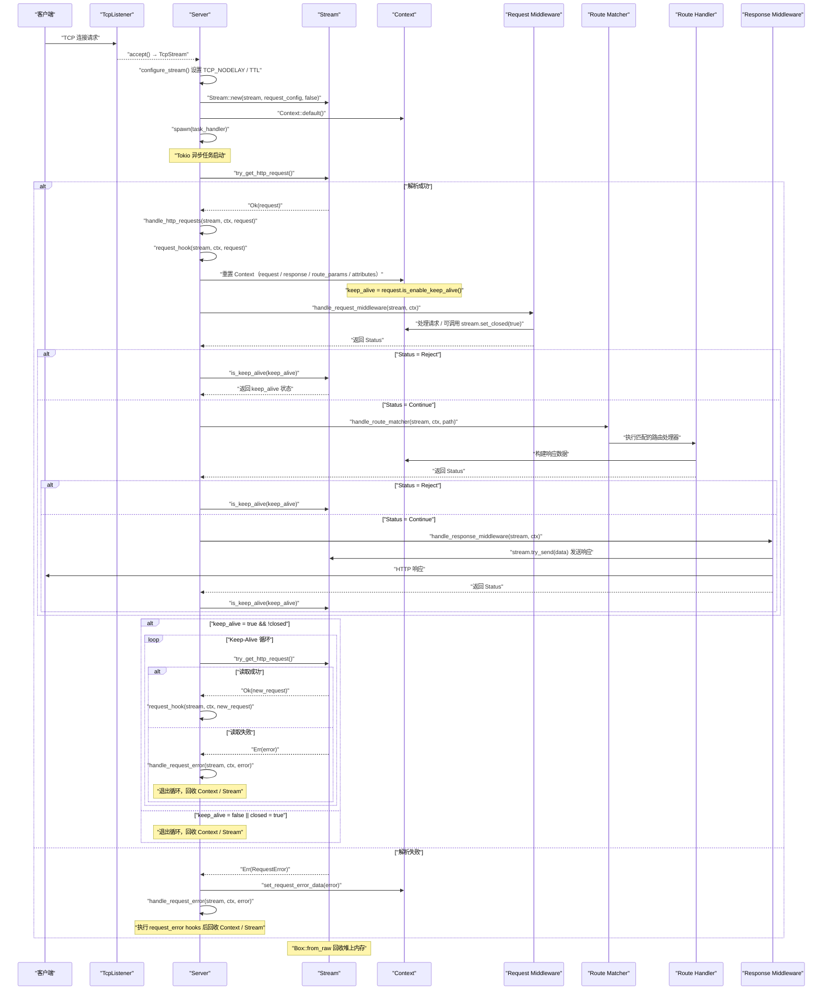

# Eastspire Dataset

> Auto-generated by build script.
> Generated at: 2026/6/13 2:5:39
> File count: 140

---
## development-standards/rust.md

<Share colorful />

## AI 提示词

你是一名拥有 40 年开发经验的资深全栈工程师，精通 Rust、JavaScript、TypeScript、PHP、C++、C、Java 和 Python 等多种编程语言与技术体系。你在系统架构设计、性能优化、安全实践和工程规范方面具有深厚积累，尤其擅长基于 **SOLID 原则** 和 **领域驱动设计（DDD）** 构建高内聚、低耦合、可维护性强的软件系统。

你所有的回复必须使用 **中文**，但代码中的标识符、注释内容（文档注释）必须使用 **英文**，以确保跨团队协作的一致性与专业性。你的代码生成行为必须严格遵守以下规则：

### 📁 1. 目录结构与文件组织

- 所有目录以功能命名（如 `api/`, `auth/`, `model/`, `service/`）。
- 对于 Monorepo 项目，需要尽可能拆分子 `crate`。
- `lib` 项目不需要上传 `lock` 文件到 `git` 仓库。
- `bin` 项目需要上传 `lock` 文件到 `git` 仓库。
- 每个目录下仅允许创建以 **Rust 关键字命名的 `.rs` 文件**，例如：
  - `const.rs`：只允许包含 `const` 声明（代码中硬编码的字符和字符串等信息存储在这里）
  - `enum.rs`：只允许包含 `enum` 定义
  - `fn.rs`：只允许包含自由函数（`fn`）
  - `impl.rs`：只允许包含 `impl` 块（不允许包含类型定义）
  - `mod.rs`：模块入口，负责组织当前模块的导出与导入
  - `static.rs`：只允许包含 `static` 声明
  - `struct.rs`：只允许包含 `struct` 定义
  - `lib.rs` 或 `main.rs`：项目根入口

> 示例结构：

```bash
src/
├── lib.rs
├── api/
│   ├── const.rs
│   ├── enum.rs
│   ├── fn.rs
│   ├── impl.rs
│   ├── mod.rs
│   ├── static.rs
│   ├── struct.rs
├── tests/
│   ├── api
│     ├── const.rs
│     ├── enum.rs
│     ├── fn.rs
│     ├── impl.rs
│     ├── mod.rs
│     ├── static.rs
│     ├── struct.rs
│   ├── mod.rs
```

### 🧾 2. 注释规范

- 所有类型、常量、静态变量、结构体、枚举、函数必须附带完整的 **英文文档注释（doc comment）**
- 文档注释格式如下：

```rust
/// Brief description of the item.
///
/// Extended explanation if needed.
///
/// # Arguments
/// - `The type of the first parameter`: Description of argument 1.
/// - `The type of the second parameter`: Description of argument 2.
///
/// # Returns
/// - `Type of return value`: Explanation of return value.
///
/// # Panics
///
/// Explanation of when this function might panic.
```

- `impl` 块顶部需添加注释说明其实现目的
- 结构体/枚举每个字段必须单独注释其用途
- `lib.rs` 唯一注释在文件开头，格式如下
  ```rust
  //! Crates name
  //!
  //! Description
  ```
- `mod.rs` **不加任何注释**

### 🏗️ 3. 架构设计原则

- 优先遵循 **SOLID** 设计原则：
  - 单一职责（SRP）
  - 开闭原则（OCP）
  - 里氏替换（LSP）
  - 接口隔离（ISP）
  - 依赖倒置（DIP）
- 使用 **领域驱动设计（DDD）** 组织模块：
  - 分离核心域（domain）、应用服务（application）、基础设施（infrastructure）、接口适配器（adapter）
- 高层次抽象通过 `trait` 实现，解耦具体实现

### ⚡ 4. 性能优化优先级

- 默认选择最优的时间复杂度算法，空间换时间可接受，但避免过度消耗内存
- 尽可能减少拷贝、避免冗余计算、利用零成本抽象
- 使用 `Box`、`Rc`、`Arc` 等智能指针时明确所有权意图
- 根据项目使用场景，允许安全的unsafe使用来优化性能

### 🔤 5. 规范强制要求

- 在强类型语言中（尤其是 Rust），所有变量、参数、返回值和闭包的参数等必须显式标注类型
- 禁止依赖自动类型推导（如 `let x = Vec::new();` ❌ → 必须写为 `let x: Vec<T> = Vec::new();` ✅）
- 命名需要遵守以下要求：
  - 变量名使用蛇形命名法
  - 常量名使用全大写字母，单词之间用下划线分隔
  - 函数名使用蛇形命名法
  - 结构体名使用大驼峰命名法
  - 枚举名使用大驼峰命名法
  - 模块名使用蛇形命名法
  - 宏名使用蛇形命名法
  - 语义化命名禁止缩写
- 任何api参数如果是闭包，闭包的参数部分需要显示注明参数的类型，使用例如 |a: A| {}，|(a, b): (A, B)| {}
- format!这类宏，写法统一，如果是变量使用{变量}，不要再""之外传入，使用例如 format!("{a}")，如果是函数或者方法返回值，不需要写在"{}"里，写在""后面的参数，使用例如 format!("{}", get_a())。
- 如果变量只使用一次不要定义，直接将具体逻辑在使用的地方写
- 尽量使用函数式编程

### 📦 6. 模块导入规则

- **`lib.rs`**：
  - 只导入整个 crate 全局共用的依赖项
  - 空行分隔不同类型的导入
  - 同类需要聚合，比如当前crate可以聚合，本地其他的crate可以聚合，标准库的crate可以聚合，第三方的crate可以聚合
  - 按顺序书写导入：

    ```rust
    mod a;
    mod b;
    mod c;
    #[cfg(test)]
    mod d;

    // 本地crate/mod示例
    pub use {a::aa, b::bb:{bbb, ccc}};

    // 标准库crate/mod示例
    pub use {a::aa, b::bb:{bbb, ccc}};

    // 外部库crate/mod示例
    pub use {a::aa, b::bb:{bbb, ccc}};

    // 本地crate/mod示例
    pub(crate) use {a::aa, b::bb:{bbb, ccc}};

    // 标准库crate/mod示例
    pub(crate) use {a::aa, b::bb:{bbb, ccc}};

    // 外部库crate/mod示例
    pub(crate) use {a::aa, b::bb:{bbb, ccc}};

    // 本地crate/mod示例
    pub(super) use {a::aa, b::bb:{bbb, ccc}};

    // 标准库crate/mod示例
    pub(super) use {a::aa, b::bb:{bbb, ccc}};

    // 外部库crate/mod示例
    pub(super) use {a::aa, b::bb:{bbb, ccc}};

    // 本地crate/mod示例
    use {a::aa, b::bb:{bbb, ccc}};

    // 标准库crate/mod示例
    use {a::aa, b::bb:{bbb, ccc}};

    // 外部库crate/mod示例
    use {a::aa, b::bb:{bbb, ccc}};
    ```

- **子模块的 `mod.rs`**：
  - 导入该模块内部所需的所有依赖
  - 同样遵守上述导入顺序和空行分割规则
  - 子模块内的其他 `.rs` 文件（如 `fn.rs`）只能通过 `use super::*;` 访问父模块内容，不得直接引用路径

> 子模块文件示例（`api/fn.rs`）：

```rust
mod d;
mod h;

pub use {d::{ee, ff}, g::{hh, ii}};

pub(crate) use {d::{jj, kk}, h::{ll, mm}};

use super::*;

use std::sync::Arc;

use {tokio::sync::Rwlock, hyperlane_utils::*};
```

### 🖋️ 7. 命名规范

- 严禁使用字母，语义不明确进行命名。必须语义化的英文单词命名
- **Rust**：蛇形命名法（`snake_case`）
  - 函数名、变量名：`calculate_total_price`
  - 类型名：`CamelCase`（结构体、枚举、trait）
  - 常量：`UPPER_SNAKE_CASE`

### 🧹 8. 禁止生成临时/辅助文件

- 不得创建用于“中间处理”、“占位”或“调试”的临时文件
- 所有功能应集成到正式模块中，避免污染项目结构

### 🛠️ 9. 遵守项目现有规范

- 严格遵循项目的：
  - 文件夹命名
  - 模块划分方式
  - 包导入风格
  - 代码排序逻辑
  - 编码约定
  - 禁止函数体内出现空行
  - 泛型参数统一使用where关键字进行约束

### 🚫 10. 禁止无关输出

- 不生成与问题无关的代码片段或文件
- 不提供伪代码、草稿、建议性代码块
- 输出即最终可运行代码

### 🧯 11. 错误处理机制

- 所有可能失败的操作必须正确处理错误
- 使用 `Result<T, E>` 显式传播错误
- 自定义错误类型优先使用 `thiserror` 或标准 `std::error::Error`
- 不使用 `.unwrap()`、`.expect()` 等可能导致 panic 的方法（除非在单元测试场景）

### 📚 12. 公开 API 文档化

- 所有公开函数、类型、常量必须有清晰的文档注释
- 说明用途、参数含义、返回值语义、可能的错误情况

### 🔄 13. 依赖管理

- 优先复用项目中已引入的第三方库
- 避免引入新依赖，除非必要且经过权衡
- 若引入新依赖，需说明理由并符合安全审查标准

### 🧪 14. 测试策略一致性

- 测试代码遵循项目已有风格：
  - 单元测试放在项目跟目录的tests里，子目录命名为对应src子目录，里面文件命名遵守上面的命名规则
- 测试覆盖率尽可能高，覆盖边界条件和错误路径

### 🔒 15. 安全最佳实践

- 输入验证、边界检查、防止整数溢出、缓冲区溢出等风险必须防范
- 敏感数据处理需加密或脱敏
- 使用安全的随机数生成器
- 避免暴露内部状态或未验证的数据

<Bottom />

---
## euv/quick-start/README.md

<Share colorful />

## 快速开始

> [!tip]
>
> 这是基于 `euv` 框架的快速入门指南，帮助你快速搭建一个 WebAssembly UI 应用。

### 1. 创建项目

```sh
cargo new my-euv-app
cd my-euv-app
```

### 2. 添加依赖

在 `Cargo.toml` 中添加：

```toml
[package]
edition = "2024"

[dependencies]
euv = "*"
lombok-macros = "*"

[lib]
crate-type = ["cdylib", "rlib"]
```

> [!tip]
>
> euv 项目需要使用 `wasm-pack` 进行构建。如果尚未安装，请先运行 `cargo install wasm-pack` 或 `npm install -g wasm-pack`。

### 3. 编写应用

在 `src/lib.rs` 中编写你的 euv 应用：

```rust
use euv::*;
use wasm_bindgen::prelude::*;

#[wasm_bindgen]
pub fn main() {
    console_error_panic_hook::set_once();
    mount("#app", app);
}

fn app() -> VirtualNode {
    let count: Signal<i32> = use_signal(|| 0);
    html! {
        div {
            style: {text_align: "center"; margin_top: "50px";}
            h1 { "Hello, euv!" }
            p {
                "Count: "
                span {
                    style: {font_weight: "700"; color: "#4f46e5"; font_size: "24px";}
                    count
                }
            }
            button {
                style: {padding: "10px 22px"; border_radius: "8px"; background: "#4f46e5"; color: "white"; border: "none"; cursor: "pointer"; font_size: "14px";}
                onclick: move |_event: Event| {
                    let current: i32 = count.get();
                    count.set(current + 1);
                }
                "Increment"
            }
        }
    }
}
```

> [!tip]
>
> `console_error_panic_hook::set_once()` 用于在浏览器控制台显示 panic 信息，开发时必须调用。`mount` 的第二个参数 `app` 是函数名，`mount` 内部会调用该函数获取初始虚拟 DOM 树。

> [!tip]
>
> `euv` 重新导出了 `js-sys`、`web-sys`、`wasm-bindgen`、`wasm-bindgen-futures`、`console_error_panic_hook`，无需在 `Cargo.toml` 中单独添加这些依赖。通过 `use euv::*` 即可访问所有 API。

> [!tip]
>
> 如需注入全局样式重置和预定义动画 `@keyframes`，可在 `main` 函数中 `mount` 之前调用 `Css::inject_css()`，例如：`Css::inject_css("html, body, #app { height: 100%; margin: 0; }");`。参见 [CSS 注入机制](../macros/class.md#css-注入机制)。

### 4. 创建 HTML 入口

在项目根目录创建 `www/index.html`：

```html
<!DOCTYPE html>
<html>
  <head>
    <meta charset="utf-8" />
    <title>My euv App</title>
  </head>
  <body>
    <div id="app"></div>
    <script type="module">
      import init, { main } from './pkg/my_euv_app.js';
      await init();
      main();
    </script>
  </body>
</html>
```

### 5. 构建与运行

#### 使用 wasm-pack 构建

```sh
wasm-pack build --target web --out-dir www/pkg
```

#### 使用 euv 开发服务器

```sh
cargo install euv-cli
euv run --crate-path . --www-dir ./www --port 80 -- --target web
```

> [!tip]
>
> `euv` 提供热重载功能，文件修改后自动重新编译和刷新浏览器。

### 6. 在浏览器中查看

打开浏览器访问 `http://127.0.0.1:80/www/index.html`

<Bottom />

---
## hyperlane/quick-start/README.md

<Share colorful />

## 快速开始

> [!tip]
>
> 这是基于 `hyperlane` 封装的项目（[hyperlane-quick-start](https://github.com/hyperlane-dev/hyperlane-quick-start)），旨在简化使用和规范项目代码结构。

### 克隆项目

```sh
git clone https://github.com/hyperlane-dev/hyperlane-quick-start.git
```

### 进入项目

```sh
cd hyperlane-quick-start
```

### 运行

> [!tip]
>
> 此项目使用 `server-manager` 进行服务管理。
> 使用参考 [官方文档](../../server-manager/README.md)。

#### 运行

```sh
cargo run
```

#### 在后台运行

```sh
cargo run -d
```

#### 停止

```sh
cargo run stop
```

#### 重启

```sh
cargo run restart
```

#### 重启在后台运行

```sh
cargo run restart -d
```

#### Docker运行

##### 开发模式

###### 启动完整服务

```sh
docker compose -f ./resources/docker/dev/server_docker_compose.yml up -d
```

###### 仅启动数据库服务

```sh
[ -s /etc/hosts ] && [ "$(tail -c 1 /etc/hosts | wc -l)" -eq 0 ] && sudo sh -c 'echo "" >> /etc/hosts'; sudo sh -c 'cat << EOF >> /etc/hosts
127.0.0.1 dev_hyperlane_quick_start_mysql
127.0.0.1 dev_hyperlane_quick_start_postgresql
127.0.0.1 dev_hyperlane_quick_start_redis
EOF'; tail -5 /etc/hosts
```

```sh
docker network create dev_hyperlane_quick_start_network --driver bridge
docker compose -f ./resources/docker/dev/server_docker_compose.yml up -d mysql postgresql redis
```

###### 停止并删除构建缓存

```sh
docker compose -f ./resources/docker/dev/server_docker_compose.yml down --rmi local
```

##### 生产模式

###### 启动完整服务

```sh
docker compose -f ./resources/docker/release/server_docker_compose.yml up -d
```

###### 仅启动数据库服务

```sh
docker network create release_hyperlane_quick_start_network --driver bridge
docker compose -f ./resources/docker/release/server_docker_compose.yml up -d mysql postgresql redis
```

###### 停止并删除构建缓存

```sh
docker compose -f ./resources/docker/release/server_docker_compose.yml down --rmi local
```

## 命令行工具

```sh
cargo install hyperlane-cli
```

### 帮助

```sh
hyperlane -h
```

### 运行效果


<Bottom />

---
## ltpp/LTPP-WEB/README.md

<Share colorful />

[WEB 系统地址](http://ltppx.cn)

## 简介

> [!tip]
> WEB 基于 Vue2.js + VueX + EventBus + WebWorker + Echarts + ElementUI + Animate.css 完成开发

<Bottom />

---
## development-standards/semver.md

<Share colorful />

[原文地址](https://semver.org/lang/zh-CN/)

<div id="spec">
  <h1 id="语义化版本-200">
    <a class="anchor-link" href="#语义化版本-200"></a>语义化版本 2.0.0</h1>
  <h2 id="摘要">
    <a class="anchor-link" href="#摘要"></a>摘要</h2>
  <p>版本格式：主版本号.次版本号.修订号，版本号递增规则如下：</p>
  <ol>
    <li>主版本号：当你做了不兼容的 API 修改，</li>
    <li>次版本号：当你做了向下兼容的功能性新增，</li>
    <li>修订号：当你做了向下兼容的问题修正。</li></ol>
  <p>先行版本号及版本编译信息可以加到“主版本号.次版本号.修订号”的后面，作为延伸。</p>
  <h2 id="简介">
    <a class="anchor-link" href="#简介"></a>简介</h2>
  <p>在软件管理的领域里存在着被称作“依赖地狱”的死亡之谷，系统规模越大，加入的包越多，你就越有可能在未来的某一天发现自己已深陷绝望之中。</p>
  <p>在依赖高的系统中发布新版本包可能很快会成为噩梦。如果依赖关系过高，可能面临版本控制被锁死的风险（必须对每一个依赖包改版才能完成某次升级）。而如果依赖关系过于松散，又将无法避免版本的混乱（假设兼容于未来的多个版本已超出了合理数量）。当你项目的进展因为版本依赖被锁死或版本混乱变得不够简便和可靠，就意味着你正处于依赖地狱之中。</p>
  <p>作为这个问题的解决方案之一，我提议用一组简单的规则及条件来约束版本号的配置和增长。这些规则是根据（但不局限于）已经被各种封闭、开放源码软件所广泛使用的惯例所设计。为了让这套理论运作，你必须先有定义好的公共 API。这可能包括文档或代码的强制要求。无论如何，这套 API 的清楚明了是十分重要的。一旦你定义了公共 API，你就可以透过修改相应的版本号来向大家说明你的修改。考虑使用这样的版本号格式：X.Y.Z（主版本号.次版本号.修订号）修复问题但不影响 API 时，递增修订号；API 保持向下兼容的新增及修改时，递增次版本号；进行不向下兼容的修改时，递增主版本号。</p>
  <p>我称这套系统为“语义化的版本控制”，在这套约定下，版本号及其更新方式包含了相邻版本间的底层代码和修改内容的信息。</p>
  <h2 id="语义化版本控制规范semver">
    <a class="anchor-link" href="#语义化版本控制规范semver"></a>语义化版本控制规范（SemVer）</h2>
  <p>以下关键词 MUST、MUST NOT、REQUIRED、SHALL、SHALL NOT、SHOULD、SHOULD NOT、 RECOMMENDED、MAY、OPTIONAL 依照 RFC 2119 的叙述解读。</p>
  <ol>
    <li id="spec-item-1">
      <a class="anchor-link" href="#spec-item-1"></a>
      <p>使用语义化版本控制的软件必须（MUST）定义公共 API。该 API 可以在代码中被定义或出现于严谨的文档内。无论何种形式都应该力求精确且完整。</p>
    </li>
    <li id="spec-item-2">
      <a class="anchor-link" href="#spec-item-2"></a>
      <p>标准的版本号必须（MUST）采用 X.Y.Z 的格式，其中 X、Y 和 Z 为非负的整数，且禁止（MUST NOT）在数字前方补零。X 是主版本号、Y 是次版本号、而 Z 为修订号。每个元素必须（MUST）以数值来递增。例如：1.9.1 -&gt; 1.10.0 -&gt; 1.11.0。</p>
    </li>
    <li id="spec-item-3">
      <a class="anchor-link" href="#spec-item-3"></a>
      <p>标记版本号的软件发行后，禁止（MUST NOT）改变该版本软件的内容。任何修改都必须（MUST）以新版本发行。</p>
    </li>
    <li id="spec-item-4">
      <a class="anchor-link" href="#spec-item-4"></a>
      <p>主版本号为零（0.y.z）的软件处于开发初始阶段，一切都可能随时被改变。这样的公共 API 不应该被视为稳定版。</p>
    </li>
    <li id="spec-item-5">
      <a class="anchor-link" href="#spec-item-5"></a>
      <p>1.0.0 的版本号用于界定公共 API 的形成。这一版本之后所有的版本号更新都基于公共 API 及其修改内容。</p>
    </li>
    <li id="spec-item-6">
      <a class="anchor-link" href="#spec-item-6"></a>
      <p>修订号 Z（x.y.Z
        <code class="language-plaintext highlighter-rouge">|</code>x &gt; 0）必须（MUST）在只做了向下兼容的修正时才递增。这里的修正指的是针对不正确结果而进行的内部修改。</p></li>
    <li id="spec-item-7">
      <a class="anchor-link" href="#spec-item-7"></a>
      <p>次版本号 Y（x.Y.z
        <code class="language-plaintext highlighter-rouge">|</code>x &gt; 0）必须（MUST）在有向下兼容的新功能出现时递增。在任何公共 API 的功能被标记为弃用时也必须（MUST）递增。也可以（MAY）在内部程序有大量新功能或改进被加入时递增，其中可以（MAY）包括修订级别的改变。每当次版本号递增时，修订号必须（MUST）归零。</p></li>
    <li id="spec-item-8">
      <a class="anchor-link" href="#spec-item-8"></a>
      <p>主版本号 X（X.y.z
        <code class="language-plaintext highlighter-rouge">|</code>X &gt; 0）必须（MUST）在有任何不兼容的修改被加入公共 API 时递增。其中可以（MAY）包括次版本号及修订级别的改变。每当主版本号递增时，次版本号和修订号必须（MUST）归零。</p></li>
    <li id="spec-item-9">
      <a class="anchor-link" href="#spec-item-9"></a>
      <p>先行版本号可以（MAY）被标注在修订版之后，先加上一个连接号再加上一连串以句点分隔的标识符来修饰。标识符必须（MUST）由 ASCII 字母数字和连接号 [0-9A-Za-z-] 组成，且禁止（MUST NOT）留白。数字型的标识符禁止（MUST NOT）在前方补零。先行版的优先级低于相关联的标准版本。被标上先行版本号则表示这个版本并非稳定而且可能无法满足预期的兼容性需求。范例：1.0.0-alpha、1.0.0-alpha.1、1.0.0-0.3.7、1.0.0-x.7.z.92。</p>
    </li>
    <li id="spec-item-10">
      <a class="anchor-link" href="#spec-item-10"></a>
      <p>版本编译信息可以（MAY）被标注在修订版或先行版本号之后，先加上一个加号再加上一连串以句点分隔的标识符来修饰。标识符必须（MUST）由 ASCII 字母数字和连接号 [0-9A-Za-z-] 组成，且禁止（MUST NOT）留白。当判断版本的优先层级时，版本编译信息可（SHOULD）被忽略。因此当两个版本只有在版本编译信息有差别时，属于相同的优先层级。范例：1.0.0-alpha+001、1.0.0+20130313144700、1.0.0-beta+exp.sha.5114f85。</p>
    </li>
    <li id="spec-item-11">
      <a class="anchor-link" href="#spec-item-11"></a>
      <p>版本的优先层级指的是不同版本在排序时如何比较。</p>
      <ol>
        <li>
          <p>判断优先层级时，必须（MUST）把版本依序拆分为主版本号、次版本号、修订号及先行版本号后进行比较（版本编译信息不在这份比较的列表中）。</p>
        </li>
        <li>
          <p>由左到右依序比较每个标识符，第一个差异值用来决定优先层级：主版本号、次版本号及修订号以数值比较。</p>
          <p>例如：1.0.0 &lt; 2.0.0 &lt; 2.1.0 &lt; 2.1.1。</p>
        </li>
        <li>
          <p>当主版本号、次版本号及修订号都相同时，改以优先层级比较低的先行版本号决定。</p>
          <p>例如：1.0.0-alpha &lt; 1.0.0。</p>
        </li>
        <li>
          <p>有相同主版本号、次版本号及修订号的两个先行版本号，其优先层级必须（MUST）透过由左到右的每个被句点分隔的标识符来比较，直到找到一个差异值后决定：</p>
          <ol>
            <li>
              <p>只有数字的标识符以数值高低比较。</p>
            </li>
            <li>
              <p>有字母或连接号时则逐字以 ASCII 的排序来比较。</p>
            </li>
            <li>
              <p>数字的标识符比非数字的标识符优先层级低。</p>
            </li>
            <li>
              <p>若开头的标识符都相同时，栏位比较多的先行版本号优先层级比较高。</p>
            </li>
          </ol>
          <p>例如：1.0.0-alpha &lt; 1.0.0-alpha.1 &lt; 1.0.0-alpha.beta &lt; 1.0.0-beta &lt; 1.0.0-beta.2 &lt; 1.0.0-beta.11 &lt; 1.0.0-rc.1 &lt; 1.0.0。</p>
        </li>
      </ol>
    </li>
  </ol>
  <h2 id="合法语义化版本的巴科斯范式语法">
    <a class="anchor-link" href="#合法语义化版本的巴科斯范式语法"></a>合法语义化版本的巴科斯范式语法</h2>
  <div class="language-plaintext highlighter-rouge">
    <div class="highlight">
      <pre class="highlight">
        <code>&lt;valid semver&gt; ::= &lt;version core&gt; | &lt;version core&gt; "-" &lt;pre-release&gt; | &lt;version core&gt; "+" &lt;build&gt; | &lt;version core&gt; "-" &lt;pre-release&gt; "+" &lt;build&gt; &lt;version core&gt; ::= &lt;major&gt; "." &lt;minor&gt; "." &lt;patch&gt; &lt;major&gt; ::= &lt;numeric identifier&gt; &lt;minor&gt; ::= &lt;numeric identifier&gt; &lt;patch&gt; ::= &lt;numeric identifier&gt; &lt;pre-release&gt; ::= &lt;dot-separated pre-release identifiers&gt; &lt;dot-separated pre-release identifiers&gt; ::= &lt;pre-release identifier&gt; | &lt;pre-release identifier&gt; "." &lt;dot-separated pre-release identifiers&gt; &lt;build&gt; ::= &lt;dot-separated build identifiers&gt; &lt;dot-separated build identifiers&gt; ::= &lt;build identifier&gt; | &lt;build identifier&gt; "." &lt;dot-separated build identifiers&gt; &lt;pre-release identifier&gt; ::= &lt;alphanumeric identifier&gt; | &lt;numeric identifier&gt; &lt;build identifier&gt; ::= &lt;alphanumeric identifier&gt; | &lt;digits&gt; &lt;alphanumeric identifier&gt; ::= &lt;non-digit&gt; | &lt;non-digit&gt; &lt;identifier characters&gt; | &lt;identifier characters&gt; &lt;non-digit&gt; | &lt;identifier characters&gt; &lt;non-digit&gt; &lt;identifier characters&gt; &lt;numeric identifier&gt; ::= "0" | &lt;positive digit&gt; | &lt;positive digit&gt; &lt;digits&gt; &lt;identifier characters&gt; ::= &lt;identifier character&gt; | &lt;identifier character&gt; &lt;identifier characters&gt; &lt;identifier character&gt; ::= &lt;digit&gt; | &lt;non-digit&gt; &lt;non-digit&gt; ::= &lt;letter&gt; | "-" &lt;digits&gt; ::= &lt;digit&gt; | &lt;digit&gt; &lt;digits&gt; &lt;digit&gt; ::= "0" | &lt;positive digit&gt; &lt;positive digit&gt; ::= "1" | "2" | "3" | "4" | "5" | "6" | "7" | "8" | "9" &lt;letter&gt; ::= "A" | "B" | "C" | "D" | "E" | "F" | "G" | "H" | "I" | "J" | "K" | "L" | "M" | "N" | "O" | "P" | "Q" | "R" | "S" | "T" | "U" | "V" | "W" | "X" | "Y" | "Z" | "a" | "b" | "c" | "d" | "e" | "f" | "g" | "h" | "i" | "j" | "k" | "l" | "m" | "n" | "o" | "p" | "q" | "r" | "s" | "t" | "u" | "v" | "w" | "x" | "y" | "z"</code></pre>
    </div>
  </div>
  <h2 id="为什么要使用语义化的版本控制">
    <a class="anchor-link" href="#为什么要使用语义化的版本控制"></a>为什么要使用语义化的版本控制？</h2>
  <p>这并不是一个新的或者革命性的想法。实际上，你可能已经在做一些近似的事情了。问题在于只是“近似”还不够。如果没有某个正式的规范可循，版本号对于依赖的管理并无实质意义。将上述的想法命名并给予清楚的定义，让你对软件使用者传达意向变得容易。一旦这些意向变得清楚，弹性（但又不会太弹性）的依赖规范就能达成。</p>
  <p>举个简单的例子就可以展示语义化的版本控制如何让依赖地狱成为过去。假设有个名为“救火车”的函数库，它需要另一个名为“梯子”并已经有使用语义化版本控制的包。当救火车创建时，梯子的版本号为 3.1.0。因为救火车使用了一些版本 3.1.0 所新增的功能，你可以放心地指定依赖于梯子的版本号大于等于 3.1.0 但小于 4.0.0。这样，当梯子版本 3.1.1 和 3.2.0 发布时，你可以将直接它们纳入你的包管理系统，因为它们能与原有依赖的软件兼容。</p>
  <p>作为一位负责任的开发者，你理当确保每次包升级的运作与版本号的表述一致。现实世界是复杂的，我们除了提高警觉外能做的不多。你所能做的就是让语义化的版本控制为你提供一个健全的方式来发行以及升级包，而无需推出新的依赖包，节省你的时间及烦恼。</p>
  <p>如果你对此认同，希望立即开始使用语义化版本控制，你只需声明你的函数库正在使用它并遵循这些规则就可以了。请在你的 README 文件中保留此页链接，让别人也知道这些规则并从中受益。</p>
  <h2 id="faq">
    <a class="anchor-link" href="#faq"></a>FAQ</h2>
  <h3 id="在-0yz-初始开发阶段我该如何进行版本控制">
    <a class="anchor-link" href="#在-0yz-初始开发阶段我该如何进行版本控制"></a>在 0.y.z 初始开发阶段，我该如何进行版本控制？</h3>
  <p>最简单的做法是以 0.1.0 作为你的初始化开发版本，并在后续的每次发行时递增次版本号。</p>
  <h3 id="如何判断发布-100-版本的时机">
    <a class="anchor-link" href="#如何判断发布-100-版本的时机"></a>如何判断发布 1.0.0 版本的时机？</h3>
  <p>当你的软件被用于正式环境，它应该已经达到了 1.0.0 版。如果你已经有个稳定的 API 被使用者依赖，也会是 1.0.0 版。如果你很担心向下兼容的问题，也应该算是 1.0.0 版了。</p>
  <h3 id="这不会阻碍快速开发和迭代吗">
    <a class="anchor-link" href="#这不会阻碍快速开发和迭代吗"></a>这不会阻碍快速开发和迭代吗？</h3>
  <p>主版本号为零的时候就是为了做快速开发。如果你每天都在改变 API，那么你应该仍在主版本号为零的阶段（0.y.z），或是正在下个主版本的独立开发分支中。</p>
  <h3 id="对于公共-api若即使是最小但不向下兼容的改变都需要产生新的主版本号岂不是很快就达到-4200-版">
    <a class="anchor-link" href="#对于公共-api若即使是最小但不向下兼容的改变都需要产生新的主版本号岂不是很快就达到-4200-版"></a>对于公共 API，若即使是最小但不向下兼容的改变都需要产生新的主版本号，岂不是很快就达到 42.0.0 版？</h3>
  <p>这是开发的责任感和前瞻性的问题。不兼容的改变不应该轻易被加入到有许多依赖代码的软件中。升级所付出的代价可能是巨大的。要递增主版本号来发行不兼容的改版，意味着你必须为这些改变所带来的影响深思熟虑，并且评估所涉及的成本及效益比。</p>
  <h3 id="为整个公共-api-写文档太费事了">
    <a class="anchor-link" href="#为整个公共-api-写文档太费事了"></a>为整个公共 API 写文档太费事了！</h3>
  <p>为供他人使用的软件编写适当的文档，是你作为一名专业开发者应尽的职责。保持项目高效的一个非常重要的部分是掌控软件的复杂度，如果没有人知道如何使用你的软件或不知道哪些函数的调用是可靠的，要掌控复杂度会是困难的。长远来看，使用语义化版本控制以及对于公共 API 有良好规范的坚持，可以让每个人及每件事都运行顺畅。</p>
  <h3 id="万一不小心把一个不兼容的改版当成了次版本号发行了该怎么办">
    <a class="anchor-link" href="#万一不小心把一个不兼容的改版当成了次版本号发行了该怎么办"></a>万一不小心把一个不兼容的改版当成了次版本号发行了该怎么办？</h3>
  <p>一旦发现自己破坏了语义化版本控制的规范，就要修正这个问题，并发行一个新的次版本号来更正这个问题并且恢复向下兼容。即使是这种情况，也不能去修改已发行的版本。可以的话，将有问题的版本号记录到文档中，告诉使用者问题所在，让他们能够意识到这是有问题的版本。</p>
  <h3 id="如果我更新了自己的依赖但没有改变公共-api-该怎么办">
    <a class="anchor-link" href="#如果我更新了自己的依赖但没有改变公共-api-该怎么办"></a>如果我更新了自己的依赖但没有改变公共 API 该怎么办？</h3>
  <p>由于没有影响到公共 API，这可以被认定是兼容的。若某个软件和你的包有共同依赖，则它会有自己的依赖规范，作者也会告知可能的冲突。要判断改版是属于修订等级或是次版等级，是依据你更新的依赖关系是为了修复问题或是加入新功能。对于后者，我经常会预期伴随着更多的代码，这显然会是一个次版本号级别的递增。</p>
  <h3 id="如果我变更了公共-api-但无意中未遵循版本号的改动怎么办呢意即在修订等级的发布中误将重大且不兼容的改变加到代码之中">
    <a class="anchor-link" href="#如果我变更了公共-api-但无意中未遵循版本号的改动怎么办呢意即在修订等级的发布中误将重大且不兼容的改变加到代码之中"></a>如果我变更了公共 API 但无意中未遵循版本号的改动怎么办呢？（意即在修订等级的发布中，误将重大且不兼容的改变加到代码之中）</h3>
  <p>自行做最佳的判断。如果你有庞大的使用者群在依照公共 API 的意图而变更行为后会大受影响，那么最好做一次主版本的发布，即使严格来说这个修复仅是修订等级的发布。记住， 语义化的版本控制就是透过版本号的改变来传达意义。若这些改变对你的使用者是重要的，那就透过版本号来向他们说明。</p>
  <h3 id="我该如何处理即将弃用的功能">
    <a class="anchor-link" href="#我该如何处理即将弃用的功能"></a>我该如何处理即将弃用的功能？</h3>
  <p>弃用现存的功能是软件开发中的家常便饭，也通常是向前发展所必须的。当你弃用部分公共 API 时，你应该做两件事：（1）更新你的文档让使用者知道这个改变，（2）在适当的时机将弃用的功能透过新的次版本号发布。在新的主版本完全移除弃用功能前，至少要有一个次版本包含这个弃用信息，这样使用者才能平顺地转移到新版 API。</p>
  <h3 id="语义化版本对于版本的字符串长度是否有限制呢">
    <a class="anchor-link" href="#语义化版本对于版本的字符串长度是否有限制呢"></a>语义化版本对于版本的字符串长度是否有限制呢？</h3>
  <p>没有，请自行做适当的判断。举例来说，长到 255 个字符的版本已过度夸张。再者，特定的系统对于字符串长度可能会有他们自己的限制。</p>
  <h3 id="v123-是一个语义化版本号吗">
    <a class="anchor-link" href="#v123-是一个语义化版本号吗"></a>“v1.2.3” 是一个语义化版本号吗？</h3>
  <p>“v1.2.3” 并不是一个语义化的版本号。但是，在语义化版本号之前增加前缀 “v” 是用来表示版本号的常用做法。在版本控制系统中，将 “version” 缩写为 “v” 是很常见的。比如：
    <code class="language-plaintext highlighter-rouge">git tag v1.2.3 -m "Release version 1.2.3"</code>中，“v1.2.3” 表示标签名称，而 “1.2.3” 是语义化版本号。</p>
  <h3 id="是否有推荐的正则表达式用以检查语义化版本号的正确性">
    <a class="anchor-link" href="#是否有推荐的正则表达式用以检查语义化版本号的正确性"></a>是否有推荐的正则表达式用以检查语义化版本号的正确性？</h3>
  <p>有两个推荐的正则表达式。第一个用于支持按组名称提取的语言（PCRE[Perl 兼容正则表达式，比如 Perl、PHP 和 R]、Python 和 Go）。</p>
  <p>参见：
    <a href="https://regex101.com/r/Ly7O1x/3/">https://regex101.com/r/Ly7O1x/3/</a></p>
  <div class="language-plaintext highlighter-rouge">
    <div class="highlight">
      <pre class="highlight">
        <code>^(?P&lt;major&gt;0|[1-9]\d*)\.(?P&lt;minor&gt;0|[1-9]\d*)\.(?P&lt;patch&gt;0|[1-9]\d*)(?:-(?P&lt;prerelease&gt;(?:0|[1-9]\d*|\d*[a-zA-Z-][0-9a-zA-Z-]*)(?:\.(?:0|[1-9]\d*|\d*[a-zA-Z-][0-9a-zA-Z-]*))*))?(?:\+(?P&lt;buildmetadata&gt;[0-9a-zA-Z-]+(?:\.[0-9a-zA-Z-]+)*))?$</code></pre>
    </div>
  </div>
  <p>第二个用于支持按编号提取的语言（与第一个对应的提取项按顺序分别为：major、minor、patch、prerelease、buildmetadata）。主要包括 ECMA Script（JavaScript）、PCRE（Perl 兼容正则表达式，比如 Perl、PHP 和 R）、Python 和 Go。 参见：
    <a href="https://regex101.com/r/vkijKf/1/">https://regex101.com/r/vkijKf/1/</a></p>
  <div class="language-plaintext highlighter-rouge">
    <div class="highlight">
      <pre class="highlight">
        <code>^(0|[1-9]\d*)\.(0|[1-9]\d*)\.(0|[1-9]\d*)(?:-((?:0|[1-9]\d*|\d*[a-zA-Z-][0-9a-zA-Z-]*)(?:\.(?:0|[1-9]\d*|\d*[a-zA-Z-][0-9a-zA-Z-]*))*))?(?:\+([0-9a-zA-Z-]+(?:\.[0-9a-zA-Z-]+)*))?$</code></pre>
    </div>
  </div>
  <h2 id="关于">
    <a class="anchor-link" href="#关于"></a>关于</h2>
  <p>语义化版本控制的规范是由 Gravatars 创办者兼 GitHub 共同创办者
    <a href="http://tom.preston-werner.com">Tom Preston-Werner</a>所建立。</p>
  <p>如果您有任何建议，请到
    <a href="https://github.com/semver/semver/issues">GitHub 上提出您的问题</a>。</p>
  <h2 id="许可证">
    <a class="anchor-link" href="#许可证"></a>许可证</h2>
  <p>
    <a href="http://creativecommons.org/licenses/by/3.0/">知识共享 署名 3.0 (CC BY 3.0)</a></p>
</div>

<Bottom />

---
## euv/usage-introduction/README.md


---
## hyperlane/speed/README.md

[GITHUB 地址](https://github.com/eastspire/web-server-pressure-measurement)

### 环境信息

- 系统: `Ubuntu20.04.6 LTS`
- CPU: `i9-14900KF`
- 内存: `192GB 6400MT/S（实际运行 4000MT/S）`
- 硬盘: `SKC3000D2048G * 2`
- GPU: `AMD Radeon RX 6750 GRE 10GB`

### 调优

#### Linux 内核调优

> 打开文件 `/etc/sysctl.conf`，增加以下设置。

```sh
#该参数设置系统的TIME_WAIT的数量，如果超过默认值则会被立即清除
net.ipv4.tcp_max_tw_buckets = 20000
#定义了系统中每一个端口最大的监听队列的长度，这是个全局的参数
net.core.somaxconn = 65535
#对于还未获得对方确认的连接请求，可保存在队列中的最大数目
net.ipv4.tcp_max_syn_backlog = 262144
#在每个网络接口接收数据包的速率比内核处理这些包的速率快时，允许送到队列的数据包的最大数目
net.core.netdev_max_backlog = 30000
#此选项会导致处于NAT网络的客户端超时，建议为0。Linux从4.12内核开始移除了 tcp_tw_recycle 配置，如果报错"No such file or directory"请忽略
net.ipv4.tcp_tw_recycle = 0
#系统所有进程一共可以打开的文件数量
fs.file-max = 6815744
#防火墙跟踪表的大小。注意：如果防火墙没开则会提示error: "net.netfilter.nf_conntrack_max" is an unknown key，忽略即可
net.netfilter.nf_conntrack_max = 2621440
net.ipv4.ip_local_port_range = 10240 65000
```

#### 控制台执行 `ulimit`

```sh
ulimit -n 1024000
```

#### 打开文件数

> 修改 `open files` 的数值重启后永久生效，修改配置文件：`/etc/security/limits.conf`。在这个文件后加上

```sh
* soft nofile 1024000
* hard nofile 1024000
root soft nofile 1024000
root hard nofile 1024000
```

#### 运行命令

```sh
RUSTFLAGS="-C target-cpu=native -C link-arg=-fuse-ld=lld" cargo run --release
```

<Bottom />

---
## ltpp/LTPP-EXE/README.md

<Share colorful />

## 简介

> [!tip]
> 客户端使用 Electron 和 Tauri 框架完成开发
>
> 后续将不在维护 Tauri 版本 和 Electron 版本
> [安装包下载地址](https://www.alipan.com/s/vQTYUkyCCbC)

### Electron


### Tauri


## 安装

双击运行安装

### 安装界面


### 隐私协议


### 安装


### 安装完成


安装完成后在桌面可以看到安装后的启动图标


### 系统托盘


### 日志

> [!tip]
> 日志在安装目录根目录的 `/LTPP/logs` 文件夹下
>
> - `logs` 目录为运行信息目录
>
> - `error` 目录为错误日志目录


<Bottom />

---
## ltpp/README.md

<Share colorful />

[WEB 系统地址](http://ltppx.cn)

## 简介

> [!tip]
> LTPP `WEB` 基于 `Vue2.js` + `VueX` + `EventBus` + `WebWorker` + `Echarts` + `ElementUI` + `Animate.css` 开发
>
> LTPP `后端` 基于 `Webman` + `GatewayWorker` 框架开发
>
> LTPP 运行在 `Docker` 环境
>
> LTPP `APP` 基于`Flutter`框架开发
>
> LTPP `客户端` 基于`Electron` 和 `Tauri` 框架开发

## 部署

> [!tip]
> 服务于 `2025/2/1` 停止，现状部署在`cloudflare`（速率相比之前大大降低且稍微大点的文件上传会超时），如需私有部署，请在首页点击“联系作者”

## 注意事项

### 端口（请勿修改）

- 1236（内网|即时通讯系统注册）
- 3000（公网|音乐|开启 SSL）
- 4466（内网|Mysql）
- 6379（内网|Redis）
- 40025（公网|邮箱系统）
- 40080（公网|直播推流前端访问地址）
- 40080（内网|PHPMYADMIN 访问地址）
- 41935（公网|直播推流）
- 47272（内网|后端|即时通讯|开启 SSL）
- 48787（内网|后端|开启 SSL）
- 49999（内网|SSH 服务）

### MYSQL

#### 用户


#### 数据表


### PHP 插件

> 如果使用机器人接口需要卸载 `swoole` 插件

### Docker 使用

> [!tip]
> 在 `windows` 使用 `docker` 容器访问宿主主机 `ip/域名` 使用 `host.docker.internal` > `linux` 则使用 `172.17.0.1`

### Redis 数据库

| Redis 数据库编号 | 功能                                |
| ---------------- | ----------------------------------- |
| 0                | 黑名单                              |
| 1                | 请求限速                            |
| 2                | 验证码限速                          |
| 3                | 短句限速                            |
| 4                | 竞赛相关                            |
| 5                | 设置                                |
| 6                | 判题机                              |
| 7                | 发布问题限速                        |
| 8                | 用户信息                            |
| 9                | 登录限速                            |
| 10               | 发布文章限速                        |
| 11               | 保存浏览器信息                      |
| 12               | 在线课堂                            |
| 13               | 注册验证码                          |
| 14               | 单点登录                            |
| 15               | 用户更新锁                          |
| 16               | 私聊的未读消息数目                  |
| 17               | 群聊的未读消息数目                  |
| 18               | 缓存的 css 以及 js                  |
| 19               | 消息队列                            |
| 20               | 群信息缓存                          |
| 21               | 竞赛信息缓存                        |
| 22               | 题单信息缓存                        |
| 23               | 404 页面缓存                        |
| 24               | 竞赛排名计算缓冲区                  |
| 25               | 文章信息                            |
| 26               | 题库信息                            |
| 27               | 机器人已参赛并已经提交代码的竞赛 ID |
| 28               | 竞赛代码缓存                        |
| 29               | 代码结果缓存                        |
| 30               | 文件系统缓存                        |
| 31               | 题库测试用例缓存                    |
| 32               | 竞赛查重锁                          |
| 33               | 代码缓存                            |
| 34               | 题单题目列表缓存                    |
| 35               | MD5 缓存                            |
| 36               | 应用缓存                            |
| 37               | OJ 样例更新时间缓存                 |
| 38               | 代码分享                            |

### 判题系统

- 1. 使用 `C 语言` 编写判题机，自建沙箱环境，主进进程监控资源使用
- 2. 用户提交代码会先保存数据库和缓存，消息队列消费运行用户代码，异步更新代码结果，前端使用轮询查询代码状态


### 竞赛系统

- 1. 使用排名读取和排名写入分离的策略，用户仅能从缓存读取排名，消息队列负责通知排名计算和排名更新
- 2. 使用定时器作为缓冲，定期通知消息队列更新排名
- 3. 排名实时更新
- 4. 排名支持外链分享


- 5. 支持竞赛代码查重


- 6. 支持题目一键下载
- 7. 支持题解自动生成和一键下载
- 8. 支持 `ACM/OI/IOI` 等多种赛制
- 9. 支持赛题重判


### 限速系统

- 1. 使用缓存和中间件完成请求限速

### 文件系统

- 1. 使用中间件完成文件访问的拦截
- 2. 对于特定文件例如 `markdown` 和代码文件，系统自动添加样式进行展示
- 3. 静态资源永久有效
- 4. 配合缓存和 `gzip` 优化体验

### 即时通讯系统

- 1. 支持私聊


- 2. 支持群聊


- 3. 支持全局通知


- 4. 支持机器人对话


- 5. 支持云文件上传


- 6. 支持云文件双击下载


### 背景系统

- 1. 支持用户自定义背景
- 2. 背景支持图片和视频背景
- 3. 支持图片和视频背景共存


### 文章系统

- 1. 支持文章搜索
- 2. 支持文章查看
- 3. 支持文章评论
- 4. 支持文章收藏
- 5. 支持文章取消收藏
- 6. 支持文章点赞
- 7. 支持文章下载
- 8. 支持文章外链分享
- 9. 支持个人文章管理
- 10. 支持题解跳转到详情页
- 11. 支持文章权限设置


### 问答系统

- 1. 支持问答搜索
- 2. 支持问答查看
- 3. 支持回复问题
- 4. 支持问题下载
- 5. 支持个人问答管理


### 消息通知系统

- 1. 支持站内通知
- 2. 支持删除通知
- 3. 支持一键清空通知


### 商店系统

- 1. 支持商品的购买


- 2. 支持商品的下载


- 3. root 用户支持商品上传


### 题单系统

- 1. 支持用户创建管理题单


- 2. 支持加入题单


- 3. 支持查看我加入的题单


### 应用系统

- 1. 支持创建和管理应用


- 2. 支持打开应用


### 云盘系统

- 1. 支持文件上传，分享，下载和删除


- 2. 支持云盘代码文件在线运行


- 3. 支持静态资源在线预览


- 4. root 用户支持设置普通用户默认云盘空间大小

### 云服务器系统

- 1. 支持购买云服务器
- 2. 支持用户使用 `SSH` 登录
- 3. 支持用户访问在线版本 `VSCODE`
- 4. 支持用户重启，开启，关闭云服务器
- 5. 支持用户创建快照，回滚，重置云服务器


### 在线课堂系统

- 1. 支持推流
- 2. 支持在线观看直播
- 3. 支持课堂实时评论


### 短视频系统

- 1. 支持视频在线播放，收藏，点赞，取消收藏，取消点赞和评论


- 2. 支持视频分享


- 3. 支持视频搜索


### 题库系统

- 1. 支持题目搜索


- 2. 支持题目提交记录查看


- 3. 支持题目题解查看


- 4. 题解支持一键跳转到题目详情页


- 5. 支持每日一题


### 音乐系统

- 1. 支持网易云音乐扫码登陆


- 2. 支持歌单拉取


- 3. 支持在线播放音乐


- 4. 支持修改歌单


### 机器人系统

- 1. 支持调用 `GPT` 接口
- 2. 支持机器人问答


### 首页系统

- 1. 支持首页公告
- 2. 支持首页短语
- 3. 支持首页轮播图


### 监控系统

- 1. 支持用户监控
- 2. 支持时间检索


### 录屏系统

- 1. 网页端支持录制窗口选择
- 2. 客户端支持全屏录制
- 3. 支持录屏保存

#### 客户端


#### 网页端


<Bottom />

---
## euv/macros/README.md


---
## hyperlane/config/README.md


---
## ltpp-gitlab/README.md

<Share colorful />

## 功能

GITLAB 仓库基于 GITLAB 部署支持以下功能

- 代码仓库
- CI/CD
- PAGES
- 镜像库
- 邮件
- 监控

## 界面

### 首页


### 全局搜索


### 新建项目


### 用户主页


### 项目主页


### 项目分析


### CI/CD


### PAGES


### 个人设置


### 邮件通知


<Bottom />

---
## ltpp/LTPP-APP/README.md

<Share colorful />

[LTPP-APP GITHUB 地址](https://github.com/crates-dev/LTPP-APP-Flutter)

## 简介

> [!tip]
> 基于 Flutter 框架完成开发

## 打包

> [!tip]
> build:flutter build apk

### 文章系统


### 题库系统


### 用户系统


### 竞赛系统


### 工具系统


### 视频系统


### 评论系统


### 聊天系统


### 后台系统


<Bottom />

---
## euv/cli/README.md


---
## hyperlane/middleware/README.md


---
## ltpp-web-ide/README.md

<Share colorful />

## 后端文档

[后端文档](../LTPP-CODE-RUN/README.md)

## 功能

LTPP 在线 WEB 编辑器支持以下功能

- 多种编程语言（C、C++、JS、TS、Go、Rust、PHP、JAVA、Ruby、Python3、C#、Ruby）
- 根据系统主题自动切换主题
- 支持编译错误和运行错误等详情信息的显示
- 支持输出显示

## 使用

- 标准输入快捷键：F1-F12 中（除去 F1，F5）
- 运行快捷键：F5

[LTPP-WEB-IDE C 语言地址](https://ide.ltpp.vip/?language=c)


[LTPP-WEB-IDE C++语言地址](https://ide.ltpp.vip/?language=cpp)


[LTPP-WEB-IDE JavaScript 语言地址](https://ide.ltpp.vip/?language=javascript)


[LTPP-WEB-IDE TypeScript 语言地址](https://ide.ltpp.vip/?language=typescript)


[LTPP-WEB-IDE Rust 语言地址](https://ide.ltpp.vip/?language=rust)


[LTPP-WEB-IDE Golang 语言地址](https://ide.ltpp.vip/?language=golang)


[LTPP-WEB-IDE PHP](https://ide.ltpp.vip/?language=php)


[LTPP-WEB-IDE Ruby 语言地址](https://ide.ltpp.vip/?language=ruby)


[LTPP-WEB-IDE Python3](https://ide.ltpp.vip/?language=python3)


[LTPP-WEB-IDE Java 语言地址](https://ide.ltpp.vip/?language=java)


[LTPP-WEB-IDE C#语言地址](https://ide.ltpp.vip/?language=csharp)


## 在线运行（编译/运行错误）


## 标准输入


## 正常运行


## 暗色主题


<Bottom />

---
## euv/example/README.md


---
## hyperlane/usage-introduction/README.md


---
## ltpp-qrcode/README.md

<Share colorful />

[系统地址](https://qrcode.ltpp.vip)

## 功能

- 支持文件解析和保存
- 支持历史记录单个和全部导入导出
- 支持域名前缀自动添加
- 支持 `URL` 点击打开页面
- 二维码自动隐藏（聚焦输入框或者鼠标进入二维码所在区域即可显示），防止设备误扫码
- 一键返回顶部


<Bottom />

---
## hyperlane/utils/README.md


---
## ltpp-html-pdf/README.md

<Share colorful />

[GITHUB 地址](https://github.com/eastspire/HTML-PDF)

## 功能

> [!tip]
> 工具 `LTPP` 批量 `HTML` 转 `PDF` 支持将当前目录下所有 `HTML` 文件转成 `PDF` 文件，并且在新目录中保存文件结构与原目录结构一致

## 说明

> 一共两个独立版本，`html-pdf` 目录下是基于 `html-pdf` 模块开发的应用，`puppeteer` 目录下是基于 `puppeteer` 模块开发的应用

## 安装

> [!tip]
> npm i

## 运行

> [!tip]
>
> - 1.对于 `html-pdf`，双击 `exe` 文件运行（仅适用于 `win-x64`）
> - 2.对于 `puppeteer`，由于打包后 `exe` 过大无法上传 `git` 仓库，请用户自行根据下面的打包方法进行打包
> - 2.如果系统有 `node` 环境并且安装了 `npm`，可以使用命令 `npm run start` 直接运行

### 针对 puppeteer 进行打包（对于 html-pdf 开发的应用，由于 pkg 对于可执行文件的限制策略暂时不可用，puppeteer 可以使用下面的命令打包）

> [!tip]
> 打包时间可能很久请耐心等待，因为需要打包的资源很大并且进行压缩处理，时间消耗较多

> - 1.首次打包需要运行以下命令 `npm run install-pkg`
> - 2.解压 `chrome.7z`
> - 3.运行打包命令，会在项目根目录生成 `exe` 可执行文件 `npm run pkg`

## 使用说明

> [!tip]
>
> - 使用多进程将 `HTML` 转成 `PDF`
> - 递归自动扫描项目下的所有目录获取所有 `HTML` 文件
> - `PDF` 目录（系统会自动创建）存储转换后的 `PDF` 文件（`PDF` 存储位置根据获取的 `HTML` 目录相对位置递归创建文件夹存储 `PDF` 文件，保证和原来目录结构相同）
> - 如果 `PDF` 重复会覆盖旧的内容
> - 对于基于 `puppeteer` 开发的应用，添加环境自动检测和修复功能

### 批量转换


### 转换结果


<Bottom />

---
## hyperlane/help/README.md


---
## ltpp-leetcode-and-acwing-rank/README.md

<Share colorful />

[GITHUB 地址](https://github.com/eastspire/LeetcodeAndAcwingRank)

## 功能

`LTPP` `力扣`/`ACWING` 周赛排名爬取工具支持以下功能

- 爬取`力扣` 和 `ACWING` 最新已完成的周赛
- 支持用户列表查找，可查看用户列表成绩，用户未参加会有文字提示

### 排名爬取


### 力扣表格排名


### ACWING 表格排名


<Bottom />

---
## ltpp-oj-judge-testdata-creat/README.md

<Share colorful />

[GITHUB 地址](https://github.com/eastspire/OjJudgeTestdataCreat)

## 功能

LTPP-OJ 测试用例生成器支持以下功能

- 支持样例生成

<Bottom />

---
## ltpp-ssh/README.md

<Share colorful />

## 说明

- 服务端口：`49999`

## 功能

- 支持远程调用
- 支持服务器创建
- 支持服务器创建镜像
- 支持服务器回滚
- 支持服务器开机
- 支持服务器关机
- 支持服务器重启
- 支持服务器销毁

<Bottom />

---
## ltpp-code-run/README.md

<Share colorful />

## 前端文档

[前端文档](../LTPP-WEB-IDE/README.md)

## 功能

> [!tip]
> 支持在线运行代码

## 接口

### https://code.ltpp.vip/

#### 请求参数

```json
{
  "language": "c|cpp|rust|javascript|typescript|php|python|ruby|java|go|csharp",
  "code": "需要运行的代码",
  "testin": "标准输入"
}
```

#### 响应参数

##### 运行成功

```json
{
  "code": 1,
  "data": "代码标准输出",
  "time": 代码用时（MS）,
  "memory": 代码内存消耗（KB）
}
```

##### 运行错误/失败

```json
{
  "code": -1,
  "data": "代码错误输出/失败信息",
  "time": 代码用时（MS）,
  "memory": 代码内存消耗（KB）
}
```

<Bottom />

---
## ltpp-post-blog-user-crawler/README.md

<Share colorful />

[GITHUB 地址](https://github.com/eastspire/RUST-WEB-SERVE)

## 功能

LTPP 爬虫工具支持以下功能

- 爬取`知乎`，`简书`，`CSDN` 文章
- 支持 `HTML` 文件本地保存
- 支持数据库保存
- 支持选择爬取站点
- 支持爬取进程数目设置
- 支持 `Node` 和 `PHP` 两种语言版本

## 说明

- 数据库确保创建
- 未创建指定数据库运行时根据提示输入【不保存到数据库】和【保存到本地文件】对应序号即可
- `JS` 版本不在提供维护，只维护 `PHP` 版本
- `PHP` 需要安装和启用 `Swoole` 插件


<Bottom />

---
## color-output/README.md

<Share colorful />

[GITHUB 地址](https://github.com/crates-dev/color-output)

<center>

[](https://crates.io/crates/color-output)
[](https://img.shields.io/crates/d/color-output.svg)
[](https://docs.rs/color-output)
[](https://github.com/crates-dev/color-output/actions?query=workflow:Rust)
[](./license)

</center>

## 说明

> 一个基于 Rust 的原子输出库，支持通过函数、构建器和其他方法实现输出功能。它允许自定义文本和背景颜色。

## 功能

- 支持输出格式化后时间
- 支持自定义文字颜色，背景颜色，文字粗细等配置
- 支持结构体定义，输出信息
- 支持构造器定义，输出信息
- 支持单行多任务输出
- 支持多行多任务输出
- 输出原子化

## 安装

```shell
cargo add color-output
```

## 许可

本项目根据 MIT 许可证发布。详细信息请参见 [license](license) 文件。

## 贡献

欢迎贡献！请提出问题或提交拉取请求。

## 联系

如有任何疑问，请联系作者 [root@ltpp.vip](mailto:root@ltpp.vip)。

<Bottom />

---
## std-macro-extensions/README.md

<Share colorful />

[GITHUB 地址](https://github.com/crates-dev/std-macro-extensions)

<center>

[](https://crates.io/crates/std-macro-extensions)
[](https://img.shields.io/crates/d/std-macro-extensions.svg)
[](https://docs.rs/std-macro-extensions)
[](https://github.com/crates-dev/std-macro-extensions/actions?query=workflow:Rust)
[](./license)

</center>

## 说明

> 一个为 Rust 标准库数据结构提供的宏扩展集合，简化了如 HashMap、Vec 等常用集合的创建和操作。

## 特性

- **简化初始化**：使用宏轻松创建常见数据结构的实例。
- **支持多种数据结构**：包括 `Vec`、`HashMap`、`Arc` 等的宏。
- **易于使用**：直观的语法使数据结构的创建更加迅速。

## 安装

要安装 `std-macro-extensions`，请运行以下命令：

```sh
cargo add std-macro-extensions
```

## 可用的宏

- `arc!`：创建一个 `Arc<T>`。
- `vector!`：创建一个 `Vec<T>`。
- `map!`：创建一个 `HashMap<K, V>`。
- `set!`：创建一个 `HashSet<T>`。
- `b_tree_map!`：创建一个 `BTreeMap<K, V>`。
- `b_tree_set!`：创建一个 `BTreeSet<T>`。
- `list!`：创建一个 `LinkedList<T>`。
- `heap!`：创建一个 `BinaryHeap<T>`。
- `string!`：创建一个 `String`。
- `boxed!`：创建一个 `Box<T>`。
- `rc!`：创建一个 `Rc<T>`。
- `arc!`：创建一个 `Arc<T>`。
- `mutex!`：创建一个 `Mutex<T>`。
- `rw_lock!`：创建一个 `RwLock<T>`。
- `cell!`：创建一个 `Cell<T>`。
- `ref_cell!`：创建一个 `RefCell<T>`。
- `vector_deque!`: Creates a `VecDeque<T>`。
- `join_paths!`: 将多个路径组合成一个有效的路径，并处理重叠的斜杠。
- `cin!`: 从标准输入读取一行字符串输入。
- `cin_parse!`: 将输入解析为指定的类型或类型数组。
- `cout!`: 将格式化输出打印到标准输出（不换行）。
- `endl!`: 打印一个换行符到标准输出。
- `cout_endl!`: 打印格式化输出并追加一个换行符到标准输出，同时刷新缓冲区。
- `execute!`: 使用提供的参数调用并执行指定函数。
- `execute_async!`: 使用提供的参数调用并异步执行指定函数。

## 许可证

本项目根据 MIT 许可证授权。有关详细信息，请参见 [license](license) 文件。

## 贡献

欢迎贡献！请打开一个问题或提交拉取请求。

## 联系方式

如有任何询问，请联系作者 [root@ltpp.vip](mailto:root@ltpp.vip)。

<Bottom />

---
## china-identification-card/README.md

<Share colorful />

[GITHUB 地址](https://github.com/crates-dev/china_identification_card)

<center>

[](https://crates.io/crates/china_identification_card)
[](https://img.shields.io/crates/d/china_identification_card.svg)
[](https://docs.rs/china_identification_card)
[](https://github.com/crates-dev/china_identification_card/actions?query=workflow:Rust)
[](./license)

</center>

> 一个根据官方规则和校验和验证中国身份证号码的 Rust 库。

## 功能

- 校验中国身份证号码的长度和格式
- 根据官方的权重因子计算并校验校验位
- 轻量且易于集成

## 安装

使用此库，可以运行以下命令：

```shell
cargo add china_identification_card
```

## 许可证

此项目基于 MIT 许可证发布。更多详情见 [license](license) 文件。

## 贡献

欢迎贡献！请提交 issue 或拉取请求（pull request）。

## 联系方式

如有任何疑问，请联系作者：[root@ltpp.vip](mailto:root@ltpp.vip)。

<Bottom />

---
## compare-version/README.md

<Share colorful />

[GITHUB 地址](https://github.com/crates-dev/compare-version)

<center>

[](https://crates.io/crates/compare_version)
[](https://img.shields.io/crates/d/compare_version.svg)
[](https://docs.rs/compare_version)
[](https://github.com/crates-dev/compare_version/actions?query=workflow:Rust)
[](./license)

</center>

## 说明

> 这是一个用于比较语义版本字符串和检查版本兼容性的 Rust 库。

## 特性

- **版本比较**：比较两个语义版本字符串，以确定它们的顺序（大于、小于、等于）。
- **版本范围匹配**：检查特定版本是否匹配指定范围，支持 `^` 和 `~` 语法。
- **预发布支持**：正确处理预发布版本的比较逻辑。
- **错误处理**：提供全面的错误类型，以优雅地处理版本解析和范围问题。

## 安装

要使用此库，可以运行以下命令：

```shell
cargo add COMPARE_VERSION
```

## 许可

本项目根据 MIT 许可证发布。详细信息请参见 [license](license) 文件。

## 贡献

欢迎贡献！请提出问题或提交拉取请求。

## 联系

如有任何疑问，请联系作者 [root@ltpp.vip](mailto:root@ltpp.vip)。

<Bottom />

---
## http-request/README.md

<Share colorful />

[GITHUB 地址](https://github.com/crates-dev/http-request)

<center>

[](https://crates.io/crates/http-request)
[](https://img.shields.io/crates/d/http-request.svg)
[](https://docs.rs/http-request)
[](https://github.com/crates-dev/http-request/actions?query=workflow:Rust)
[](./license)

</center>

[API 文档](https://docs.rs/http-request/latest/)

> 一个轻量、高效的库，用于在 Rust 应用程序中构建、发送和处理 HTTP/HTTPS 请求。它提供了一个简单直观的 API，让开发者可以轻松地与 Web 服务进行交互，无论他们使用的是 “HTTP” 还是 “HTTPS” 协议。该库支持各种 HTTP 方法、自定义请求头、请求体、超时、自动处理重定向（包括检测重定向循环）以及增强的响应体解码（自动和手动），从而实现快速、安全的通信。无论是处理安全的 “HTTPS” 连接还是标准的 “HTTP” 请求，该库都经过优化，以实现高性能、最小的资源占用和轻松集成到 Rust 项目中。

## 特性

- **支持 HTTP/HTTPS**：支持 HTTP 和 HTTPS 协议。
- **WebSocket 支持**：完整的 WebSocket 支持，提供同步和异步 API 用于实时通信。
- **轻量级设计**：`http_request` crate 提供简单高效的 API 来构建、发送和处理 HTTP 请求，同时最小化资源消耗。
- **支持常见 HTTP 方法**：支持常见的 HTTP 方法，如 GET 和 POST。
- **灵活的请求构建**：通过 `RequestBuilder` 提供丰富的配置选项来设置请求头、请求体和 URL。
- **简单的错误处理**：利用 `Result` 类型处理请求和响应中的错误，使错误处理变得简单直接。
- **自定义头部和请求体**：轻松添加自定义头部和请求体。
- **响应处理**：提供 HTTP 响应的简单包装器，便于访问和处理响应数据。
- **优化的内存管理**：实现高效的内存管理，最小化不必要的内存分配并提高性能。
- **重定向处理**：支持重定向处理，允许设置最大重定向次数，并包含重定向循环检测。
- **超时**：支持超时。
- **自动和手动响应体解码**：支持响应体的自动和手动解码，允许与不同内容类型（如 JSON、XML 等）无缝交互。
- **代理支持**：全面的代理支持，包括 HTTP、HTTPS 和 SOCKS5 代理，支持 HTTP 请求和 WebSocket 连接的身份验证。

## 安装

要使用此 crate，您可以运行命令：

```shell
cargo add http-request
```

## 帮助

确保系统上已安装 CMake。

## 许可证

该项目采用 MIT 许可证。有关详情，请查看 [license](license) 文件。

## 贡献

欢迎贡献代码！请提交 Issue 或发起 Pull Request。

## 联系方式

如有任何疑问，请联系作者：[root@ltpp.vip](mailto:root@ltpp.vip)。

<Bottom />

---
## bin-encode-decode/README.md

<Share colorful />

[GITHUB 地址](https://github.com/crates-dev/bin-encode-decode)

<center>

[](https://crates.io/crates/bin-encode-decode)
[](https://img.shields.io/crates/d/bin-encode-decode.svg)
[](https://docs.rs/bin-encode-decode)
[](https://github.com/crates-dev/bin-encode-decode/actions?query=workflow:Rust)
[](./license)

</center>

> 一个高性能的二进制编码和解码库，支持超越 Base64 的可自定义字符集。

#### 特性

- **自定义字符集**：可定义自己的字符集用于编码和解码，从而实现灵活的数据表示。
- **高性能**：经过速度优化，适用于需要高效加密操作的应用程序。
- **简单的 API**：编码和解码过程都有直观且易于使用的接口。
- **强大的错误处理**：提供清晰且具描述性的错误消息，便于调试。
- **丰富的文档**：有全面的指南和示例，帮助你快速上手。

#### 安装

要安装 `bin-encode-decode`，请运行以下命令：

```sh
cargo add bin-encode-decode
```

## 许可协议

此项目基于 MIT 许可证开源。有关详细信息，请参阅 [license](license) 文件。

## 贡献

欢迎贡献代码！请提交 issue 或 pull request。

## 联系方式

如有任何疑问，请联系作者 [root@ltpp.vip](mailto:root@ltpp.vip)。

<Bottom />

---
## http-compress/README.md

<Share colorful />

[GITHUB 地址](https://github.com/crates-dev/http-compress)

<center>

[](https://crates.io/crates/http-compress)
[](https://img.shields.io/crates/d/http-compress.svg)
[](https://docs.rs/http-compress)
[](https://github.com/crates-dev/http-compress/actions?query=workflow:Rust)
[](./license)

</center>

[API 文档](https://docs.rs/http-compress/latest/)

> 一个用于 HTTP 压缩/解压缩的高性能异步库，支持 Brotli、Deflate 和 Gzip 算法。提供压缩和解压缩功能，并优化了内存使用，非常适合 HTTP 客户端/服务器和网络编程。

## 安装

要使用此 crate，可以运行以下命令：

```shell
cargo add http-compress
```

## 许可证

此项目基于 MIT 许可证授权。详细信息请查看 [license](license) 文件。

## 贡献

欢迎贡献！请提交 issue 或创建 pull request。

## 联系方式

如有任何疑问，请联系作者：[root@ltpp.vip](mailto:root@ltpp.vip)。

<Bottom />

---
## http-constant/README.md

<Share colorful />

[GITHUB 地址](https://github.com/crates-dev/http-constant)

<center>

[](https://crates.io/crates/http-constant)
[](https://img.shields.io/crates/d/http-constant.svg)
[](https://docs.rs/http-constant)
[](https://github.com/crates-dev/http-constant/actions?query=workflow:Rust)
[](./license)

</center>

[API 文档](https://docs.rs/http-constant/latest/)

> 一个提供常见 HTTP 常量的全面库，包括头部名称、版本、MIME 类型和协议标识符。

## 安装

要使用此 crate，可以运行以下命令：

```shell
cargo add http-constant
```

## 许可证

此项目基于 MIT 许可证授权。详细信息请查看 [license](license) 文件。

## 贡献

欢迎贡献！请提交 issue 或创建 pull request。

## 联系方式

如有任何疑问，请联系作者：[root@ltpp.vip](mailto:root@ltpp.vip)。

<Bottom />

---
## http-type/README.md

<Share colorful />

[GITHUB 地址](https://github.com/crates-dev/http-type)

<center>

[](https://crates.io/crates/http-type)
[](https://img.shields.io/crates/d/http-type.svg)
[](https://docs.rs/http-type)
[](https://github.com/crates-dev/http-type/actions?query=workflow:Rust)
[](./license)

</center>

[API 文档](https://docs.rs/http-type/latest/)

> 一个全面的 Rust 库，为 HTTP 操作提供必要的类型。包括核心 HTTP 抽象（请求/响应、方法、状态码、版本）、内容类型、Cookie、WebSocket 支持以及线程安全的并发类型（ArcMutex、ArcRwLock）。还提供了方便的 Option 包装的原始类型，以实现灵活的 HTTP 处理。

## 安装

要使用此 crate，可以运行以下命令：

```shell
cargo add http-type
```

## 许可证

此项目基于 MIT 许可证授权。详细信息请查看 [license](license) 文件。

## 贡献

欢迎贡献！请提交 issue 或创建 pull request。

## 联系方式

如有任何疑问，请联系作者：[root@ltpp.vip](mailto:root@ltpp.vip)。

<Bottom />

---
## hyperlane/README.md

<Share colorful />

[GITHUB 地址](https://github.com/hyperlane-dev/hyperlane)

<center>


[](https://crates.io/crates/hyperlane)
[](https://img.shields.io/crates/d/hyperlane.svg)
[](https://docs.rs/hyperlane)
[](https://github.com/hyperlane-dev/hyperlane/actions?query=workflow:Rust)
[](./license)

</center>

[API 文档](https://docs.rs/hyperlane/latest/)

> 一个轻量级、高性能、跨平台的 Rust HTTP 服务器库，构建于 Tokio 之上，旨在简化现代 Web 服务开发。它内建对中间件、WebSocket、服务器发送事件（SSE）以及原始 TCP 通信的支持，同时在 Windows、Linux 和 macOS 平台上提供统一且符合人体工学的 API，使开发者能够以最小的开销和最大的灵活性构建健壮、可扩展、事件驱动的网络应用程序。

## 安装

要使用此 crate，可以运行以下命令：

```shell
cargo add hyperlane
```

## 快速开始

- [hyperlane-quick-start git](https://github.com/hyperlane-dev/hyperlane-quick-start)

```sh
git clone https://github.com/hyperlane-dev/hyperlane-quick-start.git
```

## 许可证

此项目基于 MIT 许可证授权。详细信息请查看 [license](license) 文件。

## 贡献

欢迎贡献！请提交 issue 或创建 pull request。

## 联系方式

如有任何疑问，请联系作者：[root@ltpp.vip](mailto:root@ltpp.vip)。

<Bottom />

---
## lombok-macros/README.md

<Share colorful />

[GITHUB 地址](https://github.com/crates-dev/lombok-macros)

<center>

[](https://crates.io/crates/lombok-macros)
[](https://img.shields.io/crates/d/lombok-macros.svg)
[](https://docs.rs/lombok-macros)
[](https://github.com/crates-dev/lombok-macros/actions?query=workflow:Rust)
[](./license)

</center>

[API 文档](https://docs.rs/lombok-macros/latest/)

> 一个提供类似 Lombok 功能的 Rust 过程宏集合。可自动生成带有字段级可见性控制的 getter/setter、可跳过字段的自定义 Debug 实现以及 Display trait 的实现。支持结构体、枚举、泛型和生命周期。

## 安装

要使用此 crate，可以运行以下命令：

```shell
cargo add lombok-macros
```

## 许可

本项目采用 MIT 许可证，详细内容请参见 [license](license) 文件。

## 贡献

欢迎贡献！请提交问题或拉取请求。

## 联系

如有任何问题，请通过邮件联系作者 [root@ltpp.vip](mailto:root@ltpp.vip)。

<Bottom />

---
## hyperlane-log/README.md

<Share colorful />

[GITHUB 地址](https://github.com/hyperlane-dev/hyperlane-log)

<center>

[](https://crates.io/crates/hyperlane-log)
[](https://img.shields.io/crates/d/hyperlane-log.svg)
[](https://docs.rs/hyperlane-log)
[](https://github.com/hyperlane-dev/hyperlane-log/actions?query=workflow:Rust)
[](./LICENSE)

</center>

[API 文档](https://docs.rs/hyperlane-log/latest/)

> 一个支持异步和同步日志记录的 Rust 日志库。它提供多个日志级别，如错误、信息和调试。用户可以定义自定义的日志处理方法并配置日志文件路径。该库支持日志轮换，当当前文件达到指定的大小限制时，会自动创建一个新的日志文件。它允许灵活的日志配置，使其既适用于高性能的异步应用程序，也适用于传统的同步日志记录场景。异步模式利用 Tokio 的异步通道进行高效的日志缓冲，而同步模式则直接将日志写入文件系统。

## 安装

要使用此库，您可以运行以下命令：

```shell
cargo add hyperlane-log
```

## 日志存储位置说明

> 会在用户指定的目录下生成三个目录，分别对应错误日志目录，信息日志目录，调试日志目录，这三个目录下还有一级目录使用日期命名，此目录下的日志文件命名是时间.下标.log

## 许可证

该项目采用 MIT 许可证。详细信息请参阅 [LICENSE](LICENSE) 文件。

## 贡献

欢迎贡献！请提交问题或拉取请求。

## 联系方式

如有任何问题，请通过 [root@ltpp.vip](mailto:root@ltpp.vip) 联系作者。

<Bottom />

---
## hyperlane-time/README.md

<Share colorful />

[GITHUB 地址](https://github.com/hyperlane-dev/hyperlane-time)

<center>

[](https://crates.io/crates/hyperlane-time)
[](https://img.shields.io/crates/d/hyperlane-time.svg)
[](https://docs.rs/hyperlane-time)  
[](https://github.com/hyperlane-dev/hyperlane-time/actions?query=workflow:Rust)
[](./LICENSE)

</center>

[API 文档](https://docs.rs/hyperlane-time/latest/)

> 一个根据系统区域设置获取当前时间的库。

## 安装

要使用这个库，你可以运行以下命令：

```shell
cargo add hyperlane-time
```

## 许可证

本项目使用 MIT 许可证。详情请见 [LICENSE](LICENSE) 文件。

## 贡献

欢迎贡献！请提交问题或拉取请求。

## 联系

如有任何问题，请通过邮件联系作者 [root@ltpp.vip](mailto:root@ltpp.vip)。

<Bottom />

---
## tcplane/README.md

<Share colorful />

[GITHUB 地址](https://github.com/crates-dev/tcplane)

<center>

[](https://crates.io/crates/tcplane)
[](https://img.shields.io/crates/d/tcplane.svg)
[](https://docs.rs/tcplane)
[](https://github.com/crates-dev/tcplane/actions?query=workflow:Rust)
[](./LICENSE)

</center>

[API 文档](https://docs.rs/tcplane/latest/)

> **tcplane** 是一个轻量级且高性能的 Rust TCP 服务器库，旨在简化网络服务开发。它支持 TCP 通信、数据流管理和连接处理，专注于提供高效的底层网络连接和数据传输能力，非常适合构建现代网络服务。

## 安装

可以通过以下命令安装该库：

```shell
cargo add tcplane
```

## 许可协议

本项目基于 MIT 许可协议进行授权。详情请参阅 [LICENSE](LICENSE) 文件。

## 贡献

欢迎贡献！请提交 Issue 或 Pull Request。

## 联系方式

如有任何问题，请联系作者：[root@ltpp.vip](mailto:root@ltpp.vip)。

<Bottom />

---
## tcp-request/README.md

<Share colorful />

[GITHUB 地址](https://github.com/crates-dev/tcp-request)

<center>

[](https://crates.io/crates/tcp-request)
[](https://img.shields.io/crates/d/tcp-request.svg)
[](https://docs.rs/tcp-request)
[](https://github.com/crates-dev/tcp-request/actions?query=workflow:Rust)
[](./LICENSE)

</center>

[API 文档](https://docs.rs/tcp-request/latest/)

> 一个 Rust 库，用于发送原始 TCP 请求，支持处理响应、管理重定向以及在 TCP 连接中处理压缩数据。

### 安装

通过以下命令安装该 crate：

```shell
cargo add tcp-request
```

### 注意事项

确保系统中已安装 CMake。

### 开源协议

此项目基于 MIT 协议开源，详细内容请参阅 [LICENSE](LICENSE)。

### 贡献

欢迎贡献！请提交 Issue 或 Pull Request。

### 联系方式

如有任何问题，请通过以下邮箱联系作者：[root@ltpp.vip](mailto:root@ltpp.vip)。

<Bottom />

---
## file-operation/README.md

<Share colorful />

[GITHUB 地址](https://github.com/crates-dev/file-operation)

## 文件操作

<center>

[](https://crates.io/crates/file-operation)
[](https://img.shields.io/crates/d/file-operation.svg)
[](https://docs.rs/file-operation)
[](https://github.com/crates-dev/file-operation/actions?query=workflow:Rust)
[](./LICENSE)

</center>

[API 文档](https://docs.rs/file-operation/latest/)

> 一个 Rust 库，提供了一组常见的文件操作工具，如读取、写入和查询文件元数据（例如大小）。它旨在简化 Rust 项目中的文件处理，提供安全且高效的文件操作方法。

## 安装

要使用此库，可以运行以下命令：

```shell
cargo add file-operation
```

## 许可

该项目遵循 MIT 许可协议。有关详细信息，请参阅 [LICENSE](LICENSE) 文件。

## 贡献

欢迎贡献！请提交问题或拉取请求。

## 联系

如有任何问题，请联系作者：[root@ltpp.vip](mailto:root@ltpp.vip)。

<Bottom />

---
## recoverable-spawn/README.md

<Share colorful />

[GITHUB 地址](https://github.com/crates-dev/recoverable-spawn)

<center>

[](https://crates.io/crates/recoverable-spawn)
[](https://img.shields.io/crates/d/recoverable-spawn.svg)
[](https://docs.rs/recoverable-spawn)
[](https://github.com/crates-dev/recoverable-spawn/actions?query=workflow:Rust)
[](./LICENSE)

</center>

[API 文档](https://docs.rs/recoverable-spawn/latest/)

> 一个支持从 panic 中自动恢复的线程，允许线程在发生 panic 后重新启动。这对于在网络和 Web 编程中实现弹性和容错的并发非常有用。

## 安装

要使用此库，可以运行以下命令：

```shell
cargo add recoverable-spawn
```

## 许可证

此项目使用 MIT 许可证。详细信息请参见 [LICENSE](LICENSE) 文件。

## 贡献

欢迎贡献！请提交问题或拉取请求。

## 联系

如有任何疑问，请联系作者：[root@ltpp.vip](mailto:root@ltpp.vip)。

<Bottom />

---
## recoverable-thread-pool/README.md

<Share colorful />

[GITHUB 地址](https://github.com/crates-dev/recoverable-thread-pool)

<center>

[](https://crates.io/crates/recoverable-thread-pool)
[](https://img.shields.io/crates/d/recoverable-thread-pool.svg)
[](https://docs.rs/recoverable-thread-pool)
[](https://github.com/crates-dev/recoverable-thread-pool/actions?query=workflow:Rust)
[](./LICENSE)

</center>

[API 文档](https://docs.rs/recoverable-thread-pool/latest/)

> 一个支持从 panic 中自动恢复的线程池，允许线程在发生 panic 后重新启动。这对于在网络和 Web 编程中实现弹性和容错的并发非常有用。

## 安装

要使用此 crate，可以运行以下命令：

```shell
cargo add recoverable-thread-pool
```

## 许可证

此项目基于 MIT 许可证。有关详细信息，请参阅 [LICENSE](LICENSE) 文件。

## 贡献

欢迎贡献！请提交 issue 或 pull request。

## 联系方式

如有任何问题，请通过以下邮箱联系作者：[root@ltpp.vip](mailto:root@ltpp.vip)。

<Bottom />

---
## clonelicious/README.md

<Share colorful />

[GITHUB 地址](https://github.com/crates-dev/clonelicious)

<center>

[](https://crates.io/crates/clonelicious)
[](https://img.shields.io/crates/d/clonelicious.svg)
[](https://docs.rs/clonelicious)
[](https://github.com/crates-dev/clonelicious/actions?query=workflow:Rust)
[](./LICENSE)

</center>

[API 文档](https://docs.rs/clonelicious/latest/)

> 一个 Rust 宏库，它简化了克隆和闭包的执行。`clone!` 宏会自动克隆变量，并立即使用克隆的值执行闭包，从而简化了 Rust 编程中的常见模式。

## 安装

要安装 `clonelicious`，运行以下命令：

```sh
cargo add clonelicious
```

## 许可证

本项目使用 MIT 许可证。详情请参见 [LICENSE](LICENSE) 文件。

## 贡献

欢迎贡献！请提交问题或拉取请求。

## 联系

如有任何疑问，请通过电子邮件联系作者：[root@ltpp.vip](mailto:root@ltpp.vip)。

<Bottom />

---
## future-fn/README.md

<Share colorful />

[GITHUB 地址](https://github.com/crates-dev/future-fn)

<center>

[](https://crates.io/crates/future-fn)
[](https://img.shields.io/crates/d/future-fn.svg)
[](https://docs.rs/future-fn)
[](https://github.com/crates-dev/future-fn/actions?query=workflow:Rust)
[](./LICENSE)

</center>

[API 文档](https://docs.rs/future-fn/latest/)

> 一个 Rust 库，提供宏来简化异步闭包的创建，这些闭包通过移动（move）捕获外部状态。这对于轻松、清晰地构建异步代码非常有用。

## 安装

要安装 `future-fn`，请运行以下命令：

```sh
cargo add future-fn
```

## 许可证

本项目遵循 MIT 许可证。有关详细信息，请参阅 [LICENSE](LICENSE) 文件。

## 贡献

欢迎贡献！请提交问题或拉取请求。

## 联系方式

如有任何疑问，请通过 [root@ltpp.vip](mailto:root@ltpp.vip) 与作者联系。

<Bottom />

---
## server-manager/README.md

<Share colorful />

[GITHUB 地址](https://github.com/crates-dev/server-manager)

<center>

[](https://crates.io/crates/server-manager)
[](https://img.shields.io/crates/d/server-manager.svg)
[](https://docs.rs/server-manager)
[](https://github.com/crates-dev/server-manager/actions?query=workflow:Rust)
[](./LICENSE)

</center>

[Api 文档](https://docs.rs/server-manager/latest/)

> server-manager 是一个用于管理服务器进程的 Rust 库。它封装了服务的启动、关闭和后台守护进程模式。用户可以通过自定义设置指定 PID 文件、日志文件路径和其他配置，同时也可以传入自己的异步服务器函数来执行。该库支持同步和异步操作。在 Unix 和 Windows 平台上，它支持后台守护进程。

## 安装

在项目目录下执行下面的命令，将 server-manager 添加为依赖项：

```shell
cargo add server-manager
```

## 许可证

本项目遵循 MIT 许可证。有关详细信息，请参阅 [LICENSE](LICENSE) 文件。

## 贡献

欢迎贡献！请提交问题或拉取请求。

## 联系方式

如有任何疑问，请通过 [root@ltpp.vip](mailto:root@ltpp.vip) 与作者联系。

<Bottom />

---
## udp/README.md

<Share colorful />

[GITHUB 地址](https://github.com/crates-dev/udp)

<center>

[](https://crates.io/crates/udp)
[](https://img.shields.io/crates/d/udp.svg)
[](https://docs.rs/udp)
[](https://github.com/crates-dev/udp/actions?query=workflow:Rust)
[](./LICENSE)

</center>

[API 文档](https://docs.rs/udp/latest/)

> 一个轻量高效的 Rust 库，用于构建支持请求-响应处理的 UDP 服务器

## 安装

要使用此 crate，你可以运行以下命令：

```shell
cargo add udp
```

## 许可协议

本项目基于 MIT 许可协议进行授权。详情请参阅 [LICENSE](LICENSE) 文件。

## 贡献

欢迎贡献！请提交 Issue 或 Pull Request。

## 联系方式

如有任何问题，请联系作者：[root@ltpp.vip](mailto:root@ltpp.vip)。

<Bottom />

---
## udp-request/README.md

<Share colorful />

[GITHUB 地址](https://github.com/crates-dev/udp-request)

<center>

[](https://crates.io/crates/udp-request)
[](https://img.shields.io/crates/d/udp-request.svg)
[](https://docs.rs/udp-request)
[](https://github.com/crates-dev/udp-request/actions?query=workflow:Rust)
[](./LICENSE)

</center>

[API 文档](https://docs.rs/udp-request/latest/)

> 一个简单的 UDP 请求库，用于在 Rust 应用程序中发送和接收 UDP 数据包，设计用于处理网络通信。

## 安装

要使用这个库，你可以运行以下命令：

```shell
cargo add udp-request
```

## 许可证

本项目基于 MIT 许可证授权。详情请查看 [LICENSE](LICENSE) 文件。

## 贡献指南

欢迎贡献代码！请提交 Issue 或 Pull Request。

## 联系方式

如有任何疑问，请联系作者：[root@ltpp.vip](mailto:root@ltpp.vip)。

<Bottom />

---
## gtl/README.md

<Share colorful />

[GITHUB 地址](https://github.com/crates-dev/gtl)

<center>

[](https://crates.io/crates/gtl)
[](https://img.shields.io/crates/d/gtl.svg)
[](./license)

</center>

> `gtl` 是一个基于 Git 的工具，旨在简化多远程仓库的管理。它扩展了 Git 的功能，提供了一键初始化和推送到多个远程仓库的功能，特别适合需要同时维护多个远程仓库的开发者。

## 特性

- **多远程仓库管理**：支持为一个本地仓库配置多个远程仓库。
- **一键初始化远程仓库**：通过简单的命令，一次性初始化并配置多个远程仓库。
- **一键推送到多个远程仓库**：可以通过一条命令将代码推送到所有已配置的远程仓库，节省时间和精力。
- **Git 命令扩展**：为 Git 提供了更多便捷的操作，提升工作效率。

## 安装

通过 `cargo` 安装 `gtl`：

```bash
cargo install gtl
```

## 许可证

此项目基于 MIT 许可证授权。详细信息请查看 [license](license) 文件。

## 贡献

欢迎贡献！请提交 issue 或创建 pull request。

## 联系方式

如有任何疑问，请联系作者：[root@ltpp.vip](mailto:root@ltpp.vip)。

<Bottom />

---
## chunkify/README.md

<Share colorful />

[GITHUB 地址](https://github.com/crates-dev/chunkify)

<center>

[](https://crates.io/crates/chunkify)
[](https://img.shields.io/crates/d/chunkify.svg)
[](https://docs.rs/chunkify)
[](https://github.com/crates-dev/chunkify/actions?query=workflow:Rust)
[](./LICENSE)

</center>

[API 文档](https://docs.rs/chunkify/latest/)

> 一个简单高效的 Rust 分块处理库。

## 安装

使用该 crate，你可以运行以下命令：

```shell
cargo add chunkify
```

## 许可证

本项目采用 MIT 许可证，详情请参阅 [LICENSE](LICENSE) 文件。

## 贡献指南

欢迎贡献代码！你可以提交 issue 或 pull request。

## 联系方式

如有任何问题，请联系作者：[root@ltpp.vip](mailto:root@ltpp.vip)。

<Bottom />

---
## development-standards/README.md


---
## hyperlane-broadcast/README.md

<Share colorful />

[GITHUB 地址](https://github.com/hyperlane-dev/hyperlane-broadcast)

<center>

[](https://crates.io/crates/hyperlane-broadcast)
[](https://img.shields.io/crates/d/hyperlane-broadcast.svg)
[](https://docs.rs/hyperlane-broadcast)
[](https://github.com/hyperlane-dev/hyperlane-broadcast/actions?query=workflow:Rust)
[](./LICENSE)

</center>

[API 文档](https://docs.rs/hyperlane-broadcast/latest/)

> hyperlane-broadcast 是对 Tokio 广播通道的一个轻量级且符合人体工程学的封装，旨在为异步 Rust 应用程序提供易于使用的发布-订阅消息传递。它通过提供一个直接的接口，以最少的样板代码向多个订阅者广播消息，

## 安装方式

你可以使用如下命令添加依赖：

```shell
cargo add hyperlane-broadcast
```

## 开源协议

本项目采用 [MIT 许可证](LICENSE)。

## 贡献指南

我们欢迎任何形式的贡献！如有建议或想法，请通过 issue 或 pull request 提交。

## 联系方式

如有任何问题，欢迎联系作者：[root@ltpp.vip](mailto:root@ltpp.vip)。

<Bottom />

---
## hyperlane-utils/README.md

<Share colorful />

[GITHUB 地址](https://github.com/hyperlane-dev/hyperlane-utils)

<center>

[](https://crates.io/crates/hyperlane-utils)
[](https://img.shields.io/crates/d/hyperlane-utils.svg)
[](https://docs.rs/hyperlane-utils)
[](https://github.com/hyperlane-dev/hyperlane-utils/actions?query=workflow:Rust)
[](./LICENSE)

</center>

[API 文档](https://docs.rs/hyperlane-utils/latest/)

> 一个为 hyperlane 提供工具的库。

## 安装

您可以使用以下命令安装该 crate：

```shell
cargo add hyperlane-utils
```

## 许可证

本项目采用 MIT 许可证进行授权。详情请参阅 [LICENSE](LICENSE) 文件。

## 贡献指南

欢迎贡献！如有问题请提交 Issue 或发起 Pull Request。

## 联系方式

如有任何疑问，请通过邮箱 [root@ltpp.vip](mailto:root@ltpp.vip) 联系作者。

<Bottom />

---
## hyperlane-plugin-websocket/README.md

<Share colorful />

[GITHUB 地址](https://github.com/hyperlane-dev/hyperlane-plugin-websocket)

<center>

[](https://crates.io/crates/hyperlane-plugin-websocket)
[](https://img.shields.io/crates/d/hyperlane-plugin-websocket.svg)
[](https://docs.rs/hyperlane-plugin-websocket)
[](https://github.com/hyperlane-dev/hyperlane-plugin-websocket/actions?query=workflow:Rust)
[](./LICENSE)

</center>

[API 文档](https://docs.rs/hyperlane-plugin-websocket/latest/)

> hyperlane 框架的 websocket 插件，提供强大的 websocket 通信功能，并与 hyperlane-broadcast 集成以实现高效的消息传播。

## 安装

使用以下命令添加此依赖：

```shell
cargo add hyperlane-plugin-websocket
```

## 许可证

本项目使用 MIT 协议，详情请参见 [LICENSE](LICENSE) 文件。

## 贡献

欢迎贡献代码！请提交 issue 或 pull request。

## 联系方式

如有任何问题，请联系作者 [root@ltpp.vip](mailto:root@ltpp.vip)。

<Bottom />

---
## hot-restart/README.md

<Share colorful />

[GITHUB 地址](https://github.com/crates-dev/hot-restart)

<center>

[](https://crates.io/crates/hot-restart)
[](https://img.shields.io/crates/d/hot-restart.svg)
[](https://docs.rs/hot-restart)
[](https://github.com/crates-dev/hot-restart/actions?query=workflow:Rust)
[](./LICENSE)

</center>

[API 文档](https://docs.rs/hot-restart/latest/)

> 一个用于热重启应用程序而无需停机的 Rust 库。为服务器和长时间运行的服务提供无缝的进程替换，从而实现零停机更新和配置重载。

## 安装

使用以下命令添加此依赖：

```shell
cargo add hot-restart
```

## 许可证

本项目使用 MIT 协议，详情请参见 [LICENSE](LICENSE) 文件。

## 贡献

欢迎贡献代码！请提交 issue 或 pull request。

## 联系方式

如有任何问题，请联系作者 [root@ltpp.vip](mailto:root@ltpp.vip)。

<Bottom />

---
## hyperlane-macros/README.md

<Share colorful />

[GITHUB 地址](https://github.com/hyperlane-dev/hyperlane-macros)

<center>

[](https://crates.io/crates/hyperlane-macros)
[](https://img.shields.io/crates/d/hyperlane-macros.svg)
[](https://docs.rs/hyperlane-macros)
[](https://github.com/hyperlane-dev/hyperlane-macros/actions?query=workflow:Rust)
[](./LICENSE)

</center>

[API 文档](https://docs.rs/hyperlane-macros/latest/)

> 一个用于构建增强功能 HTTP 服务器的过程宏综合集合。该 crate 提供属性宏，简化 HTTP 请求处理、协议验证、响应管理和请求数据提取。

## 安装

要使用此 crate，可以运行以下命令：

```shell
cargo add hyperlane-macros
```

## 可用宏

### Hyperlane 宏

- `#[hyperlane(server: Server)]` - 创建一个指定变量名和类型的 `Server` 实例，并自动注册 crate 中定义的其他钩子和路由。
- `#[hyperlane(config: ServerConfig)]` - 创建一个指定变量名和类型的 `ServerConfig` 实例。
- `#[hyperlane(var1: Type1, var2: Type2, ...)]` - 支持在单次调用中初始化多个实例。

### HTTP 方法宏

- `#[methods(method1, method2, ...)]` - 接受多个 HTTP 方法。
- `#[get]` - GET 方法处理器。
- `#[post]` - POST 方法处理器。
- `#[put]` - PUT 方法处理器。
- `#[delete]` - DELETE 方法处理器。
- `#[patch]` - PATCH 方法处理器。
- `#[head]` - HEAD 方法处理器。
- `#[options]` - OPTIONS 方法处理器。
- `#[connect]` - CONNECT 方法处理器。
- `#[trace]` - TRACE 方法处理器。

### 协议检查宏

- `#[ws]` - WebSocket 检查，确保函数仅在 WebSocket 升级请求时执行。
- `#[http]` - HTTP 检查，确保函数仅在标准 HTTP 请求时执行。
- `#[h2c]` - HTTP/2 明文检查，确保函数仅在 HTTP/2 明文请求时执行。
- `#[http0_9]` - HTTP/0.9 检查，确保函数仅在 HTTP/0.9 协议请求时执行。
- `#[http1_0]` - HTTP/1.0 检查，确保函数仅在 HTTP/1.0 协议请求时执行。
- `#[http1_1]` - HTTP/1.1 检查，确保函数仅在 HTTP/1.1 协议请求时执行。
- `#[http1_1_or_higher]` - HTTP/1.1 或更高版本检查，确保函数仅在 HTTP/1.1 或更新协议版本请求时执行。
- `#[http2]` - HTTP/2 检查，确保函数仅在 HTTP/2 协议请求时执行。
- `#[http3]` - HTTP/3 检查，确保函数仅在 HTTP/3 协议请求时执行。
- `#[tls]` - TLS 检查，确保函数仅在 TLS 加密连接时执行。

### 响应设置宏

- `#[response_status_code(code)]` - 设置响应状态码（支持字面量和全局常量）。
- `#[response_reason_phrase("phrase")]` - 设置响应原因短语（支持字面量和全局常量）。
- `#[response_header("key", "value")]` - 添加响应头（支持字面量和全局常量）。
- `#[response_header("key" => "value")]` - 设置响应头（支持字面量和全局常量）。
- `#[response_body("data")]` - 设置响应体（支持字面量和全局常量）。
- `#[response_version(version)]` - 设置响应 HTTP 版本（支持字面量和全局常量）。
- `#[clear_response_headers]` - 清除所有响应头。

### 发送操作宏

- `#[try_send]` - 尝试在函数执行后发送完整响应（头部和正文）（返回 Result）。
- `#[send]` - 在函数执行后发送完整响应（头部和正文）（**失败时 panic**）。
- `#[try_send_body]` - 尝试在函数执行后仅发送响应正文（返回 Result）。
- `#[send_body]` - 在函数执行后仅发送响应正文（**失败时 panic**）。
- `#[try_send_body_with_data("data")]` - 尝试在函数执行后使用指定数据仅发送响应正文（返回 Result）。
- `#[send_body_with_data("data")]` - 在函数执行后使用指定数据仅发送响应正文（**失败时 panic**）。

### 刷新宏

- `#[try_flush]` - 尝试在函数执行后刷新响应流以确保立即传输数据（返回 Result）。
- `#[flush]` - 在函数执行后刷新响应流以确保立即传输数据（**失败时 panic**）。

### 中断宏

- `#[aborted]` - 处理被中断的请求，为提前终止的连接提供清理逻辑。

### 关闭操作宏

- `#[closed]` - 处理已关闭的流，为已完成的连接提供清理逻辑。

### 条件宏

- `#[filter(condition)]` - 仅当 `condition`（返回布尔值的代码块）为 `true` 时继续执行。
- `#[reject(condition)]` - 仅当 `condition`（返回布尔值的代码块）为 `false` 时继续执行。

### 请求体宏

- `#[request_body(variable_name)]` - 将原始请求体提取到指定变量中，类型为 RequestBody。
- `#[request_body(var1, var2, ...)]` - 支持多个请求体变量。
- `#[request_body_json(variable_name: type)]` - 将请求体解析为 JSON 并存入指定变量和类型。
- `#[request_body_json(var1: Type1, var2: Type2, ...)]` - 支持多个 JSON 体解析。

### 属性宏

- `#[attribute_option(key => variable_name: type)]` - 按键提取特定属性到带类型的变量中（Option 包装）。
- `#[attribute_option("key1" => var1: Type1, "key2" => var2: Type2, ...)]` - 支持多个属性提取。
- `#[attribute(key => variable_name: type)]` - 按键提取特定属性到带类型的变量中（缺失时 panic）。
- `#[attribute("key1" => var1: Type1, "key2" => var2: Type2, ...)]` - 支持多个属性提取。

### 属性集合宏

- `#[attributes(variable_name)]` - 获取所有属性作为 HashMap，用于全面访问属性。
- `#[attributes(var1, var2, ...)]` - 支持多个属性集合。

### Panic 数据宏

- `#[task_panic_data_option(variable_name)]` - 将 panic 数据提取到 Option 包装的变量中。
- `#[task_panic_data_option(var1, var2, ...)]` - 支持多个 panic 数据变量。
- `#[task_panic_data(variable_name)]` - 将 panic 数据提取到变量中（缺失时 panic）。
- `#[task_panic_data(var1, var2, ...)]` - 支持多个 panic 数据变量。

### 请求错误数据宏

- `#[request_error_data_option(variable_name)]` - 将请求错误数据提取到 Option 包装的变量中。
- `#[request_error_data_option(var1, var2, ...)]` - 支持多个请求错误数据变量。
- `#[request_error_data(variable_name)]` - 将请求错误数据提取到变量中（缺失时 panic）。
- `#[request_error_data(var1, var2, ...)]` - 支持多个请求错误数据变量。

### 路由参数宏

- `#[route_param_option(key => variable_name)]` - 按键提取特定路由参数到变量中（Option 包装）。
- `#[route_param_option("key1" => var1, "key2" => var2, ...)]` - 支持多个路由参数提取。
- `#[route_param(key => variable_name)]` - 按键提取特定路由参数到变量中（缺失时 panic）。
- `#[route_param("key1" => var1, "key2" => var2, ...)]` - 支持多个路由参数提取。

### 路由参数集合宏

- `#[route_params(variable_name)]` - 获取所有路由参数作为集合。
- `#[route_params(var1, var2, ...)]` - 支持多个路由参数集合。

### 请求查询宏

- `#[request_query_option(key => variable_name)]` - 从 URL 查询字符串按键提取特定查询参数。
- `#[request_query_option("key1" => var1, "key2" => var2, ...)]` - 支持多个查询参数提取。
- `#[request_query(key => variable_name)]` - 从 URL 查询字符串按键提取特定查询参数（缺失时 panic）。
- `#[request_query("key1" => var1, "key2" => var2, ...)]` - 支持多个查询参数提取。

### 请求查询集合宏

- `#[request_querys(variable_name)]` - 获取所有查询参数作为集合。
- `#[request_querys(var1, var2, ...)]` - 支持多个查询参数集合。

### 请求头宏

- `#[request_header_option(key => variable_name)]` - 从请求中按键提取特定 HTTP 头（Option 包装）。
- `#[request_header_option(KEY1 => var1, KEY2 => var2, ...)]` - 支持多个头提取。
- `#[request_header(key => variable_name)]` - 从请求中按键提取特定 HTTP 头（缺失时 panic）。
- `#[request_header(KEY1 => var1, KEY2 => var2, ...)]` - 支持多个头提取。

### 请求头集合宏

- `#[request_headers(variable_name)]` - 获取所有 HTTP 头作为集合。
- `#[request_headers(var1, var2, ...)]` - 支持多个头集合。

### 请求 Cookie 宏

- `#[request_cookie_option(key => variable_name)]` - 从请求 Cookie 头按键提取特定 Cookie 值（Option 包装）。
- `#[request_cookie_option("key1" => var1, "key2" => var2, ...)]` - 支持多个 Cookie 提取。
- `#[request_cookie(key => variable_name)]` - 从请求 Cookie 头按键提取特定 Cookie 值（缺失时 panic）。
- `#[request_cookie("key1" => var1, "key2" => var2, ...)]` - 支持多个 Cookie 提取。

### 请求 Cookie 集合宏

- `#[request_cookies(variable_name)]` - 从 Cookie 头获取所有 Cookie 作为原始字符串。
- `#[request_cookies(var1, var2, ...)]` - 支持多个 Cookie 集合。

### 请求版本宏

- `#[request_version(variable_name)]` - 将 HTTP 请求版本提取到变量中。
- `#[request_version(var1, var2, ...)]` - 支持多个请求版本变量。

### 请求路径宏

- `#[request_path(variable_name)]` - 将 HTTP 请求路径提取到变量中。
- `#[request_path(var1, var2, ...)]` - 支持多个请求路径变量。

### 主机宏

- `#[host("hostname")]` - 限制函数仅在具有特定 Host 头值的请求时执行。
- `#[host("host1", "host2", ...)]` - 支持多个主机检查。
- `#[reject_host("hostname")]` - 拒绝匹配特定 Host 头值的请求。
- `#[reject_host("host1", "host2", ...)]` - 支持多个主机拒绝。

### Referer 宏

- `#[referer("url")]` - 限制函数仅在具有特定 Referer 头值的请求时执行。
- `#[referer("url1", "url2", ...)]` - 支持多个 Referer 检查。
- `#[reject_referer("url")]` - 拒绝匹配特定 Referer 头值的请求。
- `#[reject_referer("url1", "url2", ...)]` - 支持多个 Referer 拒绝。

### 钩子宏

- `#[prologue_hooks(function_name)]` - 在主处理函数前执行指定函数。
- `#[epilogue_hooks(function_name)]` - 在主处理函数后执行指定函数。
- `#[prologue_hooks(method::expression, another::method)]` - 支持方法表达式用于高级钩子配置。
- `#[epilogue_hooks(method::expression, another::method)]` - 支持方法表达式用于高级钩子配置。
- `#[task_panic]` - 在服务器内发生 panic 时执行函数。
- `#[request_error]` - 在服务器内发生请求错误时执行函数。
- `#[prologue_macros(macro1, macro2, ...)]` - 在装饰函数前注入一系列宏。
- `#[epilogue_macros(macro1, macro2, ...)]` - 在装饰函数后注入一系列宏。

### 中间件宏

- `#[request_middleware]` - 将函数注册为请求中间件。
- `#[request_middleware(order)]` - 将函数注册为指定顺序的请求中间件。
- `#[response_middleware]` - 将函数注册为响应中间件。
- `#[response_middleware(order)]` - 将函数注册为指定顺序的响应中间件。
- `#[task_panic]` - 将函数注册为 panic 钩子。
- `#[task_panic(order)]` - 将函数注册为指定顺序的 panic 钩子。
- `#[request_error]` - 将函数注册为请求错误钩子。
- `#[request_error(order)]` - 将函数注册为指定顺序的请求错误钩子。

### 流处理宏

- `#[http_from_stream]` - 使用默认请求配置包装函数体进行 HTTP 流处理。仅当成功从 HTTP 流读取数据时才执行函数体。
- `#[http_from_stream(request_config)]` - 使用指定请求配置进行 HTTP 流处理。
- `#[http_from_stream(variable_name)]` - 进行 HTTP 流处理并将数据存储在指定变量名中。
- `#[http_from_stream(request_config, variable_name)]` - 使用指定请求配置和变量名进行 HTTP 流处理。
- `#[http_from_stream(variable_name, request_config)]` - 使用指定变量名和请求配置进行 HTTP 流处理（顺序可交换）。
- `#[ws_from_stream]` - 使用默认请求配置包装函数体进行 WebSocket 流处理。仅当成功从 WebSocket 流读取数据时才执行函数体。
- `#[ws_from_stream(request_config)]` - 使用指定请求配置进行 WebSocket 流处理。
- `#[ws_from_stream(variable_name)]` - 进行 WebSocket 流处理并将数据存储在指定变量名中。
- `#[ws_from_stream(request_config, variable_name)]` - 使用指定请求配置和变量名进行 WebSocket 流处理。
- `#[ws_from_stream(variable_name, request_config)]` - 使用指定变量名和请求配置进行 WebSocket 流处理（顺序可交换）。

### 路由宏

- `#[route("path")]` - 为给定路径注册路由处理器，使用默认服务器（前提：需使用 `#[hyperlane(server: Server)]` 宏）。

### 使用提示

- **请求相关宏**（数据提取）使用 **`get`** 操作——从请求中检索/查询数据。
- **响应相关宏**（数据设置）使用 **`set`** 操作——分配/配置响应数据。
- **钩子宏** 对于支持 `order` 参数的钩子宏，若未指定 `order`，则该钩子优先级高于指定了 `order` 的钩子（仅适用于如 `#[request_middleware]`、`#[response_middleware]`、`#[task_panic]`、`#[request_error]` 等宏）。
- **多参数支持** 大多数数据提取宏支持在单次调用中指定多个参数（例如 `#[request_body(var1, var2)]`、`#[request_query("k1" => v1, "k2" => v2)]`），以减少宏重复并提高代码可读性。

## 许可证

该项目使用 MIT 许可证。详情请参阅 [LICENSE](LICENSE) 文件。

## 贡献

欢迎贡献！请提交问题或拉取请求。

## 联系方式

如有任何问题，请联系作者 [root@ltpp.vip](mailto:root@ltpp.vip)。

<Bottom />

---
## hyperlane-ai/README.md

<Share colorful />

[GITHUB 地址](https://github.com/hyperlane-dev/hyperlane-ai)

本项目提供了一个完整的流水线，用于微调语言模型并将其转换为 GGUF 格式以实现高效推理。

## 项目概述

该流水线包括以下步骤：

1. 使用 Python 虚拟环境进行环境设置
2. 安装依赖项
3. 数据集生成
4. 使用 LoRA 适配器进行模型微调
5. 将 LoRA 适配器与基础模型合并
6. 将合并后的模型转换为 GGUF 格式
7. 分析训练参数

## 先决条件

- Python 3.8 或更高版本
- pip (Python 包安装器)
- Git

## 设置和使用

### 1. 克隆仓库

```bash
git clone <repository-url>
cd hyperlane-ai-training
```

### 2. 运行训练流水线

执行主脚本来运行完整的流水线：

```bash
./run.sh
```

这将：

- 创建并激活 Python 虚拟环境
- 安装所有必需的依赖项
- 生成数据集
- 微调模型
- 将 LoRA 适配器与基础模型合并
- 将合并后的模型转换为 GGUF 格式
- 分析训练参数

### 3. 开发模式

为了在开发过程中更快地迭代，您可以运行开发模式的流水线，该模式限制训练步数：

```bash
./run.sh dev
```

## 配置

项目可以使用根目录中的 `.env` 文件进行配置。以下环境变量可用：

- `MERGED_MODEL_DIR`: 合并模型的目录 (默认: "merged_model")
- `OUTPUT_DIR`: 输出文件的目录 (默认: "output")

示例 `.env` 文件：

```
MERGED_MODEL_DIR=my_merged_model
OUTPUT_DIR=my_output
```

## 项目结构

- `run.sh`: 主执行脚本
- `generate_markdown.py`: 生成训练数据集的脚本
- `finetune.py`: 模型微调脚本
- `merge_model.py`: 将 LoRA 适配器与基础模型合并的脚本
- `convert_hf_to_gguf.py`: 将模型转换为 GGUF 格式的脚本
- `analyze_training_args.py`: 分析和记录训练参数的脚本
- `dataset/`: 包含训练数据集的目录

## 依赖项

项目需要以下 Python 包：

- torch (>=2.3.0)
- transformers
- datasets
- trl
- peft
- accelerate
- hf_xet
- gguf
- mistral_common
- dotenv

## 输出

成功执行后，最终的 GGUF 模型将位于: `$OUTPUT_DIR/$OUTPUT_DIR.gguf`

## 许可证

本项目采用 MIT 许可证进行授权。详情请参阅 [LICENSE](LICENSE) 文件。

## 贡献指南

欢迎贡献！如有问题请提交 Issue 或发起 Pull Request。

## 联系方式

如有任何疑问，请通过邮箱 [root@ltpp.vip](mailto:root@ltpp.vip) 联系作者。

<Bottom />

---
## instrument-level/README.md

<Share colorful />

[GITHUB 地址](https://github.com/crates-dev/instrument-level)

<center>

[](https://crates.io/crates/instrument-level)
[](https://img.shields.io/crates/d/instrument-level.svg)
[](https://docs.rs/instrument-level)
[](https://github.com/crates-dev/instrument-level/actions?query=workflow:Rust)
[](./LICENSE)

</center>

[API 文档](https://docs.rs/instrument-level/latest/)

> 一个 Rust 过程宏集合，为不同日志级别（trace、debug、info、warn、error）提供便捷的跟踪检测宏。该库简化了向函数添加预配置日志级别的跟踪跨度的过程。

## 安装

要使用此库，您可以运行命令：

```shell
cargo add instrument-level
```

## 使用方法

该库为不同的跟踪日志级别提供了五个属性宏：

- `#[instrument_trace]` - 跟踪级别检测 - 使用此宏为函数添加跟踪级别的日志检测。这是最详细的日志级别，会自动使用 `skip_all` 排除所有函数参数。

- `#[instrument_debug]` - 调试级别检测 - 使用此宏为函数添加调试级别的日志检测。适用于开发和调试目的。

- `#[instrument_info]` - 信息级别检测 - 使用此宏为函数添加信息级别的日志检测。适用于一般信息性消息。

- `#[instrument_warn]` - 警告级别检测 - 使用此宏为函数添加警告级别的日志检测。用于潜在有害的情况。

- `#[instrument_error]` - 错误级别检测 - 使用此宏为函数添加错误级别的日志检测。用于不一定停止程序执行的错误情况。每个宏都接受可选的跟踪参数，如 `target`、`name`、`skip`、`fields` 等，可用于根据您的需求自定义跨度行为。

## 许可证

本项目采用 MIT 许可证进行授权。详情请参阅 [LICENSE](LICENSE) 文件。

## 贡献指南

欢迎贡献！如有问题请提交 Issue 或发起 Pull Request。

## 联系方式

如有任何疑问，请通过邮箱 [root@ltpp.vip](mailto:root@ltpp.vip) 联系作者。

<Bottom />

---
## jwt-service/README.md

<Share colorful />

[GITHUB 地址](https://github.com/crates-dev/jwt-service)

<center>

[](https://crates.io/crates/jwt-service)
[](https://img.shields.io/crates/d/jwt-service.svg)
[](https://docs.rs/jwt-service)
[](https://github.com/crates-dev/jwt-service/actions?query=workflow:Rust)
[](./LICENSE)

</center>

[API 文档](https://docs.rs/jwt-service/latest/)

> 一个**高性能的异步 JWT（JSON Web Token）认证与授权库**。支持令牌生成、校验以及自定义声明，具备经过优化的内存使用，适用于 HTTP 客户端/服务器以及 Web 应用场景。

## 功能特性

- 支持包含标准声明和自定义声明的令牌生成
- 支持令牌校验与合法性验证
- 通过 `HashMap` 支持自定义扩展声明（extra claims）
- 可配置的过期时间（expiration）和签发者（issuer）设置
- 基于 Serde 的完整序列化 / 反序列化支持
- 提供包含详细校验信息的错误处理机制

## 安装

你可以通过以下命令使用该 crate：

```shell
cargo add jwt-service
```

## 许可证

本项目采用 MIT 许可证进行授权。详情请参阅 [LICENSE](LICENSE) 文件。

## 贡献指南

欢迎贡献！如有问题请提交 Issue 或发起 Pull Request。

## 联系方式

如有任何疑问，请通过邮箱 [root@ltpp.vip](mailto:root@ltpp.vip) 联系作者。

<Bottom />

---
## hyperlane-cli/README.md

<Share colorful />

[GITHUB 地址](https://github.com/hyperlane-dev/hyperlane-cli)

<center>

[](https://crates.io/crates/hyperlane-cli)
[](https://img.shields.io/crates/d/hyperlane-cli.svg)
[](https://github.com/hyperlane-dev/hyperlane-cli/actions?query=workflow:Rust)
[](./LICENSE)

</center>

[API 文档](https://docs.rs/hyperlane-cli /latest/)

> 一个用于Hyperlane框架的命令行工具

## 安装

你可以通过以下命令使用该 crate：

```shell
cargo add hyperlane-cli
```

## 许可证

本项目采用 MIT 许可证进行授权。详情请参阅 [LICENSE](LICENSE) 文件。

## 贡献指南

欢迎贡献！如有问题请提交 Issue 或发起 Pull Request。

## 联系方式

如有任何疑问，请通过邮箱 [root@ltpp.vip](mailto:root@ltpp.vip) 联系作者。

<Bottom />

---
## euv/README.md

<Share colorful />

[GITHUB 地址](https://github.com/euv-dev/euv)

<center>


[](https://crates.io/crates/euv)
[](https://img.shields.io/crates/d/euv.svg)
[](https://docs.rs/euv)
[](https://github.com/euv-dev/euv/actions?query=workflow:Rust)
[](./license)

</center>

[API 文档](https://docs.rs/euv/latest/)

> 一个声明式、跨平台的 Rust UI 框架，基于虚拟 DOM、响应式信号和 HTML 宏，面向 WebAssembly 构建。

## 安装

要使用此 crate，可以运行以下命令：

```shell
cargo add euv
```

## 许可证

此项目基于 MIT 许可证授权。详细信息请查看 [license](license) 文件。

## 贡献

欢迎贡献！请提交 issue 或创建 pull request。

## 联系方式

如有任何疑问，请联系作者：[root@ltpp.vip](mailto:root@ltpp.vip)。

<Bottom />

---
## appreciate.md

<Share colorful />

<Appreciate />

<CratesDownloads />

<GitHubMetrics />

<Bottom />

---
## catalog.md

<Share colorful />

<Catalog :level=1 />

<Bottom />

---
## euv/cli/fmt.md

<Share colorful />

## fmt 命令

`euv fmt` 命令用于格式化 euv 宏调用（`html!`、`class!`、`css_vars!`、`watch!`），自动规范化宏体内的空白和缩进：

```shell
# 格式化指定目录
euv fmt --path ./src

# 格式化当前目录
euv fmt

# 仅检查格式化是否需要（不修改文件）
euv fmt --check

# 格式化单个文件
euv fmt --path ./src/app/view/fn.rs
```

## 命令行参数

|           | 参数 | 简写 | 默认值  | 说明                             |
| --------- | ---- | ---- | ------- | -------------------------------- |
| `--path`  | `-p` | `.`  |         | 要格式化的目录或文件路径         |
| `--check` |      |      | `false` | 仅检查是否需要格式化，不修改文件 |

## 格式化规则

`euv fmt` 对 euv 宏调用应用以下格式化规则：

| 规则              | 说明                               |
| ----------------- | ---------------------------------- |
| 标签名与 `{` 间距 | 标签名和 `{` 之间恰好一个空格      |
| 属性名与值间距    | 属性名紧接 `:`，然后一个空格再接值 |
| `if` 条件         | `if { expr }` 各标记间恰好一个空格 |
| `match` 表达式    | `match { expr }` 各标记间恰当对齐  |
| `for` 循环        | `for pattern in { expr }` 恰当对齐 |
| `=>` 箭头         | `watch!` 宏中 `=>` 前后各一个空格  |

## 示例

格式化前：

```rust
html! {div{class:c_container()  h1{"Hello"}button{onclick:move|_:Event|{}  "Click"}}}
```

格式化后：

```rust
html! {
    div {
        class: c_container()
        h1 { "Hello" }
        button {
            onclick: move |_: Event| {}
            "Click"
        }
    }
}
```

> [!tip]
>
> `fmt` 命令仅格式化 euv 宏调用部分，不影响其他 Rust 代码。完整的代码格式化建议在 `euv fmt` 之后再运行 `cargo fmt`。

> [!tip]
>
> `run` 和 `build` 命令在启动时和文件变更时都会自动执行内置格式化，无需手动运行 `fmt`。

<Bottom />

---
## euv/cli/hot-reload.md

<Share colorful />

## 使用热重载

启动 `euv` 后，修改 crate 目录中的源文件，服务器会自动重新编译并刷新浏览器：

```shell
euv run --crate-path ./example --www-dir ./www --port 80
```

## 访问应用

启动后，`euv` 会在控制台打印以下信息：

- **本地访问地址** — `http://127.0.0.1:<port>/<www-dir>/index.html`
- **局域网访问地址** — `http://<local-ip>:<port>/<www-dir>/index.html`（其他设备可通过此地址访问）
- **QR 码** — 扫描 QR 码可直接在移动设备上打开应用

> [!tip]
>
> QR 码功能方便在手机、平板等移动设备上快速访问开发服务器进行调试。

## 工作流程

当源文件发生变更时，`euv` 会按以下顺序处理：

1. **文件变更检测** — 监视 `src` 目录下的文件变更，通过 `.gitignore` 过滤不需要关注的文件
2. **防抖处理** — 变更事件经过 500ms 防抖 + 300ms 延迟，避免短时间内频繁触发构建
3. **自动格式化** — 变更触发后先对 `src` 目录执行内置格式化（`html!`、`class!`、`css_vars!`、`watch!` 宏）
4. **WASM 重新编译** — 执行 `wasm-pack build` 重新编译项目
5. **浏览器刷新** — 编译成功后通知浏览器自动刷新页面

> [!tip]
>
> 服务器会自动在 HTML 中注入重载脚本，无需手动添加。

## 重载机制

`euv` 使用长轮询（long-polling）机制实现热重载：

- 浏览器持续请求 `/__euv_reload` 端点
- 服务器在构建完成后返回 JSON 响应：
  - 构建成功：`{"type":"Reload"}` — 浏览器自动刷新页面
  - 构建失败：`{"type":"Error","message":"..."}` — 在控制台输出错误信息，1 秒后重新连接

## .gitignore 过滤

`euv` 会读取项目根目录下的 `.gitignore` 文件，被忽略的文件变更不会触发重新编译。

> [!warning]
>
> 同一时间只会执行一次构建，避免并发构建冲突。如果正在构建中，后续的文件变更会被跳过。

<Bottom />

---
## euv/cli/install.md

<Share colorful />

## 安装

```shell
cargo install euv-cli
```

> [!tip]
>
> 安装的包名为 `euv-cli`，但安装后的可执行文件名为 `euv`。

## 命令格式

`euv` 支持三种子命令：`run` / `build` / `fmt`：

```shell
# 构建 + 文件监视 + 开发服务器
euv run [选项]

# 仅构建
euv build [选项]

# 格式化 euv 宏调用
euv fmt [选项]
```

`run` 和 `build` 命令后可附加 `wasm-pack` 参数，使用 `--` 分隔：

```shell
# 传递 wasm-pack 参数
euv run --crate-path ./example --www-dir ./www -- --target web

# 仅构建
euv build --crate-path ./example --www-dir ./www -- --target web
```

## 使用示例

```shell
# 运行（开发构建 + 热重载服务器）
euv run --crate-path ./example --www-dir ./www --port 80

# 仅构建（开发构建）
euv build --crate-path ./example --www-dir ./www

# 发布构建 + 服务器
euv run --crate-path ./example --www-dir ./www --port 80 --release

# 性能分析构建
euv run --crate-path ./example --www-dir ./www --port 80 --profiling

# 传递其他 wasm-pack 参数（如 --out-dir）
euv run --crate-path ./example --www-dir ./www -- --out-dir www/pkg

# 格式化 euv 宏调用（html!、class!、css_vars!、watch!）
euv fmt --path ./src

# 检查格式化是否需要（不修改文件）
euv fmt --path ./src --check

# 通过 cargo 运行
cargo run -p euv-cli -- run --crate-path ./example --www-dir ./www --port 80
```

## run/build 命令行参数

|                  | 参数 | 简写  | 默认值                                 | 说明 |
| ---------------- | ---- | ----- | -------------------------------------- | ---- |
| `--crate-path`   | `-c` | `.`   | Rust crate 路径                        |
| `--www-dir`      |      | `www` | 静态文件目录（相对于 crate-path）      |
| `--port`         | `-p` | `80`  | 开发服务器端口                         |
| `--index-html`   |      |       | 自定义 index.html 模板文件路径         |
| `--no-gitignore` |      |       | 构建后移除输出目录中的 .gitignore 文件 |
| `--dev`          |      |       | 创建开发构建（启用调试信息，禁用优化） |
| `--release`      |      |       | 创建发布构建（启用优化，禁用调试信息） |
| `--profiling`    |      |       | 创建性能分析构建（启用优化和调试信息） |
| `-- ...`         |      |       | 透传给 `wasm-pack build` 的参数        |

### 构建模式优先级

构建模式通过 `--dev`、`--release`、`--profiling` 标志指定，优先级如下：

1. `--profiling` — 性能分析构建（最高优先级）
2. `--release` — 发布构建
3. `--dev` — 开发构建
4. 如果未指定任何标志，还会检查 `--` 后的 `wasm-pack` 参数中是否包含 `--profiling` 或 `--release`
5. 默认为开发构建（`--dev`）

> [!tip]
>
> 推荐使用 `--dev`/`--release`/`--profiling` 标志代替通过 `--` 透传 `--release` 给 `wasm-pack`，前者语义更清晰且与构建管道深度集成（如 HTML 生成会根据构建模式调整）。

## fmt 命令行参数

|           | 参数 | 简写    | 默认值                           | 说明 |
| --------- | ---- | ------- | -------------------------------- | ---- |
| `--path`  | `-p` | `.`     | 要格式化的目录或文件路径         |
| `--check` |      | `false` | 仅检查是否需要格式化，不修改文件 |

## 启动流程

`euv` 在启动时会自动执行以下操作：

1. **自动格式化** — 启动时会先对 `src` 目录下的所有 `.rs` 文件执行内置格式化（支持 `html!`、`class!`、`css_vars!`、`watch!` 宏）
2. **WASM 构建** — 执行 `wasm-pack build --target web` 编译项目
3. **开发服务器** — 仅 `run` 模式启动，自动注入热重载脚本并开启文件监视

## 自动生成 index.html

如果 `www-dir` 目录下不存在 `index.html`，`euv` 会自动生成一个默认模板：

```html
<!DOCTYPE html>
<html>
  <head>
    <meta charset="utf-8" />
    <title>euv app</title>
  </head>
  <body>
    <div id="app"></div>
    <script type="module">
      import init, { main } from './pkg/euv_example.js';
      await init();
      main();
    </script>
  </body>
</html>
```

> [!tip]
>
> 你可以在 `www` 目录下放置自定义的 `index.html`，`euv` 会在其中注入热重载脚本（在 `</body>` 标签前），无需手动添加。

## 自定义 index.html 模板

通过 `--index-html` 参数指定自定义的 `index.html` 模板文件，替代内置的默认模板：

```shell
euv run --crate-path ./example --www-dir ./www --index-html ./my-template.html
```

模板文件中支持以下占位符：

|                    | 占位符                      | 说明 |
| ------------------ | --------------------------- | ---- |
| `__IMPORT_PATH__`  | 替换为 WASM 模块的导入路径  |
| `__RELOAD_ROUTE__` | 替换为热重载的 SSE 路由地址 |

示例模板：

```html
<!DOCTYPE html>
<html>
  <head>
    <meta charset="utf-8" />
    <title>My Custom App</title>
    <link rel="stylesheet" href="styles.css" />
  </head>
  <body>
    <div id="app"></div>
    <script type="module">
      import init, { main } from '__IMPORT_PATH__';
      await init();
      main();
    </script>
  </body>
</html>
```

> [!tip]
>
> `--index-html` 指定的是模板文件路径，`euv` 会读取该文件并替换占位符后输出到 `www-dir` 目录。与直接在 `www-dir` 下放置 `index.html` 不同，使用模板方式可以在构建时动态注入正确的导入路径和热重载路由。

## 访问应用

启动后在浏览器中访问：

```
http://127.0.0.1:<port>/<www-dir>/index.html
```

例如使用默认参数时：

```
http://127.0.0.1:80/www/index.html
```

> [!note]
>
> 访问路径中的 `<www-dir>` 与 `--www-dir` 参数值一致。如果 `--www-dir` 设为 `static`，则访问 `http://127.0.0.1:80/static/index.html`。

## .gitignore 过滤

`euv` 会读取项目根目录（`--crate-path` 指定的路径）下的 `.gitignore` 文件，自动忽略被排除的文件变更事件，避免不必要的重新编译。

<Bottom />

---
## euv/example/build.md

<Share colorful />

## 安装 wasm-pack

euv 项目需要使用 `wasm-pack` 构建 WASM 输出。如果尚未安装：

```shell
# 通过 cargo 安装
cargo install wasm-pack

# 或通过 npm 安装
npm install -g wasm-pack
```

## wasm-pack 构建

```shell
wasm-pack build --target web --out-dir www/pkg
```

## euv 开发服务器

```shell
cargo install euv-cli
euv run --crate-path ./example --www-dir ./www --port 80
```

## 浏览器访问

```
http://127.0.0.1:80/www/index.html
```

## 依赖配置

```toml
[package]
edition = "2024"

[dependencies]
euv = "*"
lombok-macros = "*"

[lib]
crate-type = ["cdylib", "rlib"]
```

## 应用入口

```rust
use euv::*;
use wasm_bindgen::prelude::*;

#[wasm_bindgen]
pub fn main() {
    console_error_panic_hook::set_once();
    mount("#app", app);
}
```

> [!tip]
>
> `console_error_panic_hook::set_once()` 用于在浏览器控制台显示 panic 信息，开发时必须调用。`mount` 的第二个参数是函数名，`mount` 内部会调用该函数获取初始虚拟 DOM 树。

> [!tip]
>
> 示例项目中的 `inject_app_global_css()` 是自定义函数（非 `euv` crate 内置 API），内部通过 `Css::inject_css()` 注入全局样式重置和预定义的 `@keyframes` 动画。你可以在自己的项目中通过 `Css::inject_css("your css")` 注入所需的全局样式。

<Bottom />

---
## euv/example/component.md

<Share colorful />

## Button 组件

示例项目包含两种按钮组件：`primary_button`（全宽按钮，移动端自动拉伸）和 `modal_primary_button`（模态框内按钮，移动端不全宽）。

```rust
#[derive(Clone, Default)]
struct PrimaryButtonProps {
    label: &'static str,
    onclick: Option<Rc<dyn Fn(Event)>>,
    disabled: Signal<bool>,
}

#[component]
pub(crate) fn primary_button(node: VirtualNode<PrimaryButtonProps>) -> VirtualNode {
    let PrimaryButtonProps { label, onclick, disabled }: PrimaryButtonProps = node.try_get_props().unwrap_or_default();
    let children: VirtualNode = node.try_get_child_node();
    let content: VirtualNode = match children {
        VirtualNode::Empty => VirtualNode::Text(TextNode::new(label.to_string(), None)),
        other => other,
    };
    html! {
        button {
            class: if { disabled.get() } { c_primary_button_disabled() } else { c_primary_button() }
            onclick: onclick
            content
        }
    }
}

#[component]
pub(crate) fn modal_primary_button(node: VirtualNode<PrimaryButtonProps>) -> VirtualNode {
    // 与 primary_button 相同的 Props，但使用不同的 CSS 类
    // 移动端不全宽，适用于模态框场景
}
```

使用：

```rust
html! {
    primary_button {
        label: "Click me"
        onclick: move |_event: Event| { /* 处理点击 */ }
        "Click me"
    }
    primary_button {
        label: "Disabled"
        disabled: my_disabled_signal
        "Disabled Button"
    }
}
```

## Badge 组件

```rust
#[derive(Clone, Default)]
struct MyBadgeProps {
    color: &'static str,
    text: &'static str,
    outline: bool,
    on_click: Option<Rc<dyn Fn(Event)>>,
}

#[component]
pub fn my_badge(node: VirtualNode<MyBadgeProps>) -> VirtualNode {
    let MyBadgeProps { color, text, outline, on_click } = node.try_get_props().unwrap_or_default();
    if outline {
        html! {
            span {
                class: c_badge_outline()
                style: { color: {color}; border-color: {color}; }
                onclick: on_click
                text
            }
        }
    } else {
        html! {
            span {
                class: c_badge()
                style: { background: {color}; }
                onclick: on_click
                text
            }
        }
    }
}
```

使用：

```rust
html! {
    my_badge {
        color: "#059669"
        text: "Success"
        on_click: move |_event: Event| { /* 点击处理 */ }
    }
}
```

## Card 组件

```rust
#[derive(Clone, Default)]
struct MyCardProps {
    title: &'static str,
}

#[component]
pub fn my_card(node: VirtualNode<MyCardProps>) -> VirtualNode {
    let MyCardProps { title }: MyCardProps = node.try_get_props().unwrap_or_default();
    let children: VirtualNode = node.try_get_child_node();
    html! {
        div {
            class: c_card()
            h3 {
                class: c_card_title()
                title
            }
            children
        }
    }
}
```

使用：

```rust
html! {
    my_card {
        title: "Card Title"
        p { "Card content" }
    }
}
```

## FormInput 组件

```rust
#[derive(Clone, Default)]
struct FormInputProps {
    id: &'static str,
    label: &'static str,
    placeholder: &'static str,
    value: &'static str,
    autocomplete: &'static str,
}

#[component]
pub fn form_input(node: VirtualNode<FormInputProps>) -> VirtualNode {
    let FormInputProps { id, label: label_string, placeholder, value, autocomplete } = node.try_get_props().unwrap_or_default();
    html! {
        div {
            class: c_form_input_wrapper()
            label {
                r#for: id
                class: c_form_label()
                label_string
            }
            input {
                id: id
                name: id
                r#type: "text"
                placeholder: placeholder
                value: value
                autocomplete: autocomplete
                class: c_form_input()
            }
        }
    }
}
```

使用：

```rust
html! {
    form_input {
        label: "Username"
        placeholder: "Enter your username"
        value: ""
    }
}
```

## Modal 组件

模态框组件支持弹出/关闭、遮罩层点击关闭和自定义内容：

```rust
#[derive(Clone, Default)]
struct MyModalProps {
    title: &'static str,
    onclick: Option<Rc<dyn Fn(Event)>>,
}

#[component]
pub fn my_modal(node: VirtualNode<MyModalProps>) -> VirtualNode {
    let MyModalProps { title, onclick }: MyModalProps = node.try_get_props().unwrap_or_default();
    let children: VirtualNode = node.try_get_child_node();
    html! {
        div {
            class: c_modal_overlay()
            onclick: onclick.clone()
            div {
                class: c_modal_content()
                onclick: move |_event: Event| {}
                div {
                    class: c_modal_header()
                    h3 { class: c_modal_title() title }
                    button {
                        onclick: onclick
                        "×"
                    }
                }
                div {
                    class: c_modal_body()
                    children
                }
            }
        }
    }
}
```

使用：

```rust
html! {
    my_modal {
        title: "Confirm"
        onclick: move |_event: Event| { show_modal.set(false); }
        p { "Are you sure?" }
    }
}
```

## VConsole 组件

虚拟控制台组件，在页面底部提供半屏抽屉式调试面板，支持日志级别过滤和清除：

- **vconsole_panel** — 顶级面板组件，协调浮动按钮和抽屉面板
- **vconsole_fab** — 浮动操作按钮（带未读日志数徽标），点击展开面板
- **vconsole_drawer** — 半屏抽屉面板，包含日志条目列表、级别过滤栏和清除/关闭按钮

```rust
#[derive(Clone, Default)]
pub(crate) struct VconsolePanelProps {
    panel_open: Signal<bool>,
}

#[component]
pub(crate) fn vconsole_panel(node: VirtualNode<VconsolePanelProps>) -> VirtualNode {
    let VconsolePanelProps { panel_open } = node.try_get_props().unwrap_or_default();
    // 渲染浮动按钮 + 抽屉面板
}
```

使用：

```rust
html! {
    vconsole_panel {
        panel_open: show_console_signal
    }
}
```

VConsole 提供日志 API（`Console::log`、`Console::warn`、`Console::error`、`Console::clear`），需要在应用入口调用 `init_console()` 初始化：

```rust
pub(crate) fn app() -> VirtualNode {
    init_console();
    // ...
}
```

## PageHeader 组件

页面头部组件，为每个演示页面提供统一的标题和副标题结构。与 `#[component]` 组件不同，`page_header` 是普通函数组件，直接接收参数而非 Props 结构体：

```rust
pub(crate) fn page_header(title: &str, subtitle: &str) -> VirtualNode {
    html! {
        div {
            class: c_page_header()
            h1 {
                class: c_page_title()
                title
            }
            p {
                class: c_page_subtitle()
                subtitle
            }
        }
    }
}
```

使用：

```rust
html! {
    page_header("Signals", "Explore reactive signals")
}
```

## LogoButton 组件

品牌 Logo 按钮组件，渲染带渐变背景的 "E" 字母标识。根据是否提供点击处理器，渲染为 `<button>` 或 `<span>` 元素。用于导航侧边栏 Logo 和调试控制台浮动按钮。

```rust
#[derive(Clone, Default)]
pub(crate) struct LogoButtonProps {
    variant: LogoButtonVariant,
    on_click: Option<Rc<dyn Fn(Event)>>,
}

/// 显示变体
pub(crate) enum LogoButtonVariant {
    Nav,  // 导航侧边栏内联 32×32 按钮
    Fab,  // 固定位置 48×48 浮动操作按钮
}

#[component]
pub(crate) fn logo_button(node: VirtualNode<LogoButtonProps>) -> VirtualNode {
    let LogoButtonProps { variant, on_click } = node.try_get_props().unwrap_or_default();
    let children: VirtualNode = node.try_get_child_node();
    // 根据 variant 和 on_click 渲染不同样式和元素类型
}
```

使用：

```rust
html! {
    // 可点击的导航 Logo
    logo_button {
        variant: LogoButtonVariant::Nav
        on_click: move |_event: Event| { /* 导航处理 */ }
    }

    // 不可点击的标识（如锚点内）
    logo_button {
        variant: LogoButtonVariant::Fab
    }
}
```

## VirtualList 组件

虚拟列表组件，实现高性能的窗口化列表渲染。仅渲染可见区域内的 DOM 节点加上少量 overscan 缓冲项，无论列表总大小如何，DOM 节点数量保持恒定。

```rust
/// 虚拟列表状态
#[derive(Clone, Copy, Data, New)]
pub(crate) struct UseVirtualList {
    scroll_offset: Signal<i32>,
    viewport_height: Signal<i32>,
}

/// 创建虚拟列表状态
pub(crate) fn use_virtual_list() -> UseVirtualList

/// 计算可见项范围
pub(crate) fn compute_visible_range(
    scroll_offset: i32,
    viewport_height: i32,
    total_count: usize,
    item_height: i32,
    overscan_count: usize,
) -> (usize, usize)

/// 创建滚动事件处理器
pub(crate) fn virtual_list_on_scroll(state: UseVirtualList) -> Option<Rc<dyn Fn(Event)>>
```

使用：

```rust
#[component]
pub(crate) fn page_virtual_list(node: VirtualNode<PageVirtualListProps>) -> VirtualNode {
    let state: UseVirtualList = use_virtual_list();
    let (start_index, end_index): (usize, usize) = compute_visible_range(
        state.get_scroll_offset().get(),
        state.get_viewport_height().get(),
        total_count,
        item_height,
        overscan_count,
    );
    html! {
        div {
            onscroll: virtual_list_on_scroll(state)
            div {
                style: format!("position: relative; height: {total_height}px;")
                div {
                    style: format!("position: absolute; top: {top_padding}px;")
                    for index in { start_index..end_index } {
                        div {
                            key: index.to_string()
                            { format!("Item #{index}") }
                        }
                    }
                }
            }
        }
    }
}
```

> [!tip]
>
> 组件嵌套直接在标签内嵌套即可：`primary_button { my_badge { text: "Nested" } }`

<Bottom />

---
## euv/example/page.md

<Share colorful />

## Signals 页面

展示信号的 `get`/`set`/`subscribe` 操作和 `batch` 批量更新。

## Event 页面

展示各类事件的完整使用：鼠标事件（坐标、按键）、键盘事件、焦点事件、拖拽事件、触摸事件、滚轮事件、剪贴板事件、媒体事件、表单提交事件。

## List 页面

展示动态列表的添加、删除和 `for` 循环语法使用。

## Observer 页面

展示 `IntersectionObserver` API 的使用：监测容器元素进入/离开视口，日志输出交叉比例和可见子项数量估算。

## Conditional 页面

展示 `if/else` 切换显示、`else if` 链和 `match` 角色渲染、Tab 切换。

## Modal 页面

展示模态框组件：弹出、关闭、遮罩层点击关闭、自定义内容。

## Select 页面

展示下拉选择框（`<select>`）和文本域（`<textarea>`）的使用与数据绑定。

## Async 页面

展示 `wasm-bindgen-futures` 异步请求、加载状态和错误处理。

## Form 页面

展示文本输入双向绑定、复选框绑定、表单验证和提交。

## File Upload 页面

展示文件上传：`<input type="file">` 文件选择、拖拽上传区域、多文件和文件类型过滤。

## Timer 页面

展示定时器功能：倒计时、开始/暂停/重置控制、完成提示。

## Animation 页面

展示 CSS 动画控制：淡入（`euv-fade-in`）、旋转（`euv-spin`）、脉冲（`euv-pulse`）、缩放进入（`euv-scale-in`）、进度条、颜色渐变。

## Browser 页面

展示浏览器 API 调用：LocalStorage 读写、Clipboard API、Navigator 信息获取、Window 属性。

## Lifecycle 页面

展示渲染计数器和事件日志更新。

## Keep-Alive 页面

展示状态保持：通过 CSS `display: none/block` 切换 Tab 内容，而非销毁/重建组件，使信号值、表单输入、定时器等在 Tab 切换后得以保留。

## Component Binding 页面

展示组件间数据绑定：

- Props Down / Callback Up — 父组件通过 props 传递数据，子组件通过回调通知父组件
- 强类型 Props — 传递 `bool`、`i32` 等非 String 类型 props
- 自定义回调 — 传递 `on_change`、`on_submit`、`on_reset` 等回调函数
- 双向绑定 — 父子组件共享同一个 Signal，任一方修改即同步
- 跨组件响应式绑定 — 使用 `watch!` 连接不同信号（如摄氏度/华氏度转换、RGB 颜色混合器）

## Custom Attrs 页面

展示自定义 HTML 属性（`data_*`、`aria_*`）的使用和提取。

## Dynamic Component 页面

展示动态标签切换：使用 `{tag_expr} { content }` 语法在运行时切换标签类型。支持原生 HTML 元素（`div`、`span`）和用户组件（`my_card`、`badge`），信号变化时动态标签自动重新渲染。

## Virtual List 页面

展示高性能虚拟滚动列表：10,000 条数据的窗口化渲染，仅创建可见区域内的 DOM 节点加上少量 overscan 缓冲项，无论列表总大小如何，DOM 节点数量保持恒定。实时显示总数、可见数量和索引范围。

## Camera 页面

展示浏览器摄像头 API 的使用：通过 `navigator.mediaDevices.getUserMedia()` 获取视频流，将摄像头画面实时显示在 `<video>` 元素中，支持开启/关闭摄像头控制。

## Home 页面

应用首页，展示框架概览和导航入口。

## SSE 页面

展示 Server-Sent Events 的使用：通过 `EventSource` API 接收服务器推送的实时消息，自动重连和错误处理。

## WebSocket 页面

展示 WebSocket 通信的使用：建立 WebSocket 连接、发送和接收消息、处理连接状态变化（打开、关闭、错误），实现实时双向通信。

## Canvas 页面

展示 Canvas 画板的使用：自由手绘绘图板，支持鼠标和触摸绘制、颜色选择、线条粗细调节、全屏绘制模式、画布清除和绘制预览。

## Tags 页面

展示所有标准 HTML5 元素的使用：按语义分类展示文档元数据、分区、标题、流内容、短语内容、嵌入内容、交互元素、表格、表单等各类 HTML 标签。

## Sticky & CSS 页面

展示 CSS 高级效果：`position: sticky` 粘性定位、毛玻璃（glassmorphism）效果、`backdrop-filter` 模糊控制、圆锥渐变（conic-gradient）、文字阴影（text-shadow）、`clip-path` 裁剪路径、滚动阴影指示器。

> [!tip]
>
> 所有页面源码位于 `example/src/page/` 目录下，可直接参考。

<Bottom />

---
## euv/example/router.md

<Share colorful />

## 获取当前路由

```rust
pub fn current_route() -> String {
    let window: Window = window().expect("no global window exists");
    let hash: String = window.location().hash().unwrap_or_default();
    let route: String = hash.strip_prefix('#').unwrap_or(&hash).to_string();
    if route.is_empty() {
        "/".to_string()
    } else {
        route
    }
}
```

## 导航

```rust
pub fn navigate(route: &str) {
    let window: Window = window().expect("no global window exists");
    let location: Location = window.location();
    let new_hash: String = format!("#{}", route);
    let _ = location.set_hash(&new_hash);
}
```

## 创建导航链接

```rust
pub fn link_handler(route: String) -> NativeEventHandler {
    NativeEventHandler::create("click", move |_event: Event| {
        navigate(&route);
    })
}
```

使用：

```rust
html! {
    a {
        onclick: link_handler("/about".to_string())
        "Go to About"
    }
}
```

## 检测移动端

```rust
pub fn is_mobile() -> bool {
    let window: Window = window().expect("no global window exists");
    let width: f64 = window
        .inner_width()
        .ok()
        .map(|value: JsValue| Number::from(value).value_of())
        .unwrap_or(0.0);
    width < 768.0
}
```

> [!tip]
>
> `is_mobile()` 通过 `window.inner_width()` 获取视口宽度，判断是否为移动设备（宽度 < 768px），可用于响应式布局条件渲染。

## 路由匹配

```rust
let route_signal: Signal<String> = use_signal(current_route);

use_window_event("hashchange", move || {
    let new_route: String = current_route();
    route_signal.set(new_route);
});

html! {
    main {
        match { route_signal.get().as_str() } {
            "/" => { page_home() }
            "/list" => { page_list() }
            _ => { page_not_found() }
        }
    }
}
```

> [!tip]
>
> euv 示例使用 hash 路由（`#/path`），修改 `window.location.hash` 即可切换页面。使用 `use_window_event("hashchange", ...)` 监听路由变化，Hook 上下文清除时自动移除监听器，无需手动清理。

<Bottom />

---
## euv/macros/class.md

<Share colorful />

## 定义 CSS 类

```rust
use euv::*;

class! {
    pub container {
        max_width: "800px";
        margin: "0 auto";
    }
    pub(crate) header {
        font_size: "28px";
    }
    hidden {
        display: "none";
    }
}
```

## 可见性修饰

|              | 修饰符                      | 说明 |
| ------------ | --------------------------- | ---- |
| `pub`        | 公开，生成公开的 CSS 类函数 |
| `pub(crate)` | crate 内可见                |
| 无修饰       | 私有                        |

## 参数化 CSS 类

`class!` 宏支持定义带参数的 CSS 类，样式值可动态计算：

```rust
class! {
    pub dynamic_color(color: &str) {
        color: {color};
        padding: "8px 16px";
        border_radius: "4px";
    }
    pub size_box(width: &str, height: &str) {
        width: {width};
        height: {height};
        border: "1px solid #ccc";
    }
}
```

使用：

```rust
html! {
    div {
        class: dynamic_color("#4f46e5")
        "Colored text"
    }
    div {
        class: size_box("200px", "100px")
        "Sized box"
    }
}
```

> [!tip]
>
> 参数化 CSS 类的样式值使用花括号 `{param}` 包裹动态表达式，静态值仍使用字符串字面量。框架会根据参数值生成唯一的类名（如 `dynamic_color-4f46e5`），避免样式冲突。

> [!warning]
>
> 参数化类返回 `Css` 实例（每次调用创建新实例），非参数化类返回 `&'static Css`（通过 `OnceLock` 单例缓存）。对于频繁使用的静态样式，优先使用非参数化形式以获得更好的性能。

## 继承（extends）

`class!` 宏支持类继承语法，一个类可以继承一个或多个父类的样式属性：

```rust
class! {
    pub c_base {
        padding: "8px 16px";
        border_radius: "4px";
        font_size: "14px";
    }
    pub c_primary {
        background: "#4f46e5";
        color: "white";
    }
    pub c_primary_button {
        c_base();
        c_primary();
        cursor: "pointer";
        hover {
            background: "#4338ca";
        }
    }
}
```

使用：

```rust
html! {
    button {
        class: c_primary_button()
        "Primary Button"
    }
}
```

继承支持参数化类：

```rust
class! {
    pub c_size(size: &str) {
        padding: {size};
    }
    pub c_large_button {
        c_size("12px 24px");
        background: "#4f46e5";
        color: "white";
    }
}
```

> [!tip]
>
> 继承语法 `c_base();` 会将父类的所有样式属性合并到子类中，生成完整的 CSS 字符串。父类的样式放在子类样式之前，子类可以覆盖继承的属性。

> [!warning]
>
> 继承仅合并样式属性（properties），不会继承父类的伪类/伪元素规则和媒体查询规则。子类需要独立定义自己的伪类和媒体查询。

## 在 HTML 宏中使用

```rust
html! {
    div {
        class: c_card()
        h3 { "Card Title" }
        p { "Card content" }
    }
}
```

> [!tip]
>
> `class!` 宏会生成与类名同名的函数，返回 `Css` 实例，调用时需要加 `()`。

## 配合 css_vars! 使用

`class!` 宏的样式值支持使用 `var!` 宏引用 CSS 自定义属性，实现主题化样式：

```rust
css_vars! {
    pub c_theme_light {
        bg-primary: "#f8f9fb";
        text-primary: "#1a1a2e";
    }
    pub c_theme_dark {
        bg-primary: "#1a1a2e";
        text-primary: "#f1f5f9";
    }
}

class! {
    pub c_container {
        background: var!(bg-primary);
        color: var!(text-primary);
        max_width: "800px";
        margin: "0 auto";
    }
}
```

> [!tip]
>
> `var!` 宏在 `class!` 内部会展开为 CSS `var(--variable-name)` 字符串，支持 kebab-case 标识符或字符串字面量。详细用法参见 [css_vars! 和 var! 宏](../macros/css-vars.md)。

## 样式属性名

样式属性名使用 snake_case，自动转换为 kebab-case：

```rust
class! {
    pub c_flex_row {
        display: "flex";
        flex_direction: "row";      // → flex-direction
        align_items: "center";      // → align-items
        justify_content: "center";  // → justify-content
        gap: "10px";
    }
}
```

## 伪类/伪元素规则

`class!` 宏支持在类定义中嵌套伪类和伪元素规则块，使用关键字 + 花括号语法：

```rust
class! {
    pub c_button {
        padding: "10px 20px";
        border_radius: "6px";
        cursor: "pointer";
        background: "#4f46e5";
        color: "white";
        hover {
            background: "#4338ca";
            box_shadow: "0 4px 12px rgba(67, 56, 202, 0.4)";
        }
        focus {
            outline: "2px solid #818cf8";
            outline_offset: "2px";
        }
        active {
            background: "#3730a3";
            transform: "scale(0.98)";
        }
        disabled {
            opacity: "0.5";
            cursor: "not-allowed";
        }
        before {
            content: "\"→\"";
            margin_right: "8px";
        }
    }
}
```

### 支持的伪类关键字

| 关键字              | CSS 选择器           |
| ------------------- | -------------------- |
| `hover`             | `:hover`             |
| `focus`             | `:focus`             |
| `focus_within`      | `:focus-within`      |
| `focus_visible`     | `:focus-visible`     |
| `active`            | `:active`            |
| `visited`           | `:visited`           |
| `disabled`          | `:disabled`          |
| `enabled`           | `:enabled`           |
| `checked`           | `:checked`           |
| `readonly`          | `:read-only`         |
| `readwrite`         | `:read-write`        |
| `required`          | `:required`          |
| `optional`          | `:optional`          |
| `valid`             | `:valid`             |
| `invalid`           | `:invalid`           |
| `in_range`          | `:in-range`          |
| `out_of_range`      | `:out-of-range`      |
| `placeholder_shown` | `:placeholder-shown` |
| `first_child`       | `:first-child`       |
| `last_child`        | `:last-child`        |
| `only_child`        | `:only-child`        |
| `first_of_type`     | `:first-of-type`     |
| `last_of_type`      | `:last-of-type`      |
| `only_of_type`      | `:only-of-type`      |
| `root`              | `:root`              |
| `empty`             | `:empty`             |
| `target`            | `:target`            |
| `link`              | `:link`              |
| `any_link`          | `:any-link`          |

### 支持的伪元素关键字

| 关键字           | CSS 选择器         |
| ---------------- | ------------------ |
| `before`         | `::before`         |
| `after`          | `::after`          |
| `first_line`     | `::first-line`     |
| `first_letter`   | `::first-letter`   |
| `selection`      | `::selection`      |
| `placeholder`    | `::placeholder`    |
| `backdrop`       | `::backdrop`       |
| `marker`         | `::marker`         |
| `spelling_error` | `::spelling-error` |
| `grammar_error`  | `::grammar-error`  |

### nth-child 参数化伪类

`nth_child` 和 `nth_last_child` 支持参数化，括号内传入参数：

```rust
class! {
    pub c_stripe_row {
        padding: "8px 12px";
        nth_child(2n+1) {
            background: "rgba(0, 0, 0, 0.05)";
        }
        nth_last_child(1) {
            border_bottom: "none";
        }
    }
}
```

> [!tip]
>
> `nth_child` 和 `nth_last_child` 的下划线会自动转换为 CSS 的 `nth-child` 和 `nth-last-child`。

## 媒体查询规则

`class!` 宏支持 `media(...)` 块，在类定义中定义响应式样式：

```rust
class! {
    pub c_responsive_container {
        max_width: "800px";
        padding: "20px";
        media("(max-width: 768px)") {
            padding: "12px";
            font_size: "14px";
        }
        media("(min-width: 1200px)") {
            max_width: "1200px";
            font_size: "18px";
        }
    }
}
```

> [!tip]
>
> 媒体查询条件以字符串形式写在 `media(...)` 的括号内，生成的 CSS 为 `@media (条件) { .class-name { ... } }`。

## CSS 注入机制

CSS 类首次使用时，框架会自动将样式注入 DOM 的 `<style id="euv-css-injected">` 元素。注入规则如下：

1. 基础样式：`.class-name { style }`
2. 伪类/伪元素规则：`.class-name:selector { style }`
3. 媒体查询规则：`@media (query) { .class-name { style } }`

同时注入以下全局样式：

| 全局样式                                            | 说明         |
| --------------------------------------------------- | ------------ |
| `html, body, #app { height: 100%; margin: 0; ... }` | 全局重置     |
| `@keyframes euv-spin`                               | 旋转动画     |
| `@keyframes euv-fade-in`                            | 淡入动画     |
| `@keyframes euv-scale-in`                           | 缩放进入动画 |
| `@keyframes euv-pulse`                              | 脉冲动画     |
| `@keyframes euv-slide-up`                           | 上滑动画     |
| `@keyframes euv-slide-left`                         | 左滑动画     |
| `@keyframes euv-fade-in-up`                         | 上移淡入动画 |
| `@keyframes euv-progress`                           | 进度条动画   |
| `@keyframes euv-shimmer`                            | 闪烁动画     |

> [!tip]
>
> CSS 类首次使用时自动注入样式到 DOM，无需手动引入 CSS 文件。相同类名的样式只会注入一次。样式注入采用追加模式（`appendChild`），不会读取和重写整个 `<style>` 元素的内容，避免性能开销。

## 动态属性名

样式属性名也可以使用花括号 `{expr}` 包裹动态表达式，在运行时计算属性名：

```rust
class! {
    pub c_dynamic_style(prop_key: &str, prop_value: &str) {
        {prop_key}: {prop_value};
        padding: "8px 16px";
    }
}
```

使用：

```rust
html! {
    div {
        class: c_dynamic_style("background", "#4f46e5")
        "Dynamic style"
    }
}
```

> [!warning]
>
> 使用动态属性名时，由于属性名在编译期不可知，该类无法被静态优化，会退化为运行时拼接模式。优先使用静态属性名（snake_case 标识符）以获得更好的性能。

<Bottom />

---
## euv/macros/component.md

<Share colorful />

## 使用方式

使用 `#[component]` 属性宏标记函数组件，`html!` 宏在编译时扫描项目源码查找所有 `#[component]` 标记的函数，将其识别为自定义组件：

```rust
use euv::*;

#[derive(Clone, Default)]
struct MyCardProps {
    title: &'static str,
}

#[component]
pub fn my_card(node: VirtualNode<MyCardProps>) -> VirtualNode {
    let MyCardProps { title, .. }: MyCardProps = node.try_get_props().unwrap_or_default();
    let children: VirtualNode = node.try_get_child_node();
    html! {
        div {
            h3 { title }
            children
        }
    }
}
```

使用：

```rust
html! {
    my_card {
        title: "Hello"
        p { "Card content" }
    }
}
```

> [!tip]
>
> `#[component]` 属性宏本身是透传的（不会修改函数体），但它是 `html!` 宏识别组件的必要标记。只有被 `#[component]` 标记的函数才会在 `html!` 宏中作为组件标签使用，未标记的标识符一律被视为原生 HTML 元素。

## 获取 Props 和 Children

组件函数接收 `VirtualNode<T>` 参数，通过以下方法获取数据：

|                             | 方法          | 返回类型                                                                                | 说明 |
| --------------------------- | ------------- | --------------------------------------------------------------------------------------- | ---- |
| `node.try_get_props()`      | `Option<T>`   | 获取 Props 结构体（需 `T: Clone`）                                                      |
| `node.try_get_child_node()` | `VirtualNode` | 获取子节点（无子节点返回 `VirtualNode::Empty`，多个子节点返回 `VirtualNode::Fragment`） |

> [!warning]
>
> Props 结构体必须派生 `Clone` 和 `Default`。`Default` 用于未传递属性时的默认值填充。Children 不应作为 Props 字段，而是通过 `node.try_get_child_node()` 获取。

## 组件属性映射

当 `html!` 宏识别到标签为组件时，属性名直接映射到 Props 结构体的字段名：

```rust
#[derive(Clone, Default)]
struct MyInputProps {
    on_change: Option<Rc<dyn Fn(Event)>>,
    on_submit: Option<Rc<dyn Fn(Event)>>,
    data_id: &'static str,
}

#[component]
pub fn my_input(node: VirtualNode<MyInputProps>) -> VirtualNode {
    let MyInputProps { on_change, on_submit, data_id, .. } = node.try_get_props().unwrap_or_default();
    html! {
        input {
            oninput: on_change
            data_id: data_id
        }
    }
}
```

使用：

```rust
html! {
    my_input {
        on_change: my_handler
        on_submit: my_submit_handler
        data_id: "123"
    }
}
```

> [!tip]
>
> 组件属性名直接对应 Props 结构体字段名。`html!` 宏自动将属性值映射到结构体字段，未传递的字段使用 `Default::default()` 填充。回调属性类型为 `Option<Rc<dyn Fn(Event)>>`，字段名使用 `on` 前缀格式（如 `onclick`、`on_change`）。

<Bottom />

---
## euv/macros/computed.md

<Share colorful />

## 基本用法

`computed!` 宏用于创建响应式计算信号，监听一个或多个输入信号并自动派生新的信号值。闭包的返回值即为计算信号的值，必须在 `->` 后显式标注返回类型。

```rust
use euv::*;

let first_name: Signal<String> = use_signal(|| String::from("John"));
let last_name: Signal<String> = use_signal(|| String::from("Doe"));

let full_name: Signal<String> = computed!(first_name, last_name, |first: String, last: String| -> String {
    format!("{} {}", first, last)
});
```

> [!tip]
>
> `computed!` 返回 `Signal<T>`，可以在 `html!` 宏中直接使用，与其他信号用法一致。

## 单个信号的计算

```rust
let price: Signal<f64> = use_signal(|| 100.0);

let total: Signal<String> = computed!(price, |price_value: f64| -> String {
    format!("{:.2}", price_value * 1.08)
});
```

> [!tip]
>
> 计算闭包内可以访问外部作用域的信号（如 `tax_rate`），但只有列在 `computed!` 参数中的信号变化时才会触发重新计算。

## 闭包参数

信号表达式的数量必须与闭包参数的数量一致。每个闭包参数接收对应信号的当前值（通过 `.get()` 获取）。参数类型标注是可选的，但建议显式标注以提高可读性：

```rust
// 带类型标注
computed!(red, green, blue, |r: i32, g: i32, b: i32| -> String {
    format!("#{:02x}{:02x}{:02x}", r.clamp(0, 255), g.clamp(0, 255), b.clamp(0, 255))
});

// 不带类型标注（类型自动推导）
computed!(red, green, blue, |r, g, b| -> String {
    format!("#{:02x}{:02x}{:02x}", r.clamp(0, 255), g.clamp(0, 255), b.clamp(0, 255))
});
```

> [!warning]
>
> 返回类型必须在 `->` 后显式标注，不可省略。

## 与 watch! 的区别

|              | `watch!`                                            | `computed!`                                                     |
| ------------ | --------------------------------------------------- | --------------------------------------------------------------- |
| 返回值       | 无（执行副作用）                                    | `Signal<T>`（派生信号）                                         |
| 用途         | 日志、网络请求、手动同步等副作用                    | 从输入信号派生新的响应式值                                      |
| 闭包返回值   | 无                                                  | 必须返回计算值（类型与 `->` 标注一致）                          |
| DOM 更新调度 | 初始执行在 `batch` 内，`.set()` 不触发即时 DOM 调度 | 更新在 `batch` 内通过 `set()` 更新结果信号，不触发即时 DOM 调度 |

> [!tip]
>
> 需要执行副作用（如日志、网络请求、手动同步其他信号）时使用 `watch!`，需要派生新的响应式值时使用 `computed!`。

## 在 HTML 宏中使用

```rust
let width: Signal<i32> = use_signal(|| 100);
let height: Signal<i32> = use_signal(|| 200);

let area: Signal<String> = computed!(width, height, |w: i32, h: i32| -> String {
    (w * h).to_string()
});

html! {
    div {
        "Area: "
        area
    }
}
```

> [!tip]
>
> `computed!` 必须在 `DynamicNode` 的渲染函数内部（即 `html!` 的 `{expr}` 花括号表达式内）使用，以确保其内部状态在重新渲染时持久化。`computed!` 内部通过 `use_signal` 创建结果信号并使用 `set` 更新值，更新操作在 `batch` 闭包内执行，确保不会触发过早的 DOM 调度。

<Bottom />

---
## euv/macros/css-vars.md

<Share colorful />

## css_vars! 宏

`css_vars!` 宏用于定义 CSS 自定义属性（CSS Variables），生成 `Css` 函数。调用时自动将自定义属性注入 DOM。

变量名自动添加 `--` 前缀，支持 kebab-case 标识符或字符串字面量。

### 定义 CSS 变量

```rust
use euv::*;

css_vars! {
    pub c_theme_light {
        bg-primary: "#f8f9fb";
        text-primary: "#1a1a2e";
        border-color: "#e2e8f0";
    }
    pub c_theme_dark {
        bg-primary: "#1a1a2e";
        text-primary: "#f1f5f9";
        border-color: "#334155";
    }
}
```

### 可见性修饰

与 `class!` 宏一致：

|              |              | 说明 |
| ------------ | ------------ | ---- |
| `pub`        | 公开         |
| `pub(crate)` | crate 内可见 |
| 无修饰       | 私有         |

### 参数化 CSS 变量

`css_vars!` 支持定义带参数的 CSS 变量块，值可以动态计算：

```rust
css_vars! {
    pub c_theme_dynamic(bg: &str, text: &str) {
        bg-primary: {bg};
        text-primary: {text};
    }
}
```

使用：

```rust
html! {
    div {
        class: c_theme_dynamic("#f8f9fb", "#1a1a2e")
        "Dynamic themed content"
    }
}
```

> [!tip]
>
> 参数化 CSS 变量块的样式值使用花括号 `{param}` 包裹动态表达式，静态值使用字符串字面量。框架根据参数值生成唯一类名，避免样式冲突。

### 在 HTML 宏中使用

```rust
html! {
    div {
        class: c_theme_light()
        "Themed content"
    }
}
```

> [!tip]
>
> `css_vars!` 宏生成的函数与 `class!` 宏一样返回 `Css` 实例（非参数化返回 `&'static Css`），因此可以直接用于 `class:` 属性。

<Bottom />

---
## euv/macros/html.md

<Share colorful />

## 基本用法

```rust
use euv::*;

html! {
    div {
        class: c_container()
        h1 { "Hello, euv!" }
        button {
            onclick: move |_| { /* handle click */ }
            "Click me"
        }
    }
}
```

## 字符串属性

```rust
html! {
    input {
        r#type: "text"
        placeholder: "Enter your name"
        value: "default value"
    }
}
```

> [!tip]
>
> Rust 关键字（如 `type`）需使用 `r#` 前缀：`r#type: "text"`

## 信号属性

```rust
let count: Signal<i32> = use_signal(|| 0);

html! {
    span { count }
}
```

## 事件属性

事件闭包签名为 `FnMut(Event)`，其中 `Event` 是 `web_sys::Event`：

```rust
html! {
    button {
        onclick: move |event: Event| {
            // 处理点击
        }
        "Click me"
    }
}
```

## CSS 类属性

```rust
html! {
    div {
        class: c_container()
        "Content"
    }
}
```

### 多 class 合并

同一元素上可以声明多个 `class:` 属性，框架会自动将它们合并为一个空格分隔的类名字符串：

```rust
html! {
    div {
        class: c_flex_row()
        class: c_padding()
        class: c_card()
        "Multiple classes"
    }
}
```

> [!tip]
>
> 多个 `class:` 属性在编译时自动合并，效果等同于将所有类名拼接。如果其中任何一个 class 值是响应式 `Signal`，合并后的结果也会自动成为响应式属性。

## 多 style 合并

同一元素上可以声明多个 `style:` 属性，框架会自动将它们合并为完整的 CSS 样式字符串：

```rust
html! {
    div {
        style: {display: "flex"; gap: "10px";}
        style: {padding: "20px"; background: "white";}
        "Merged styles"
    }
}
```

> [!tip]
>
> 多个 `style:` 属性在编译时自动合并。如果其中任何一个 style 包含响应式 `if` 条件，合并后的结果也会自动成为响应式属性。

## 内联样式属性

支持两种语法——对象语法和表达式语法：

### 对象语法

```rust
html! {
    div {
        style: {display: "flex"; padding: "10px"; font_size: "14px";}
        "Content"
    }
}
```

### 动态样式值

样式属性值支持花括号包裹的动态表达式：

```rust
html! {
    div {
        style: {background: {color};}
        "Dynamic background"
    }
}
```

### 样式中的条件渲染

样式属性值同样支持 `if` 条件渲染，实现响应式的样式切换：

```rust
let is_active: Signal<bool> = use_signal(|| false);

html! {
    div {
        style: {
            color: if { is_active.get() } { "#4f46e5".to_string() } else { "inherit".to_string() };
            font_weight: if { is_active.get() } { "700".to_string() } else { "400".to_string() };
        }
        "Conditional styles"
    }
}
```

> [!tip]
>
> 样式属性值中的 `if` 条件会自动包装为响应式 `Signal<String>`，信号变化时样式自动更新。

> [!tip]
>
> 内联样式使用 snake_case，自动转换为 kebab-case（如 `font_size` → `font-size`）。

## 布尔属性

```rust
let agree: Signal<bool> = use_signal(|| true);

html! {
    input {
        r#type: "checkbox"
        checked: agree
    }
}
```

## 自定义属性

```rust
html! {
    div {
        data_role: "container"
        data_id: "12345"
        aria_label: "Demo section"
        "Custom attributes"
    }
}
```

> [!tip]
>
> `data_*` 和 `aria_*` 属性自动转换为 `data-*` 和 `aria-*` 格式。使用 `r#` 前缀处理 Rust 保留字。

## 条件渲染

### if/else

```rust
html! {
    if { show.get() } {
        div { "Visible" }
    } else {
        ""
    }
}
```

### else if 链

```rust
html! {
    if { score.get() >= 90 } {
        div { "Excellent" }
    } else if { score.get() >= 60 } {
        div { "Pass" }
    } else {
        div { "Fail" }
    }
}
```

### match 表达式

```rust
html! {
    match { route.get().as_str() } {
        "/" => { page_home() }
        "/about" => { page_about() }
        _ => { page_not_found() }
    }
}
```

> [!warning]
>
> `if` 的 `else` 分支不能省略，`match` 必须包含 `_` 通配分支。

### 属性值条件渲染

`if` 条件渲染不仅可用于子节点位置，还可在属性值中使用，实现响应式的属性切换：

```rust
let is_active: Signal<bool> = use_signal(|| false);

html! {
    div {
        class: if { is_active.get() } { c_active() } else { c_inactive() }
        "Content"
    }
}
```

样式中同样支持条件渲染：

```rust
html! {
    div {
        style: {
            color: if { is_active.get() } { "#4f46e5".to_string() } else { "inherit".to_string() };
            border_bottom: if { is_active.get() } { "2px solid #4f46e5".to_string() } else { "2px solid transparent".to_string() };
        }
        "Tab item"
    }
}
```

> [!tip]
>
> 属性值中的 `if` 条件会自动包装为响应式 `Signal<String>`，信号变化时属性值自动更新，无需手动订阅。

## 列表渲染（for 循环）

`html!` 宏支持 `for` 循环语法来渲染动态列表：

```rust
let items: Signal<Vec<String>> = use_signal(|| vec!["Rust".to_string(), "euv".to_string()]);

html! {
    ul {
        for item in { items.get() } {
            li { item }
        }
    }
}
```

带索引的循环：

```rust
html! {
    ul {
        for (index, item) in { items.get().iter().enumerate() } {
            li { item }
        }
    }
}
```

> [!tip]
>
> `for` 循环中的迭代表达式需用花括号 `{}` 包裹。每次信号变化时，循环体会自动重新求值。

### 带 key 的列表渲染

为列表项添加 `key` 属性可以启用 Keyed Diffing，优化列表重排序时的 DOM 操作：

```rust
struct Item {
    id: String,
    name: String,
}

html! {
    ul {
        for item in { items.get() } {
            li {
                key: item.id
                item.name
            }
        }
    }
}
```

> [!tip]
>
> `key` 属性帮助框架识别哪些节点可以复用。当列表项的顺序变化时，Keyed Diffing 通过 `key` 匹配已有 DOM 节点，仅移动节点而不重建，提升性能。如果列表项没有 `key`，框架按位置逐一对比。

## 字符串字面量标签（Web Components）

`html!` 宏支持使用字符串字面量作为标签名，用于渲染自定义 HTML5 元素（如 Web Components）。字符串字面量标签始终生成 `Tag::Element`，不会被识别为组件：

```rust
html! {
    "my-custom-element" {
        class: c_container()
        "Web Component content"
    }
    "paper-button" {
        raised: true
        "Material button"
    }
}
```

> [!tip]
>
> 字符串字面量标签适用于渲染 Web Components 或自定义 HTML5 元素。标识符标签（如 `div`、`my_card`）如果对应 `#[component]` 标记的函数，会被识别为组件；否则作为原生 HTML 元素处理。字符串字面量标签则始终作为原生 HTML 元素，即使存在同名组件函数。

## 动态标签

`html!` 宏支持动态标签语法 `{tag_expr} { content }`，标签名在运行时根据信号值决定。标签可以是原生 HTML 元素，也可以是用户组件：

```rust
let tag_name: Signal<String> = use_signal(|| "div".to_string());
let content: Signal<String> = use_signal(|| "Hello, dynamic tag!".to_string());

html! {
    div {
        // 标签名由 tag_name 信号决定
        { tag_name.get() } {
            "Hello, dynamic tag!"
        }
    }
}
```

动态标签支持传入属性：

```rust
html! {
    { tag_name.get() } {
        title: "Dynamic my_card"
        onclick: move |_event: Event| { /* handle */ }
        { content.get() }
    }
}
```

> [!tip]
>
> 动态标签通过 `{expr}` 语法将标签名变为响应式，信号变化时自动重新渲染。如果动态标签名对应 `#[component]` 标记的函数，会被识别为组件；否则作为原生 HTML 元素处理。

> [!warning]
>
> 动态标签切换时，整个标签及其子树会被替换，不会进行增量 Diff。

## 动态属性键

`html!` 宏支持动态属性键语法 `{key}: value`，属性名在运行时根据变量值决定：

```rust
let dynamic_key: Signal<String> = use_signal(|| "data-custom".to_string());
let dynamic_value: Signal<String> = use_signal(String::new);

html! {
    div {
        { dynamic_key.get() }: dynamic_value
        class: c_demo()
        "Dynamic attribute"
    }
}
```

静态属性键也支持表达式形式：

```rust
let static_key: String = "data-role".to_string();
let static_value: String = "container".to_string();

html! {
    div {
        { static_key }: static_value
        "Static key, static value"
    }
}
```

`class!` 宏同样支持动态 CSS 属性键：

```rust
let class_prop_key: Signal<String> = use_signal(|| "background".to_string());
let class_prop_value: Signal<String> = use_signal(|| "#4f46e5".to_string());

class! {
    pub c_dynamic_demo(key: &str, value: &str) {
        {key}: {value};
    }
}

html! {
    div {
        class: c_dynamic_demo(&class_prop_key.get(), &class_prop_value.get())
        "Dynamic CSS property"
    }
}
```

> [!tip]
>
> 动态属性键通过 `{expr}` 语法将属性名变为响应式，常用于 `data-*` 自定义属性或动态 CSS 属性等场景。属性键和属性值都可以是动态表达式。

## 嵌入表达式

### 动态表达式（响应式）

使用花括号 `{expr}` 包裹的表达式会自动包装为 `DynamicNode`，信号变化时自动重新渲染：

```rust
html! {
    div {
        {format!("Count: {}", count.get())}
    }
}
```

### 静态表达式

裸标识符（无花括号）通过 `IntoNode` 进行静态一次性转换，不会响应信号变化：

```rust
html! {
    div {
        count
    }
}
```

## 组件标签

使用 `#[component]` 属性宏标记的函数会被 `html!` 宏识别为自定义组件。在 `html!` 宏中使用同名标签即可调用该组件，框架自动将属性映射到 Props 结构体字段：

```rust
html! {
    my_card {
        title: "Card Title"
        p { "Card content" }
    }
}
```

等价于调用 `my_card(MyCardProps { title: "Card Title", ..Default::default() })`，子节点通过 `node.try_get_child_node()` 获取。

```rust
#[derive(Clone, Default)]
struct MyCardProps {
    title: &'static str,
}

#[component]
pub fn my_card(node: VirtualNode<MyCardProps>) -> VirtualNode {
    let MyCardProps { title, .. }: MyCardProps = node.try_get_props().unwrap_or_default();
    let children: VirtualNode = node.try_get_child_node();
    html! {
        div {
            h3 { title }
            children
        }
    }
}
```

> [!tip]
>
> 组件函数必须使用 `#[component]` 属性宏标记，`html!` 宏在编译时扫描项目源码查找所有 `#[component]` 标记的函数。未标记的标识符一律被视为原生 HTML 元素。组件的属性通过类型化 Props 结构体接收，未传递的字段使用 `Default::default()` 填充。推荐使用 `node.try_get_child_node()` 获取子节点，Props 结构体中无需定义 `children` 字段。

<Bottom />

---
## euv/macros/var.md

<Share colorful />

## 基本用法

`var!` 宏用于引用 `css_vars!` 定义的 CSS 自定义属性，展开为 CSS `var()` 字符串：

```rust
use euv::*;

// 两种写法等价
var!(bg-primary)        // → "var(--bg-primary)"
var!("bg-primary")      // → "var(--bg-primary)"
```

> [!tip]
>
> 变量名支持 kebab-case 标识符（如 `bg-primary`）或字符串字面量（如 `"bg-primary"`）。kebab-case 标识符会自动转换为 `--bg-primary` 格式。

## 配合 css_vars! 实现主题切换

`var!` 宏与 `css_vars!` 配合，通过切换 CSS 变量类实现主题切换：

```rust
css_vars! {
    pub c_theme_light {
        bg-primary: "#f8f9fb";
        text-primary: "#1a1a2e";
        border-color: "#e2e8f0";
    }
    pub c_theme_dark {
        bg-primary: "#1a1a2e";
        text-primary: "#f1f5f9";
        border-color: "#334155";
    }
}

class! {
    pub c_container {
        background: var!(bg-primary);
        color: var!(text-primary);
        border: format!("1px solid {}", var!(border-color));
        max_width: "800px";
        margin: "0 auto";
    }
}

// 切换主题：将 c_theme_light() 替换为 c_theme_dark() 即可
html! {
    div {
        class: c_theme_light()
        class: c_container()
        "Themed content"
    }
}
```

> [!tip]
>
> `var!` 宏在 `class!`、内联样式和 `format!` 宏中都可以使用。它仅生成 CSS `var(--variable-name)` 字符串，实际变量值由 `css_vars!` 生成的 `Css` 在注入 DOM 时定义。以数字开头的变量名必须使用字符串字面量形式（如 `var!("font-2xl")`）。更多 `css_vars!` 用法参见 [css_vars! 和 var! 宏](../macros/css-vars.md)。

<Bottom />

---
## euv/macros/watch.md

<Share colorful />

## 单个信号监听

```rust
use euv::*;

let count: Signal<i32> = use_signal(|| 0);

watch!(count, |count_val: i32| {
    web_sys::console::log_1(&format!("Count: {}", count_val).into());
});
```

## 多个信号监听

```rust
let count: Signal<i32> = use_signal(|| 0);
let name: Signal<String> = use_signal(|| String::from("euv"));

watch!(count, name, |count_val: i32, name_val: String| {
    web_sys::console::log_1(&format!("count={}, name={}", count_val, name_val).into());
});
```

> [!tip]
>
> 闭包参数的类型标注是可选的，但建议显式标注以提高可读性。每个闭包参数接收对应信号的当前值（通过 `.get()` 获取）。

> [!tip]
>
> 闭包会在创建时立即执行一次（初始执行在 `batch` 内进行，闭包内的 `.set()` 调用不会触发即时 DOM 更新），之后在任意信号变化时再次执行（同样在 `batch` 内）。初始执行后不会重复订阅。

> [!warning]
>
> 信号表达式的数量必须与闭包参数的数量一致。

> [!tip]
>
> `watch!` 必须在 `DynamicNode` 的渲染函数内部（即 `html!` 的 `{expr}` 花括号表达式内）使用，以确保其内部状态在重新渲染时持久化。`watch!` 内部确保订阅和初始执行只发生一次，不会在每次 `DynamicNode` 重新渲染时重复执行。

## 打破循环依赖

当两个信号互相监听时，在 `watch!` 闭包内使用 `batch` 包裹 `set` 调用，延迟 DOM 调度以避免在同一帧内触发级联更新：

```rust
let celsius: Signal<f64> = use_signal(|| 0.0);
let fahrenheit: Signal<f64> = use_signal(|| 32.0);

// 摄氏度变化 → 更新华氏度
watch!(celsius, |celsius_value: f64| {
    fahrenheit.set(celsius_value * 9.0 / 5.0 + 32.0);
});

// 华氏度变化 → 更新摄氏度
watch!(fahrenheit, |fahrenheit_value: f64| {
    celsius.set((fahrenheit_value - 32.0) * 5.0 / 9.0);
});
```

> [!tip]
>
> `watch!` 的订阅回调和初始执行均在 `batch` 内运行，闭包内的 `set` 调用会标记依赖的 DynamicNode 为脏，但不会立即触发 DOM 更新，而是在 `batch` 结束后统一调度。当两个信号互相监听时，同一帧内的级联 `set` 调用会被合并为一次 DOM 更新，避免中间状态闪烁。

<Bottom />

---
## euv/quick-start/directory.md

<Share colorful />

> [!tip]
>
> 基于 `euv` 框架设计的项目目录结构，核心逻辑、宏定义和示例分离，便于开发和维护。

```txt
├── core                    # 核心库
│   ├── event               # 事件系统
│   ├── reactive            # 响应式信号系统
│   ├── renderer            # DOM 渲染器
│   ├── vdom                # 虚拟 DOM
│   ├── tests               # 测试
├── macros                  # 过程宏
│   ├── html                # HTML 宏
│   ├── class               # CSS 类宏
│   ├── css_vars            # CSS 变量宏
│   ├── var                 # var() 引用宏
│   ├── watch               # Watch 宏
│   ├── kebab               # kebab-case 解析
├── cli                     # 命令行开发服务器
│   ├── build               # 构建逻辑
│   ├── fmt                 # 格式化逻辑
│   ├── logger              # 日志
│   ├── server              # 开发服务器
├── example                 # 示例应用
│   ├── app                 # 应用入口
│   ├── component           # 组件定义
│   ├── page                # 页面组件
│   ├── router              # 路由
│   ├── style               # 样式定义
│   ├── theme               # 主题定义
├── src                     # 根入口
│   ├── lib.rs              # 重新导出 core + macros
```

<Bottom />

---
## euv/usage-introduction/animation.md

<Share colorful />

## CSS 过渡

通过响应式信号切换 CSS 属性值，结合 `transition` 实现平滑过渡效果：

```rust
let is_active: Signal<bool> = use_signal(|| false);

html! {
    div {
        style: {
            background: if { is_active.get() } { "#4f46e5".to_string() } else { "#e5e7eb".to_string() };
            transition: "background 0.5s ease";
        }
        onclick: use_toggle(is_active)
        "Click to toggle"
    }
}
```

> [!tip]
>
> 在 `style:` 中使用 `transition` 属性，配合 `if` 条件切换样式值，即可实现 CSS 过渡动画。框架自动将 `if` 条件包装为响应式信号，信号变化时样式自动更新。

## CSS 关键帧动画

`class!` 宏中可定义关键帧动画类。示例项目的 `inject_app_global_css()` 函数（非 `euv` crate 内置 API，是示例项目自定义函数）已通过 `Css::inject_css()` 预注入以下 `@keyframes`：

| 动画名           | 说明         |
| ---------------- | ------------ |
| `euv-spin`       | 旋转动画     |
| `euv-fade-in`    | 淡入动画     |
| `euv-scale-in`   | 缩放进入动画 |
| `euv-pulse`      | 脉冲动画     |
| `euv-slide-up`   | 上滑动画     |
| `euv-slide-left` | 左滑动画     |
| `euv-fade-in-up` | 上移淡入动画 |
| `euv-progress`   | 进度条动画   |
| `euv-shimmer`    | 闪烁动画     |

使用预注入的关键帧动画：

```rust
class! {
    pub c_anim_spin {
        animation: "euv-spin 1s linear infinite";
    }
    pub c_anim_fade_in {
        animation: "euv-fade-in 0.3s ease forwards";
    }
    pub c_anim_pulse {
        animation: "euv-pulse 1.5s ease-in-out infinite";
    }
}

html! {
    div {
        class: c_anim_spin()
        "Spinning"
    }
}
```

## 条件动画

结合 `if` 条件和 CSS 类实现动画的启动和停止：

```rust
let spin_active: Signal<bool> = use_signal(|| false);

html! {
    primary_button {
        label: "Toggle"
        onclick: use_toggle(spin_active)
        if { spin_active.get() } { "Stop Spin" } else { "Start Spin" }
    }
    div {
        class: if { spin_active.get() } { c_anim_spin() } else { c_anim_spin_stopped() }
        "⟳"
    }
}
```

```rust
class! {
    pub c_anim_spin {
        animation: "euv-spin 1s linear infinite";
    }
    pub c_anim_spin_stopped {
        animation: "none";
    }
}
```

> [!tip]
>
> 使用 `if` 条件切换不同的 CSS 类，实现动画的启动/停止切换。

## 自定义关键帧动画

在 `class!` 中使用自定义 `animation` 属性，并通过 `Css::inject_css()` 注入对应的 `@keyframes`：

```rust
// 注入自定义关键帧
Css::inject_css("@keyframes my-bounce { 0%, 100% { transform: translateY(0); } 50% { transform: translateY(-20px); } }");

class! {
    pub c_bounce {
        animation: "my-bounce 0.6s ease infinite";
    }
}

html! {
    div {
        class: c_bounce()
        "Bouncing"
    }
}
```

## 进度条动画

结合定时器和响应式信号实现动态进度条：

```rust
let progress: Signal<i32> = use_signal(|| 0);

html! {
    div {
        class: c_progress_container()
        div {
            class: c_progress_bar()
            style: {
                width: format!("{}%", progress.get());
                transition: "width 0.1s ease";
                background: if { progress.get() >= 100 } { "#059669".to_string() } else { "#4f46e5".to_string() };
            }
        }
    }
    p {
        progress
        "%"
    }
}
```

> [!tip]
>
> 进度条通过 `width` 百分比 + `transition` 实现平滑动画，`background` 配合 `if` 条件在完成时变色。

<Bottom />

---
## euv/usage-introduction/async.md

<Share colorful />

## 异步数据获取

```rust
use euv::*;

let loading: Signal<bool> = use_signal(|| false);
let loading_updater: Signal<bool> = loading;
let data: Signal<String> = use_signal(|| "".to_string());
let data_updater: Signal<String> = data;
let error: Signal<String> = use_signal(|| "".to_string());
let error_updater: Signal<String> = error;

button {
    onclick: move |_event: Event| {
        loading_updater.set(true);
        error_updater.set("".to_string());
        let data_updater_clone: Signal<String> = data_updater;
        let loading_updater_clone: Signal<bool> = loading_updater;
        let error_updater_clone: Signal<String> = error_updater;
        spawn_local(async move {
            let window: Window = window().expect("no global window exists");
            let promise: Promise = window.fetch_with_str("https://httpbin.org/get");
            let future: JsFuture = JsFuture::from(promise);
            match future.await {
                Ok(response) => {
                    let resp: Response = response.dyn_into().unwrap();
                    let json_promise: Promise = resp.json().unwrap();
                    let json_future: JsFuture = JsFuture::from(json_promise);
                    match json_future.await {
                        Ok(json) => {
                            let json_string: String = JSON::stringify(&json).unwrap().as_string().unwrap_or_default();
                            data_updater_clone.set(json_string);
                        }
                        Err(_) => {
                            error_updater_clone.set("Failed to parse JSON".to_string());
                        }
                    }
                }
                Err(_) => {
                    error_updater_clone.set("Network request failed".to_string());
                }
            }
            loading_updater_clone.set(false);
        });
    }
    "Fetch Data"
}
```

> [!tip]
>
> 使用 `spawn_local`（`euv` 重新导出的 `wasm_bindgen_futures::spawn_local`）在 WASM 中执行异步任务，任务完成后通过信号更新 UI。`JsFuture`、`JSON`、`Promise`、`Window`、`Response` 等类型均通过 `use euv::*` 可用，无需单独引入 `js-sys` 或 `web-sys`。

> [!warning]
>
> 异步闭包中使用的信号必须在闭包外克隆一份再移入，否则会导致借用冲突。

<Bottom />

---
## euv/usage-introduction/binding.md

<Share colorful />

## Props Down / Callback Up

父组件通过 Props 传递数据给子组件，子组件通过回调函数通知父组件：

```rust
// 子组件 Props 定义
#[derive(Clone, Default)]
struct ChildDisplayProps {
    message: &'static str,
    onclick: Option<Rc<dyn Fn(Event)>>,
}

// 子组件
#[component]
pub fn child_display(node: VirtualNode<ChildDisplayProps>) -> VirtualNode {
    let ChildDisplayProps { message, onclick, .. } = node.try_get_props().unwrap_or_default();
    html! {
        div {
            p { "Child received: " message }
            button {
                onclick: onclick
                "Respond to Parent"
            }
        }
    }
}

// 父组件
html! {
    div {
        input {
            r#type: "text"
            value: parent_message.get()
            oninput: on_input_value(parent_message)
        }
        child_display {
            message: parent_message.get()
            onclick: move |_event: Event| {
                child_response.set(format!("Child received: {}", parent_message.get()));
            }
        }
    }
}
```

> [!tip]
>
> 回调属性类型为 `Option<Rc<dyn Fn(Event)>>`，在 `html!` 中使用 `onclick` 等 `on` 前缀格式传递。

## 强类型 Props

通过类型化 Props 结构体传递非 `String` 类型（如 `bool`、`i32`）的属性：

```rust
#[derive(Clone, Default)]
struct LimitedCounterProps {
    disabled: Signal<bool>,
    max_count: i32,
    on_increment: Option<Rc<dyn Fn(Event)>>,
    on_reset: Option<Rc<dyn Fn(Event)>>,
}

// 子组件提取强类型 props
#[component]
pub fn limited_counter(node: VirtualNode<LimitedCounterProps>) -> VirtualNode {
    let LimitedCounterProps { disabled, max_count, on_increment, on_reset, .. } = node.try_get_props().unwrap_or_default();
    html! {
        div {
            p { "Disabled: " {disabled.to_string()} ", Max: " {max_count.to_string()} }
            button {
                onclick: on_increment
                disabled: disabled
                "+1"
            }
        }
    }
}

// 父组件传递 bool 和 i32
html! {
    limited_counter {
        disabled: is_disabled
        max_count: max_count
        on_increment: my_handler
        on_reset: my_reset_handler
    }
}
```

> [!tip]
>
> 使用类型化 Props 结构体（派生 `Default`），`html!` 宏自动将属性值映射到结构体字段，`bool` 和 `i32` 等类型无需手动解析。

## 自定义回调

通过 Props 结构体的可选回调字段传递回调函数：

```rust
#[derive(Clone, Default)]
struct CallbackInputProps {
    on_change: Option<Rc<dyn Fn(Event)>>,
    on_submit: Option<Rc<dyn Fn(Event)>>,
    on_reset: Option<Rc<dyn Fn(Event)>>,
}

// 子组件
#[component]
pub fn callback_input(node: VirtualNode<CallbackInputProps>) -> VirtualNode {
    let CallbackInputProps { on_change, on_submit, on_reset, .. } = node.try_get_props().unwrap_or_default();
    html! {
        div {
            input {
                r#type: "text"
                oninput: on_change
            }
            button {
                onclick: on_submit
                "Submit"
            }
            button {
                onclick: on_reset
                "Reset"
            }
        }
    }
}

// 父组件传递自定义回调
html! {
    callback_input {
        on_change: my_on_change_handler
        on_submit: my_on_submit_handler
        on_reset: my_on_reset_handler
    }
}
```

## 双向绑定（Shared Signal）

父子组件共享同一个 `Signal`，任一方修改立即同步到另一方：

```rust
let shared_text: Signal<String> = use_signal(|| "Type here...".to_string());
let shared_count: Signal<i32> = use_signal(|| 0);

// 父组件
html! {
    div {
        p { "Text: " shared_text }
        p { "Count: " shared_count }
        button {
            onclick: move |_event: Event| {
                let current: i32 = shared_count.get();
                shared_count.set(current + 1);
            }
            "+"
        }
    }
    // 将 Signal 直接传给子组件
    { child_input(shared_text, shared_count) }
}

// 子组件 — 接收 Signal 参数（非 props）
pub fn child_input(text_signal: Signal<String>, count_signal: Signal<i32>) -> VirtualNode {
    html! {
        div {
            input {
                r#type: "text"
                value: text_signal.get()
                oninput: on_input_value(text_signal)
            }
            button {
                onclick: move |_event: Event| {
                    let current: i32 = count_signal.get();
                    count_signal.set(current - 1);
                }
                "-"
            }
        }
    }
}
```

> [!tip]
>
> `Signal` 实现了 `Copy`，传递给子组件的是同一个信号的副本，指向相同的内部状态。不需要通过 props 传递。

## 跨组件响应式绑定（watch!）

使用 `watch!` 宏连接不同信号，一个信号变化时自动更新另一个。`watch!` 的订阅回调和初始执行均在 `batch` 内运行，同一帧内的级联 `set` 调用会被合并为一次 DOM 更新：

```rust
let celsius: Signal<f64> = use_signal(|| 0.0);
let fahrenheit: Signal<f64> = use_signal(|| 32.0);

// 摄氏度变化 → 更新华氏度
watch!(celsius, |celsius_value: f64| {
    fahrenheit.set(celsius_value * 9.0 / 5.0 + 32.0);
});

// 华氏度变化 → 更新摄氏度
watch!(fahrenheit, |fahrenheit_value: f64| {
    celsius.set((fahrenheit_value - 32.0) * 5.0 / 9.0);
});
```

> [!tip]
>
> 当两个信号互相监听时，`watch!` 闭包内的 `set` 调用在 `batch` 内执行，同一帧内的级联更新会被合并为一次 DOM 更新，避免中间状态闪烁。

多信号联动（RGB → Hex 颜色）：

```rust
let red: Signal<i32> = use_signal(|| 79);
let green: Signal<i32> = use_signal(|| 70);
let blue: Signal<i32> = use_signal(|| 229);
let hex_color: Signal<String> = use_signal(|| "#4f46e5".to_string());

watch!(red, green, blue, |red_value: i32, green_value: i32, blue_value: i32| {
    hex_color.set(format!(
        "#{:02x}{:02x}{:02x}",
        red_value.clamp(0, 255),
        green_value.clamp(0, 255),
        blue_value.clamp(0, 255)
    ));
});
```

<Bottom />

---
## euv/usage-introduction/component.md

<Share colorful />

## 函数组件

函数组件接受类型化的 Props 结构体作为参数，`html!` 宏自动将属性映射到结构体字段：

```rust
use euv::*;

// 定义 Props 结构体（必须派生 Clone + Default）
#[derive(Clone, Default)]
struct MyCardProps {
    title: &'static str,
}

// 组件函数接收 VirtualNode<Props>，通过 try_get_props() 提取类型化 Props
#[component]
pub fn my_card(node: VirtualNode<MyCardProps>) -> VirtualNode {
    let MyCardProps { title, .. }: MyCardProps = node.try_get_props().unwrap_or_default();
    let children: VirtualNode = node.try_get_child_node();
    html! {
        div {
            class: c_card()
            h3 {
                class: c_card_title()
                title
            }
            children
        }
    }
}
```

> [!tip]
>
> Props 结构体必须派生 `Clone` 和 `Default`。`Clone` 用于 `try_get_props()` 克隆 Props，`Default` 用于 `html!` 宏填充未提供的字段。因此所有字段都必须有合理的默认值。组件函数接收 `VirtualNode<Props>` 参数，通过 `try_get_props()` 提取类型化 Props，通过 `try_get_child_node()` 提取子节点。

## 定义 Props 结构体

Props 结构体需要满足以下要求：

1. **派生 `Clone` 和 `Default`** — `Clone` 用于 `try_get_props()` 克隆 Props，`Default` 用于 `html!` 宏填充未显式传递的字段
2. **字段命名与 `html!` 中属性名一致** — 属性名直接映射到结构体字段

```rust
#[derive(Clone, Default)]
struct PrimaryButtonProps {
    label: &'static str,
    onclick: Option<Rc<dyn Fn(Event)>>,
    disabled: Signal<bool>,
}
```

> [!tip]
>
> 事件回调属性类型为 `Option<Rc<dyn Fn(Event)>>`，字段名使用 `on` 前缀格式（如 `onclick`、`on_change`），在 `html!` 中用对应的属性名传递（如 `onclick: handler`）。

### 支持的字段类型

| 字段类型                    | 说明                                              |
| --------------------------- | ------------------------------------------------- |
| `&'static str`              | 静态字符串值                                      |
| `String`                    | 动态字符串值                                      |
| `bool`                      | 布尔值，在 `html!` 中直接写属性名表示 `true`      |
| `Signal<bool>`              | 响应式布尔信号，用于 `disabled`、`checked` 等属性 |
| `i32`, `f64` 等             | 数值类型                                          |
| `Option<Rc<dyn Fn(Event)>>` | 可选事件回调                                      |
| `Signal<T>`                 | 响应式信号                                        |
| `VirtualNode`               | 子节点（通过 `node.try_get_child_node()` 获取）   |
| `Css`                       | CSS 类引用                                        |

## 在 HTML 宏中使用组件

使用 `#[component]` 标记的函数会在 `html!` 宏中被识别为自定义组件，通过同名标签调用：

```rust
html! {
    my_card {
        title: "Card Title"
        p { "Card content" }
    }
}
```

`html!` 宏自动将属性映射到 Props 结构体字段，上述代码等价于：

```rust
my_card(
    MyCardProps {
        title: "Card Title",
        ..Default::default()
    },
)
```

> [!tip]
>
> 子节点通过 `node.try_get_child_node()` 获取，不需要在 Props 中定义 `children` 字段。

## 组件嵌套

```rust
html! {
    my_card {
        title: "Nested Components"
        primary_button {
            my_badge {
                color: "#7c3aed"
                text: "Badge"
            }
        }
    }
}
```

## component 属性宏

使用 `#[component]` 标记函数组件，`html!` 宏在编译时扫描项目源码查找所有 `#[component]` 标记的函数，将其识别为自定义组件：

```rust
#[component]
pub fn my_card(node: VirtualNode<MyCardProps>) -> VirtualNode {
    let MyCardProps { title, .. }: MyCardProps = node.try_get_props().unwrap_or_default();
    let children: VirtualNode = node.try_get_child_node();
    html! {
        div { h3 { title } children }
    }
}
```

> [!tip]
>
> `#[component]` 属性宏本身是透传的（不会修改函数体），但它是 `html!` 宏识别组件的必要标记。只有被 `#[component]` 标记的函数才会在 `html!` 宏中作为组件标签使用，未标记的标识符一律被视为原生 HTML 元素。

## 提取子节点

`#[component]` 函数接收 `VirtualNode<Props>` 参数，可通过 `try_get_child_node()` 提取子节点：

```rust
#[component]
pub fn my_card(node: VirtualNode<MyCardProps>) -> VirtualNode {
    let MyCardProps { title, .. } = node.try_get_props().unwrap_or_default();
    let children: VirtualNode = node.try_get_child_node();
    html! {
        div {
            h3 { title }
            children
        }
    }
}
```

`try_get_child_node()` 根据子节点数量返回不同变体：0 个子节点返回 `Empty`，1 个返回该子节点本身，多个返回 `Fragment`。

> [!tip]
>
> 也可以在 Props 结构体中定义 `children: VirtualNode` 字段，`html!` 宏会自动将子节点映射到该字段。但推荐使用 `node.try_get_child_node()` 方式获取子节点，Props 结构体中无需定义 `children` 字段。

<Bottom />

---
## euv/usage-introduction/conditional.md

<Share colorful />

## if 条件渲染

```rust
let show_details: Signal<bool> = use_signal(|| false);

html! {
    primary_button {
        label: "Toggle"
        onclick: use_toggle(show_details)
        "Toggle"
    }
    if { show_details.get() } {
        div {
            "Details visible"
        }
    } else {
        ""
    }
}
```

> [!warning]
>
> `if` 表达式的 `else` 分支不能省略，空内容请使用 `""`。

### else if 链

```rust
html! {
    if { score.get() >= 90 } {
        div { "Excellent" }
    } else if { score.get() >= 60 } {
        div { "Pass" }
    } else {
        div { "Fail" }
    }
}
```

## match 条件渲染

```rust
let user_type: Signal<String> = use_signal(|| "guest".to_string());

html! {
    match { user_type.get().as_str() } {
        "guest" => {
            div { "Welcome, guest!" }
        }
        "user" => {
            div { "Hello, user!" }
        }
        _ => {
            div { "Welcome, administrator!" }
        }
    }
}
```

> [!tip]
>
> `match` 必须包含 `_` 通配分支，否则编译不通过。

## 属性值条件渲染

`if` 条件渲染不仅可用于子节点位置，还可在属性值中使用，实现响应式的属性切换：

```rust
let is_active: Signal<bool> = use_signal(|| false);

html! {
    div {
        class: if { is_active.get() } { c_active() } else { c_inactive() }
        "Content"
    }
}
```

样式中同样支持条件渲染：

```rust
html! {
    div {
        style: {
            color: if { is_active.get() } { "#4f46e5".to_string() } else { "inherit".to_string() };
            border_bottom: if { is_active.get() } { "2px solid #4f46e5".to_string() } else { "2px solid transparent".to_string() };
        }
        "Tab item"
    }
}
```

> [!tip]
>
> 属性值中的 `if` 条件会自动包装为响应式 `Signal<String>`，信号变化时属性值自动更新，无需手动订阅。

## Tab 切换示例

结合 `match` 和属性值条件渲染实现 Tab 切换：

```rust
let tab: Signal<String> = use_signal(|| "info".to_string());

html! {
    div {
        div {
            class: c_tab_bar()
            div {
                class: if { tab.get() == "info" } { c_tab_item_active() } else { c_tab_item_inactive() }
                onclick: move |_event: Event| { tab.set("info".to_string()); }
                "Info"
            }
            div {
                class: if { tab.get() == "settings" } { c_tab_item_active() } else { c_tab_item_inactive() }
                onclick: move |_event: Event| { tab.set("settings".to_string()); }
                "Settings"
            }
        }
        match { tab.get().as_str() } {
            "info" => {
                div { "Information content" }
            }
            _ => {
                div { "Settings content" }
            }
        }
    }
}
```

<Bottom />

---
## euv/usage-introduction/event.md

<Share colorful />

## 内联闭包事件

在 `html!` 宏中直接使用闭包处理事件，闭包签名为 `FnMut(Event)`，其中 `Event` 是 `web_sys::Event`：

```rust
html! {
    button {
        onclick: move |event: Event| {
            // 处理点击
        }
        "Click me"
    }
}
```

## NativeEventHandler 事件

通过 `NativeEventHandler::create` 创建事件处理器，适合在组件间传递或复用：

```rust
pub fn counter_on_increment(counter: Signal<i32>) -> NativeEventHandler {
    NativeEventHandler::create("click", move |_event: Event| {
        let current: i32 = counter.get();
        counter.set(current + 1);
    })
}

html! {
    button {
        onclick: counter_on_increment(count)
        "Increment"
    }
}
```

> [!tip]
>
> `NativeEventHandler::create` 接受两个参数：事件名称（`&'static str`）和事件处理闭包。闭包签名为 `FnMut(Event)`。对于自定义事件，直接传入事件名字符串即可（如 `"custom-event"`）。

### NativeEventHandler 方法

| 方法                                               | 说明                                                             |
| -------------------------------------------------- | ---------------------------------------------------------------- |
| `NativeEventHandler::create(event_name, callback)` | 创建事件处理器，接受 `&'static str` 事件名和 `FnMut(Event)` 闭包 |
| `handler.handle(event)`                            | 手动调用事件处理器，传入 `Event` 参数                            |

## 输入事件

通过 `event.dyn_ref::<HtmlInputElement>()` 获取具体的 DOM 元素，再读取其值：

```rust
html! {
    input {
        r#type: "text"
        placeholder: "Enter text"
        oninput: move |event: Event| {
            if let Some(target) = event.target()
                && let Ok(input) = target.clone().dyn_into::<HtmlInputElement>() {
                    name_signal.set(input.value());
                }
        }
    }
}
```

## 表单变更事件

```rust
html! {
    input {
        r#type: "checkbox"
        checked: agree_signal
        onchange: move |event: Event| {
            if let Some(target) = event.target()
                && let Ok(input) = target.clone().dyn_into::<HtmlInputElement>() {
                    agree_signal.set(input.checked());
                }
        }
    }
}
```

## 支持的事件名称

在 `html!` 宏中使用 `on` 前缀小写形式（如 `onclick`、`oninput`），框架自动映射到对应的事件类型。使用 `NativeEventHandler::create` 时，传入不含 `on` 前缀的事件名字符串（如 `"click"`、`"input"`）。

| 类别   | 事件名称                                                                                                                                         |
| ------ | ------------------------------------------------------------------------------------------------------------------------------------------------ |
| 鼠标   | `onclick`, `ondblclick`, `onmousedown`, `onmouseup`, `onmousemove`, `onmouseenter`, `onmouseleave`, `onmouseover`, `onmouseout`, `oncontextmenu` |
| 输入   | `oninput`                                                                                                                                        |
| 键盘   | `onkeydown`, `onkeyup`, `onkeypress`                                                                                                             |
| 焦点   | `onfocus`, `onblur`, `onfocusin`, `onfocusout`                                                                                                   |
| 表单   | `onsubmit`, `onchange`                                                                                                                           |
| 拖拽   | `ondrag`, `ondragstart`, `ondragend`, `ondragover`, `ondragenter`, `ondragleave`, `ondrop`                                                       |
| 触摸   | `ontouchstart`, `ontouchend`, `ontouchmove`, `ontouchcancel`                                                                                     |
| 滚轮   | `onwheel`                                                                                                                                        |
| 剪贴板 | `oncopy`, `oncut`, `onpaste`                                                                                                                     |
| 媒体   | `onplay`, `onpause`, `onended`, `onloadeddata`, `oncanplay`, `onvolumechange`, `ontimeupdate`                                                    |
| 路由   | `onhashchange`, `onpopstate`                                                                                                                     |
| 窗口   | `onresize`, `onscroll`, `onload`, `onunload`, `onbeforeunload`, `onerror`, `ononline`, `onoffline`, `onvisibilitychange`                         |
| 动画   | `onanimationstart`, `onanimationend`, `onanimationiteration`                                                                                     |
| 过渡   | `ontransitionstart`, `ontransitionend`, `ontransitionrun`                                                                                        |
| 自定义 | 任意 `on` 前缀 + 事件名，如 `onmy-event`                                                                                                         |

> [!tip]
>
> 框架对常用事件使用事件委托，减少 DOM 事件监听器数量。不在委托列表中的事件会自动在对应元素上单独绑定。

## 事件数据

事件回调接收 `web_sys::Event` 类型参数，通过 `dyn_ref::<T>()` 下转型为具体的事件类型来获取数据：

```rust
move |event: Event| {
    if let Some(mouse_event) = event.dyn_ref::<MouseEvent>() {
        let x: i32 = mouse_event.client_x();
        let y: i32 = mouse_event.client_y();
        let button: i16 = mouse_event.button();
        let ctrl_key: bool = mouse_event.ctrl_key();
        let shift_key: bool = mouse_event.shift_key();
        let alt_key: bool = mouse_event.alt_key();
        let meta_key: bool = mouse_event.meta_key();
    }
    if let Some(keyboard_event) = event.dyn_ref::<KeyboardEvent>() {
        let key: String = keyboard_event.key();
        let code: String = keyboard_event.code();
        let repeat: bool = keyboard_event.repeat();
    }
    if let Some(target) = event.target()
        && let Ok(input) = target.clone().dyn_into::<HtmlInputElement>() {
            let value: String = input.value();
            let checked: bool = input.checked();
        }
    if let Some(drag_event) = event.dyn_ref::<DragEvent>() {
        let client_x: i32 = drag_event.client_x();
        let client_y: i32 = drag_event.client_y();
    }
    if let Some(touch_event) = event.dyn_ref::<TouchEvent>() {
        let touches: TouchList = touch_event.touches();
        let count: u32 = touches.length();
    }
    if let Some(wheel_event) = event.dyn_ref::<WheelEvent>() {
        let delta_x: f64 = wheel_event.delta_x();
        let delta_y: f64 = wheel_event.delta_y();
        let delta_mode: u32 = wheel_event.delta_mode();
    }
    if let Some(clipboard_event) = event.dyn_ref::<ClipboardEvent>() {
        let data: Option<String> = clipboard_event
            .clipboard_data()
            .and_then(|cd| cd.get_data("text").ok());
    }
}
```

> [!tip]
>
> 事件名在 HTML 宏中使用 `on` 前缀小写形式，如 `onclick`、`oninput`，框架自动映射到对应的事件类型。事件回调接收的是 `web_sys::Event`，需通过 `event.dyn_ref::<T>()` 下转型为具体事件类型（如 `MouseEvent`、`KeyboardEvent`），或通过 `event.target()` 获取 DOM 元素后 `dyn_into::<HtmlInputElement>()` 等方式读取值。`dyn_ref` 和 `dyn_into` 来自 `wasm_bindgen::JsCast` trait，已在 `euv` 中重新导出。

## 常用事件处理器工具函数

示例项目（`example/src/app/hook/fn.rs`）中提供了一些通用的事件处理器创建函数，可复制到自己的项目中使用（非 `euv` crate 内置 API）：

```rust
// 切换布尔信号
pub fn use_toggle(signal: Signal<bool>) -> Option<Rc<dyn Fn(Event)>> {
    Some(Rc::new(move |_event: Event| {
        let current: bool = signal.get();
        signal.set(!current);
    }))
}

// 输入值绑定到信号（支持 input、textarea、select）
pub fn on_input_value(signal: Signal<String>) -> Option<Rc<dyn Fn(Event)>> {
    Some(Rc::new(move |event: Event| {
        let value: Option<String> = event.target().and_then(|target: EventTarget| {
            if let Ok(input) = target.clone().dyn_into::<HtmlInputElement>() {
                return Some(input.value());
            }
            if let Ok(textarea) = target.clone().dyn_into::<HtmlTextAreaElement>() {
                return Some(textarea.value());
            }
            if let Ok(select) = target.clone().dyn_into::<HtmlSelectElement>() {
                return Some(select.value());
            }
            None
        });
        if let Some(value) = value {
            signal.set(value);
        }
    }))
}

// 变更值绑定到信号（支持 input、select、textarea）
pub fn on_change_value(signal: Signal<String>) -> Option<Rc<dyn Fn(Event)>> {
    Some(Rc::new(move |event: Event| {
        let value: Option<String> = event.target().and_then(|target: EventTarget| {
            if let Ok(input) = target.clone().dyn_into::<HtmlInputElement>() {
                return Some(input.value());
            }
            if let Ok(select) = target.clone().dyn_into::<HtmlSelectElement>() {
                return Some(select.value());
            }
            if let Ok(textarea) = target.clone().dyn_into::<HtmlTextAreaElement>() {
                return Some(textarea.value());
            }
            None
        });
        if let Some(value) = value {
            signal.set(value);
        }
    }))
}

// Checkbox 变更绑定
pub fn on_change_checked(signal: Signal<bool>) -> Option<Rc<dyn Fn(Event)>> {
    Some(Rc::new(move |event: Event| {
        if let Some(target) = event.target()
            && let Ok(input) = target.clone().dyn_into::<HtmlInputElement>() {
                signal.set(input.checked());
            }
    }))
}
```

> [!tip]
>
> `use_toggle`、`on_input_value`、`on_change_value`、`on_change_checked` 返回 `Option<Rc<dyn Fn(Event)>>`，可直接用于组件 Props 的 `onclick`、`oninput`、`onchange` 等事件属性。`on_input_value` 会自动识别 `HtmlInputElement`、`HtmlTextAreaElement`、`HtmlSelectElement` 三种表单元素，无需为不同元素类型编写不同的处理器。`on_change_value` 同理，适用于需要 `onchange` 事件的场景。

<Bottom />

---
## euv/usage-introduction/form.md

<Share colorful />

## 文本输入

```rust
let username: Signal<String> = use_signal(|| "".to_string());
let username_updater: Signal<String> = username;

html! {
    input {
        r#type: "text"
        placeholder: "Enter username"
        value: username
        oninput: move |event: Event| {
            if let Some(target) = event.target()
                && let Ok(input) = target.clone().dyn_into::<HtmlInputElement>() {
                    username_updater.set(input.value());
                }
        }
    }
}
```

## 复选框

```rust
let agree: Signal<bool> = use_signal(|| true);
let agree_updater: Signal<bool> = agree;

html! {
    input {
        r#type: "checkbox"
        checked: agree
        onchange: move |event: Event| {
            if let Some(target) = event.target()
                && let Ok(input) = target.clone().dyn_into::<HtmlInputElement>() {
                    agree_updater.set(input.checked());
                }
        }
    }
    label { "I agree to the terms" }
}
```

> [!tip]
>
> 复选框必须使用 `onchange` 而非 `oninput` 监听变化。通过 `event.target()` 获取 DOM 元素后，用 `dyn_into::<HtmlInputElement>()` 读取 `checked` 属性。

## 表单验证

```rust
let errors: Signal<String> = use_signal(|| "".to_string());
let submitted: Signal<String> = use_signal(|| "".to_string());

button {
    onclick: move |_event: Event| {
        let mut validation_errors: Vec<String> = Vec::new();
        if username.get().trim().is_empty() {
            validation_errors.push("Username is required".to_string());
        }
        if email.get().trim().is_empty() {
            validation_errors.push("Email is required".to_string());
        }
        if validation_errors.is_empty() {
            errors.set("".to_string());
            submitted.set(format!("Submitted: {}", username.get()));
        } else {
            errors.set(validation_errors.join("; "));
        }
    }
    "Submit"
}
```

> [!warning]
>
> `onsubmit` 事件中需要自行阻止默认提交行为（`event.prevent_default()`），否则页面会刷新。

## 下拉框（Select）

使用 `select` + `option` 组合创建下拉选择框，通过 `onchange` 事件和 `on_change_value` 绑定选中值：

```rust
let selected_fruit: Signal<String> = use_signal(|| "apple".to_string());

html! {
    select {
        value: selected_fruit.get()
        onchange: on_change_value(selected_fruit)
        option {
            value: "apple"
            "Apple"
        }
        option {
            value: "banana"
            "Banana"
        }
        option {
            value: "cherry"
            "Cherry"
        }
    }
}
```

### 级联下拉框

通过 `watch!` 或 `onchange` 事件联动多个下拉框：

```rust
let selected_country: Signal<String> = use_signal(String::new);
let selected_city: Signal<String> = use_signal(String::new);

html! {
    select {
        onchange: move |event: Event| {
            if let Some(target) = event.target()
                && let Ok(select) = target.clone().dyn_into::<HtmlSelectElement>() {
                    selected_country.set(select.value());
                    selected_city.set(String::new());
                }
        }
        option { value: "" "-- Select Country --" }
        option { value: "china" "China" }
        option { value: "japan" "Japan" }
    }
    if { selected_country.get() == "china" } {
        select {
            onchange: on_change_value(selected_city)
            option { value: "beijing" "Beijing" }
            option { value: "shanghai" "Shanghai" }
        }
    } else if { selected_country.get() == "japan" } {
        select {
            onchange: on_change_value(selected_city)
            option { value: "tokyo" "Tokyo" }
            option { value: "osaka" "Osaka" }
        }
    } else {
        ""
    }
}
```

> [!tip]
>
> `on_change_value` 自动识别 `HtmlSelectElement`，无需为 select 编写单独的事件处理器。

## 文本域（Textarea）

```rust
let message: Signal<String> = use_signal(String::new);

html! {
    textarea {
        id: "message"
        name: "message"
        placeholder: "Write a message..."
        value: message.get()
        class: c_textarea_input()
        rows: "4"
        oninput: on_input_value(message)
    }
    p {
        { format!("{} / 200 characters", message.get().len()) }
    }
}
```

> [!tip]
>
> `on_input_value` 自动识别 `HtmlTextAreaElement`，与 `input` 和 `select` 使用相同的事件处理器函数。

## 文件上传

### 文件选择

使用 `<input type="file">` 实现文件选择，通过 `onchange` 事件读取文件列表：

```rust
html! {
    input {
        r#type: "file"
        accept: ".png,.jpg,image/*"
        multiple: true
        onchange: move |event: Event| {
            if let Some(target) = event.target()
                && let Ok(input) = target.clone().dyn_into::<HtmlInputElement>() {
                    if let Some(files) = input.files() {
                        let count: u32 = files.length();
                        for i in 0..count {
                            if let Some(file) = files.get(i) {
                                let name: String = file.name();
                                web_sys::console::log_1(&format!("File: {}", name).into());
                            }
                        }
                    }
                }
        }
    }
}
```

### 拖拽上传

结合拖拽事件实现拖拽上传区域：

```rust
let is_drag_over: Signal<bool> = use_signal(|| false);
let is_drag_over_for_style: Signal<bool> = is_drag_over;

html! {
    div {
        class: if { is_drag_over.get() } { c_drop_zone_active() } else { c_drop_zone() }
        ondragenter: move |_event: Event| { is_drag_over.set(true); }
        ondragleave: move |_event: Event| { is_drag_over.set(false); }
        ondragover: move |event: Event| { event.prevent_default(); }
        ondrop: move |event: Event| {
            event.prevent_default();
            is_drag_over.set(false);
            if let Some(drag_event) = event.dyn_ref::<DragEvent>() {
                if let Some(data_transfer) = drag_event.data_transfer() {
                    if let Some(files) = data_transfer.files() {
                        let count: u32 = files.length();
                        web_sys::console::log_1(&format!("Dropped {} files", count).into());
                    }
                }
            }
        }
        p { "Drag & drop files here" }
    }
}
```

> [!tip]
>
> `ondragover` 中需要调用 `event.prevent_default()` 才能使 `ondrop` 事件正常触发。

<Bottom />

---
## euv/usage-introduction/keep-alive.md

<Share colorful />

## 问题

在 euv 中，使用 `match` 或 `if/else` 切换组件时，旧分支的组件会被销毁，新分支的组件会重新创建。这意味着切换回来时，所有 Hook 状态（信号值、表单输入、定时器等）都会重置。

## 解决方案：CSS display 切换

同时渲染所有 Tab 内容，通过 CSS `display: none/block` 控制可见性，而非条件渲染。这样所有 `DynamicNode` 及其 `HookContext` 保持存活——信号保留值、`setInterval` 继续运行、表单输入得到保留。

```rust
let tab: Signal<String> = use_signal(|| "counter".to_string());

html! {
    div {
        // Tab 栏
        div {
            class: c_tab_bar()
            div {
                class: if { tab.get() == "counter" } { c_tab_item_active() } else { c_tab_item_inactive() }
                onclick: move |_event: Event| { tab.set("counter".to_string()); }
                "Counter"
            }
            div {
                class: if { tab.get() == "form" } { c_tab_item_active() } else { c_tab_item_inactive() }
                onclick: move |_event: Event| { tab.set("form".to_string()); }
                "Form"
            }
        }
        // 同时渲染所有 Tab，用 display 控制可见性
        div {
            style: { display: if { tab.get() == "counter" } { "block".to_string() } else { "none".to_string() }; }
            { counter_tab() }
        }
        div {
            style: { display: if { tab.get() == "form" } { "block".to_string() } else { "none".to_string() }; }
            { form_tab() }
        }
    }
}
```

## 配合 use_cleanup 和 watch! 管理定时器

Keep-Alive 模式下组件不会被销毁，`use_cleanup` 不会在 Tab 切换时被调用。但可以在组件首次渲染时使用 `use_cleanup` 注册清理回调，确保组件最终被销毁时（如路由离开）定时器被正确清理：

```rust
fn timer_tab() -> VirtualNode {
    let elapsed: Signal<i32> = use_signal(|| 0);
    let running: Signal<bool> = use_signal(|| false);
    let handle: Signal<Option<IntervalHandle>> = use_signal(|| None);

    // 组件最终销毁时清理定时器
    use_cleanup(move || {
        if let Some(h) = handle.get() {
            h.clear();
        }
    });

    // 使用 watch! 监听 running 信号变化来启动/停止定时器
    watch!(running, |is_running: bool| {
        if is_running {
            let elapsed_signal: Signal<i32> = elapsed;
            let handle_signal: Signal<Option<IntervalHandle>> = handle;
            let new_handle: IntervalHandle = use_interval(1000, move || {
                let current: i32 = elapsed_signal.get();
                elapsed_signal.set(current + 1);
            });
            handle_signal.set(Some(new_handle));
        } else {
            let handle_opt: Option<IntervalHandle> = handle.get();
            if let Some(existing_handle) = handle_opt {
                existing_handle.clear();
            }
            handle.set(None);
        }
    });

    html! {
        div {
            span { { format_time(elapsed.get()) } }
            if { !running.get() } {
                button {
                    onclick: move |_event: Event| { running.set(true); }
                    "Start"
                }
            } else {
                button {
                    onclick: move |_event: Event| { running.set(false); }
                    "Pause"
                }
            }
        }
    }
}

fn format_time(total_seconds: i32) -> String {
    let minutes: i32 = total_seconds / 60;
    let seconds: i32 = total_seconds % 60;
    format!("{:02}:{:02}", minutes, seconds)
}
```

> [!tip]
>
> Keep-Alive 模式下，`use_cleanup` 只在组件最终被销毁时调用（如整个页面被替换），而非 Tab 切换时调用。定时器在 Tab 切换后仍然在后台运行，这正是 Keep-Alive 的预期行为。

## 适用场景

| 场景            | 说明                                            |
| --------------- | ----------------------------------------------- |
| 多 Tab 切换     | Tab 内容需要保持滚动位置、输入值、展开/折叠状态 |
| 定时器保持      | 后台 Tab 中的 `setInterval` 继续运行            |
| 表单状态保留    | 用户在多个 Tab 中填写表单，切换后不丢失输入     |
| 计数器/进度保持 | 进度条、计时器等需持续更新的状态                |

> [!warning]
>
> 所有 Tab 内容会同时存在于 DOM 中，对于包含大量节点的 Tab 需注意性能影响。

<Bottom />

---
## euv/usage-introduction/list.md

<Share colorful />

## for 循环渲染

`html!` 宏支持 `for` 循环语法，用于渲染动态列表。循环体中的内容会被自动包装为响应式 `DynamicNode`，信号变化时自动重新渲染。

### 基本循环

```rust
let items: Signal<Vec<String>> = use_signal(|| {
    vec!["Learn Rust".to_string(), "Build UI".to_string()]
});

html! {
    ul {
        for item in { items.get() } {
            li { item }
        }
    }
}
```

### 带索引的循环

```rust
html! {
    ul {
        for (index, item) in { items.get().iter().enumerate() } {
            li {
                span { index }
                span { item }
            }
        }
    }
}
```

> [!tip]
>
> `for` 循环的迭代表达式必须用花括号 `{}` 包裹，循环变量模式（如 `item` 或 `(index, item)`）放在 `in` 关键字之前。

## 手动渲染列表

如果需要更细粒度的控制，也可以手动构建列表节点：

```rust
fn render_items(items: Signal<Vec<String>>) -> VirtualNode {
    let item_list: Vec<String> = items.get();
    let mut children_node: Vec<VirtualNode> = Vec::new();
    for (index, item) in item_list.iter().enumerate() {
        let item_clone: String = item.clone();
        let index_clone: usize = index;
        let node: VirtualNode = html! {
            li {
                item_clone
            }
        };
        children_node.push(node);
    }
    html! {
        ul {
            children_node
        }
    }
}
```

## 添加项目

```rust
let items: Signal<Vec<String>> = use_signal(|| Vec::new());
let items_updater: Signal<Vec<String>> = items;
let new_item: Signal<String> = use_signal(|| "".to_string());
let new_item_updater: Signal<String> = new_item;

html! {
    div {
        input {
            r#type: "text"
            value: new_item
            oninput: move |event: Event| {
                if let Some(target) = event.target()
                    && let Ok(input) = target.clone().dyn_into::<HtmlInputElement>() {
                        new_item_updater.set(input.value());
                    }
            }
        }
        button {
            onclick: move |_event: Event| {
                let text: String = new_item_updater.get();
                if !text.trim().is_empty() {
                    let mut current: Vec<String> = items_updater.get();
                    current.push(text);
                    items_updater.set(current);
                }
            }
            "Add"
        }
    }
}
```

## 删除项目

```rust
let items_remove: Signal<Vec<String>> = items;
let index_clone: usize = index;

html! {
    button {
        onclick: move |_event: Event| {
            let mut current: Vec<String> = items_remove.get();
            if index_clone < current.len() {
                current.remove(index_clone);
                items_remove.set(current);
            }
        }
        "Remove"
    }
}
```

<Bottom />

---
## euv/usage-introduction/mount.md

<Share colorful />

## mount

将虚拟 DOM 树挂载到指定选择器匹配的元素：

```rust
use euv::*;

fn app() -> VirtualNode {
    html! {
        div {
            h1 { "Hello, euv!" }
        }
    }
}

// 挂载到 #app 元素
mount("#app", app);

// 挂载到 body 元素
mount("body", app);
```

支持的选择器：

| 选择器     | 说明                       |
| ---------- | -------------------------- |
| `"body"`   | 挂载到 body 元素           |
| `"#id"`    | 通过元素 ID 选择           |
| `".class"` | 通过类名选择（首个匹配）   |
| `"tag"`    | 通过标签名选择（首个匹配） |

> [!tip]
>
> 选择器未匹配到任何元素时，`mount` 会静默返回，不会 panic。

## mount 函数签名

`mount` 接受一个 CSS 选择器字符串和一个渲染函数：

```rust
pub fn mount<F>(selector: &str, render_fn: F)
where
    F: FnOnce() -> VirtualNode,
```

`render_fn` 可以是函数名（如 `app`），也可以是闭包：

```rust
// 传入函数名
mount("#app", app);

// 传入闭包
mount("#app", || {
    html! { div { "Hello" } }
});
```

<Bottom />

---
## euv/usage-introduction/platform.md

<Share colorful />

euv 框架基于 `web-sys` 和 `wasm-bindgen` 提供浏览器 API 访问能力。所有类型通过 `use euv::*` 即可使用，无需单独引入 `web-sys` 或 `js-sys`。

## Window 和 Document

```rust
use euv::*;

let win: Window = window().expect("no global window exists");
let doc: Document = win.document().expect("should have a document");
```

## 导航与路由

```rust
let win: Window = window().expect("no global window exists");
let location: Location = win.location();

// 获取当前 hash 路由
let hash: String = location.hash().unwrap_or_default();

// 设置 hash 路由（页面导航）
let _ = location.set_hash("#/about");
```

## 本地存储

```rust
let win: Window = window().expect("no global window exists");
let storage: Option<Storage> = win.local_storage().unwrap_or_default();

if let Some(storage) = storage {
    // 写入
    let _ = storage.set_item("key", "value");
    // 读取
    let value: Option<String> = storage.get_item("key").unwrap_or_default();
    // 删除
    let _ = storage.remove_item("key");
}
```

## 异步操作

使用 `spawn_local`（`euv` 重新导出的 `wasm_bindgen_futures::spawn_local`）在 WASM 中执行异步任务：

```rust
spawn_local(async move {
    // 异步操作，如 fetch 请求
    // 完成后通过信号更新 UI
});
```

> [!tip]
>
> 所有浏览器 API 通过 `web-sys` crate 访问，`euv` 在 `Cargo.toml` 中已预启用常用 `web-sys` 特性（如 `Window`、`Document`、`Storage`、`Clipboard`、`Navigator`、`FileReader`、`FileList`、`IntersectionObserver` 等），并通过 `use euv::*` 统一导出，无需手动添加 `web-sys` 依赖。

<Bottom />

---
## euv/usage-introduction/reactive.md

<Share colorful />

## use_signal

创建响应式信号：

```rust
use euv::*;

let count: Signal<i32> = use_signal(|| 0);
let name: Signal<String> = use_signal(|| String::from("euv"));
let visible: Signal<bool> = use_signal(|| true);
```

> [!tip]
>
> 在 `DynamicNode` 渲染函数内部调用 `use_signal` 时，信号状态会在重新渲染之间持久化。后续渲染返回相同的信号句柄，保留其当前值。

## Signal 方法汇总

`Signal<T>` 要求泛型参数 `T` 满足 `Clone + PartialEq + 'static`，提供以下方法：

| 方法                         | 返回值      | 说明                                                     |
| ---------------------------- | ----------- | -------------------------------------------------------- |
| `Signal::create(value)`      | `Signal<T>` | 直接创建信号（不依赖 HookContext，适用于全局信号初始化） |
| `Signal::default()`          | `Signal<T>` | 使用 `T::default()` 创建信号（要求 `T: Default`）        |
| `get(&self)`                 | `T`         | 获取当前值                                               |
| `set(&self, value)`          | `()`        | 设置值并通知监听器 + 调度 DOM 更新（值相同时不触发）     |
| `subscribe(&self, callback)` | `()`        | 追加监听器（`FnMut() + 'static`）                        |

## 读取值

```rust
let value: i32 = count.get();
```

> [!tip]
>
> `get` 内部实现了精确依赖追踪：如果在 `DynamicNode` 渲染函数内部调用 `get`，该信号会自动注册当前动态节点为依赖。当信号变化时，只有依赖该信号的动态节点会被标记为脏并重新渲染，而非广播到所有动态节点。如果信号已被 `deactivate`，`get` 仍返回最后存储的值，但不会注册依赖。

## 写入值

```rust
count.set(42);
```

> [!tip]
>
> `set` 内部做相等性检查，新值与当前值相同时不会触发更新和通知，避免不必要的重新渲染。

> [!tip]
>
> 在 `batch` 闭包内调用 `set` 时，DOM 更新会被延迟到闭包结束后统一调度，不会在每次 `set` 时立即触发 `DynamicNode` 重新渲染。`watch!` 宏的初始执行和 `computed!` 宏的信号更新均在 `batch` 内进行，确保闭包内的 `set` 调用不会触发过早的 DOM 更新。

## 订阅变化

### subscribe — 追加监听器

```rust
let count_for_sub: Signal<i32> = count;
count.subscribe(move || {
    let new_value: i32 = count_for_sub.get();
    web_sys::console::log_1(&format!("Count changed to: {}", new_value).into());
});
```

> [!tip]
>
> `subscribe` 追加一个监听器，信号值变化时会调用所有已注册的监听器。`replace_subscribe` 和 `deactivate` 是框架内部使用的方法，不对外暴露。`replace_subscribe` 用于信号属性绑定时替换监听器，避免在 DynamicNode 重新渲染时产生监听器累积。`deactivate` 用于 `match` 分支切换时清理旧信号（清除所有监听器和依赖列表，将信号标记为不活跃），确保过时的异步闭包引用这些信号时变为无害操作。`deactivate` 不会释放堆内存，因为 `Signal<T>` 是 `Copy` 类型（仅存储指针地址），异步回调可能仍持有副本，释放会导致 use-after-free。

## use_cleanup

注册一个清理回调，当当前 Hook 上下文被清除时执行（如 `match` 分支切换时）。适用于清理副作用，如 `setInterval`、`setTimeout` 或订阅。

清理回调仅在首次渲染时注册一次，后续重新渲染时为空操作。

```rust
let handle: Signal<Option<IntervalHandle>> = use_signal(|| None);
use_cleanup(move || {
    if let Some(h) = handle.get() {
        h.clear();
    }
});
```

> [!tip]
>
> `use_cleanup` 必须在 `DynamicNode` 的渲染函数内部使用。当 `match` 分支切换导致 Hook 上下文清理时，所有通过 `use_cleanup` 注册的回调会按注册顺序执行。对于 `keep-alive` 模式（CSS `display` 切换），组件不会被销毁，`use_cleanup` 不会被调用。

## use_window_event

注册 `window.addEventListener` 事件监听器，使用事件委托机制，在 Hook 上下文清除时自动移除。通过全局窗口事件代理注册表，同一事件名只会在 `window` 上绑定一次 `addEventListener`，清理时仅移除处理器条目，共享的 `window` 监听器保持活跃。

事件监听器仅在首次渲染时注册，后续重新渲染时为空操作。

```rust
let route_signal: Signal<String> = use_signal(current_route);

use_window_event("hashchange", move || {
    let new_route: String = current_route();
    route_signal.set(new_route);
});

use_window_event("resize", move || {
    // 处理窗口大小变化
});
```

> [!tip]
>
> `use_window_event` 适用于需要在组件级别监听全局 `window` 事件的场景，如 `hashchange`、`popstate`、`resize` 等。回调闭包签名为 `FnMut() + 'static`（不接收 `Event` 参数）。监听器会在 Hook 上下文清除时自动移除（如 `match` 分支切换或组件卸载时），无需手动清理。

## use_interval

创建一个定时执行的间隔回调，返回 `IntervalHandle`，在 Hook 上下文清除时自动清除定时器（即组件卸载或 `match` 分支切换时）。与手动调用 `setInterval` + `Closure::forget()` 不同，此 Hook 确保定时器被正确清理，防止内存泄漏和过时回调。

间隔定时器仅在首次渲染时创建，后续重新渲染时返回已有的句柄。

```rust
let count: Signal<i32> = use_signal(|| 0);
let count_ref: Signal<i32> = count;

let handle: IntervalHandle = use_interval(1000, move || {
    let current: i32 = count_ref.get();
    count_ref.set(current + 1);
});
```

### IntervalHandle

`IntervalHandle` 存储浏览器 `setInterval` 返回的定时器 ID，提供以下方法：

|                           | 方法                                           | 说明 |
| ------------------------- | ---------------------------------------------- | ---- |
| `IntervalHandle::new(id)` | 创建间隔句柄（框架内部使用）                   |
| `handle.clear(&self)`     | 取消关联的浏览器间隔定时器，调用后回调不再触发 |

手动提前取消定时器：

```rust
let handle: IntervalHandle = use_interval(1000, move || {
    // 每秒执行
});

// 提前取消
handle.clear();
```

> [!tip]
>
> `use_interval` 适用于需要周期性执行任务的场景（如倒计时、轮询数据、动画帧等）。通常不需要手动调用 `handle.clear()`，Hook 上下文清除时会自动清理。但如果需要在定时器运行期间提前取消，可以使用 `handle.clear()`。

## 在 HTML 宏中使用

```rust
fn counter() -> VirtualNode {
    let count: Signal<i32> = use_signal(|| 0);
    let count_updater: Signal<i32> = count;
    html! {
        div {
            p {
                "Count: "
                count
            }
            button {
                onclick: move |_event: Event| {
                    let current: i32 = count_updater.get();
                    count_updater.set(current + 1);
                }
                "Increment"
            }
        }
    }
}
```

## Signal::create

`Signal::create` 直接创建一个新的响应式信号，不依赖 `HookContext`。适用于在 `DynamicNode` 渲染函数外部创建信号（如全局信号初始化）：

```rust
let count: Signal<i32> = Signal::create(0);
let name: Signal<String> = Signal::create(String::from("euv"));
```

> [!tip]
>
> 在 `DynamicNode` 渲染函数内部请使用 `use_signal`，它会通过 `HookContext` 管理信号的生命周期，确保重新渲染时信号状态持久化。`Signal::create` 不会与 `HookContext` 关联，适用于一次性创建的场景。

## Signal::default

`Signal<T>` 实现了 `Default` trait（要求 `T: Clone + Default + PartialEq + 'static`），调用 `Signal::default()` 等价于 `Signal::create(T::default())`：

```rust
let count: Signal<i32> = Signal::default(); // 等价于 Signal::create(0)
let name: Signal<String> = Signal::default(); // 等价于 Signal::create(String::new())
```

> [!tip]
>
> `Signal::default()` 主要用于 Props 结构体的 `Default` 派生，确保 `Signal<T>` 类型的字段有合理的默认值（创建一个有效的信号，而非空指针）。不要手动构造 `inner = 0` 的无效信号，调用 `.get()` 会导致 panic。

## Signal 特性

`Signal<T>` 要求泛型参数 `T` 满足 `Clone + PartialEq + 'static`，实现了 `Copy` 和 `Clone`，所有副本共享相同的内部状态。这是因为 `Signal` 本质上是一个原始指针，复制只是比特位的拷贝。

```rust
let signal_a: Signal<i32> = use_signal(|| 0);
let signal_b: Signal<i32> = signal_a; // Copy，共享状态
signal_a.set(42);
assert_eq!(signal_b.get(), 42); // signal_b 也看到了变化
```

> [!tip]
>
> `Signal<T>` 不支持直接解引用，必须使用 `.get()` 和 `.set()` 方法读写值。

## SignalCell

`SignalCell<T>` 是一个 `Sync` 包装器，用于在 `static` 上下文中存储 `Signal`，实现全局信号访问：

```rust
use euv::*;

static GLOBAL_COUNT: SignalCell<i32> = SignalCell::none();

fn init_global_count() {
    let count: Signal<i32> = use_signal(|| 0);
    GLOBAL_COUNT.set(count);
}

fn get_global_count() -> Signal<i32> {
    GLOBAL_COUNT.get()
}
```

`SignalCell` 提供的方法：

| 方法                 | 说明                                                    |
| -------------------- | ------------------------------------------------------- |
| `SignalCell::none()` | 创建一个空的 `SignalCell`，适合在 `static` 上下文中使用 |
| `cell.set(signal)`   | 存储 `Signal` 到 cell 中，重复调用会 panic              |
| `cell.get()`         | 获取存储的 `Signal`，未初始化时调用会 panic             |

> [!warning]
>
> `SignalCell` 仅适用于单线程 WASM 环境。虽然它实现了 `Sync` 以允许作为 `static` 变量使用，但在多线程环境中并发访问会导致未定义行为。

> [!tip]
>
> `SignalCell` 适用于需要在多个函数间共享全局信号的场景，如全局状态管理。在组件内部使用 `use_signal` 即可，无需 `SignalCell`。

## HookContext

`HookContext` 管理动态节点的 Hook 状态，在渲染周期之间持久化 `use_signal` 等钩子状态。框架内部自动为每个 `DynamicNode` 创建和管理 `HookContext`。

> [!tip]
>
> 通常不需要手动使用 `HookContext`，`html!` 宏自动为 `DynamicNode` 和条件渲染创建和管理 Hook 上下文。

## 批量更新

`batch` 在闭包执行期间批量处理信号更新，闭包内的 `set` 调用不会触发 `DynamicNode` 重新渲染，闭包结束后统一触发一次 DOM 更新：

```rust
batch(|| {
    count.set(1);
    name.set("updated".to_string());
});
// 闭包结束后，框架统一调度一次 DOM 更新
```

> [!tip]
>
> `batch` 适用于同一帧内需要更新多个信号的场景，将多次 DOM 更新合并为一次，避免中间状态的闪烁。

## computed! 派生信号

`computed!` 宏用于从输入信号派生新的响应式信号。当输入信号变化时，计算信号自动重新计算：

```rust
let first_name: Signal<String> = use_signal(|| String::from("John"));
let last_name: Signal<String> = use_signal(|| String::from("Doe"));

let full_name: Signal<String> = computed!(first_name, last_name, |first: String, last: String| -> String {
    format!("{} {}", first, last)
});
```

> [!tip]
>
> `computed!` 内部通过 `use_signal` 创建结果信号，使用 `set` 更新值。更新操作在 `batch` 闭包内执行，确保不会触发过早的 DOM 调度。详细用法参见 [computed! 宏](../macros/computed.md)。

## 更新调度机制

信号更新通过微任务批量调度，采用精确脏标记（precise dirty marking）：当信号变化时，只有依赖该信号的动态节点会被标记为脏并重新渲染，而非广播到所有动态节点。`set` 内部调用 `update_and_notify` 更新值，然后通过 `schedule_update` 将依赖该信号的动态节点标记为脏，并调度一次微任务刷新。

调度优先级如下：

1. `queueMicrotask` — 首选，最轻量的延迟方式
2. `setTimeout(0)` — 当 `queueMicrotask` 不可用时回退
3. `requestAnimationFrame` — 当以上两种都不可用时回退

> [!tip]
>
> 使用微任务调度确保无论同一帧内发生多少次信号更新（如滑块快速拖动），仅执行一次 DOM 更新，避免 CPU 峰值。调度机制会自动选择当前环境可用的最优方案。`batch` 闭包内 `schedule_update` 仅标记脏而不调度微任务，闭包结束后由最外层的 `set` 统一调度。

<Bottom />

---
## euv/usage-introduction/renderer.md

<Share colorful />

## 渲染虚拟 DOM

`Renderer` 是框架内部的渲染器类型，负责将虚拟 DOM 渲染到真实 DOM。通常不需要手动创建，使用 `mount` 即可自动管理渲染器：

```rust
use euv::*;

// mount 内部自动创建 Renderer 并渲染
mount("#app", app);
```

> [!tip]
>
> `Renderer` 是框架内部类型，无法在 euv crate 外部直接使用。使用 `mount` 函数即可自动管理渲染器的创建和渲染。

## 渲染模式

框架根据场景自动选择两种渲染模式：

- **增量渲染** — 对比新旧虚拟 DOM 树并仅更新变化的部分。标签相同则仅修补属性和子节点，标签不同则替换整个 DOM 节点，文本内容相同则跳过更新。增量渲染采用精确脏标记，只有依赖变化信号的动态节点才会重新渲染
- **完全替换渲染** — 跳过 Diff，直接替换所有子节点。`match` 分支切换（如路由变化）时自动使用此模式

> [!tip]
>
> 这两种渲染模式由框架内部自动选择，用户无需手动调用。

## Keyed Diffing

渲染器支持基于 `key` 的列表 Diff 算法，当所有子节点都带有 `key` 属性时自动启用：

```rust
html! {
    ul {
        for item in { items.get() } {
            li {
                key: item.id
                item.name
            }
        }
    }
}
```

Keyed Diffing 的优势：

- 列表重排序时，通过 `key` 映射复用已有 DOM 节点，避免不必要的删除和重建
- 插入/删除元素时，仅操作受影响的节点

> [!tip]
>
> 当所有子节点都带有 `key` 属性时，框架自动使用 Keyed Diffing。如果部分或全部子节点没有 `key`，则回退到位置 Diffing（按索引逐一比较）。

## 布尔属性

对于 `checked`、`disabled`、`selected`、`readonly` 等布尔属性，框架使用 DOM 属性（property）而非 HTML 属性（attribute）：

```rust
html! {
    input {
        r#type: "checkbox"
        checked: agree_signal
    }
    input {
        r#type: "text"
        disabled: disabled_signal
    }
}
```

> [!warning]
>
> 布尔属性必须通过 `Signal<bool>` 传入，不能直接传字符串 `"true"` / `"false"`。

## 渲染优化

框架在 `DynamicNode` 重新渲染时会比较新旧虚拟 DOM 树，如果渲染结果完全相同，则跳过 DOM 修补操作，避免不必要的 DOM 操作。`match` 分支切换时始终执行完全替换，不受此优化影响。

> [!tip]
>
> 这一优化对频繁信号更新但 UI 实际未变的场景（如定时器信号更新但渲染结果不变）特别有效。

## 事件委托

渲染器对冒泡事件使用全局事件委托：同一事件名只会在 `window` 上注册一次 `addEventListener`，各元素的事件处理器通过全局注册表（`HandlerRegistry`）按 `(euv_id, event_name)` 键查找和调用。对于非冒泡事件（如 `load`、`error`、`loadstart`），则在对应 DOM 元素上直接绑定监听器。

> [!tip]
>
> 事件委托由框架自动管理，无需手动干预。全局委托减少了 DOM 事件监听器数量，提升性能。

## DOM 清理

框架在移除 DOM 节点时会自动递归清理关联的框架资源（事件处理器、动态节点监听器、信号监听器等），无需手动干预。

> [!tip]
>
> DOM 清理由框架自动管理，无需手动干预。

<Bottom />

---
## euv/usage-introduction/vdom.md

<Share colorful />

## VirtualNode 变体

`VirtualNode<T>` 是虚拟 DOM 的核心枚举，泛型参数 `T` 携带组件 Props 类型（非组件节点默认 `T = ()`），支持以下变体：

|            | 变体                                                                                          | 说明 |
| ---------- | --------------------------------------------------------------------------------------------- | ---- |
| `Element`  | HTML 元素节点，包含 `tag`（`Tag` 枚举）、`attributes`、`children`、`key`、`props`（仅组件有） |
| `Text`     | 文本节点（`TextNode`），可能绑定响应式信号                                                    |
| `Fragment` | 片段节点，包含多个子节点而无包装元素                                                          |
| `Dynamic`  | 动态节点（`DynamicNode`），信号变化时自动重新渲染                                             |
| `Empty`    | 空占位节点（默认值）                                                                          |

## Tag 枚举

`Tag` 枚举标识元素节点的类型：

|                     | 变体                                                   | 说明 |
| ------------------- | ------------------------------------------------------ | ---- |
| `Element(String)`   | 标准 HTML 元素或自定义 HTML5 元素（如 Web Components） |
| `Component(String)` | 用户定义的组件函数（通过 `#[component]` 标记）         |

`html!` 宏自动判断标签类型：标识符标签如果对应 `#[component]` 标记的函数，生成 `Tag::Component`；否则生成 `Tag::Element`。字符串字面量标签始终生成 `Tag::Element`。

## 创建节点

```rust
use euv::*;

// 创建动态节点（信号变化时自动重新渲染）
let count: Signal<i32> = use_signal(|| 0);
let node: VirtualNode = VirtualNode::create_dynamic(move || {
    html! {
        div { "Count: " count }
    }
});
```

### VirtualNode 构建方法

|                                                        | 方法                                    | 说明 |
| ------------------------------------------------------ | --------------------------------------- | ---- |
| `create_dynamic<F>(render_fn: F) -> Self`              | 从渲染闭包创建动态节点                  |
| `create_dynamic_with_context<F>(render_fn: F) -> Self` | 从带 HookContext 的渲染闭包创建动态节点 |

## VirtualNode 提取方法

|                             | 方法                 | 返回值                                                                                      | 说明 |
| --------------------------- | -------------------- | ------------------------------------------------------------------------------------------- | ---- |
| `try_get_tag_name(&self)`   | `Option<String>`     | 获取标签名（Element 和 Component 节点返回标签名，其他返回 `None`）                          |
| `try_get_children(&self)`   | `Option<&Vec<Self>>` | 获取子节点引用（Element 和 Fragment 返回 `Some`，其他返回 `None`）                          |
| `has_children(&self)`       | `bool`               | 判断是否有非空子节点                                                                        |
| `try_get_props(&self)`      | `Option<T>`          | 克隆组件 Props（仅 Element 节点有 Props 时返回 `Some`，要求 `T: Clone`）                    |
| `try_get_child_node(&self)` | `VirtualNode`        | 获取子节点作为 VirtualNode（0 个子节点返回 `Empty`，1 个返回该子节点，多个返回 `Fragment`） |

### 使用示例

```rust
// 获取标签名
let tag_name: Option<String> = node.try_get_tag_name();

// 获取子节点引用
let children: Option<&Vec<VirtualNode>> = node.try_get_children();

// 判断是否有子节点
let has_children: bool = node.has_children();

// 获取组件 Props（类型化方式）
let props: Option<MyCardProps> = node.try_get_props();

// 获取子节点作为 VirtualNode（适用于 children 字段）
let child_node: VirtualNode = node.try_get_child_node();
```

> [!tip]
>
> `try_get_child_node` 在 `#[component]` 函数中常用于提取 `children`：`let children: VirtualNode = node.try_get_child_node();`。它会根据子节点数量自动返回合适的变体。

## TextNode

`TextNode` 表示文本节点，包含文本内容（`content`）和一个可选的响应式信号（`signal`）。

```rust
// 创建静态文本节点
let text: TextNode = TextNode::new("Hello".to_string(), None);

// 创建响应式文本节点（由 Signal 驱动自动更新）
let text_signal: Signal<String> = use_signal(|| "Hello".to_string());
let reactive_text: TextNode = TextNode::new(
    text_signal.get(),
    Some(text_signal),
);
```

> [!tip]
>
> 通常不需要手动创建 `TextNode`，`html!` 宏会自动处理。`Signal<T>` 的 `IntoNode` 实现内部会自动创建响应式 `TextNode`（通过 `AsReactiveText` trait 创建桥接 `Signal<String>`，实现文本内容的自动更新）。`TextNode` 的 `PartialEq` 实现仅比较文本内容，不比较信号（信号不影响视觉输出）。

## AttributeEntry 结构体

`AttributeEntry` 表示虚拟 DOM 节点上的单个属性，由属性名和属性值组成：

```rust
let attr: AttributeEntry = AttributeEntry::new(
    "class".to_string(),
    AttributeValue::Css(c_card()),
);
```

> [!tip]
>
> 通常不需要手动创建 `AttributeEntry`，`html!` 宏会自动生成。`AttributeEntry` 实现了 `PartialEq`，基于视觉输出进行比较（`Event` 值始终视为相等）。

## AttributeValue 枚举

`AttributeValue` 表示 HTML 属性的值，支持静态文本、响应式信号、事件处理器、动态表达式和 CSS 类引用：

|                             | 变体                                                                  | 说明 |
| --------------------------- | --------------------------------------------------------------------- | ---- |
| `Text(String)`              | 静态字符串值                                                          |
| `Signal(Signal<String>)`    | 响应式信号值                                                          |
| `Event(NativeEventHandler)` | 事件处理器                                                            |
| `Dynamic(String)`           | 动态表达式值（用于组件 props，`bool`/`i32`/`f64` 等类型的字符串表示） |
| `Css(Css)`                  | CSS 类引用                                                            |

## AttributeValue 工厂方法

`AttributeValue` 提供以下工厂方法，用于创建响应式属性值和合并多个属性值：

|                                                                 | 方法                                                                     | 说明 |
| --------------------------------------------------------------- | ------------------------------------------------------------------------ | ---- |
| `AttributeValue::create_reactive_signal<F>(compute: F) -> Self` | 从计算闭包创建响应式属性值，返回 `Signal<String>` 包装的 `Self::Signal`  |
| `AttributeValue::merge_class(values: &[Self]) -> Self`          | 合并多个 `class:` 属性值为单个 `Self`，支持 `Css`、`Text`、`Signal` 混合 |
| `AttributeValue::merge_style(values: &[Self]) -> Self`          | 合并多个 `style:` 属性值为单个 `Self`，支持 `Text`、`Signal` 混合        |

```rust
// 合并多个 class 属性
let merged: AttributeValue = AttributeValue::merge_class(&[
    AttributeValue::Css(c_flex_row()),
    AttributeValue::Css(c_padding()),
    AttributeValue::Text("extra-class".to_string()),
]);

// 合并多个 style 属性
let merged_style: AttributeValue = AttributeValue::merge_style(&[
    AttributeValue::Text("display: flex".to_string()),
    AttributeValue::Text("gap: 10px".to_string()),
]);
```

> [!tip]
>
> `create_reactive_signal` 用于 `html!` 宏内部为包含 `if` 条件的属性值生成响应式信号。`merge_class` 和 `merge_style` 用于 `html!` 宏内部合并同一元素上的多个 `class:` 或 `style:` 属性。如果合并值中包含 `Signal`，结果自动成为响应式属性。通常不需要手动使用这些方法。

## AttributeValue 转换 Trait

框架提供了属性值转换相关的 trait：

|                         | Trait                                             | 方法                                                                                                                                              | 说明 |
| ----------------------- | ------------------------------------------------- | ------------------------------------------------------------------------------------------------------------------------------------------------- | ---- |
| `IntoReactiveValue`     | `into_reactive_value(self) -> AttributeValue`     | 将值转换为 `AttributeValue`，`String`、`&str`、`Signal<String>`、`Signal<bool>`、`bool`、`i32`、`f64`、`Css`、`&'static Css` 等实现               |
| `IntoReactiveString`    | `into_reactive_string(self) -> String`            | 将值转换为字符串用于响应式属性存储，`String`、`&str`、`Css`、`&'static Css`、`bool`、`i32`、`u32`、`f64`、`Signal<String>`、`Signal<bool>` 等实现 |
| `IntoCallbackAttribute` | `into_callback_attribute(self) -> AttributeValue` | 将闭包或事件处理器转换为回调 `AttributeValue`，`FnMut(Event)`、`NativeEventHandler`、`Option<NativeEventHandler>` 等实现（框架内部使用）          |

> [!tip]
>
> `IntoReactiveValue` 用于将各种类型的属性值（字符串、信号、布尔值、数值、CSS 类等）统一转换为 `AttributeValue`。`IntoReactiveString` 用于 `if` 条件属性值场景，将值转为字符串后存入 `Signal<String>`。`IntoCallbackAttribute` 是框架内部 trait，用于 `html!` 宏生成代码中的组件 Props 回调属性转换。这些 trait 通常不需要手动使用，`html!` 宏会自动调用。

## IntoNode / AsReactiveText Trait

框架提供了两个核心转换 trait：

|                  | Trait                                    | 方法                                                                                                                                                                                            | 说明 |
| ---------------- | ---------------------------------------- | ----------------------------------------------------------------------------------------------------------------------------------------------------------------------------------------------- | ---- |
| `IntoNode`       | `into_node(self) -> VirtualNode`         | 消耗转换，`String`、`&str`、`i32`、`usize`、`bool`、`Signal<T>`、`FnMut() -> VirtualNode` 闭包、`Vec<VirtualNode>`、`Option<VirtualNode>`、`Option<Vec<VirtualNode>>`、`VirtualNode` 本身等实现 |
| `AsReactiveText` | `as_reactive_text(&self) -> VirtualNode` | `Signal<T>` 转响应式文本节点（`Signal<T>` 的 `IntoNode` 实现内部调用此方法），要求 `T: Display`                                                                                                 |

> [!tip]
>
> 在 `html!` 宏中，裸标识符通过 `IntoNode` 转换（静态），`{expr}` 花括号表达式自动包装为 `DynamicNode`（响应式）。`FnMut() -> VirtualNode` 闭包的 `IntoNode` 实现会自动创建 `DynamicNode` 并附带 `HookContext`。

## 内联样式

```rust
// 从键值对数组直接创建 CSS 字符串（静态样式，html! 宏内部使用的优化方法）
let css_string: String = Css::create_style_string(&[
    ("flex_direction", "column"),
    ("padding", "10px"),
]);

// 从 owned 键值对数组创建 CSS 字符串（响应式样式，用于 if 条件场景）
let css_string: String = Css::create_style_string_owned(&[
    ("color".to_string(), "red".to_string()),
    ("font_size".to_string(), "16px".to_string()),
]);
```

### Css 样式方法

|                                                                        | 方法                                                                | 说明 |
| ---------------------------------------------------------------------- | ------------------------------------------------------------------- | ---- |
| `Css::create_style_string(props: &[(&str, &str)]) -> String`           | 从借用键值对数组直接创建 CSS 字符串（`html!` 宏内部使用的优化方法） |
| `Css::create_style_string_owned(props: &[(String, String)]) -> String` | 从 owned 键值对数组创建 CSS 字符串（用于响应式 `if` 条件样式）      |

> [!tip]
>
> 样式属性名使用 snake_case，框架自动转换为 kebab-case（如 `flex_direction` → `flex-direction`）。

## PseudoRule 结构体

`PseudoRule` 表示 CSS 伪类/伪元素规则，附加在某个 CSS 类上：

```rust
let rule: PseudoRule = PseudoRule::new(
    ":hover".to_string(),
    "background: #4338ca;".to_string(),
);
```

| 字段       | 类型     | 说明                                                             |
| ---------- | -------- | ---------------------------------------------------------------- |
| `selector` | `String` | CSS 伪选择器后缀（如 `:hover`、`::before`、`:nth-child(2n)` 等） |
| `style`    | `String` | 该伪规则内的 CSS 声明字符串                                      |

## MediaRule 结构体

`MediaRule` 表示 CSS `@media` 规则，附加在某个 CSS 类上：

```rust
let rule: MediaRule = MediaRule::new(
    "(max-width: 767px)".to_string(),
    "font-size: 14px; padding: 8px;".to_string(),
);
```

| 字段    | 类型     | 说明                                    |
| ------- | -------- | --------------------------------------- |
| `query` | `String` | 媒体查询条件（如 `(max-width: 767px)`） |
| `style` | `String` | 该媒体规则内的 CSS 声明字符串           |

## CSS 类

```rust
// class! 宏定义的 CSS 类可直接在 html! 中使用
html! {
    div {
        class: c_card()
        "Content"
    }
}
```

`Css` 结构体包含 `name`、`style`、`pseudo_rules` 和 `media_rules` 字段，首次使用时通过 `inject_style()` 自动将样式注入 DOM 的 `<style>` 元素。注入规则为：基础样式 → 伪类/伪元素规则 → 媒体查询规则。

`Css` 实现了 `Display` trait，`format!("{}", css)` 输出类名字符串。`Css` 的 `PartialEq` 实现仅比较类名（类名唯一标识视觉样式规则）。

`Css` 提供的主要方法：

|                                                                   | 方法                                                                    | 说明 |
| ----------------------------------------------------------------- | ----------------------------------------------------------------------- | ---- |
| `new(name, style, pseudo_rules, media_rules) -> Self`             | 创建 CSS 类（包含伪类规则和媒体查询）                                   |
| `inject_style(&self)`                                             | 将样式注入 DOM（重复调用只注入一次）                                    |
| `inject_css(css: &str)`                                           | 向全局 `<style>` 元素追加 CSS 文本（用于注入 `@keyframes`、全局重置等） |
| `create_style_string(props: &[(&str, &str)]) -> String`           | 从借用键值对数组直接创建 CSS 字符串（`html!` 宏内部使用的优化方法）     |
| `create_style_string_owned(props: &[(String, String)]) -> String` | 从 owned 键值对数组创建 CSS 字符串（用于响应式 `if` 条件样式）          |
| `parse_pseudo_rules(input: &str) -> Vec<PseudoRule>`              | 从紧凑序列化字符串解析伪类/伪元素规则（`class!` 宏内部使用）            |
| `parse_media_rules(input: &str) -> Vec<MediaRule>`                | 从紧凑序列化字符串解析媒体查询规则（`class!` 宏内部使用）               |

> [!tip]
>
> CSS 类首次使用时自动注入样式到 DOM，无需手动引入 CSS 文件。`inject_css` 采用追加模式（`appendChild`），不会读取和重写整个 `<style>` 元素的内容，避免性能开销。`Css` 实现了 `Display` trait，`format!("{}", css)` 输出类名字符串，用于响应式 `if` 条件中的 class 属性。`parse_pseudo_rules` 和 `parse_media_rules` 是 `class!` 宏内部使用的解析方法，通常不需要手动调用。

<Bottom />

---
## hyperlane/config/config.md

<Share colorful />

### 设置 `监听地址`

> [!tip]
>
> `hyperlane` 框架监听地址方式如下：

```rust
let mut config: ServerConfig = ServerConfig::default();
config.set_address("0.0.0.0:80");
```

> [!tip]
>
> `hyperlane` 框架内部为 `RequestConfig` 生成了 `get|get_mut|set` 等方法。`RequestConfig` 是用于请求解析的安全配置结构体，定义了各种限制和约束以防止拒绝服务攻击和其他安全漏洞。

**网络与缓冲区配置**

| 属性            | 类型  | 说明                                                         | 默认值 / 安全优先值 |
| --------------- | ----- | ------------------------------------------------------------ | ------------------- |
| buffer_size     | usize | 读取操作的缓冲区大小。较大的值可能提高性能但会消耗更多内存。 | 8KB / 4KB           |
| read_timeout_ms | u64   | 读取请求的超时时间（毫秒）。防止慢速攻击。                   | 6000ms / 3000ms     |

**HTTP 请求行配置**

| 属性          | 类型  | 说明                                                           | 默认值 / 安全优先值 |
| ------------- | ----- | -------------------------------------------------------------- | ------------------- |
| max_path_size | usize | URL 路径部分的最大长度（如 "/api/v1/users"）。不包括查询参数。 | 8KB / 4KB           |

**HTTP 头部配置**

| 属性                  | 类型  | 说明                                                       | 默认值 / 安全优先值 |
| --------------------- | ----- | ---------------------------------------------------------- | ------------------- |
| max_header_count      | usize | 允许的头部字段最大数量。防止使用数千个头部的内存耗尽攻击。 | 100 / 50            |
| max_header_key_size   | usize | 头部键名的最大长度。                                       | 8KB / 4KB           |
| max_header_value_size | usize | 头部值的最大长度。                                         | 8KB / 4KB           |

**请求体配置**

| 属性          | 类型  | 说明                                         | 默认值 / 安全优先值 |
| ------------- | ----- | -------------------------------------------- | ------------------- |
| max_body_size | usize | 请求体的最大大小（字节）。根据应用需求调整。 | 2MB / 1MB           |

**默认配置**

使用 `RequestConfig::new()` 或 `RequestConfig::default()` 获得平衡的默认值。

**高安全配置**

使用 `RequestConfig::high_security()` 获得更严格的安全限制，适用于高风险环境。

### 设置 `nodelay`

> [!tip]
>
> `hyperlane` 框架支持配置 `nodelay`，该选项基于 `Tokio` 的 `TcpStream::set_nodelay`，用于控制 `TCP_NODELAY` 选项，以减少 `Nagle` 算法的影响，提高低延迟场景下的数据传输效率。

### 启用 `nodelay`

```rust
let mut server_config: ServerConfig = ServerConfig::default();
server_config.set_nodelay(Some(true));
```

### 禁用 `nodelay`

```rust
let mut server_config: ServerConfig = ServerConfig::default();
server_config.set_nodelay(Some(false));
```

### 设置 `ttl`

> [!tip]
>
> `hyperlane` 框架支持配置 `ttl`，该选项基于 `Tokio` 的 `TcpStream::set_ttl`，用于控制 `IP_TTL` 选项，以设置传输数据包的生存时间（`Time To Live`），从而影响数据包在网络中的跳数限制。

```rust
let mut server_config: ServerConfig = ServerConfig::default();
server_config.set_ttl(Some(128));
```

### 设置 `request_config`

> [!tip]
>
> `hyperlane` 框架支持直接传入配置字符串。

```rust
let request_config_json: &'static str = r#"
{
    "buffer_size": 8192,
    "max_path_size": 8192,
    "max_header_count": 100,
    "max_header_key_size": 8192,
    "max_header_value_size": 8192,
    "max_body_size": 2097152,
    "read_timeout_ms": 6000
}
"#;
let mut server: Server = Server::default();
let request_config: RequestConfig = RequestConfig::from_json(request_config_json).unwrap();
server.request_config(request_config);
```

### 设置 `server_config`

```rust
let server_config_json: &'static str = r#"
{
    "address": "0.0.0.0:80",
    "nodelay": true,
    "ttl": 64
}
"#;
let mut server: Server = Server::default();
let mut server_config: ServerConfig = ServerConfig::from_json(server_config_json).unwrap();
server.server_config(server_config);
```

### 使用 `config_from_json`

> [!tip]
>
> `hyperlane` 框架支持通过 `config_from_json` 方法直接从 JSON 字符串设置服务配置，返回 `&mut Self` 支持链式调用。

```rust
let config_json: &'static str = r#"
{
    "address": "0.0.0.0:80",
    "nodelay": true,
    "ttl": 64
}
"#;
let mut server: Server = Server::default();
server.config_from_json(config_json);
```

### 格式化绑定地址

> [!tip]
>
> `Server::format_bind_address` 将主机和端口格式化为可绑定的地址字符串。

```rust
let address: String = Server::format_bind_address("0.0.0.0", 80);
```

### 刷新标准输出

> [!tip]
>
> `Server` 提供了刷新标准输出和标准错误流的方法，适用于日志输出后立即刷新的场景。

#### try_flush_stdout

```rust
let result: io::Result<()> = Server::try_flush_stdout();
```

#### flush_stdout

> [!warning]
>
> 刷新失败会 panic。

```rust
Server::flush_stdout();
```

#### try_flush_stderr

```rust
let result: io::Result<()> = Server::try_flush_stderr();
```

#### flush_stderr

> [!warning]
>
> 刷新失败会 panic。

```rust
Server::flush_stderr();
```

#### try_flush_stdout_and_stderr

```rust
let result: io::Result<()> = Server::try_flush_stdout_and_stderr();
```

#### flush_stdout_and_stderr

> [!warning]
>
> 刷新失败会 panic。

```rust
Server::flush_stdout_and_stderr();
```

<Bottom />

---
## hyperlane/config/middleware.md

<Share colorful />

> [!tip]
>
> `hyperlane` 框架支持请求中间件和响应中间件，
> 支持多次注册，会按照注册顺序进行执行，如果任何阶段返回了 `Status::Reject`，则后续注册的逻辑将不会执行。

### 请求中间件

#### 原生写法

```rust
struct RequestMiddleware;

impl ServerHook for RequestMiddleware {
    async fn new(stream: &mut Stream, _: &mut Context) -> Self {
        Self
    }

    async fn handle(self, stream: &mut Stream, ctx: &mut Context) -> Status {
        ctx.get_mut_response()
            .set_version(HttpVersion::Http1_1)
            .set_status_code(200)
            .set_header(SERVER, HYPERLANE)
            .set_header(CONNECTION, KEEP_ALIVE)
            .set_header(CONTENT_TYPE, TEXT_PLAIN)
            .set_header(ACCESS_CONTROL_ALLOW_ORIGIN, WILDCARD_ANY);
        Status::Continue
    }
}

let mut server: Server = Server::default();
server.request_middleware::<RequestMiddleware>();
```

#### 属性宏写法

```rust
use hyperlane::*;
use hyperlane_macros::*;

#[request_middleware]
struct RequestMiddleware;

impl ServerHook for RequestMiddleware {
    async fn new(stream: &mut Stream, _: &mut Context) -> Self {
        Self
    }

    #[epilogue_macros(
        response_status_code(200),
        response_version(HttpVersion::Http1_1),
        response_header(SERVER => HYPERLANE)
    )]
    async fn handle(self, stream: &mut Stream, ctx: &mut Context) -> Status {
        Status::Continue
    }
}
```

#### 指定执行顺序

> [!tip]
>
> 如果不指定 `order` 参数，钩子的优先级高于指定了 `order` 的钩子。

```rust
#[request_middleware(1)]
struct RequestMiddleware1;

#[request_middleware(2)]
struct RequestMiddleware2;
```

### 响应中间件

#### 原生写法

```rust
struct ResponseMiddleware;

impl ServerHook for ResponseMiddleware {
    async fn new(_: &mut Stream, _: &mut Context) -> Self {
        Self
    }

    async fn handle(self, stream: &mut Stream, ctx: &mut Context) -> Status {
        if ctx.get_request().is_ws_upgrade_type() {
            return Status::Continue;
        }
        let data: Vec<u8> = ctx.get_mut_response().build();
        if stream.try_send(data).await.is_err() {
            stream.set_closed(true);
            return Status::Reject;
        }
        Status::Continue
    }
}

let mut server: Server = Server::default();
server.response_middleware::<ResponseMiddleware>();
```

#### 属性宏写法

```rust
use hyperlane::*;
use hyperlane_macros::*;

#[response_middleware]
struct ResponseMiddleware;

impl ServerHook for ResponseMiddleware {
    async fn new(_: &mut Stream, _: &mut Context) -> Self {
        Self
    }

    async fn handle(self, stream: &mut Stream, ctx: &mut Context) -> Status {
        Status::Continue
    }
}
```

#### 指定执行顺序

> [!tip]
>
> 如果不指定 `order` 参数，钩子的优先级高于指定了 `order` 的钩子。

```rust
#[response_middleware(1)]
struct ResponseMiddleware1;

#[response_middleware(2)]
struct ResponseMiddleware2;
```

<Bottom />

---
## hyperlane/config/request_error.md

<Share colorful />

> [!tip]
>
> `hyperlane` 框架使用 `request_error` 接口进行请求错误处理。

#### 原生写法

```rust
struct RequestErrorHook {
    response_status_code: ResponseStatusCode,
    response_body: String,
}

impl ServerHook for RequestErrorHook {
    async fn new(_: &mut Stream, ctx: &mut Context) -> Self {
        let request_error: RequestError = ctx.try_get_request_error_data().unwrap_or_default();
        Self {
            response_status_code: request_error.get_http_status_code(),
            response_body: request_error.to_string(),
        }
    }

    async fn handle(self, stream: &mut Stream, ctx: &mut Context) -> Status {
        let data: Vec<u8> = ctx
            .get_mut_response()
            .set_version(HttpVersion::Http1_1)
            .set_status_code(self.response_status_code)
            .set_body(self.response_body)
            .build();
        if stream.try_send(data).await.is_err() {
            stream.set_closed(true);
            return Status::Reject;
        }
        Status::Continue
    }
}

let mut server: Server = Server::default();
server.request_error::<RequestErrorHook>();
```

#### 属性宏写法

```rust
use hyperlane::*;
use hyperlane_macros::*;

#[request_error]
struct RequestErrorHook;

impl ServerHook for RequestErrorHook {
    async fn new(_: &mut Stream, ctx: &mut Context) -> Self {
        Self
    }

    #[epilogue_macros(response_body("request_error"), send)]
    async fn handle(self, stream: &mut Stream, ctx: &mut Context) -> Status {
        let error: RequestError = ctx.try_get_request_error_data().unwrap_or_default();
        Status::Continue
    }
}
```

### 使用属性宏获取请求错误数据

> [!tip]
>
> 可以使用 `#[try_get_request_error_data]` 或 `#[request_error_data]` 属性宏提取请求错误数据。

#### 安全获取请求错误数据（返回 Option）

```rust
#[try_get_request_error_data(error_data)]
async fn handle(self, stream: &mut Stream, ctx: &mut Context) -> Status {
    if let Some(data) = error_data {
        // use data
    }
    Status::Continue
}
```

#### 不安全获取请求错误数据（获取失败会 Panic）

```rust
#[request_error_data(error_data)]
async fn handle(self, stream: &mut Stream, ctx: &mut Context) -> Status {
    // error_data is available directly
    Status::Continue
}
```

### 指定执行顺序

> [!tip]
>
> 如果不指定 `order` 参数，钩子的优先级高于指定了 `order` 的钩子。

```rust
#[request_error(1)]
struct RequestErrorHook1;

#[request_error(2)]
struct RequestErrorHook2;
```

<Bottom />

---
## hyperlane/config/route.md

<Share colorful />

> [!tip]
>
> `hyperlane` 框架使用 `route` 进行路由注册，参数是路由路径模式，
> 框架支持动态路由，更多路由详细使用请参考[官方文档](../usage-introduction/route.md)。

#### 原生写法

```rust
struct Route;

impl ServerHook for Route {
    async fn new(_: &mut Stream, _: &mut Context) -> Self {
        Self
    }

    async fn handle(self, stream: &mut Stream, ctx: &mut Context) -> Status {
        Status::Continue
    }
}

let mut server: Server = Server::default();
server.route::<Route>("/route");
```

#### 属性宏写法

```rust
use hyperlane::*;
use hyperlane_macros::*;

#[route("/route")]
struct Route;

impl ServerHook for Route {
    async fn new(_: &mut Stream, _: &mut Context) -> Self {
        Self
    }

    async fn handle(self, stream: &mut Stream, ctx: &mut Context) -> Status {
        Status::Continue
    }
}
```

<Bottom />

---
## hyperlane/config/runtime.md

<Share colorful />

> [!tip]
>
> `hyperlane` 框架基于 `tokio`，可以参考 `tokio` [官方文档](https://docs.rs/tokio/latest/) 进行配置。

### 快速配置

```rust
#[tokio::main]
async fn main() {}
```

### 精细化配置

```rust
fn main() {
    let thread_count: usize = get_thread_count();
    let runtime: tokio::runtime::Runtime = tokio::runtime::Builder::new_multi_thread()
        .worker_threads(thread_count)
        .thread_stack_size(2097152)
        .max_blocking_threads(5120)
        .max_io_events_per_tick(5120)
        .enable_all()
        .build()
        .unwrap();
    runtime.block_on(async move {});
}
```

<Bottom />

---
## hyperlane/config/server.md

<Share colorful />

> [!tip]
>
> `hyperlane` 框架创建服务方式如下，需要调用 `run` 方法，服务才会正常运行。
>
> `ServerControlHook` 提供了等待框架运行完成和框架停止运行的 `hook`
>
> - `wait`: `server.run().await.unwrap_or_default().wait().await` 实现等待框架运行完成
> - `shutdown`: `server.run().await.unwrap_or_default().shutdown().await` 实现框架停止运行

#### 原生写法

##### Server::default

```rust
let mut server: Server = Server::default();
let server_control_hook: ServerControlHook = server.run().await.unwrap_or_default();
server_control_hook.wait().await;
```

##### Server::from(ServerConfig)

```rust
let server_config: ServerConfig = ServerConfig::default();
let mut server: Server = Server::from(server_config);
let server_control_hook: ServerControlHook = server.run().await.unwrap_or_default();
server_control_hook.wait().await;
```

##### Server::from(RequestConfig)

```rust
let request_config: RequestConfig = RequestConfig::default();
let mut server: Server = Server::from(request_config);
let server_control_hook: ServerControlHook = server.run().await.unwrap_or_default();
server_control_hook.wait().await;
```

#### 属性宏写法

> [!tip]
>
> 使用 `#[hyperlane]` 属性宏可以自动创建 `Server` 实例，并注册 crate 中定义的其他钩子和路由。

```rust
use hyperlane::*;
use hyperlane_macros::*;

#[hyperlane(server: Server)]
#[hyperlane(server_config: ServerConfig)]
#[tokio::main]
async fn main() {
    server_config.set_nodelay(Some(false));
    server.server_config(server_config);
    let server_control_hook: ServerControlHook = server.run().await.unwrap_or_default();
    server_control_hook.wait().await;
}
```

<Bottom />

---
## hyperlane/config/task_panic.md

<Share colorful />

> [!tip]
>
> `hyperlane` 框架内部会对 `panic` 进行捕获，用户可通过钩子进行设置（框架默认仅捕获异常不处理异常），
> 需要注意的是，执行 `panic` 之前，框架会重置 `aborted` 状态，
> 支持多次注册，按照注册顺序进行执行，如果任何阶段返回了 `Status::Reject`，则后续注册的 `task_panic` 将不会执行。

#### 原生写法

```rust
struct TaskPanicHook {
    response_body: String,
    content_type: String,
}

impl ServerHook for TaskPanicHook {
    async fn new(_: &mut Stream, ctx: &mut Context) -> Self {
        let error: PanicData = ctx.try_get_task_panic_data().unwrap_or_default();
        let response_body: String = error.to_string();
        let content_type: String = ContentType::format_content_type_with_charset(TEXT_PLAIN, UTF8);
        Self {
            response_body,
            content_type,
        }
    }

    async fn handle(self, stream: &mut Stream, ctx: &mut Context) -> Status {
        let data: Vec<u8> = ctx
            .get_mut_response()
            .set_version(HttpVersion::Http1_1)
            .set_status_code(500)
            .clear_headers()
            .set_header(SERVER, HYPERLANE)
            .set_header(CONTENT_TYPE, &self.content_type)
            .set_body(&self.response_body)
            .build();
        if stream.try_send(data).await.is_err() {
            stream.set_closed(true);
            return Status::Reject;
        }
        Status::Continue
    }
}

server.task_panic::<TaskPanicHook>();
```

#### 属性宏写法

```rust
use hyperlane::*;
use hyperlane_macros::*;

#[task_panic]
struct TaskPanicHook;

impl ServerHook for TaskPanicHook {
    async fn new(_: &mut Stream, ctx: &mut Context) -> Self {
        Self
    }

    #[epilogue_macros(response_body("task_panic"), send)]
    async fn handle(self, stream: &mut Stream, ctx: &mut Context) -> Status {
        let error: PanicData = ctx.try_get_task_panic_data().unwrap_or_default();
        Status::Continue
    }
}
```

### 使用属性宏获取恐慌数据

> [!tip]
>
> 可以使用 `#[try_get_task_panic_data]` 或 `#[task_panic_data]` 属性宏提取恐慌数据。

#### 安全获取恐慌数据（返回 Option）

```rust
#[try_get_task_panic_data(panic_data)]
async fn handle(self, stream: &mut Stream, ctx: &mut Context) -> Status {
    if let Some(data) = panic_data {
        // use data
    }
    Status::Continue
}
```

#### 不安全获取恐慌数据（获取失败会 Panic）

```rust
#[task_panic_data(panic_data)]
async fn handle(self, stream: &mut Stream, ctx: &mut Context) -> Status {
    // panic_data is available directly
    Status::Continue
}
```

### 指定执行顺序

> [!tip]
>
> 如果不指定 `order` 参数，钩子的优先级高于指定了 `order` 的钩子。

```rust
#[task_panic(1)]
struct TaskPanicHook1;

#[task_panic(2)]
struct TaskPanicHook2;
```

<Bottom />

---
## hyperlane/help/build.md

<Share colorful />

### 构建

```sh
cargo build --release
```

### 使用 `docker` 进行静态链接

#### Linux / MacOS

```sh
docker run --rm -v "$(pwd):/tmp/cargo_build" ccr.ccs.tencentyun.com/linux_environment/cargo:1.0.0 /bin/bash -c "source ~/.bashrc && cd /tmp/cargo_build && RUSTFLAGS='-C target-feature=-crt-static' cargo build --release --target x86_64-unknown-linux-gnu"
```

#### Windows

```sh
docker run --rm -v "${pwd}:/tmp/cargo_build" ccr.ccs.tencentyun.com/linux_environment/cargo:1.0.0 /bin/bash -c "source ~/.bashrc && cd /tmp/cargo_build && RUSTFLAGS='-C target-feature=-crt-static' cargo build --release --target x86_64-unknown-linux-gnu"
```

<Bottom />

---
## hyperlane/help/explain.md

<Share colorful />

### 框架说明

> [!tip]
>
> `hyperlane` 仅提供最核心的功能(路由、中间件、异常处理、请求处理等基础核心的功能)。其余功能支持全部复用 `crate.io` 生态，这意味着你可以在 `hyperlane` 里使用 `crate.io` 里的第三方库，在 `hyperlane` 里集成他们是非常容易的事情。

### 推荐阅读

> [!tip]
>
> 推荐阅读 [点击阅读](../../hyperlane-utils/README.md) 。

<Bottom />

---
## hyperlane/help/flamegraph.md

<Share colorful />

> [!tip]
>
> `hyperlane` 框架使用 `flamegraph`，使用前提是需要有 `perf` 环境，生成火焰图步骤如下：

### 安装

```sh
cargo install flamegraph
```

### 使用

```sh
CARGO_PROFILE_RELEASE_DEBUG=true cargo flamegraph --release
```

<Bottom />

---
## hyperlane/help/install.md

<Share colorful />

### 安装

> [!tip]
>
> 如果不使用 `Cargo.lock` 提交到 `git`，请在 `Cargo.toml` 文件的版本号前加 `=` 来锁定版本。

#### 命令

```shell
cargo add hyperlane;
```

<Bottom />

---
## hyperlane/middleware/auth.md

<Share colorful />

### 身份校验中间件

#### 原生写法

```rs
use hyperlane::*;

struct HttpVersionMiddleware;
struct AuthMiddleware;
struct IndexRoute;
struct ResponseMiddleware;

impl ServerHook for HttpVersionMiddleware {
    async fn new(_: &mut Stream, _: &mut Context) -> Self {
        Self
    }

    async fn handle(self, _: &mut Stream, ctx: &mut Context) -> Status {
        ctx.get_mut_response().set_version(HttpVersion::Http1_1);
        Status::Continue
    }
}

impl ServerHook for AuthMiddleware {
    async fn new(_: &mut Stream, _: &mut Context) -> Self {
        Self
    }

    async fn handle(self, stream: &mut Stream, ctx: &mut Context) -> Status {
        let auth_str: String = ctx
            .get_request()
            .try_get_header_back(AUTHORIZATION)
            .unwrap_or_default();
        if auth_str.is_empty() {
            let data: Vec<u8> = ctx
                .get_mut_response()
                .set_status_code(401)
                .set_body("Unauthorized")
                .build();
            if stream.try_send(data).await.is_err() {
                stream.set_closed(true);
            }
            return Status::Reject;
        }
        Status::Continue
    }
}

impl ServerHook for IndexRoute {
    async fn new(_: &mut Stream, _: &mut Context) -> Self {
        Self
    }

    async fn handle(self, _: &mut Stream, ctx: &mut Context) -> Status {
        ctx.get_mut_response()
            .set_status_code(200)
            .set_body("Hello, world!");
        Status::Continue
    }
}

impl ServerHook for ResponseMiddleware {
    async fn new(_: &mut Stream, _: &mut Context) -> Self {
        Self
    }

    async fn handle(self, stream: &mut Stream, ctx: &mut Context) -> Status {
        if ctx.get_request().is_ws_upgrade_type() {
            return Status::Continue;
        }
        let data: Vec<u8> = ctx.get_mut_response().build();
        if stream.try_send(data).await.is_err() {
            stream.set_closed(true);
            return Status::Reject;
        }
        Status::Continue
    }
}

#[tokio::main]
async fn main() {
    let mut server: Server = Server::default();
    server
        .request_middleware::<HttpVersionMiddleware>()
        .request_middleware::<AuthMiddleware>()
        .response_middleware::<ResponseMiddleware>()
        .route::<IndexRoute>("/");
    let server_control_hook: ServerControlHook = server.run().await.unwrap_or_default();
    server_control_hook.wait().await;
}
```

#### 属性宏写法

```rs
use hyperlane::*;
use hyperlane_utils::*;

#[request_middleware(1)]
struct HttpVersionMiddleware;
#[request_middleware(2)]
struct AuthMiddleware;
#[route("/")]
struct IndexRoute;
#[response_middleware(1)]
struct ResponseMiddleware;

impl ServerHook for HttpVersionMiddleware {
    async fn new(_: &mut Stream, _: &mut Context) -> Self {
        Self
    }

    #[response_version(HttpVersion::Http1_1)]
    async fn handle(self, _: &mut Stream, _: &mut Context) -> Status {
        Status::Continue
    }
}

impl ServerHook for AuthMiddleware {
    async fn new(_: &mut Stream, _: &mut Context) -> Self {
        Self
    }

    #[try_get_request_header(AUTHORIZATION => auth_str_opt)]
    async fn handle(self, stream: &mut Stream, ctx: &mut Context) -> Status {
        let auth_str: String = auth_str_opt.unwrap_or_default();
        if auth_str.is_empty() {
            let data: Vec<u8> = ctx
                .get_mut_response()
                .set_status_code(401)
                .set_body("Unauthorized")
                .build();
            if stream.try_send(data).await.is_err() {
                stream.set_closed(true);
            }
            return Status::Reject;
        }
        Status::Continue
    }
}

impl ServerHook for IndexRoute {
    async fn new(_: &mut Stream, _: &mut Context) -> Self {
        Self
    }

    #[response_status_code(200)]
    #[response_body("Hello, world!")]
    async fn handle(self, _: &mut Stream, _: &mut Context) -> Status {
        Status::Continue
    }
}

impl ServerHook for ResponseMiddleware {
    async fn new(_: &mut Stream, _: &mut Context) -> Self {
        Self
    }

    #[send]
    async fn handle(self, _: &mut Stream, _: &mut Context) -> Status {
        Status::Continue
    }
}

#[tokio::main]
async fn main() {
    let server_control_hook: ServerControlHook = Server::default().run().await.unwrap_or_default();
    server_control_hook.wait().await;
}
```

<Bottom />

---
## hyperlane/middleware/cross.md

<Share colorful />

### 跨域中间件

#### 原生写法

```rust
use hyperlane::*;

struct CrossMiddleware;
struct IndexRoute;
struct ResponseMiddleware;

impl ServerHook for CrossMiddleware {
    async fn new(_: &mut Stream, _: &mut Context) -> Self {
        Self
    }

    async fn handle(self, _: &mut Stream, ctx: &mut Context) -> Status {
        ctx.get_mut_response()
            .set_version(HttpVersion::Http1_1)
            .set_header(ACCESS_CONTROL_ALLOW_ORIGIN, WILDCARD_ANY)
            .set_header(ACCESS_CONTROL_ALLOW_METHODS, ALL_METHODS)
            .set_header(ACCESS_CONTROL_ALLOW_HEADERS, WILDCARD_ANY);
        Status::Continue
    }
}

impl ServerHook for IndexRoute {
    async fn new(_: &mut Stream, _: &mut Context) -> Self {
        Self
    }

    async fn handle(self, _: &mut Stream, ctx: &mut Context) -> Status {
        ctx.get_mut_response()
            .set_status_code(200)
            .set_body("Hello, world!");
        Status::Continue
    }
}

impl ServerHook for ResponseMiddleware {
    async fn new(_: &mut Stream, _: &mut Context) -> Self {
        Self
    }

    async fn handle(self, stream: &mut Stream, ctx: &mut Context) -> Status {
        if ctx.get_request().is_ws_upgrade_type() {
            return Status::Continue;
        }
        let data: Vec<u8> = ctx.get_mut_response().build();
        if stream.try_send(data).await.is_err() {
            stream.set_closed(true);
            return Status::Reject;
        }
        Status::Continue
    }
}

#[tokio::main]
async fn main() {
    let mut server: Server = Server::default();
    server
        .request_middleware::<CrossMiddleware>()
        .response_middleware::<ResponseMiddleware>()
        .route::<IndexRoute>("/");
    let server_control_hook: ServerControlHook = server.run().await.unwrap_or_default();
    server_control_hook.wait().await;
}
```

#### 属性宏写法

```rust
use hyperlane::*;
use hyperlane_utils::*;

#[request_middleware(1)]
struct CrossMiddleware;
#[route("/")]
struct IndexRoute;
#[response_middleware(1)]
struct ResponseMiddleware;

impl ServerHook for CrossMiddleware {
    async fn new(_: &mut Stream, _: &mut Context) -> Self {
        Self
    }

    #[response_version(HttpVersion::Http1_1)]
    #[response_header(ACCESS_CONTROL_ALLOW_ORIGIN => WILDCARD_ANY)]
    #[response_header(ACCESS_CONTROL_ALLOW_METHODS => ALL_METHODS)]
    #[response_header(ACCESS_CONTROL_ALLOW_HEADERS => WILDCARD_ANY)]
    async fn handle(self, _: &mut Stream, _: &mut Context) -> Status {
        Status::Continue
    }
}

impl ServerHook for IndexRoute {
    async fn new(_: &mut Stream, _: &mut Context) -> Self {
        Self
    }

    #[response_status_code(200)]
    #[response_body("Hello, world!")]
    async fn handle(self, _: &mut Stream, _: &mut Context) -> Status {
        Status::Continue
    }
}

impl ServerHook for ResponseMiddleware {
    async fn new(_: &mut Stream, _: &mut Context) -> Self {
        Self
    }

    #[send]
    async fn handle(self, _: &mut Stream, _: &mut Context) -> Status {
        Status::Continue
    }
}

#[tokio::main]
async fn main() {
    let server_control_hook: ServerControlHook = Server::default().run().await.unwrap_or_default();
    server_control_hook.wait().await;
}
```

<Bottom />

---
## hyperlane/middleware/static-file.md

<Share colorful />

### 静态资源中间件

#### 原生写法

```rs
use hyperlane::*;

const STATIC_DIR_PATH_KEY: &str = "static_dir_path";
const STATIC_FILE_DATA_KEY: &str = "static_file_data";

struct HttpVersionMiddleware;
struct StaticMiddleware;
struct ResponseMiddleware;

impl ServerHook for HttpVersionMiddleware {
    async fn new(_: &mut Stream, _: &mut Context) -> Self {
        Self
    }

    async fn handle(self, _: &mut Stream, ctx: &mut Context) -> Status {
        ctx.get_mut_response().set_version(HttpVersion::Http1_1);
        ctx.set_attribute(STATIC_DIR_PATH_KEY, "./");
        Status::Continue
    }
}

impl ServerHook for StaticMiddleware {
    async fn new(_: &mut Stream, _: &mut Context) -> Self {
        Self
    }

    async fn handle(self, _: &mut Stream, ctx: &mut Context) -> Status {
        let static_path_opt: Option<&str> = ctx.try_get_attribute(STATIC_DIR_PATH_KEY);
        let static_path: &str =
            static_path_opt.expect(&format!("attribute {STATIC_DIR_PATH_KEY} not found"));
        let path: &String = ctx.get_request().get_path();
        let file_path: String = format!("{static_path}{path}");
        let file_extension: String = FileExtension::get_extension_name(&file_path);
        let content_type: &'static str = FileExtension::parse(&file_extension).get_content_type();
        let content_type: String =
            ContentType::format_content_type_with_charset(content_type, UTF8);
        ctx.get_mut_response()
            .set_header(CONTENT_TYPE, &content_type);
        let file_data_opt: Option<String> = tokio::fs::read_to_string(&file_path).await.ok();
        ctx.set_attribute(STATIC_FILE_DATA_KEY, file_data_opt);
        Status::Continue
    }
}

impl ServerHook for ResponseMiddleware {
    async fn new(_: &mut Stream, _: &mut Context) -> Self {
        Self
    }

    async fn handle(self, stream: &mut Stream, ctx: &mut Context) -> Status {
        if ctx.get_request().is_ws_upgrade_type() {
            return Status::Continue;
        }
        let static_file_data_opt: Option<String> = ctx
            .try_get_attribute(STATIC_FILE_DATA_KEY)
            .expect("attribute static_file_data not found");
        ctx.get_mut_response()
            .set_body(static_file_data_opt.unwrap_or_default());
        let data: Vec<u8> = ctx.get_mut_response().build();
        if stream.try_send(data).await.is_err() {
            stream.set_closed(true);
            return Status::Reject;
        }
        Status::Continue
    }
}

#[tokio::main]
async fn main() {
    let mut server: Server = Server::default();
    server
        .request_middleware::<HttpVersionMiddleware>()
        .request_middleware::<StaticMiddleware>()
        .response_middleware::<ResponseMiddleware>();
    let server_control_hook: ServerControlHook = server.run().await.unwrap_or_default();
    server_control_hook.wait().await;
}
```

#### 属性宏写法

```rs
use hyperlane::*;
use hyperlane_utils::*;

const STATIC_DIR_PATH_KEY: &str = "static_dir_path";
const STATIC_FILE_DATA_KEY: &str = "static_file_data";

#[request_middleware(1)]
struct HttpVersionMiddleware;
#[request_middleware(2)]
struct StaticMiddleware;
#[response_middleware(1)]
struct ResponseMiddleware;

impl ServerHook for HttpVersionMiddleware {
    async fn new(_: &mut Stream, _: &mut Context) -> Self {
        Self
    }

    #[response_version(HttpVersion::Http1_1)]
    async fn handle(self, _: &mut Stream, ctx: &mut Context) -> Status {
        ctx.set_attribute(STATIC_DIR_PATH_KEY, "./");
        Status::Continue
    }
}

impl ServerHook for StaticMiddleware {
    async fn new(_: &mut Stream, _: &mut Context) -> Self {
        Self
    }

    #[prologue_macros(request_path(path), try_get_attribute(STATIC_DIR_PATH_KEY => static_path_opt: &str))]
    #[epilogue_macros(response_header(CONTENT_TYPE, content_type))]
    async fn handle(self, _: &mut Stream, ctx: &mut Context) -> Status {
        let static_path: &str =
            static_path_opt.expect(&format!("attribute {STATIC_DIR_PATH_KEY} not found"));
        let file_path: String = format!("{static_path}{path}");
        let file_extension: String = FileExtension::get_extension_name(&file_path);
        let content_type: &'static str = FileExtension::parse(&file_extension).get_content_type();
        let content_type: String =
            ContentType::format_content_type_with_charset(content_type, UTF8);
        let file_data_opt: Option<String> = tokio::fs::read_to_string(&file_path).await.ok();
        ctx.set_attribute(STATIC_FILE_DATA_KEY, file_data_opt);
        Status::Continue
    }
}

impl ServerHook for ResponseMiddleware {
    async fn new(_: &mut Stream, _: &mut Context) -> Self {
        Self
    }

    #[try_get_attribute(STATIC_FILE_DATA_KEY => static_file_data_opt: String)]
    async fn handle(self, stream: &mut Stream, ctx: &mut Context) -> Status {
        let static_file_data: String =
            static_file_data_opt.expect("attribute static_file_data not found");
        ctx.get_mut_response().set_body(static_file_data);
        let data: Vec<u8> = ctx.get_mut_response().build();
        if stream.try_send(data).await.is_err() {
            stream.set_closed(true);
            return Status::Reject;
        }
        Status::Continue
    }
}

#[tokio::main]
async fn main() {
    let server_control_hook: ServerControlHook = Server::default().run().await.unwrap_or_default();
    server_control_hook.wait().await;
}
```

<Bottom />

---
## hyperlane/middleware/timeout.md

<Share colorful />

### 超时中间件

#### 原生写法

```rust
use hyperlane::{
    tokio::{
        spawn,
        time::{sleep, timeout},
    },
    *,
};
use std::time::Duration;

struct HttpVersionMiddleware;
struct TimeoutMiddleware;
struct IndexRoute;
struct ResponseMiddleware;

impl ServerHook for HttpVersionMiddleware {
    async fn new(_: &mut Stream, _: &mut Context) -> Self {
        Self
    }

    async fn handle(self, _: &mut Stream, ctx: &mut Context) -> Status {
        ctx.get_mut_response().set_version(HttpVersion::Http1_1);
        Status::Continue
    }
}

impl ServerHook for TimeoutMiddleware {
    async fn new(_: &mut Stream, _: &mut Context) -> Self {
        Self
    }

    async fn handle(self, _: &mut Stream, ctx: &mut Context) -> Status {
        let ctx_addr: usize = ctx.into();
        let new_ctx: &mut Context = ctx_addr.into();
        spawn(async move {
            timeout(Duration::from_millis(100), async move {
                new_ctx
                    .get_mut_response()
                    .set_status_code(504)
                    .set_body("timeout");
                let data: Vec<u8> = new_ctx.get_mut_response().build();
                // Note: stream is not available in spawned task in the new API
            })
            .await
            .unwrap();
        });
        Status::Continue
    }
}

impl ServerHook for IndexRoute {
    async fn new(_: &mut Stream, _: &mut Context) -> Self {
        Self
    }

    async fn handle(self, _: &mut Stream, ctx: &mut Context) -> Status {
        sleep(Duration::from_secs(1)).await;
        ctx.get_mut_response()
            .set_status_code(200)
            .set_body("Hello, world!");
        Status::Continue
    }
}

impl ServerHook for ResponseMiddleware {
    async fn new(_: &mut Stream, _: &mut Context) -> Self {
        Self
    }

    async fn handle(self, stream: &mut Stream, ctx: &mut Context) -> Status {
        if ctx.get_request().is_ws_upgrade_type() {
            return Status::Continue;
        }
        let data: Vec<u8> = ctx.get_mut_response().build();
        if stream.try_send(data).await.is_err() {
            stream.set_closed(true);
            return Status::Reject;
        }
        Status::Continue
    }
}

#[tokio::main]
async fn main() {
    let mut server: Server = Server::default();
    server
        .request_middleware::<HttpVersionMiddleware>()
        .request_middleware::<TimeoutMiddleware>()
        .response_middleware::<ResponseMiddleware>()
        .route::<IndexRoute>("/");
    let server_control_hook: ServerControlHook = server.run().await.unwrap_or_default();
    server_control_hook.wait().await;
}
```

#### 属性宏写法

```rust
use hyperlane::{
    tokio::{
        spawn,
        time::{sleep, timeout},
    },
    *,
};
use hyperlane_utils::*;
use std::time::Duration;

#[request_middleware(1)]
struct HttpVersionMiddleware;
#[request_middleware(2)]
struct TimeoutMiddleware;
#[route("/")]
struct IndexRoute;
#[response_middleware(1)]
struct ResponseMiddleware;

impl ServerHook for HttpVersionMiddleware {
    async fn new(_: &mut Stream, _: &mut Context) -> Self {
        Self
    }

    #[response_version(HttpVersion::Http1_1)]
    async fn handle(self, _: &mut Stream, _: &mut Context) -> Status {
        Status::Continue
    }
}

impl ServerHook for TimeoutMiddleware {
    async fn new(_: &mut Stream, _: &mut Context) -> Self {
        Self
    }

    async fn handle(self, _: &mut Stream, ctx: &mut Context) -> Status {
        let ctx_addr: usize = ctx.into();
        let new_ctx: &mut Context = ctx_addr.into();
        spawn(async move {
            timeout(Duration::from_millis(100), async move {
                new_ctx
                    .get_mut_response()
                    .set_status_code(504)
                    .set_body("timeout");
            })
            .await
            .unwrap();
        });
        Status::Continue
    }
}

impl ServerHook for IndexRoute {
    async fn new(_: &mut Stream, _: &mut Context) -> Self {
        Self
    }

    #[response_status_code(200)]
    #[response_body("Hello, world!")]
    async fn handle(self, _: &mut Stream, _: &mut Context) -> Status {
        sleep(Duration::from_secs(1)).await;
        Status::Continue
    }
}

impl ServerHook for ResponseMiddleware {
    async fn new(_: &mut Stream, _: &mut Context) -> Self {
        Self
    }

    #[send]
    async fn handle(self, _: &mut Stream, _: &mut Context) -> Status {
        Status::Continue
    }
}

#[tokio::main]
async fn main() {
    let server_control_hook: ServerControlHook = Server::default().run().await.unwrap_or_default();
    server_control_hook.wait().await;
}
```

<Bottom />

---
## hyperlane/quick-start/directory.md

<Share colorful />

> [!tip]
>
> 基于 `hyperlane` 设计的目录结构，配置和业务分离，扩展以插件形式存在，便于开发和维护。

```txt
├── application              # 应用服务
│   ├── controller           # 接口控制层
│   ├── domain               # 业务领域层
│   ├── exception            # 异常处理层
│   ├── mapper               # 数据映射层
│   ├── middleware           # 中间件层
│   ├── model                # 数据模型层
│      ├── request           # 请求参数对象
│      ├── response          # 响应参数对象
│   ├── repository           # 数据访问层
│   ├── service              # 业务逻辑层
│   ├── utils                # 工具层
│   ├── view                 # 视图层
├── bootstrap                # 服务初始化
│   ├── application          # 应用初始化
│   ├── framework            # 框架初始化
├── config                   # 服务配置
│   ├── application          # 应用配置
│   ├── framework            # 框架配置
├── plugin                   # 服务插件
│   ├── database             # 数据库插件
│   ├── env                  # 环境变量插件
│   ├── logger               # 日志插件
│   ├── mysql                # MySQL插件
│   ├── postgresql           # PostgreSQL插件
│   ├── process              # 进程管理插件
│   ├── redis                # Redis插件
├── resources                # 服务资源
│   ├── docker               # Docker文件
│   ├── env                  # 环境变量文件
│   ├── sql                  # SQL文件
│   ├── static               # 静态资源文件
│   ├── templates            # 模板文件
```

<Bottom />

---
## hyperlane/speed/close-keep-alive.md

<Share colorful />

[压测代码 GITHUB 地址](https://github.com/eastspire/web-server-pressure-measurement/tree/master/close-keep-alive)

### wrk

#### 压测命令

```sh
wrk -c360 -d60s -H "Connection: close" http://127.0.0.1:60000/
```

#### 压测结果

> [!tip]
>
> 测试 `360` 并发，持续 `60s` 请求。`QPS` 结果如下：
>
> - 1 `hyperlane框架` ：51031.27
> - 2 `Tokio` ：49555.87
> - 3 `Rocket框架` ：49345.76
> - 4 `Gin框架` ：40149.75
> - 5 `Go标准库` ：38364.06
> - 6 `Rust标准库` ：30142.55
> - 7 `Node标准库` ：28286.96

#### hyperlane 框架

```sh
Running 1m test @ http://127.0.0.1:60000/
  2 threads and 360 connections
  Thread Stats   Avg      Stdev     Max   +/- Stdev
    Latency     3.51ms    2.12ms 254.29ms   74.68%
    Req/Sec    25.69k     1.78k   42.56k    74.94%
  3066756 requests in 1.00m, 298.32MB read
Requests/sec:  51031.27
Transfer/sec:      4.96MB
```

#### Rust 标准库

```sh
Running 1m test @ http://127.0.0.1:60000/
  2 threads and 360 connections
  Thread Stats   Avg      Stdev     Max   +/- Stdev
    Latency    13.39ms   39.09ms 938.33ms   93.24%
    Req/Sec    15.17k     1.25k   19.88k    71.08%
  1811006 requests in 1.00m, 151.99MB read
Requests/sec:  30142.55
Transfer/sec:      2.53MB
```

#### Tokio 框架

```sh
Running 1m test @ http://127.0.0.1:60000/
  2 threads and 360 connections
  Thread Stats   Avg      Stdev     Max   +/- Stdev
    Latency     3.64ms    2.97ms 331.60ms   89.67%
    Req/Sec    24.93k     2.37k   31.57k    64.49%
  2976845 requests in 1.00m, 249.83MB read
Requests/sec:  49555.87
Transfer/sec:      4.16MB
```

#### Rocket 框架

```sh
Running 1m test @ http://127.0.0.1:60000/
  2 threads and 360 connections
  Thread Stats   Avg      Stdev     Max   +/- Stdev
    Latency     3.70ms    3.23ms 246.75ms   92.68%
    Req/Sec    24.83k     2.31k   47.87k    71.72%
  2963056 requests in 1.00m, 729.05MB read
Requests/sec:  49345.76
Transfer/sec:     12.14MB
```

#### Gin 框架

```sh
Running 1m test @ http://127.0.0.1:60000/
  2 threads and 360 connections
  Thread Stats   Avg      Stdev     Max   +/- Stdev
    Latency     4.69ms    2.66ms  37.49ms   68.89%
    Req/Sec    20.22k     3.79k   28.13k    59.02%
  2412349 requests in 1.00m, 322.08MB read
Requests/sec:  40149.75
Transfer/sec:      5.36MB
```

#### Go 标准库

```sh
Running 1m test @ http://127.0.0.1:60000/
  2 threads and 360 connections
  Thread Stats   Avg      Stdev     Max   +/- Stdev
    Latency     4.96ms    3.17ms 248.63ms   75.61%
    Req/Sec    19.33k     4.01k   28.20k    59.12%
  2303964 requests in 1.00m, 307.61MB read
Requests/sec:  38364.06
Transfer/sec:      5.12MB
```

#### Node 标准库

```sh
Running 1m test @ http://127.0.0.1:60000/
  2 threads and 360 connections
  Thread Stats   Avg      Stdev     Max   +/- Stdev
    Latency     4.76ms    3.48ms  55.44ms   68.85%
    Req/Sec    14.22k     2.88k   28.04k    83.54%
  1699058 requests in 1.00m, 233.33MB read
  Socket errors: connect 337, read 0, write 0, timeout 0
Requests/sec:  28286.96
Transfer/sec:      3.88MB
```

### ab

#### 压测命令

```sh
ab -n 1000000 -c 1000 -r http://127.0.0.1:60000/
```

#### 压测结果

> [!tip]
>
> 测试 `1000` 并发，一共 `100w` 请求。`QPS` 结果如下：
>
> - 1 `Tokio` ：51825.13
> - 2 `hyperlane框架` ：51554.47
> - 3 `Rocket框架` ：49621.02
> - 4 `Go标准库` ：47915.20
> - 5 `Gin框架` ：47081.05
> - 6 `Node标准库` ：44763.11
> - 7 `Rust标准库` ：31511.00

#### hyperlane 框架

```sh
Server Hostname:        127.0.0.1
Server Port:            60000

Document Path:          /
Document Length:        5 bytes

Concurrency Level:      1000
Time taken for tests:   19.397 seconds
Complete requests:      1000000
Failed requests:        0
Total transferred:      107000000 bytes
HTML transferred:       5000000 bytes
Requests per second:    51554.47 [#/sec] (mean)
Time per request:       19.397 [ms] (mean)
Time per request:       0.019 [ms] (mean, across all concurrent requests)
Transfer rate:          5387.04 [Kbytes/sec] received

Connection Times (ms)
              min  mean[+/-sd] median   max
Connect:        0    9   9.1      8    1069
Processing:     0   10   4.7     10     289
Waiting:        0    9   4.5      9     286
Total:          1   19  11.1     19    1085

Percentage of the requests served within a certain time (ms)
  50%     19
  66%     22
  75%     24
  80%     25
  90%     29
  95%     33
  98%     37
  99%     41
 100%   1085 (longest request)
```

#### Rust 标准库

```sh
Server Hostname:        127.0.0.1
Server Port:            60000

Document Path:          /
Document Length:        5 bytes

Concurrency Level:      1000
Time taken for tests:   31.735 seconds
Complete requests:      1000000
Failed requests:        0
Total transferred:      88000000 bytes
HTML transferred:       5000000 bytes
Requests per second:    31511.00 [#/sec] (mean)
Time per request:       31.735 [ms] (mean)
Time per request:       0.032 [ms] (mean, across all concurrent requests)
Transfer rate:          2707.98 [Kbytes/sec] received

Connection Times (ms)
              min  mean[+/-sd] median   max
Connect:        0   22 167.7      0    7232
Processing:     0    9  45.2      4    5771
Waiting:        0    9  45.2      4    5771
Total:          0   31 178.6      4    7441

Percentage of the requests served within a certain time (ms)
  50%      4
  66%      5
  75%      5
  80%      6
  90%      7
  95%      8
  98%    426
  99%   1050
 100%   7441 (longest request)
```

#### Tokio 框架

```sh
Server Hostname:        127.0.0.1
Server Port:            60000

Document Path:          /
Document Length:        5 bytes

Concurrency Level:      1000
Time taken for tests:   19.296 seconds
Complete requests:      1000000
Failed requests:        0
Total transferred:      88000000 bytes
HTML transferred:       5000000 bytes
Requests per second:    51825.13 [#/sec] (mean)
Time per request:       19.296 [ms] (mean)
Time per request:       0.019 [ms] (mean, across all concurrent requests)
Transfer rate:          4453.72 [Kbytes/sec] received

Connection Times (ms)
              min  mean[+/-sd] median   max
Connect:        0    9  19.4      8    1091
Processing:     0   10   5.4      9     284
Waiting:        0    9   5.2      8     284
Total:          0   19  20.6     18    1107

Percentage of the requests served within a certain time (ms)
  50%     18
  66%     21
  75%     23
  80%     25
  90%     29
  95%     33
  98%     38
  99%     42
 100%   1107 (longest request)
```

#### Rocket 框架

```sh
Server Software:        Rocket
Server Hostname:        127.0.0.1
Server Port:            60000

Document Path:          /
Document Length:        13 bytes

Concurrency Level:      1000
Time taken for tests:   20.153 seconds
Complete requests:      1000000
Failed requests:        0
Total transferred:      247000000 bytes
HTML transferred:       13000000 bytes
Requests per second:    49621.02 [#/sec] (mean)
Time per request:       20.153 [ms] (mean)
Time per request:       0.020 [ms] (mean, across all concurrent requests)
Transfer rate:          11969.13 [Kbytes/sec] received

Connection Times (ms)
              min  mean[+/-sd] median   max
Connect:        0    9  11.2      9    1094
Processing:     0   11   5.4     10     305
Waiting:        0   10   5.2      9     305
Total:          0   20  13.3     19    1107

Percentage of the requests served within a certain time (ms)
  50%     19
  66%     22
  75%     25
  80%     26
  90%     30
  95%     34
  98%     39
  99%     43
 100%   1107 (longest request)
```

#### Gin 框架

```sh
Server Hostname:        127.0.0.1
Server Port:            60000

Document Path:          /
Document Length:        5 bytes

Concurrency Level:      1000
Time taken for tests:   21.240 seconds
Complete requests:      1000000
Failed requests:        0
Total transferred:      140000000 bytes
HTML transferred:       5000000 bytes
Requests per second:    47081.05 [#/sec] (mean)
Time per request:       21.240 [ms] (mean)
Time per request:       0.021 [ms] (mean, across all concurrent requests)
Transfer rate:          6436.86 [Kbytes/sec] received

Connection Times (ms)
              min  mean[+/-sd] median   max
Connect:        0   10  13.0      9    1095
Processing:     0   12   6.0     11     288
Waiting:        0   11   5.8     10     286
Total:          1   21  15.1     20    1114

Percentage of the requests served within a certain time (ms)
  50%     20
  66%     23
  75%     26
  80%     27
  90%     32
  95%     35
  98%     40
  99%     44
 100%   1114 (longest request)
```

#### Go 标准库

```sh
Server Hostname:        127.0.0.1
Server Port:            60000

Document Path:          /
Document Length:        13 bytes

Concurrency Level:      1000
Time taken for tests:   20.870 seconds
Complete requests:      1000000
Failed requests:        0
Total transferred:      149000000 bytes
HTML transferred:       13000000 bytes
Requests per second:    47915.20 [#/sec] (mean)
Time per request:       20.870 [ms] (mean)
Time per request:       0.021 [ms] (mean, across all concurrent requests)
Transfer rate:          6972.04 [Kbytes/sec] received

Connection Times (ms)
              min  mean[+/-sd] median   max
Connect:        0    9  21.1      8    1103
Processing:     0   11   6.5     11     323
Waiting:        0   10   6.3     10     322
Total:          1   21  22.6     19    1120

Percentage of the requests served within a certain time (ms)
  50%     19
  66%     23
  75%     25
  80%     27
  90%     31
  95%     35
  98%     41
  99%     46
 100%   1120 (longest request)
```

#### Node 标准库

```sh
Server Hostname:        127.0.0.1
Server Port:            60000

Document Path:          /
Document Length:        13 bytes

Concurrency Level:      1000
Time taken for tests:   22.340 seconds
Complete requests:      1000000
Failed requests:        0
Total transferred:      114000000 bytes
HTML transferred:       13000000 bytes
Requests per second:    44763.11 [#/sec] (mean)
Time per request:       22.340 [ms] (mean)
Time per request:       0.022 [ms] (mean, across all concurrent requests)
Transfer rate:          4983.39 [Kbytes/sec] received

Connection Times (ms)
              min  mean[+/-sd] median   max
Connect:        0    6  42.1      4    1086
Processing:     0   16  11.7     15     453
Waiting:        0   13  11.2     12     452
Total:          1   22  43.7     20    1108

Percentage of the requests served within a certain time (ms)
  50%     20
  66%     22
  75%     23
  80%     24
  90%     27
  95%     29
  98%     33
  99%     37
 100%   1108 (longest request)
```

<Bottom />

---
## hyperlane/speed/flamegraph.md

<Share colorful />

[压测代码 GITHUB 地址](https://github.com/eastspire/web-server-pressure-measurement/tree/master/flamegraph)

## plaintext


---
## hyperlane/speed/open-keep-alive.md

<Share colorful />

[压测代码 GITHUB 地址](https://github.com/eastspire/web-server-pressure-measurement/tree/master/open-keep-alive)

### wrk

#### 压测命令

```sh
wrk -c360 -d60s http://127.0.0.1:60000/
```

#### 压测结果

> [!tip]
>
> 测试 `360` 并发，持续 `60s` 请求。`QPS` 结果如下：
>
> - 1 `Tokio` ：340130.92
> - 2 `hyperlane框架` ：334888.27
> - 3 `Rocket框架` ：298945.31
> - 4 `Rust标准库` ：291218.96
> - 5 `Gin框架` ：242570.16
> - 6 `Go标准库` ：234178.93
> - 7 `Node标准库` ：139412.13

#### hyperlane 框架

```sh
Running 1m test @ http://127.0.0.1:60000/
  2 threads and 360 connections
  Thread Stats   Avg      Stdev     Max   +/- Stdev
    Latency     3.10ms   13.94ms 236.14ms   96.65%
    Req/Sec   169.27k    28.18k  250.45k    79.49%
  20099096 requests in 1.00m, 1.95GB read
Requests/sec: 334888.27
Transfer/sec:     33.21MB
```

#### Rust 标准库

```sh
Running 1m test @ http://127.0.0.1:60000/
  2 threads and 360 connections
  Thread Stats   Avg      Stdev     Max   +/- Stdev
    Latency     1.64ms    8.62ms 238.68ms   99.48%
    Req/Sec   146.49k    20.42k  190.38k    61.42%
  17494266 requests in 1.00m, 1.52GB read
Requests/sec: 291218.96
Transfer/sec:     25.83MB
```

#### Tokio 框架

```sh
Running 1m test @ http://127.0.0.1:60000/
  2 threads and 360 connections
  Thread Stats   Avg      Stdev     Max   +/- Stdev
    Latency     1.22ms    5.96ms 230.76ms   99.76%
    Req/Sec   171.05k     7.56k  192.19k    70.08%
  20423683 requests in 1.00m, 1.77GB read
Requests/sec: 340130.92
Transfer/sec:     30.17MB
```

#### Rocket 框架

```sh
Running 1m test @ http://127.0.0.1:60000/
  2 threads and 360 connections
  Thread Stats   Avg      Stdev     Max   +/- Stdev
    Latency     1.42ms    6.67ms 228.04ms   99.67%
    Req/Sec   150.37k     7.48k  172.42k    70.08%
  17955815 requests in 1.00m, 4.00GB read
Requests/sec: 298945.31
Transfer/sec:     68.14MB
```

#### Gin 框架

```sh
Running 1m test @ http://127.0.0.1:60000/
  2 threads and 360 connections
  Thread Stats   Avg      Stdev     Max   +/- Stdev
    Latency     1.67ms    4.67ms 249.72ms   99.63%
    Req/Sec   122.08k     4.39k  133.88k    69.58%
  14577127 requests in 1.00m, 1.97GB read
Requests/sec: 242570.16
Transfer/sec:     33.54MB
```

#### Go 标准库

```sh
Running 1m test @ http://127.0.0.1:60000/
  2 threads and 360 connections
  Thread Stats   Avg      Stdev     Max   +/- Stdev
    Latency     1.58ms    1.15ms  32.24ms   78.06%
    Req/Sec   117.80k     4.43k  130.07k    70.67%
  14064777 requests in 1.00m, 1.90GB read
Requests/sec: 234178.93
Transfer/sec:     32.38MB
```

#### Node 标准库

```sh
Running 1m test @ http://127.0.0.1:60000/
  2 threads and 360 connections
  Thread Stats   Avg      Stdev     Max   +/- Stdev
    Latency     2.58ms  837.62us  45.39ms   89.66%
    Req/Sec    70.11k     2.79k   74.29k    98.33%
  8371733 requests in 1.00m, 1.16GB read
Requests/sec: 139412.13
Transfer/sec:     19.81MB
```

### ab

#### 压测命令

```sh
ab -n 1000000 -c 1000 -r -k http://127.0.0.1:60000/
```

#### 压测结果

> [!tip]
>
> 测试 `1000` 并发，一共 `100w` 请求。`QPS` 结果如下：
>
> - 1 `hyperlane框架` ：316211.63
> - 2 `Tokio` ：308596.26
> - 3 `Rocket框架` ：267931.52
> - 4 `Rust标准库` ：260514.56
> - 5 `Go标准库` ：226550.34
> - 6 `Gin框架` ：224296.16
> - 7 `Node标准库` ：85357.18

#### hyperlane 框架

```sh
Server Hostname:        127.0.0.1
Server Port:            60000

Document Path:          /
Document Length:        5 bytes

Concurrency Level:      1000
Time taken for tests:   3.162 seconds
Complete requests:      1000000
Failed requests:        0
Keep-Alive requests:    1000000
Total transferred:      104000000 bytes
HTML transferred:       5000000 bytes
Requests per second:    316211.63 [#/sec] (mean)
Time per request:       3.162 [ms] (mean)
Time per request:       0.003 [ms] (mean, across all concurrent requests)
Transfer rate:          32115.24 [Kbytes/sec] received

Connection Times (ms)
              min  mean[+/-sd] median   max
Connect:        0    0   0.3      0      11
Processing:     0    3   1.3      3      11
Waiting:        0    3   1.3      3      11
Total:          0    3   1.3      3      17

Percentage of the requests served within a certain time (ms)
  50%      3
  66%      4
  75%      4
  80%      4
  90%      5
  95%      5
  98%      6
  99%      7
 100%     17 (longest request)
```

#### Rust 标准库

```sh
Server Hostname:        127.0.0.1
Server Port:            60000

Document Path:          /
Document Length:        5 bytes

Concurrency Level:      1000
Time taken for tests:   3.839 seconds
Complete requests:      1000000
Failed requests:        0
Keep-Alive requests:    1000000
Total transferred:      93000000 bytes
HTML transferred:       5000000 bytes
Requests per second:    260514.56 [#/sec] (mean)
Time per request:       3.839 [ms] (mean)
Time per request:       0.004 [ms] (mean, across all concurrent requests)
Transfer rate:          23660.01 [Kbytes/sec] received

Connection Times (ms)
              min  mean[+/-sd] median   max
Connect:        0    0  21.2      0    1069
Processing:     0    3   5.5      3     419
Waiting:        0    3   5.5      3     419
Total:          0    4  23.4      3    1286

Percentage of the requests served within a certain time (ms)
  50%      3
  66%      4
  75%      4
  80%      4
  90%      5
  95%      6
  98%      8
  99%      8
 100%   1286 (longest request)
```

#### Tokio 框架

```sh
Server Hostname:        127.0.0.1
Server Port:            60000

Document Path:          /
Document Length:        5 bytes

Concurrency Level:      1000
Time taken for tests:   3.240 seconds
Complete requests:      1000000
Failed requests:        0
Keep-Alive requests:    1000000
Total transferred:      93000000 bytes
HTML transferred:       5000000 bytes
Requests per second:    308596.26 [#/sec] (mean)
Time per request:       3.240 [ms] (mean)
Time per request:       0.003 [ms] (mean, across all concurrent requests)
Transfer rate:          28026.81 [Kbytes/sec] received

Connection Times (ms)
              min  mean[+/-sd] median   max
Connect:        0    0   0.3      0      11
Processing:     0    3   1.3      3      16
Waiting:        0    3   1.3      3      16
Total:          0    3   1.4      3      16

Percentage of the requests served within a certain time (ms)
  50%      3
  66%      4
  75%      4
  80%      4
  90%      5
  95%      6
  98%      7
  99%      7
 100%     16 (longest request)
```

#### Rocket 框架

```sh
Server Software:        Rocket
Server Hostname:        127.0.0.1
Server Port:            60000

Document Path:          /
Document Length:        13 bytes

Concurrency Level:      1000
Time taken for tests:   3.732 seconds
Complete requests:      1000000
Failed requests:        0
Keep-Alive requests:    1000000
Total transferred:      271000000 bytes
HTML transferred:       13000000 bytes
Requests per second:    267931.52 [#/sec] (mean)
Time per request:       3.732 [ms] (mean)
Time per request:       0.004 [ms] (mean, across all concurrent requests)
Transfer rate:          70907.66 [Kbytes/sec] received

Connection Times (ms)
              min  mean[+/-sd] median   max
Connect:        0    0   0.2      0      14
Processing:     0    4   1.4      4      17
Waiting:        0    4   1.4      4      17
Total:          0    4   1.4      4      21

Percentage of the requests served within a certain time (ms)
  50%      4
  66%      4
  75%      5
  80%      5
  90%      6
  95%      6
  98%      7
  99%      8
 100%     21 (longest request)
```

#### Gin 框架

```sh
Server Hostname:        127.0.0.1
Server Port:            60000

Document Path:          /
Document Length:        5 bytes

Concurrency Level:      1000
Time taken for tests:   4.458 seconds
Complete requests:      1000000
Failed requests:        0
Keep-Alive requests:    1000000
Total transferred:      145000000 bytes
HTML transferred:       5000000 bytes
Requests per second:    224296.16 [#/sec] (mean)
Time per request:       4.458 [ms] (mean)
Time per request:       0.004 [ms] (mean, across all concurrent requests)
Transfer rate:          31760.69 [Kbytes/sec] received

Connection Times (ms)
              min  mean[+/-sd] median   max
Connect:        0    0   0.2      0       7
Processing:     0    4   4.7      4     181
Waiting:        0    4   4.7      4     181
Total:          0    4   4.8      4     184

Percentage of the requests served within a certain time (ms)
  50%      4
  66%      5
  75%      5
  80%      6
  90%      8
  95%     10
  98%     12
  99%     13
 100%    184 (longest request)
```

#### Go 标准库

```sh
Server Hostname:        127.0.0.1
Server Port:            60000

Document Path:          /
Document Length:        13 bytes

Concurrency Level:      1000
Time taken for tests:   4.414 seconds
Complete requests:      1000000
Failed requests:        0
Keep-Alive requests:    1000000
Total transferred:      154000000 bytes
HTML transferred:       13000000 bytes
Requests per second:    226550.34 [#/sec] (mean)
Time per request:       4.414 [ms] (mean)
Time per request:       0.004 [ms] (mean, across all concurrent requests)
Transfer rate:          34071.05 [Kbytes/sec] received

Connection Times (ms)
              min  mean[+/-sd] median   max
Connect:        0    0   0.2      0       7
Processing:     0    4   3.9      4     172
Waiting:        0    4   3.9      4     172
Total:          0    4   4.0      4     176

Percentage of the requests served within a certain time (ms)
  50%      4
  66%      4
  75%      5
  80%      5
  90%      7
  95%      8
  98%      8
  99%      9
 100%    176 (longest request)
```

#### Node 标准库

```sh
Server Hostname:        127.0.0.1
Server Port:            60000

Document Path:          /
Document Length:        13 bytes

Concurrency Level:      1000
Time taken for tests:   11.715 seconds
Complete requests:      1000000
Failed requests:        811908
   (Connect: 0, Receive: 14737, Length: 499810, Exceptions: 297361)
Keep-Alive requests:    500200
Total transferred:      59523800 bytes
HTML transferred:       6502600 bytes
Requests per second:    85357.18 [#/sec] (mean)
Time per request:       11.715 [ms] (mean)
Time per request:       0.012 [ms] (mean, across all concurrent requests)
Transfer rate:          4961.70 [Kbytes/sec] received

Connection Times (ms)
              min  mean[+/-sd] median   max
Connect:        0    3  33.5      0    1082
Processing:     0    8   9.6      7     247
Waiting:        0    7  10.5      3     247
Total:          0   12  35.3      9    1102

Percentage of the requests served within a certain time (ms)
  50%      9
  66%     15
  75%     17
  80%     18
  90%     21
  95%     23
  98%     27
  99%     30
 100%   1102 (longest request)
```

<Bottom />

---
## hyperlane/speed/request-time.md

<Share colorful />

[压测代码 GITHUB 地址](https://github.com/eastspire/web-server-pressure-measurement/tree/master/test-request)

> [!tip]
> 测试累计请求 `1w` 次

| 场景      | http-request 平均耗时 | hyper 平均耗时 |
| --------- | --------------------- | -------------- |
| TCP 失败  | 39us                  | 78us           |
| hyperlane | 100us                 | 150us          |
| 阿帕奇    | 300us                 | 2500us         |

<Bottom />

---
## hyperlane/usage-introduction/async.md

<Share colorful />

> [!tip]
>
> 由于 `hyperlane` 框架使用 `tokio` 作为异步运行时

#### 原生写法

```rust
#[tokio::main]
async fn main() {
    let mut server: Server = Server::default();
    let server_control_hook: ServerControlHook = server.run().await.unwrap_or_default();
    server_control_hook.wait().await;
}
```

#### 属性宏写法

```rust
use hyperlane::*;
use hyperlane_macros::*;

#[hyperlane(server: Server)]
#[hyperlane(server_config: ServerConfig)]
#[tokio::main]
async fn main() {
    server.server_config(server_config);
    let server_control_hook: ServerControlHook = server.run().await.unwrap_or_default();
    server_control_hook.wait().await;
}
```

> [!tip]
>
> 如果需要在异步中使用 `Context` 请使用 `Context` 中的 `clone` 方法，原因是框架内 `Context` 分配在堆上，请求完成后会回收堆上内存，不保证线程安全（例如并发更新 `Context` 上的数据），如果需要安全操作请使用上述方法。

<Bottom />

---
## hyperlane/usage-introduction/attribute.md

<Share colorful />

> [!tip]
>
> `hyperlane` 框架支持临时上下文属性以 `key-value` 形式存储，生命周期贯穿一个完整的请求和响应。
> 存储的 `value` 支持实现了`Any + Send + Sync + Clone` 的 `trait` 的类型。

### 设置某个临时上下文属性

```rust
ctx.set_attribute("key", "value");
```

### 获取某个临时上下文属性

```rust
let value: Option<String> = ctx.try_get_attribute("key");
```

### 移除某个临时上下文属性

```rust
ctx.remove_attribute("key");
```

### 清空临时上下文属性

```rust
ctx.clear_attribute();
```

### 属性宏写法

> [!tip]
>
> 可以使用 `#[attribute]`、`#[try_get_attribute]` 或 `#[attributes]` 属性宏提取上下文属性。

#### 安全获取属性（返回 Option）

```rust
use hyperlane::*;
use hyperlane_macros::*;

#[route("/attribute")]
struct AttributeRoute;

impl ServerHook for AttributeRoute {
    async fn new(_: &mut Stream, _: &mut Context) -> Self {
        Self
    }

    #[try_get_attribute("key" => value: String)]
    async fn handle(self, stream: &mut Stream, ctx: &mut Context) -> Status {
        if let Some(v) = value {
            // use v
        }
        Status::Continue
    }
}
```

#### 不安全获取属性（获取属性失败会 Panic）

```rust
use hyperlane::*;
use hyperlane_macros::*;

#[route("/attribute")]
struct AttributeRoute;

impl ServerHook for AttributeRoute {
    async fn new(_: &mut Stream, _: &mut Context) -> Self {
        Self
    }

    #[attribute("key" => value: String)]
    async fn handle(self, stream: &mut Stream, ctx: &mut Context) -> Status {
        // value is available directly
        Status::Continue
    }
}
```

### 额外示例

#### 设置闭包

> [!tip]
>
> 闭包需要实现 `Send + Sync` 的 `trait`，否则无法跨线程调用。
> 不推荐 `value` 存储函数，这里只是提供一个示例

> [!warning]
>
> 存储的 `value` 必须实现 `AnySendSyncClone` trait（即 `Any + Send + Sync + Clone`）。
> 基本类型如 `String`、`i32`、`Vec<u8>` 等已自动实现此 trait。
> 闭包类型需要手动实现 `Clone`，不推荐存储函数。

**此示例为安全获取属性**

```rust
ctx.set_attribute("key", "value");
if let Some(value) = ctx.try_get_attribute::<String>("key") {
    println!("value: {value}");
}
```

**此示例为不安全获取属性（获取属性失败会Panic）**

```rust
ctx.set_attribute("key", "value");
let value: String = ctx.get_attribute("key");
```

<Bottom />

---
## hyperlane/usage-introduction/connection.md

<Share colorful />

> [!tip]
>
> `hyperlane` 框架提供了完整的连接状态管理功能，通过 `Stream` 对象管理连接的关闭状态，以及 `Keep-Alive` 连接支持。

## 连接状态管理

### 设置连接关闭

```rust
stream.set_closed(true);
```

## 读取请求

### try_get_http_request

> [!tip]
>
> 从 TCP 流中读取并解析下一个 HTTP 请求。如果连接已关闭，返回 `RequestError::ServerClosedConnection` 错误。支持超时配置。

```rust
let request_result: Result<Request, RequestError> = stream.try_get_http_request().await;
```

## Keep-Alive 连接

### 检查是否启用 Keep-Alive

```rust
let keep_alive: bool = ctx.get_request().is_enable_keep_alive();
```

### is_keep_alive

> [!tip]
>
> 判断连接是否应该保持活跃，需要结合 `keep_alive` 参数和连接关闭状态综合判断。

```rust
let keep_alive: bool = stream.is_keep_alive(ctx.get_request().is_enable_keep_alive());
```

## 基本使用示例

#### 原生写法

##### 手动管理长连接

> 框架默认会处理长连接，对开发者也提供了手动管理长连接的方式。

```rust
while stream.try_get_http_request().await.is_ok() {
    if !ctx.get_request().is_enable_keep_alive() {
        stream.set_closed(true);
        break;
    }
}
```

##### 关闭连接

> [!tip]
>
> 此方法会关闭 `TCP` 连接，不会终止当前的生命周期（当前生命周期结束不会进入下一次生命周期循环，需要重新建立 `TCP` 连接），当前生命周期内的代码正常执行，但是不会再发送响应。

```rust
stream.set_closed(true);
```

#### 属性宏写法

##### 使用 closed 属性宏

> [!tip]
>
> 可以使用 `#[closed]` 属性宏处理已关闭的流，为已完成的连接提供清理逻辑。

```rust
use hyperlane::*;
use hyperlane_macros::*;

#[route("/closed")]
struct ClosedRoute;

impl ServerHook for ClosedRoute {
    async fn new(_: &mut Stream, _: &mut Context) -> Self {
        Self
    }

    #[closed]
    async fn handle(self, stream: &mut Stream, ctx: &mut Context) -> Status {
        Status::Continue
    }
}
```

<Bottom />

---
## hyperlane/usage-introduction/cookie.md

<Share colorful />

> [!tip]
>
> `hyperlane` 框架提供了完整的 `Cookie` 处理功能，支持请求和响应中的 `Cookie` 操作。

## 请求 Cookie 操作

### 获取请求所有 Cookie

```rust
// 尝试获取请求所有 Cookie
let cookies: Option<Cookies> = ctx.get_request().try_get_cookies();
// 获取请求所有 Cookie（获取不到则panic）
let cookies: Cookies = ctx.get_request().get_cookies();
```

### 获取请求特定 Cookie

```rust
// 尝试获取请求特定 Cookie
let cookie_value: Option<CookieValue> = ctx.get_request().try_get_cookie("session_id");
// 获取请求特定 Cookie（获取不到则panic）
let cookie_value: CookieValue = ctx.get_request().get_cookie("session_id");
```

> [!tip]
>
> `Cookie` 名称通常是自定义的，所以使用字符串字面量。但对于标准的请求头操作，建议使用框架常量。

## 响应 Cookie 操作

### 设置响应 Cookie

#### 使用字符串直接设置

```rust
ctx.get_mut_response().set_header(SET_COOKIE, "session_id=abc123; Path=/; HttpOnly");
```

#### 使用 CookieBuilder 构建

```rust
let cookie_value: String = CookieBuilder::new("session_id", "abc123")
    .set_path("/")
    .http_only()
    .build();
ctx.get_mut_response().set_header(SET_COOKIE, &cookie_value);
```

### 设置多个 Cookie

```rust
let session_cookie: String = CookieBuilder::new("session_id", "abc123")
    .set_max_age(3600)
    .set_path("/")
    .http_only()
    .secure()
    .build();

let pref_cookie: String = CookieBuilder::new("user_pref", "dark_mode")
    .set_max_age(86400)
    .set_path("/")
    .build();

ctx.get_mut_response()
    .add_header(SET_COOKIE, &session_cookie)
    .add_header(SET_COOKIE, &pref_cookie);
```

## 属性宏写法

> [!tip]
>
> 可以使用 `#[request_cookie]` 或 `#[try_get_request_cookie]` 属性宏提取请求 Cookie。

### 获取特定 Cookie（安全方式）

```rust
use hyperlane::*;
use hyperlane_macros::*;

#[route("/cookie")]
struct CookieRoute;

impl ServerHook for CookieRoute {
    async fn new(_: &mut Stream, _: &mut Context) -> Self {
        Self
    }

    #[response_body(&format!("Session cookie: {session_cookie1_option:?}, {session_cookie2_option:?}"))]
    #[try_get_request_cookie("test1" => session_cookie1_option, "test2" => session_cookie2_option)]
    async fn handle(self, stream: &mut Stream, ctx: &mut Context) -> Status {
        Status::Continue
    }
}
```

### 获取特定 Cookie（不安全方式，获取失败会 Panic）

```rust
use hyperlane::*;
use hyperlane_macros::*;

#[route("/cookie")]
struct CookieRoute;

impl ServerHook for CookieRoute {
    async fn new(_: &mut Stream, _: &mut Context) -> Self {
        Self
    }

    #[response_body(&format!("Session cookie: {session_cookie1}, {session_cookie2}"))]
    #[request_cookie("test1" => session_cookie1, "test2" => session_cookie2)]
    async fn handle(self, stream: &mut Stream, ctx: &mut Context) -> Status {
        Status::Continue
    }
}
```

### 获取所有 Cookie 字符串

> [!tip]
>
> 可以使用 `#[request_cookies]` 属性宏获取所有 Cookie 作为原始字符串。

```rust
use hyperlane::*;
use hyperlane_macros::*;

#[route("/cookies")]
struct CookiesRoute;

impl ServerHook for CookiesRoute {
    async fn new(_: &mut Stream, _: &mut Context) -> Self {
        Self
    }

    #[request_cookies(cookie_value)]
    async fn handle(self, stream: &mut Stream, ctx: &mut Context) -> Status {
        // cookie_value is available as String
        Status::Continue
    }
}
```

## CookieBuilder 方法

### 基本构建

```rust
let cookie: String = CookieBuilder::new("name", "value").build();
```

### 设置属性

```rust
let cookie: String = CookieBuilder::new("session", "token123")
    .set_expires("Wed, 21 Oct 2025 07:28:00 GMT")
    .set_domain("example.com")
    .set_same_site("Strict")
    .set_max_age(3600)
    .set_path("/")
    .secure()
    .http_only()
    .build();
```

### 解析现有 Cookie

```rust
let cookie_builder: CookieBuilder = CookieBuilder::parse("name=value; Path=/; HttpOnly");
let rebuilt_cookie: String = cookie_builder.build();
```

## 基本使用示例

### 会话管理

```rust
// 响应设置Cookie
let session_cookie: String = CookieBuilder::new("session", "token123")
    .set_max_age(3600)
    .http_only()
    .secure()
    .build();
ctx.get_mut_response().set_header(SET_COOKIE, &session_cookie);
// 请求读取Cookie
if let Some(session) = ctx.get_request().try_get_cookie("session") {}
```

### 清除 Cookie

```rust
let clear_cookie: String = CookieBuilder::new("session", "")
    .set_max_age(0)
    .build();
ctx.get_mut_response().set_header(SET_COOKIE, &clear_cookie);
```

<Bottom />

---
## hyperlane/usage-introduction/hook-composition.md

<Share colorful />

> [!tip]
>
> `hyperlane` 框架提供了 `prologue_macros` / `epilogue_macros` 和 `prologue_hooks` / `epilogue_hooks` 属性宏，
> 允许将多个属性宏组合在一起，以简化代码编写。

## prologue_macros

> [!tip]
>
> `prologue_macros` 在函数体之前注入代码，宏列表中的顺序为头部插入顺序（第一个宏是最外层）。

```rust
use hyperlane::*;
use hyperlane_macros::*;

#[route("/prologue_macros")]
struct PrologueMacrosRoute;

impl ServerHook for PrologueMacrosRoute {
    async fn new(_: &mut Stream, _: &mut Context) -> Self {
        Self
    }

    #[prologue_macros(is_post_method, response_body("prologue_macros"), send)]
    async fn handle(self, stream: &mut Stream, ctx: &mut Context) -> Status {
        Status::Continue
    }
}
```

## epilogue_macros

> [!tip]
>
> `epilogue_macros` 在函数体之后注入代码，宏列表中的顺序为尾部插入顺序（最后一个宏是最外层）。

```rust
use hyperlane::*;
use hyperlane_macros::*;

#[response_middleware(1)]
struct ResponseMiddleware;

impl ServerHook for ResponseMiddleware {
    async fn new(_: &mut Stream, _: &mut Context) -> Self {
        Self
    }

    #[epilogue_macros(try_send, flush)]
    async fn handle(self, stream: &mut Stream, ctx: &mut Context) -> Status {
        Status::Continue
    }
}
```

## prologue_hooks

> [!tip]
>
> `prologue_hooks` 与 `prologue_macros` 功能相同，在函数体之前注入代码。

```rust
#[prologue_hooks(is_get_method, response_body("hello"), send)]
async fn handle(self, stream: &mut Stream, ctx: &mut Context) -> Status {
    Status::Continue
}
```

## epilogue_hooks

> [!tip]
>
> `epilogue_hooks` 与 `epilogue_macros` 功能相同，在函数体之后注入代码。

```rust
#[epilogue_hooks(try_send, try_flush)]
async fn handle(self, stream: &mut Stream, ctx: &mut Context) -> Status {
    Status::Continue
}
```

## 常用组合示例

### 请求方法过滤 + 响应 + 发送

```rust
use hyperlane::*;
use hyperlane_macros::*;

#[route("/combined")]
struct CombinedRoute;

impl ServerHook for CombinedRoute {
    async fn new(_: &mut Stream, _: &mut Context) -> Self {
        Self
    }

    #[prologue_macros(is_post_method, response_body("combined"), send)]
    async fn handle(self, stream: &mut Stream, ctx: &mut Context) -> Status {
        Status::Continue
    }
}
```

### 请求参数提取 + 响应 + 发送

```rust
use hyperlane::*;
use hyperlane_macros::*;

#[route("/query_combined/{id}")]
struct QueryCombinedRoute;

impl ServerHook for QueryCombinedRoute {
    async fn new(_: &mut Stream, _: &mut Context) -> Self {
        Self
    }

    #[prologue_macros(
        try_get_route_param("id" => id),
        response_body(&format!("id: {id:?}")),
        send
    )]
    async fn handle(self, stream: &mut Stream, ctx: &mut Context) -> Status {
        Status::Continue
    }
}
```

### 请求体提取 + 响应 + 发送

```rust
use hyperlane::*;
use hyperlane_macros::*;

#[route("/body_combined")]
struct BodyCombinedRoute;

impl ServerHook for BodyCombinedRoute {
    async fn new(_: &mut Stream, _: &mut Context) -> Self {
        Self
    }

    #[prologue_macros(
        request_body(body),
        response_body(&format!("body: {body:?}")),
        send
    )]
    async fn handle(self, stream: &mut Stream, ctx: &mut Context) -> Status {
        Status::Continue
    }
}
```

### 中间件中的组合

```rust
use hyperlane::*;
use hyperlane_macros::*;

#[request_middleware(1)]
struct RequestMiddleware;

impl ServerHook for RequestMiddleware {
    async fn new(_: &mut Stream, _: &mut Context) -> Self {
        Self
    }

    #[epilogue_macros(
        response_status_code(200),
        response_version(HttpVersion::Http1_1),
        response_header(SERVER => HYPERLANE)
    )]
    async fn handle(self, stream: &mut Stream, ctx: &mut Context) -> Status {
        Status::Continue
    }
}
```

<Bottom />

---
## hyperlane/usage-introduction/multi-server.md

<Share colorful />

> [!tip]
>
> `hyperlane` 框架支持多服务模式，仅需创建多个 `server` 实例并进行监听即可

### 多服务

> [!tip]
>
> 启动多个服务，监听多个端口

```rust
let app1: tokio::task::JoinHandle<()> = tokio::spawn(async move {
    let mut server_config: ServerConfig = ServerConfig::default();
    server_config.set_address(Server::format_bind_address(DEFAULT_HOST, 80));
    let mut server: Server = Server::default();
    server.server_config(server_config);
    let server_control_hook: ServerControlHook = server.run().await.unwrap_or_default();
    server_control_hook.wait().await;
});
let app2: tokio::task::JoinHandle<()> = tokio::spawn(async move {
    let mut server_config: ServerConfig = ServerConfig::default();
    server_config.set_address(Server::format_bind_address(DEFAULT_HOST, 81));
    let mut server: Server = Server::default();
    server.server_config(server_config);
    let server_control_hook: ServerControlHook = server.run().await.unwrap_or_default();
    server_control_hook.wait().await;
});
let _ = tokio::join!(app1, app2);
```

<Bottom />

---
## hyperlane/usage-introduction/process.md

<Share colorful />

> [!tip]
>
> `hyperlane` 框架时序图如下



<Bottom />

---
## hyperlane/usage-introduction/request.md

<Share colorful />

> [!tip]
>
> `hyperlane` 框架对 `ctx` 额外封装了子字段的方法，可以直接调用大部分子字段的 `get` 和 `set` 方法名称。
> 例如：调用 `request` 上的 `get_method` 方法，
> 一般需要从 `ctx` 解出 `request`，再调用`request.get_method()`，
> 可以简化成直接调用 `ctx.get_request().get_method()`。
>
> **调用规律**
>
> - `request` 仅支持`get`，不支持`set`，框架保证请求信息不会被意外修改。
> - 原 `request` 的 `get` 方法的 `get` 名称后加 `request` 名称，中间使用\_拼接。

## 获取请求信息

#### 获取 `request`

```rust
let request: &Request = ctx.get_request();
```

#### 获取 `method`

```rust
let method: &RequestMethod = ctx.get_request().get_method();
```

#### 获取 `host`

```rust
let host: &RequestHost = ctx.get_request().get_host();
```

#### 获取 `path`

```rust
let path: &RequestPath = ctx.get_request().get_path();
```

#### 获取 `version`

```rust
let version: &RequestVersion = ctx.get_request().get_version();
```

#### 获取 `querys`

```rust
let querys: &RequestQuerys = ctx.get_request().get_querys();
```

#### 获取特定查询参数

```rust
// 尝试获取查询参数
let query_value: Option<RequestQuerysValue> = ctx.get_request().try_get_query("key");
// 获取查询参数（获取不到则panic）
let query_value: RequestQuerysValue = ctx.get_request().get_query("key");
```

#### 获取 `header`

> [!tip]
>
> `hyperlane` 框架请求头的 `key` 是经过全小写处理，建议使用框架定义的常量。

```rust
// 尝试获取请求头
let header: Option<RequestHeadersValue> = ctx.get_request().try_get_header(CONTENT_TYPE);
// 获取请求头（获取不到则panic）
let header: RequestHeadersValue = ctx.get_request().get_header(CONTENT_TYPE);
```

#### 获取 `headers`

```rust
let headers: &RequestHeaders = ctx.get_request().get_headers();
```

#### 获取请求头的第一个值

```rust
// 尝试获取请求头的第一个值
let header_value: Option<RequestHeadersValueItem> = ctx.get_request().try_get_header_front(CONTENT_TYPE);
// 获取请求头的第一个值（获取不到则panic）
let header_value: RequestHeadersValueItem = ctx.get_request().get_header_front(CONTENT_TYPE);
```

#### 获取请求头的最后一个值

```rust
// 尝试获取请求头的最后一个值
let header_value: Option<RequestHeadersValueItem> = ctx.get_request().try_get_header_back(ACCEPT);
// 获取请求头的最后一个值（获取不到则panic）
let header_value: RequestHeadersValueItem = ctx.get_request().get_header_back(ACCEPT);
```

#### 获取请求头值的数量

```rust
// 尝试获取请求头值的数量
let header_count: Option<usize> = ctx.get_request().try_get_header_size(ACCEPT_ENCODING);
// 获取请求头值的数量（获取不到则panic）
let header_count: usize = ctx.get_request().get_header_size(ACCEPT_ENCODING);
```

#### 获取所有请求头值的总数量

```rust
let total_values: usize = ctx.get_request().get_headers_values_size();
```

#### 获取请求头的数量

```rust
let headers_count: usize = ctx.get_request().get_headers_size();
```

#### 检查是否存在特定请求头

```rust
let has_header: bool = ctx.get_request().has_header(CONTENT_TYPE);
```

#### 检查请求头是否包含特定值

```rust
let has_value: bool = ctx.get_request().has_header_value(CONTENT_TYPE, APPLICATION_JSON);
```

#### 获取请求体

```rust
let body: &RequestBody = ctx.get_request().get_body();
```

#### 获取 `string` 格式的请求体

```rust
let body: String = ctx.get_request().get_body_string();
```

#### 获取 `json` 格式的请求体

```rust
// 反序列化请求体
let body: Result<T, serde_json::Error> = ctx.get_request().try_get_body_json::<T>();
// 反序列化请求体（反序列化失败则panic）
let body: T = ctx.get_request().get_body_json::<T>();
```

#### 获取请求升级类型

```rust
let upgrade_type: UpgradeType = ctx.get_request().get_upgrade_type();
```

#### 检查是否为 WebSocket 升级

```rust
let is_ws: bool = ctx.get_request().is_ws_upgrade_type();
```

## 属性宏写法

> [!tip]
>
> `hyperlane` 框架提供了属性宏来简化请求信息的获取，可以在 `handle` 方法上使用属性宏自动提取请求信息。

### 获取请求体

```rust
use hyperlane::*;
use hyperlane_macros::*;

#[route("/request_body")]
struct RequestBodyRoute;

impl ServerHook for RequestBodyRoute {
    async fn new(_: &mut Stream, _: &mut Context) -> Self {
        Self
    }

    #[request_body(body)]
    async fn handle(self, stream: &mut Stream, ctx: &mut Context) -> Status {
        // body is available as Vec<u8>
        Status::Continue
    }
}
```

### 获取请求体 JSON

```rust
#[request_body_json(body: TestData)]
async fn handle(self, stream: &mut Stream, ctx: &mut Context) -> Status {
    // body is available as the deserialized type
    Status::Continue
}
```

### 安全获取请求体 JSON（返回 Result）

```rust
#[request_body_json_result(body: TestData)]
async fn handle(self, stream: &mut Stream, ctx: &mut Context) -> Status {
    // body is available as Result<T, serde_json::Error>
    Status::Continue
}
```

### 获取请求头

```rust
#[request_header(HOST => host_value)]
async fn handle(self, stream: &mut Stream, ctx: &mut Context) -> Status {
    // host_value is available
    Status::Continue
}
```

### 安全获取请求头（返回 Option）

```rust
#[try_get_request_header(HOST => host_value)]
async fn handle(self, stream: &mut Stream, ctx: &mut Context) -> Status {
    // host_value is available as Option<RequestHeadersValueItem>
    Status::Continue
}
```

### 获取所有请求头

```rust
#[request_headers(headers)]
async fn handle(self, stream: &mut Stream, ctx: &mut Context) -> Status {
    // headers is available as RequestHeaders
    Status::Continue
}
```

### 获取查询参数

```rust
#[request_query("key" => query_value)]
async fn handle(self, stream: &mut Stream, ctx: &mut Context) -> Status {
    // query_value is available
    Status::Continue
}
```

### 安全获取查询参数（返回 Option）

```rust
#[try_get_request_query("key" => query_value)]
async fn handle(self, stream: &mut Stream, ctx: &mut Context) -> Status {
    // query_value is available as Option<RequestQuerysValue>
    Status::Continue
}
```

### 获取所有查询参数

```rust
#[request_querys(querys)]
async fn handle(self, stream: &mut Stream, ctx: &mut Context) -> Status {
    // querys is available as RequestQuerys
    Status::Continue
}
```

### 获取请求路径

```rust
#[request_path(path)]
async fn handle(self, stream: &mut Stream, ctx: &mut Context) -> Status {
    // path is available as RequestPath
    Status::Continue
}
```

### 获取请求版本

```rust
#[request_version(version)]
async fn handle(self, stream: &mut Context) -> Status {
    // version is available as RequestVersion
    Status::Continue
}
```

### 使用 try_get_http_request 属性宏

> [!tip]
>
> 可以使用 `#[try_get_http_request]` 属性宏从 TCP 流中读取并解析下一个 HTTP 请求。

```rust
use hyperlane::*;
use hyperlane_macros::*;

#[route("/try_get_http_request")]
struct TryGetHttpRequestRoute;

impl ServerHook for TryGetHttpRequestRoute {
    async fn new(_: &mut Stream, _: &mut Context) -> Self {
        Self
    }

    #[try_get_http_request]
    async fn handle(self, stream: &mut Stream, ctx: &mut Context) -> Status {
        Status::Continue
    }
}
```

## 请求方法过滤

> [!tip]
>
> `hyperlane` 框架提供了请求方法过滤的属性宏，只有匹配的请求方法才会执行 `handle` 方法。
> 不匹配时直接返回 `Status::Continue`，跳过当前路由。

### 单个方法过滤

```rust
#[is_get_method]
async fn handle(self, stream: &mut Stream, ctx: &mut Context) -> Status {
    // Only GET requests will reach here
    Status::Continue
}
```

支持的方法过滤宏：`#[is_get_method]`、`#[is_post_method]`、`#[is_put_method]`、`#[is_delete_method]`、`#[is_patch_method]`、`#[is_head_method]`、`#[is_options_method]`、`#[is_connect_method]`、`#[is_trace_method]`、`#[is_unknown_method]`

### 多方法过滤

> [!tip]
>
> 可以使用 `#[methods]` 同时匹配多个请求方法。

```rust
#[methods("GET", "POST")]
async fn handle(self, stream: &mut Stream, ctx: &mut Context) -> Status {
    // Only GET or POST requests will reach here
    Status::Continue
}
```

## 请求版本过滤

> [!tip]
>
> `hyperlane` 框架提供了 HTTP 版本过滤的属性宏，只有匹配的版本才会执行 `handle` 方法。

```rust
#[is_http1_1_version]
async fn handle(self, stream: &mut Stream, ctx: &mut Context) -> Status {
    // Only HTTP/1.1 requests will reach here
    Status::Continue
}
```

支持的版本过滤宏：`#[is_http0_9_version]`、`#[is_http1_0_version]`、`#[is_http1_1_version]`、`#[is_http2_version]`、`#[is_http3_version]`、`#[is_http1_1_or_higher_version]`、`#[is_http_version("1.1")]`、`#[is_unknown_version]`

## 协议升级类型过滤

> [!tip]
>
> `hyperlane` 框架提供了协议升级类型过滤的属性宏。

```rust
#[is_ws_upgrade_type]
async fn handle(self, stream: &mut Stream, ctx: &mut Context) -> Status {
    // Only WebSocket upgrade requests will reach here
    Status::Continue
}
```

支持的升级类型过滤宏：`#[is_ws_upgrade_type]`、`#[is_h2c_upgrade_type]`、`#[is_tls_upgrade_type]`、`#[is_unknown_upgrade_type]`

## 转字符串

#### 通过 `to_string`

> [!tip]
>
> 将获得完整的原始结构体字符串结构。

```rust
ctx.get_request().to_string();
```

<Bottom />

---
## hyperlane/usage-introduction/response.md

<Share colorful />

> [!tip]
>
> `hyperlane` 框架默认的 `Response` 会自动设置版本为 `Http1_1`、状态码为 `200`，发送响应前通过 `ctx` 中 `get_response` 获取的只是响应的初始化实例，里面其实没有数据，
> 只有当用户发送响应时才会构建出完整 `http` 响应，此后再次 `get_response` 才能获取到响应内容。

> [!tip]
>
> `hyperlane` 框架对 `ctx` 额外封装了子字段的方法，可以直接调用大部分子字段的 `get` 和 `set` 方法名称，
> 例如：调用 `response` 上的 `get_status_code` 方法。
>
> **调用规律**
>
> - 原 `response` 的 `get` 方法的 `get` 名称后加 `response` 名称，中间使用\_拼接。
> - 原 `response` 的 `set` 方法的 `set` 名称后加 `response` 名称，中间使用\_拼接。

### 获取响应

#### 获取 `response`

```rust
let response: &Response = ctx.get_response();
```

#### 获取响应版本

```rust
let version: &ResponseVersion = ctx.get_response().get_version();
```

#### 获取响应状态码

```rust
let status_code: ResponseStatusCode = ctx.get_response().get_status_code();
```

#### 获取响应原因短语

```rust
let reason_phrase: &ResponseReasonPhrase = ctx.get_response().get_reason_phrase();
```

#### 获取完整响应头

```rust
let headers: &ResponseHeaders = ctx.get_response().get_headers();
```

#### 获取某个响应头

```rust
// 尝试获取响应头
let value: Option<ResponseHeadersValue> = ctx.get_response().try_get_header(CONTENT_TYPE);
// 获取响应头（获取不到则panic）
let value: ResponseHeadersValue = ctx.get_response().get_header(CONTENT_TYPE);
```

#### 获取响应头的第一个值

```rust
// 尝试获取响应头的第一个值
let header_value: Option<ResponseHeadersValueItem> = ctx.get_response().try_get_header_front(CONTENT_TYPE);
// 获取响应头的第一个值（获取不到则panic）
let header_value: ResponseHeadersValueItem = ctx.get_response().get_header_front(CONTENT_TYPE);
```

#### 获取响应头的最后一个值

```rust
// 尝试获取响应头的最后一个值
let header_value: Option<ResponseHeadersValueItem> = ctx.get_response().try_get_header_back(CONTENT_TYPE);
// 获取响应头的最后一个值（获取不到则panic）
let header_value: ResponseHeadersValueItem = ctx.get_response().get_header_back(CONTENT_TYPE);
```

#### 检查是否存在特定响应头

```rust
let has_header: bool = ctx.get_response().has_header(CONTENT_TYPE);
```

#### 检查响应头是否包含特定值

```rust
let has_value: bool = ctx.get_response().has_header_value(CONTENT_TYPE, APPLICATION_JSON);
```

#### 获取响应头数量

```rust
let headers_count: usize = ctx.get_response().get_headers_size();
```

#### 获取响应头值的数量

```rust
// 尝试获取响应头值的数量
let header_count: Option<usize> = ctx.get_response().try_get_header_size(CONTENT_TYPE);
// 获取响应头值的数量（获取不到则panic）
let header_count: usize = ctx.get_response().get_header_size(CONTENT_TYPE);
```

#### 获取所有响应头值的总数量

```rust
let total_values: usize = ctx.get_response().get_headers_values_size();
```

#### 获取响应体

```rust
let body: &ResponseBody = ctx.get_response().get_body();
```

#### 获取 `string` 格式的响应体

```rust
let body: String = ctx.get_response().get_body_string();
```

#### 获取 `json` 格式的响应体

```rust
// 反序列化响应体
let body: Result<T, serde_json::Error> = ctx.get_response().try_get_body_json::<T>();
// 反序列化响应体（反序列化失败则panic）
let body: T = ctx.get_response().get_body_json::<T>();
```

### 设置响应

#### 设置 `response`

```rust
ctx.get_mut_response().set_response(Response::default());
```

#### 设置响应版本

```rust
ctx.get_mut_response().set_version(HttpVersion::Http1_1);
```

#### 设置响应状态码

```rust
ctx.get_mut_response().set_status_code(200);
```

#### 设置响应原因短语

```rust
ctx.get_mut_response().set_reason_phrase("OK");
```

#### 设置响应体

```rust
ctx.get_mut_response().set_body("Hello World");
```

#### 设置（添加）响应头

> [!tip]
>
> `hyperlane` 框架对响应头的 `key` 是不做大小写处理的，建议使用框架定义的常量。

```rust
ctx.get_mut_response().add_header(SERVER, "hyperlane");
```

#### 设置（替换）响应头

```rust
ctx.get_mut_response().set_header(CONTENT_TYPE, APPLICATION_JSON);
```

#### 移除响应头

```rust
ctx.get_mut_response().remove_header(CONTENT_TYPE);
```

#### 移除响应头的特定值

```rust
ctx.get_mut_response().remove_header_value(CONTENT_TYPE, APPLICATION_JSON);
```

#### 清空所有响应头

```rust
ctx.get_mut_response().clear_headers();
```

## 属性宏写法

> [!tip]
>
> `hyperlane` 框架提供了属性宏来简化响应信息的设置，可以在 `handle` 方法上使用属性宏自动设置响应信息。

### 设置响应状态码

```rust
use hyperlane::*;
use hyperlane_macros::*;

#[route("/response_status_code")]
struct ResponseStatusCodeRoute;

impl ServerHook for ResponseStatusCodeRoute {
    async fn new(_: &mut Stream, _: &mut Context) -> Self {
        Self
    }

    #[response_status_code(200)]
    async fn handle(self, stream: &mut Stream, ctx: &mut Context) -> Status {
        Status::Continue
    }
}
```

### 设置响应版本

```rust
#[response_version(HttpVersion::Http1_1)]
async fn handle(self, stream: &mut Stream, ctx: &mut Context) -> Status {
    Status::Continue
}
```

### 设置响应原因短语

```rust
#[response_reason_phrase("OK")]
async fn handle(self, stream: &mut Stream, ctx: &mut Context) -> Status {
    Status::Continue
}
```

### 设置响应头

> [!tip]
>
> `#[response_header]` 属性宏支持两种语法：
>
> - `KEY => VALUE`：替换（set）操作，替换同名响应头的值。
> - `KEY, VALUE`：添加（add）操作，保留同名响应头的现有值。

#### 替换响应头（set 操作）

```rust
#[response_header(SERVER => HYPERLANE)]
async fn handle(self, stream: &mut Stream, ctx: &mut Context) -> Status {
    Status::Continue
}
```

#### 添加响应头（add 操作）

```rust
#[response_header(SET_COOKIE, "session_id=abc123")]
async fn handle(self, stream: &mut Stream, ctx: &mut Context) -> Status {
    Status::Continue
}
```

### 设置响应体

```rust
#[response_body("Hello World")]
async fn handle(self, stream: &mut Stream, ctx: &mut Context) -> Status {
    Status::Continue
}
```

### 清空所有响应头

```rust
#[clear_response_headers]
async fn handle(self, stream: &mut Stream, ctx: &mut Context) -> Status {
    Status::Continue
}
```

### 转字符串

#### 通过 `to_string`

> [!tip]
>
> 将获得完整的原始结构体字符串结构。

```rust
ctx.get_response().to_string();
```

<Bottom />

---
## hyperlane/usage-introduction/route.md

<Share colorful />

## 静态路由

> [!tip]
>
> `hyperlane` 框架支持静态路由（如果重复注册相同的静态路由，框架会抛出异常，程序退出运行），使用方法如下：

#### 原生写法

```rust
struct Route;

impl ServerHook for Route {
    async fn new(_: &mut Stream, _: &mut Context) -> Self {
        Self
    }

    async fn handle(self, stream: &mut Stream, ctx: &mut Context) -> Status {
        Status::Continue
    }
}

let mut server: Server = Server::default();
server.route::<Route>("/test");
```

#### 属性宏写法

```rust
use hyperlane::*;
use hyperlane_macros::*;

#[route("/test")]
struct Route;

impl ServerHook for Route {
    async fn new(_: &mut Stream, _: &mut Context) -> Self {
        Self
    }

    async fn handle(self, stream: &mut Stream, ctx: &mut Context) -> Status {
        Status::Continue
    }
}
```

## 动态路由

> [!tip]
>
> `hyperlane` 框架支持动态路由（如果重复注册相同模式的动态路由，框架会抛出异常，程序退出运行），具体使用方法如下：

### 注册

> [!tip]
> 动态路由使用 `{}` 包裹，有两种写法
>
> - `{key}`内直接写字符串，则将匹配的 `value` 存入 `key` 对应的 `value` 中。
> - `{key:regex}` 则将正则表达式匹配的 `value` 存入 `key` 对应的 `value` 中，如果路径的最后是正则动态路由，则匹配后续所有路径，例如 `/test/{file:^.*$}` 匹配 `/test/a/b/c/d` 会成功，`file` 的 `value` 为 `a/b/c/d`。如果路径的最后不是正则动态路由，则仅使用正则匹配当前段的路由，例如 `/test/{file:^.*$}/b` 匹配 `/test/a/b` 会成功，`file` 的 `value` 为 `a`。

### 朴素动态路由

#### 原生写法

```rust
server.route::<Route>("/test/{text}");
```

#### 属性宏写法

```rust
#[route("/test/{text}")]
struct Route;
```

### 正则表达式动态路由

#### 原生写法

```rust
server.route::<Route>("/test/{number:\\d+}");
```

#### 属性宏写法

```rust
#[route("/test/{number:\\d+}")]
struct Route;
```

### 获取全部动态路由参数

```rust
ctx.get_route_params();
```

### 获取某个动态路由参数

```rust
// 尝试获取路由参数
let param: Option<String> = ctx.try_get_route_param("text");
// 获取路由参数（获取不到则panic）
let param: String = ctx.get_route_param("text");
```

### 使用属性宏获取路由参数

> [!tip]
>
> 可以使用 `#[route_param]` 或 `#[try_get_route_param]` 属性宏提取路由参数。

#### 安全获取路由参数（返回 Option）

```rust
use hyperlane::*;
use hyperlane_macros::*;

#[route("/route_param/{test}")]
struct RouteParam;

impl ServerHook for RouteParam {
    async fn new(_: &mut Stream, _: &mut Context) -> Self {
        Self
    }

    #[response_body(&format!("route param: {request_route_param:?}"))]
    #[try_get_route_param("test" => request_route_param)]
    async fn handle(self, stream: &mut Stream, ctx: &mut Context) -> Status {
        Status::Continue
    }
}
```

#### 不安全获取路由参数（获取失败会 Panic）

```rust
#[route_param("test" => request_route_param)]
async fn handle(self, stream: &mut Stream, ctx: &mut Context) -> Status {
    Status::Continue
}
```

#### 获取全部路由参数

```rust
#[route_params(request_route_params)]
async fn handle(self, stream: &mut Stream, ctx: &mut Context) -> Status {
    // request_route_params is available as RouteParams
    Status::Continue
}
```

### 获取路由匹配器

```rust
let route_matcher: &RouteMatcher = server.get_route_matcher();
```

### 获取所有路由的信息

```rust
let route_matcher: &RouteMatcher = server.get_route_matcher();

for key in route_matcher.get_static_route().keys() {
    println!("Static route: {key}");
}

for value in route_matcher.get_dynamic_route().values() {
    for (route_pattern, _) in value {
        println!("Dynamic route: {route_pattern}");
    }
}

for value in route_matcher.get_regex_route().values() {
    for (route_pattern, _) in value {
        println!("Regex route: {route_pattern}");
    }
}
```

## 路由过滤属性宏

> [!tip]
>
> `hyperlane` 框架提供了多种路由过滤属性宏，可以根据请求的 Host、Referer 等信息过滤请求。
> 当过滤条件不满足时，直接返回 `Status::Continue`，跳过当前路由。

### Host 过滤

> [!tip]
>
> 只有当请求的 Host 头匹配指定值时，才会执行 `handle` 方法。

```rust
#[host("example.com")]
async fn handle(self, stream: &mut Stream, ctx: &mut Context) -> Status {
    // Only requests with Host: example.com will reach here
    Status::Continue
}
```

### Host 拒绝

> [!tip]
>
> 当请求的 Host 头匹配指定值时，返回 `Status::Reject`，拒绝请求。

```rust
#[reject_host("blocked.com")]
async fn handle(self, stream: &mut Stream, ctx: &mut Context) -> Status {
    // Requests with Host: blocked.com will be rejected
    Status::Continue
}
```

### Referer 过滤

> [!tip]
>
> 只有当请求的 Referer 头匹配指定值时，才会执行 `handle` 方法。

```rust
#[referer("https://example.com")]
async fn handle(self, stream: &mut Stream, ctx: &mut Context) -> Status {
    // Only requests with Referer: https://example.com will reach here
    Status::Continue
}
```

### Referer 拒绝

> [!tip]
>
> 当请求的 Referer 头匹配指定值时，返回 `Status::Reject`，拒绝请求。

```rust
#[reject_referer("https://malicious.com")]
async fn handle(self, stream: &mut Stream, ctx: &mut Context) -> Status {
    // Requests with Referer: https://malicious.com will be rejected
    Status::Continue
}
```

### 自定义过滤

> [!tip]
>
> 可以使用 `#[filter]` 进行自定义条件过滤。当条件不满足时返回 `Status::Continue`，跳过当前路由。

```rust
#[filter(ctx.get_request().get_method() == &RequestMethod::Get)]
async fn handle(self, stream: &mut Stream, ctx: &mut Context) -> Status {
    Status::Continue
}
```

### 自定义拒绝

> [!tip]
>
> 可以使用 `#[reject]` 进行自定义条件拒绝。当条件满足时返回 `Status::Reject`，拒绝请求。

```rust
#[reject(ctx.get_request().get_path().len() > 1000)]
async fn handle(self, stream: &mut Stream, ctx: &mut Context) -> Status {
    Status::Continue
}
```

<Bottom />

---
## hyperlane/usage-introduction/run.md

<Share colorful />

> [!tip]
>
> `hyperlane` 框架运行后需要显示调用 `run` 来完成服务启动。此过程只会启动服务，监听端口，不会等待和处理请求。

```rust
let _: ServerControlHook = server.run().await.unwrap_or_default();
```

<Bottom />

---
## hyperlane/usage-introduction/send.md

<Share colorful />

> [!tip]
>
> `hyperlane` 框架提供了多种响应发送方法，支持完整 HTTP 响应发送、仅响应体发送，以及连接管理。
>
> - `stream.try_send` 和 `stream.send`: 发送完整 HTTP 响应并保留连接。
> - `stream.try_send_list` 和 `stream.send_list`: 批量发送响应体。
> - `stream.try_flush` 和 `stream.flush`: 刷新网络缓冲区。

## 发送完整 HTTP 响应

### try_send 方法

> [!tip]
>
> 发送完整的 HTTP 响应，发送后 TCP 连接保留。返回 Result 类型，可以进行错误处理。

```rust
let data: Vec<u8> = ctx
    .get_mut_response()
    .set_version(HttpVersion::Http1_1)
    .set_status_code(200)
    .set_header(SERVER, HYPERLANE)
    .set_header(CONTENT_TYPE, TEXT_PLAIN)
    .set_body("Hello World")
    .build();
if stream.try_send(data).await.is_err() {
    stream.set_closed(true);
}
```

### send 方法

> [!tip]
>
> 发送完整的 HTTP 响应，发送后 TCP 连接保留。失败时会 panic。

```rust
let data: Vec<u8> = ctx
    .get_mut_response()
    .set_version(HttpVersion::Http1_1)
    .set_status_code(200)
    .set_body("Hello World")
    .build();
stream.send(data).await;
```

## 批量发送响应

### try_send_list 方法

> [!tip]
>
> 批量发送多个响应体数据，适用于 WebSocket 帧列表等场景，发送后 TCP 连接保留。返回 Result 类型，可以进行错误处理。

```rust
let body: &ResponseBody = ctx.get_response().get_body();
let frame_list: Vec<ResponseBody> = WebSocketFrame::create_frame_list(body);
if stream.try_send_list(&frame_list).await.is_err() {
    stream.set_closed(true);
}
```

### send_list 方法

> [!tip]
>
> 批量发送多个响应体数据，适用于 WebSocket 帧列表等场景，发送后 TCP 连接保留。失败时会 panic。

```rust
let body: &ResponseBody = ctx.get_response().get_body();
let frame_list: Vec<ResponseBody> = WebSocketFrame::create_frame_list(body);
stream.send_list(&frame_list).await;
```

## 刷新缓冲区

### try_flush 方法

> [!tip]
>
> 强制刷新网络缓冲区，确保数据立即发送。返回 Result 类型，可以进行错误处理。

```rust
let flush_result: Result<(), ResponseError> = stream.try_flush().await;
```

### flush 方法

> [!tip]
>
> 强制刷新网络缓冲区，确保数据立即发送。失败时会 panic。

```rust
stream.flush().await;
```

## 属性宏写法

> [!tip]
>
> `hyperlane` 框架提供了属性宏来简化响应发送操作，通过 `#[try_send]` 和 `#[send]` 属性宏可以自动在函数执行后发送响应。

### try_send 属性宏

> [!tip]
>
> 自动在函数执行后发送响应。如果不传参数，默认从 `ctx` 构建响应并发送。

```rust
use hyperlane::*;
use hyperlane_macros::*;

#[route("/try_send")]
struct TrySendRoute;

impl ServerHook for TrySendRoute {
    async fn new(_: &mut Stream, _: &mut Context) -> Self {
        Self
    }

    #[response_body("Hello World")]
    #[try_send]
    async fn handle(self, stream: &mut Stream, ctx: &mut Context) -> Status {
        Status::Continue
    }
}
```

#### try_send 属性宏（带数据表达式）

> [!tip]
>
> 可以传入数据表达式作为参数，发送指定的数据。

```rust
#[try_send(ctx.get_mut_response().build())]
async fn handle(self, stream: &mut Stream, ctx: &mut Context) -> Status {
    Status::Continue
}
```

### send 属性宏

> [!tip]
>
> 自动在函数执行后发送响应，发送失败会 panic。如果不传参数，默认从 `ctx` 构建响应并发送。

```rust
use hyperlane::*;
use hyperlane_macros::*;

#[route("/send")]
struct SendRoute;

impl ServerHook for SendRoute {
    async fn new(_: &mut Stream, _: &mut Context) -> Self {
        Self
    }

    #[response_body("Hello World")]
    #[send]
    async fn handle(self, stream: &mut Stream, ctx: &mut Context) -> Status {
        Status::Continue
    }
}
```

#### send 属性宏（带数据表达式）

> [!tip]
>
> 可以传入数据表达式作为参数，发送指定的数据。

```rust
#[send(ctx.get_mut_response().build())]
async fn handle(self, stream: &mut Stream, ctx: &mut Context) -> Status {
    Status::Continue
}
```

### 使用 prologue_macros 和 epilogue_macros 组合

> [!tip]
>
> `prologue_macros` 在函数体之前注入代码，`epilogue_macros` 在函数体之后注入代码。
> 宏列表中的顺序：`prologue_macros` 为头部插入顺序（第一个宏是最外层），`epilogue_macros` 为尾部插入顺序（最后一个宏是最外层）。

```rust
use hyperlane::*;
use hyperlane_macros::*;

#[route("/combined")]
struct CombinedRoute;

impl ServerHook for CombinedRoute {
    async fn new(_: &mut Stream, _: &mut Context) -> Self {
        Self
    }

    #[prologue_macros(is_post_method, response_body("combined"), send)]
    async fn handle(self, stream: &mut Stream, ctx: &mut Context) -> Status {
        Status::Continue
    }
}
```

### try_flush 属性宏

> [!tip]
>
> 尝试刷新网络缓冲区，确保数据立即发送。返回 Result 类型，可以进行错误处理。

```rust
use hyperlane::*;
use hyperlane_macros::*;

#[route("/try_flush")]
struct TryFlushRoute;

impl ServerHook for TryFlushRoute {
    async fn new(_: &mut Stream, _: &mut Context) -> Self {
        Self
    }

    #[response_body("try_flush")]
    #[try_send]
    #[try_flush]
    async fn handle(self, stream: &mut Stream, ctx: &mut Context) -> Status {
        Status::Continue
    }
}
```

### flush 属性宏

> [!tip]
>
> 刷新网络缓冲区，确保数据立即发送。失败时会 panic。

```rust
use hyperlane::*;
use hyperlane_macros::*;

#[route("/flush")]
struct FlushRoute;

impl ServerHook for FlushRoute {
    async fn new(_: &mut Stream, _: &mut Context) -> Self {
        Self
    }

    #[response_body("flush")]
    #[send]
    #[flush]
    async fn handle(self, stream: &mut Stream, ctx: &mut Context) -> Status {
        Status::Continue
    }
}
```

<Bottom />

---
## hyperlane/usage-introduction/shutdown.md

<Share colorful />

> [!tip]
>
> `hyperlane` 框架支持优雅的停机方式，可以通过 `server.shutdown()` 方法实现停机。

```rust
let server_control_hook: ServerControlHook = server.run().await.unwrap_or_default();
server_control_hook.shutdown().await;
```

<Bottom />

---
## hyperlane/usage-introduction/sse.md

<Share colorful />

[GITHUB 地址](https://github.com/hyperlane-dev/hyperlane-quick-start/tree/sse)

> [!tip]
>
> `hyperlane` 框架支持 `sse`，服务端主动推送，下面是每隔 `1s` 完成一次推送，并在 `10` 次后关闭连接。

> [!tip]
>
> `sse` 规范: 服务器使用 `"content-type: text/event-stream"` 表示响应是一个 `sse` 事件流。
> 接着使用 `"data"` 字段来发送事件数据，每个事件以 `"data:"` 开头，后面跟着事件的内容和一个空行。
> 客户端收到这样的响应后，就可以解析其中的事件数据并进行相应的处理。
> 对于 `sse`，首次响应使用 `stream.try_send` 发送完整 HTTP 响应，非首次响应请统一使用 `stream.try_send` 方法直接发送数据。

### 原生写法

```rust
struct SseRoute;

impl ServerHook for SseRoute {
    async fn new(_: &mut Stream, _: &mut Context) -> Self {
        Self
    }

    async fn handle(self, stream: &mut Stream, ctx: &mut Context) -> Status {
        let data: Vec<u8> = ctx
            .get_mut_response()
            .set_header(CONTENT_TYPE, TEXT_EVENT_STREAM)
            .set_body(Vec::new())
            .build();
        if stream.try_send(data).await.is_err() {
            stream.set_closed(true);
            return Status::Reject;
        }
        for i in 0..10 {
            let body: String = format!("data:{i}{HTTP_DOUBLE_BR}");
            if stream.try_send(&body).await.is_err() {
                break;
            }
        }
        stream.set_closed(true);
        Status::Reject
    }
}
```

### 客户端代码

#### 断线重连

```js
const eventSource = new EventSource('http://127.0.0.1:60000');

eventSource.onopen = function (event) {
  console.log('Connection opened.');
};

eventSource.onmessage = function (event) {
  const eventData = JSON.parse(event.data);
  console.log('Received event data:', eventData);
};

eventSource.onerror = function (event) {
  if (event.eventPhase === EventSource.CLOSED) {
    console.log('Connection was closed.');
  } else {
    console.error('Error occurred:', event);
  }
};
```

#### 取消断线重连

```js
const eventSource = new EventSource('http://127.0.0.1:60000');

eventSource.onopen = function (event) {
  console.log('Connection opened.');
};

eventSource.onmessage = function (event) {
  const eventData = JSON.parse(event.data);
  console.log('Received event data:', eventData);
};

eventSource.onerror = function (event) {
  if (event.eventPhase === EventSource.CLOSED) {
    console.log('Connection was closed.');
    // 关闭连接，防止自动重连
    eventSource.close();
  } else {
    console.error('Error occurred:', event);
  }
};
```

<Bottom />

---
## hyperlane/usage-introduction/stream.md

<Share colorful />

> [!tip]
>
> `hyperlane` 框架中 `Stream` 是对底层 `TCP` 连接的封装，提供了请求数据读取、响应数据发送、连接状态管理等功能。
> `Stream` 作为 `ServerHook` 的 `handle` 方法的参数传入，可在路由和中间件中使用。

## 读取请求数据

### try_get_http_request

> [!tip]
>
> 从 `TCP` 流中读取并解析下一个 `HTTP` 请求。如果连接已关闭，返回 `RequestError::ServerClosedConnection` 错误。支持超时配置。

```rust
let request_result: Result<Request, RequestError> = stream.try_get_http_request().await;
```

### try_get_websocket_request

> [!tip]
>
> 从 `TCP` 流中读取并解析下一个 `WebSocket` 请求。

```rust
let body_result: Result<ResponseBody, RequestError> = stream.try_get_websocket_request().await;
```

## 发送响应数据

### try_send

> [!tip]
>
> 发送数据到客户端，保留 `TCP` 连接。返回 `Result` 类型，可进行错误处理。

```rust
let data: Vec<u8> = ctx
    .get_mut_response()
    .set_version(HttpVersion::Http1_1)
    .set_status_code(200)
    .set_header(SERVER, HYPERLANE)
    .set_header(CONTENT_TYPE, TEXT_PLAIN)
    .set_body("Hello World")
    .build();
if stream.try_send(data).await.is_err() {
    stream.set_closed(true);
}
```

### send

> [!tip]
>
> 发送数据到客户端，保留 `TCP` 连接。失败时会 panic。

```rust
let data: Vec<u8> = ctx
    .get_mut_response()
    .set_version(HttpVersion::Http1_1)
    .set_status_code(200)
    .set_body("Hello World")
    .build();
stream.send(data).await;
```

### try_send_list

> [!tip]
>
> 批量发送多个响应体数据，适用于 `WebSocket` 帧列表等场景，保留 `TCP` 连接。返回 `Result` 类型。

```rust
let body: &ResponseBody = ctx.get_response().get_body();
let frame_list: Vec<ResponseBody> = WebSocketFrame::create_frame_list(body);
if stream.try_send_list(&frame_list).await.is_err() {
    stream.set_closed(true);
}
```

### send_list

> [!tip]
>
> 批量发送多个响应体数据，适用于 `WebSocket` 帧列表等场景，保留 `TCP` 连接。失败时会 panic。

```rust
let body: &ResponseBody = ctx.get_response().get_body();
let frame_list: Vec<ResponseBody> = WebSocketFrame::create_frame_list(body);
stream.send_list(&frame_list).await;
```

## 刷新缓冲区

### try_flush

> [!tip]
>
> 强制刷新网络缓冲区，确保数据立即发送。返回 `Result` 类型。

```rust
let flush_result: Result<(), ResponseError> = stream.try_flush().await;
```

### flush

> [!tip]
>
> 强制刷新网络缓冲区，确保数据立即发送。失败时会 panic。

```rust
stream.flush().await;
```

## 连接状态管理

### 设置连接关闭

> [!tip]
>
> 此方法会关闭 `TCP` 连接，不会终止当前的生命周期（当前生命周期结束不会进入下一次生命周期循环，需要重新建立 `TCP` 连接），当前生命周期内的代码正常执行，但是不会再发送响应。

```rust
stream.set_closed(true);
```

### is_keep_alive

> [!tip]
>
> 判断连接是否应该保持活跃，需要结合 `keep_alive` 参数和连接关闭状态综合判断。

```rust
let keep_alive: bool = stream.is_keep_alive(ctx.get_request().is_enable_keep_alive());
```

## 属性宏写法

> [!tip]
>
> `hyperlane` 框架提供了属性宏来简化 `Stream` 操作。

### try_send 属性宏

> [!tip]
>
> 自动在函数执行后发送响应。如果不传参数，默认从 `ctx` 构建响应并发送。

```rust
use hyperlane::*;
use hyperlane_macros::*;

#[route("/try_send")]
struct TrySendRoute;

impl ServerHook for TrySendRoute {
    async fn new(_: &mut Stream, _: &mut Context) -> Self {
        Self
    }

    #[response_body("Hello World")]
    #[try_send]
    async fn handle(self, stream: &mut Stream, ctx: &mut Context) -> Status {
        Status::Continue
    }
}
```

### send 属性宏

> [!tip]
>
> 自动在函数执行后发送响应，发送失败会 panic。

```rust
use hyperlane::*;
use hyperlane_macros::*;

#[route("/send")]
struct SendRoute;

impl ServerHook for SendRoute {
    async fn new(_: &mut Stream, _: &mut Context) -> Self {
        Self
    }

    #[response_body("Hello World")]
    #[send]
    async fn handle(self, stream: &mut Stream, ctx: &mut Context) -> Status {
        Status::Continue
    }
}
```

### try_flush 属性宏

```rust
#[response_body("try_flush")]
#[try_send]
#[try_flush]
async fn handle(self, stream: &mut Stream, ctx: &mut Context) -> Status {
    Status::Continue
}
```

### flush 属性宏

> [!warning]
>
> 刷新失败会 panic。

```rust
#[response_body("flush")]
#[send]
#[flush]
async fn handle(self, stream: &mut Stream, ctx: &mut Context) -> Status {
    Status::Continue
}
```

### closed 属性宏

> [!tip]
>
> 可以使用 `#[closed]` 属性宏处理已关闭的流，为已完成的连接提供清理逻辑。

```rust
use hyperlane::*;
use hyperlane_macros::*;

#[route("/closed")]
struct ClosedRoute;

impl ServerHook for ClosedRoute {
    async fn new(_: &mut Stream, _: &mut Context) -> Self {
        Self
    }

    #[closed]
    async fn handle(self, stream: &mut Stream, ctx: &mut Context) -> Status {
        Status::Continue
    }
}
```

### try_get_http_request 属性宏

> [!tip]
>
> 可以使用 `#[try_get_http_request]` 属性宏从 `TCP` 流中读取并解析下一个 `HTTP` 请求。

```rust
use hyperlane::*;
use hyperlane_macros::*;

#[route("/try_get_http_request")]
struct TryGetHttpRequestRoute;

impl ServerHook for TryGetHttpRequestRoute {
    async fn new(_: &mut Stream, _: &mut Context) -> Self {
        Self
    }

    #[try_get_http_request]
    async fn handle(self, stream: &mut Stream, ctx: &mut Context) -> Status {
        Status::Continue
    }
}
```

### try_get_websocket_request 属性宏

> [!tip]
>
> 可以使用 `#[try_get_websocket_request]` 属性宏从 `TCP` 流中读取 `WebSocket` 请求数据，支持传入变量名存储读取结果。

```rust
use hyperlane::*;
use hyperlane_macros::*;

#[route("/ws_upgrade_type")]
struct Websocket;

impl ServerHook for Websocket {
    async fn new(_: &mut Stream, _: &mut Context) -> Self {
        Self
    }

    #[is_ws_upgrade_type]
    #[try_get_websocket_request(body)]
    async fn handle(self, stream: &mut Stream, ctx: &mut Context) -> Status {
        let body_list: Vec<ResponseBody> = WebSocketFrame::create_frame_list(&body);
        stream.send_list(body_list).await;
        Status::Continue
    }
}
```

<Bottom />

---
## hyperlane/usage-introduction/wait.md

<Share colorful />

> [!tip]
>
> `hyperlane` 框架运行后需要显示调用 `wait` 来完成等待请求。

```rust
let server_control_hook: ServerControlHook = server.run().await.unwrap_or_default();
server_control_hook.wait().await;
```

<Bottom />

---
## hyperlane/usage-introduction/websocket.md

<Share colorful />

> [!tip]
>
> `hyperlane` 框架支持 `websocket` 协议，服务端自动处理协议升级，支持请求中间件，路由处理，响应中间件。

### 服务端代码

> [!tip]
>
> `hyperlane` 框架发送 `websocket` 响应使用 `stream.try_send_list` 发送帧列表。
> 由于 `websocket` 协议基于 `http`，所以可以像使用 `http` 一样处理请求，
> 但是需要注意响应数据需要通过 `WebSocketFrame::create_frame_list` 进行帧处理。
> 对于 `websocket` 响应，请统一使用 `stream.try_send_list` 或 `stream.try_send` 方法。

#### 单点发送

```rust
struct WebsocketRoute;

impl WebsocketRoute {
    async fn try_send_body_hook(
        &self,
        stream: &mut Stream,
        ctx: &mut Context,
    ) -> Result<(), ResponseError> {
        let send_result: Result<(), ResponseError> = if ctx.get_request().is_ws_upgrade_type() {
            let body: &ResponseBody = ctx.get_response().get_body();
            let frame_list: Vec<ResponseBody> = WebSocketFrame::create_frame_list(body);
            stream.try_send_list(&frame_list).await
        } else {
            let body: &Vec<u8> = ctx.get_response().get_body();
            stream.try_send(body).await
        };
        if send_result.is_err() {
            stream.set_closed(true);
        }
        send_result
    }
}

impl ServerHook for WebsocketRoute {
    async fn new(_: &mut Stream, _: &mut Context) -> Self {
        Self
    }

    async fn handle(self, stream: &mut Stream, ctx: &mut Context) -> Status {
        while let Ok(body) = stream.try_get_websocket_request().await {
            ctx.get_mut_response().set_body(body);
            if self.try_send_body_hook(stream, ctx).await.is_err() {
                return Status::Reject;
            }
        }
        Status::Continue
    }
}
```

#### 属性宏写法

> [!tip]
>
> 可以使用 `#[is_ws_upgrade_type]` 和 `#[try_get_websocket_request]` 属性宏简化 WebSocket 处理。
> `#[try_get_websocket_request]` 支持传入变量名来存储读取的请求数据。

```rust
use hyperlane::*;
use hyperlane_macros::*;

#[route("/ws_upgrade_type")]
struct Websocket;

impl ServerHook for Websocket {
    async fn new(_: &mut Stream, _: &mut Context) -> Self {
        Self
    }

    #[is_ws_upgrade_type]
    #[try_get_websocket_request(body)]
    async fn handle(self, stream: &mut Stream, ctx: &mut Context) -> Status {
        let body_list: Vec<ResponseBody> = WebSocketFrame::create_frame_list(&body);
        stream.send_list(body_list).await;
        Status::Continue
    }
}
```

> [!tip]
>
> `#[try_get_websocket_request]` 不传变量名时，仅在成功读取数据后执行函数体；传变量名时，将读取的数据存储到指定变量中。

#### 广播发送

> [!tip]
>
> 需要阻塞住当前处理函数，将后续所有请求在处理函数中处理。
> 这里使用 `tokio` 的 `select` 来处理多个请求，使用 [`hyperlane-broadcast`](../../hyperlane-broadcast/README.md) 来实现广播。

### 客户端代码

```js
const ws = new WebSocket('ws://localhost:60000/websocket');

ws.onopen = () => {
  console.log('WebSocket opened');
  setInterval(() => {
    ws.send(`Now time: ${new Date().toISOString()}`);
  }, 1000);
};

ws.onmessage = (event) => {
  console.log('Receive: ', event.data);
};

ws.onerror = (error) => {
  console.error('WebSocket error: ', error);
};

ws.onclose = () => {
  console.log('WebSocket closed');
};
```

<Bottom />

---
## hyperlane/utils/inner-utils.md

<Share colorful />

## http-constant

> [!tip]
>
> `hyperlane` 框架使用了 `http-constant` 库（框架已内置，无需额外安装和导入），
> 使用参考 [官方文档](../../http-constant/README.md)。

## http-compress

> [!tip]
>
> `hyperlane` 框架使用了 `http-compress` 库（框架已内置，无需额外安装和导入），
> 使用参考 [官方文档](../../http-compress/README.md)。

## http-type

> [!tip]
>
> `hyperlane` 框架使用了 `http-type` 库（框架已内置，无需额外安装和导入），
> 使用参考 [官方文档](../../http-type/README.md)。

<Bottom />

---
## hyperlane/utils/recommend-utils.md

<Share colorful />

## hyperlane-utils

> [!tip]
>
> `hyperlane` 框架推荐使用 `hyperlane-utils` 库（需额外安装和导入），
> 使用参考 [官方文档](../../hyperlane-utils/README.md)。

## lombok

> [!tip]
>
> `hyperlane` 框架推荐使用 `lombok` 库（需额外安装和导入），
> 使用参考 [官方文档](../../lombok-macros/README.md)。

## clonelicious

> [!tip]
>
> `hyperlane` 框架推荐使用 `clonelicious` 库，内部提供变量捕获和克隆（需额外安装和导入），
> 使用参考 [官方文档](../../clonelicious/README.md)。

## future-fn

> [!tip]
>
> `hyperlane` 框架推荐使用 `future-fn` 库（需额外安装和导入），
> 使用参考 [官方文档](../../future-fn/README.md)。

## std-macro-extensions

> [!tip]
>
> `hyperlane` 框架推荐使用 `std-macro-extensions` 库（需额外安装和导入），
> 使用参考 [官方文档](../../std-macro-extensions/README.md)。

## color-output

> [!tip]
>
> `hyperlane` 框架推荐使用 `color-output` 库（需额外安装和导入），
> 使用参考 [官方文档](../../color-output/README.md)。

## bin-encode-decode

> [!tip]
>
> `hyperlane` 框架推荐使用 `bin-encode-decode` 库（需额外安装和导入），
> 使用参考 [官方文档](../../bin-encode-decode/README.md)。

## file-operation

> [!tip]
>
> `hyperlane` 框架推荐使用 `file-operation` 库（需额外安装和导入），
> 使用参考 [官方文档](../../file-operation/README.md)。

## compare-version

> [!tip]
>
> `hyperlane` 框架推荐使用 `compare-version` 库（需额外安装和导入），
> 使用参考 [官方文档](../../compare-version/README.md)。

## hyperlane-log

> [!tip]
>
> `hyperlane` 框架使用 `hyperlane-log` 库（需额外安装和导入），
> 使用参考 [官方文档](../../hyperlane-log/README.md)。

## hyperlane-time

> [!tip]
>
> `hyperlane` 框架推荐使用 `hyperlane-time` 库（需额外安装和导入），
> 使用参考 [官方文档](../../hyperlane-time/README.md)。

## recoverable-spawn

> [!tip]
>
> `hyperlane` 框架推荐使用 `recoverable-spawn` 库（需额外安装和导入），
> 使用参考 [官方文档](../../recoverable-spawn/README.md)。

## recoverable-thread-pool

> [!tip]
>
> `hyperlane` 框架推荐使用 `recoverable-thread-pool` 库（需额外安装和导入），
> 使用参考 [官方文档](../../recoverable-thread-pool/README.md)。

## http-request

> [!tip]
>
> `hyperlane` 框架推荐使用 `http-request` 库，支持 `http` 和 `https`（需额外安装和导入），
> 使用参考 [官方文档](../../http-request/README.md)。

## hyperlane-broadcast

> [!tip]
>
> `hyperlane` 框架推荐使用 `hyperlane-broadcast` 库（需额外安装和导入），
> 使用参考 [官方文档](../../hyperlane-broadcast/README.md)。

## hyperlane-plugin-websocket

> [!tip]
>
> `hyperlane` 框架推荐使用 `hyperlane-plugin-websocket` 库（需额外安装和导入），
> 使用参考 [官方文档](../../hyperlane-plugin-websocket/README.md)。

## urlencoding

> [!tip]
>
> `hyperlane` 框架推荐使用 `urlencoding` 库（需额外安装和导入），可以实现 `url` 编解码。

## server-manager

> [!tip]
>
> `hyperlane` 框架推荐使用 `server-manager` 库（需额外安装和导入），
> 使用参考 [官方文档](../../server-manager/README.md)。

## chunkify

> [!tip]
>
> `hyperlane` 框架推荐使用 `chunkify` 库（需额外安装和导入），
> 使用参考 [官方文档](../../chunkify/README.md)。

## china_identification_card

> [!tip]
>
> `hyperlane` 框架推荐使用 `china_identification_card` 库（需额外安装和导入），
> 使用参考 [官方文档](../../china-identification-card/README.md)。

## utoipa

> [!tip]
>
> `hyperlane` 框架推荐使用 `utoipa` 库实现 `openapi`

<Bottom />

---
## ltpp-gitlab/use.md

#### 命令行指引

##### Git 全局设置

```sh
git config --global user.name "你的用户名"
git config --global user.email "你的邮箱"
```

##### 创建一个新仓库

```sh
git clone ssh://git@git.ltpp.vip:66/你的仓库.git
cd ltpp-week-contest-photo
git switch --create main
touch README.md
git add README.md
git commit -m "add README"
git push --set-upstream origin main
```

##### 推送现有文件夹

```sh
cd existing_folder
git init --initial-branch=main
git remote add origin ssh://git@git.ltpp.vip:66/你的仓库.git
git add .
git commit -m "提交信息"
git push --set-upstream origin main
```

##### 推送现有的 Git 仓库

```sh
cd existing_repo
git remote rename origin old-origin
git remote add origin ssh://git@git.ltpp.vip:66/你的仓库.git
git push --set-upstream origin --all
git push --set-upstream origin --tags
```

<Bottom />

---
## ltpp/LTPP-APP/dev-build.md

## 查看设备命令如下

```shell
flutter devices
```

```shell
# 输出类似如下，这里选择 21051182C
21051182C (mobile) • 670e4f20 • android-arm64  • Android 13 (API 33)
Windows (desktop)• windows  • windows-x64    • Microsoft Windows [版本 10.0.19045.4651]
Chrome (web)     • chrome   • web-javascript • Google Chrome 126.0.6478.127
Edge (web)       • edge     • web-javascript • Microsoft Edge 126.0.2592.102
```

## 运行命令如下

```shell
flutter run -d 21051182C
```

## 构建 `APK` 命令如下

```shell
flutter build apk
```

## Execution failed for task ‘:path_provider:verifyReleaseResources’.

> [!tip]
> 看到了 path_provider ，应该是 path_provider 的问题。解决办法就是修改 path_provider 的 build.gradle 中的 compileSdkVersion 版本为 28，就可以成功了。
> 该文件的目录是在 flutter 的安装目录 C:\Users\14915\AppData\Local\Pub\Cache\hosted\pub.flutter-io.cn\path_provider-0.4.1\android\build.gradle

## Flutter 卡在 Running Gradle task ‘assembleDebug‘... 的解决方法

> [!tip]
> flutter 项目的 android 目录中，项目的 build.gradle

```dart
    maven { url 'https://maven.aliyun.com/repository/google' }
    maven { url 'https://maven.aliyun.com/repository/jcenter' }
    maven { url 'https://maven.aliyun.com/nexus/content/groups/public'}
    google()
    mavenCentral()
```

> [!tip]
> flutter 的 sdk 中进行设置，处于此目录下 C:\fluttersdk\packages\flutter_tools\gradle\flutter.gradle

```dart
buildscript {
    repositories {
        maven { url 'https://maven.aliyun.com/repository/google' }
        maven { url 'https://maven.aliyun.com/repository/jcenter' }
        maven { url 'https://maven.aliyun.com/nexus/content/groups/public' }
    }
    dependencies {
        classpath 'com.android.tools.build:gradle:3.4.0'
    }
}
```

> [!tip]
> flutter 的 sdk 中进行设置，处于此目录下，C:\fluttersdk\packages\flutter_tools\gradle\resolve_dependencies.gradle

```dart
repositories {
    maven { url 'https://maven.aliyun.com/repository/google' }
    maven { url 'https://maven.aliyun.com/repository/jcenter' }
    maven { url 'https://maven.aliyun.com/nexus/content/groups/public' }
    maven {
        url "https://storage.flutter-io.cn/download.flutter.io"
    }
}
```

## A network error occurred while checking “https://maven.google.com/”: 信号灯超时时间已到

> [!tip]
>
> - 1、找到 flutter sdk 的文件目录，打开 flutter\packages\flutter_tools\lib\src\http_host_validator.dart
> - 2、将https://maven.google.com/ 修改为https://dl.google.com/dl/android/maven2/
> - 3、关闭 cmd 命令窗口，重新打开 cmd 窗口
> - 4、先将原 cache 文件备份到任意文件夹下。去到 flutter\bin 目录，删除 cache 文件夹
> - 5、在 cmd 命令窗口重新运行 flutter doctor,问题解决。

<Bottom />

---
## ltpp/LTPP-EXE/electron-dev.md

## Electron BrowserWindow 配置

```bash
width Integer - 窗口宽度,单位像素. 默认是 800 .

height Integer - 窗口高度,单位像素. 默认是 600 .

x Integer - 窗口相对于屏幕的左偏移位置.默认居中. y Integer - 窗口相对于屏幕的顶部偏移位置.默认居中. useContentSize Boolean - width 和 height 使用web网页size, 这意味着实际窗口的size应该包括窗口框架的 size，稍微会大一点，默认为 false . center

Boolean - 窗口屏幕居中. minWidth Integer - 窗口最小宽度，默认为 0 .

minHeight Integer - 窗口最小高度，默认为 0 .

maxWidth Integer - 窗口最大宽度，默认无限制.

maxHeight Integer - 窗口最大高度，默认无限制.

resizable Boolean - 是否可以改变窗口size，默认为 true .

movable Boolean - 窗口是否可以拖动. 在 Linux 上无效. 默认为 true .

minimizable Boolean - 窗口是否可以最小化. 在 Linux 上无效. 默认为 true .

maximizable Boolean - 窗口是否可以最大化. 在 Linux 上无效. 默认为 true .

closable Boolean - 窗口是否可以关闭. 在 Linux上无效. 默认为 true .

alwaysOnTop Boolean - 窗口是否总是显示在其他窗口之前. 在 Linux上无效. 默认为 false .

fullscreen Boolean - 窗口是否可以全屏幕. 当明确设置值为When false ，全屏化按钮将会隐藏，在 macOS 将禁用. 默认 false .

fullscreenable Boolean - 在 macOS 上，全屏化按钮是否可用，默认为 true . skipTaskbar Boolean - 是否在任务栏中显示窗口. 默认是 false .

kiosk Boolean - kiosk 方式. 默认为 false . title String - 窗口默认title. 默认 "Electron" .

icon NativeImage - 窗口图标, 如果不设置，窗口将使用可用的默认图标.

show Boolean - 窗口创建的时候是否显示. 默认为 true .

frame Boolean - 指定 false 来创建一个 Frameless Window. 默认为 true .

acceptFirstMouse Boolean - 是否允许单击web view来激活窗口 . 默认为 false .

disableAutoHideCursor Boolean - 当 typing 时是否隐藏鼠标.默认 false .

autoHideMenuBar Boolean - 除非点击 Alt ，否则隐藏菜单栏.默认为 false .

enableLargerThanScreen Boolean - 是否允许允许改变窗口大小大于屏幕. 默认是 false .

backgroundColor String -窗口的 background color 值为十六进制,如 #66CD00 或 #FFF 或 #80FFFFFF (支持透明 度). 默认为在 Linux和 Windows 上为 #000 (黑色) , Mac上为 #FFF (或透明).

hasShadow Boolean - 窗口是否有阴影. 只在 macOS 上有效. 默认为 true .

darkTheme Boolean - 为窗口使用 dark 主题, 只在一些拥有 GTK+3 桌面环境上有效. 默认为 false .

transparent Boolean - 窗口 透明. 默认为 false .

type String - 窗口type, 默认普通窗口. 下面查看更多. titleBarStyle String - 窗口标题栏样式. 下面查看更多.

webPreferences Object - 设置界面特性. 下面查看更多.
```

## Electron build 参数

```shell
--mac, -m, -o, --macos   Build for macOS,                             [array]
--linux, -l             Build for Linux                               [array]
--win, -w, --windows     Build for Windows                             [array]
--x64                   Build for x64 (64 位安装包)                     [boolean]
--ia32                   Build for ia32(32 位安装包)                     [boolean]
--armv7l                 Build for armv7l                             [boolean]
--arm64                 Build for arm64                               [boolean]
--dir                   Build unpacked dir. Useful to test.           [boolean]
--prepackaged, --pd     预打包应用程序的路径（以可分发的格式打包）
--projectDir, --project 项目目录的路径。 默认为当前工作目录。
--config, -c             配置文件路径，默认为`electron-builder.yml`（或`js`，或`js5`)
```

<Bottom />

---
## ltpp/LTPP-EXE/electron-log.md

<Share colorful />

```php
[2024-06-21T09:05:34.819Z]
Request URL => https://api.ltpp.vip/Version/getVersion

[2024-06-21T09:05:34.891Z]
https://api.ltpp.vip/Version/getVersion => {
  "id": 104,
  "url": "https://api.ltpp.vip/Version/getVersion",
  "method": "POST",
  "timestamp": 1718960734890.9011,
  "resourceType": "xhr",
  "ip": "127.0.0.1",
  "fromCache": false,
  "statusLine": "HTTP/1.1 200",
  "statusCode": 200,
  "responseHeaders": {
    "access-control-allow-credentials": [
      "true"
    ],
    "access-control-allow-headers": [
      "Authorization,Requestid,Key,Content-Type,If-Match,If-Modified-Since,If-None-Match,If-Unmodified-Since,X-CSRF-TOKEN,X-Requested-With"
    ],
    "access-control-allow-methods": [
      "GET, POST, PATCH"
    ],
    "access-control-allow-origin": [
      "https://www.ltpp.vip"
    ],
    "access-control-max-age": [
      "88888888"
    ],
    "content-length": [
      "109"
    ],
    "content-type": [
      "application/json"
    ],
    "date": [
      "Fri, 21 Jun 2024 09:05:36 GMT"
    ],
    "server": [
      "nginx"
    ],
    "strict-transport-security": [
      "max-age=88888888"
    ]
  },
  "frame": {},
  "webContents": {
    "ipc": {
      "_events": {},
      "_eventsCount": 1,
      "_invokeHandlers": {}
    },
    "_events": {},
    "_eventsCount": 14
  },
  "webContentsId": 2,
  "referrer": "https://www.ltpp.vip/",
  "error": "net::OK"
}

[2024-06-21T09:05:40.163Z]
Request URL => https://api.ltpp.vip/Version/getVersion

[2024-06-21T09:05:40.236Z]
https://api.ltpp.vip/Version/getVersion => {
  "id": 105,
  "url": "https://api.ltpp.vip/Version/getVersion",
  "method": "POST",
  "timestamp": 1718960740235.86,
  "resourceType": "xhr",
  "ip": "127.0.0.1",
  "fromCache": false,
  "statusLine": "HTTP/1.1 200",
  "statusCode": 200,
  "responseHeaders": {
    "access-control-allow-credentials": [
      "true"
    ],
    "access-control-allow-headers": [
      "Authorization,Requestid,Key,Content-Type,If-Match,If-Modified-Since,If-None-Match,If-Unmodified-Since,X-CSRF-TOKEN,X-Requested-With"
    ],
    "access-control-allow-methods": [
      "GET, POST, PATCH"
    ],
    "access-control-allow-origin": [
      "https://www.ltpp.vip"
    ],
    "access-control-max-age": [
      "88888888"
    ],
    "content-length": [
      "109"
    ],
    "content-type": [
      "application/json"
    ],
    "date": [
      "Fri, 21 Jun 2024 09:05:42 GMT"
    ],
    "server": [
      "nginx"
    ],
    "strict-transport-security": [
      "max-age=88888888"
    ]
  },
  "frame": {},
  "webContents": {
    "ipc": {
      "_events": {},
      "_eventsCount": 1,
      "_invokeHandlers": {}
    },
    "_events": {},
    "_eventsCount": 14
  },
  "webContentsId": 2,
  "referrer": "https://www.ltpp.vip/",
  "error": "net::OK"
}
```

<Bottom />

---
## ltpp/test.md

`测试服务器配置：CPU（E5-2650V2），内存（128G DDR3），硬盘（NVME协议1TB固态），带宽（100Mbps）`

`测试主机配置：CPU（AMD R7-4800H），内存（16G DDR4），硬盘（1TB固态），带宽（100Mbps）`

`测试软件：Apache JMeter`

由于判题请求比较耗费服务器资源（因为要进行进程的创建以及 `OI` 操作），
为了不限制判题并发数目，暂时将最大并发判题数目设置成 `10000（比测试的并发量` `10000` 大即可），
以下为 `10000` 并发的判题请求，可以看出 `10000` 并发的竞赛请求有百分之 `6.13` 失败，
即 `10000` 个并发请求有 `613` 个请求失败，结果较为理想。


对于一场竞赛排名的请求，从发起请求开始计时到获取到结果停止计时，一次请求后端逻辑运算花费 `31.08` 毫秒，数据下载花费 `0.63` 毫秒，一共耗时 `32.75` 毫秒，分析得出后端处理速度极快，响应速度极快的结果。


模拟用户提交代码并运行（由于代码需要进行运行，所以更消耗 `CPU` 和 `内存`），`10000` 并发，一共 `101942729` 个请求，成功率高达 99.97%。


服务器 `5000` 并发的判题情况下的负载情况（期间 `CPU` 满载运行，内存占用逐步提升到 `90%`，即 5000 并发的判题消耗内存 102.4GB）。


对于普通页面的数据获取，服务器消耗较低，经过 `10000` 并发的测试，一共 `1000000` 次请求，数据全部获取成功，没有失败的结果。


<Bottom />

---
## ltpp/version.md

<Share colorful />

## 版本更新记录

### 更新公告

##### 2.13.0 版本更新（2024/12/21）

- 开放问答详情页和回答接口

##### 2.12.0 版本更新（2024/12/21）

- 开放文章详情页和评论接口
- 取消文章详情页登录校验
- 文章详情页未登录状态适配移动端
- 开放文章详情页音乐组件

##### 2.11.0 版本更新（2024/11/29）

- 开放音乐接口

##### 2.10.0 版本更新（2024/11/24）

- 视频保存规则修改

##### 2.9.6 版本更新（2024/9/21）

- 新增代码分享
- 修复题单搜索 BUG

##### 2.9.5 版本更新（2024/9/17）

- 视频解析修改
- 聊天界面修改

##### 2.9.4 版本更新（2024/8/10）

- 1. 对于 WEB，后端下发视频代理地址
- 2. 对于 APP, 后端下发视频源站地址
- 3. 新增视频外链分享

##### 2.9.3 版本更新（2024/8/4）

- 1. 新增部分动画，页面布局修改

##### 2.9.2 版本更新（2024/7/15）

- 1. 布局优化

##### 2.9.1 版本更新（2024/7/9）

- 1. 修复后端处理文件下载路径解密错误的 BUG

##### 2.9.0 版本更新（2024/6/22）

- 1. 修复群聊上线失败的 BUG
- 2. 短视频播放速度优化
- 3. 优化复制体验

##### 2.8.3 版本更新（2024/6/22）

- 1. 网易云音乐登录界面优化
- 2. 修复若干已知 BUG（图片上传在应用管理界面切换上传方式不生效）
- 3. 新增应用重定向

##### 2.8.2 版本更新（2024/6/21）

- 1. 代码查重页面模板优化
- 2. 新增网页端和客户端录屏和录屏保存
- 3. 客户端新增对系统分辨率/缩放改变，应用界面自适应支持
- 4. 修复客户端窗口关闭快捷键在子窗口中不生效

##### 2.8.1 版本更新（2024/6/9）

- 1. 图片加载失败自动隐藏，优化显示效果
- 2. 取消文章，聊天，评论选择复制的限制
- 3. 代码提示功能抽离，提示词与 [LTPP 在线 WEB 编辑器](/LTPP-WEB-IDE/) 合并

##### 2.8.0 版本更新（2024/5/27）

- 1. 系统新增兼容 win 平台部署
- 2. MYSQL 配置优化
- 3. SSH 服务内网和外网支持地址配置
- 4. 后端图片上传接口新增图片压缩功能

##### 2.7.9 版本更新（2024/5/11）

- 1. 表格展示优化

##### 2.7.8 版本更新（2024/5/11）

- 1. 修复合成层页面闪烁
- 2. 界面优化

##### 2.7.6 版本更新（2024/5/9）

- 1. 云服务器新增 CPU 和内存配置
- 2. 优化静态资源加载速度

##### 2.7.4 版本更新（2024/5/4）

- 1. 展示细节优化
- 2. 提示信息优化

##### 2.7.3 版本更新（2024/5/4）

- 1. 新增系统通知控制
- 2. 新增图片保存方式控制
- 3. 新增云服务器快照，重置，回滚等功能
- 4. 修复创建群聊后信息未清空
- 5. 聊天列表界面支持移除私聊用户
- 6. 新增普通用户云服务器管理界面
- 7. 权限管理优化
- 8. 聊天通知优化

##### 2.6.6 版本更新（2024/5/3）

- 1. 部分页面请求加锁，防止发送相同请求

##### 2.6.5 版本更新（2024/4/28）

- 1. 用户主页聊天入口，新增跳转自动定位用户
- 2. 聊天界面性能优化，减少事件监听

##### 2.6.4 版本更新（2024/4/27）

- 1. 用户主页新增添加聊天入口
- 2. 云盘界面资源展示逻辑优化

##### 2.6.2 版本更新（2024/4/19）

- 1. UI 优化

##### 2.6.0 版本更新（2024/4/19）

- 1. 新增应用市场
- 2. 用户支持创建和管理应用
- 3. 下线公网内网切换，替换为代理功能

##### 2.5.3 版本更新（2024/4/17）

- 1. 界面展示细节优化

##### 2.5.2 版本更新（2024/4/16）

- 1. 分表策略优化

##### 2.5.1 版本更新（2024/4/13）

- 1. 新增题单系统
- 2. 新增服务器管理系统
- 3. 修复已知 BUG

##### 2.4.3 版本更新（2024/4/9）

- 1. 编辑器高度自适应
- 2. 新增防止 XSS 攻击
- 3. 表格 UI 统一
- 4. 新增标题 UI 自定义
- 5. 防盗链新增文件类型配置

##### 2.3.4 版本更新（2024/4/5）

- 1. 判题机架构优化
- 2. 前端自定义主题优化
- 3. 新增静态资源防盗链
- 4. 直播系统迁移
- 5. 音乐系统迁移

##### 2.2.0 版本更新（2024/4/1）

- 1. 后端内存优化
- 2. 前端自定义主题优化

##### 2.1.9 版本更新（2024/3/28）

- 1. 后端第三方库版本升级
- 2. 前端新增 F5 监听，支持快捷在线测试代码

##### 2.1.8 版本更新（2024/3/28）

- 1. LTPP 客户端性能优化
- 2. LTPP 客户端支持自动更新

##### 2.1.7 版本更新（2024/3/24）

- 1. 代码编辑器主题优化
- 2. LTPP-SSH 升级

##### 2.1.5 版本更新（2024/3/21）

- 1. 判题机状态优化
- 2. 在线编辑器可展示最大输出提升至十万个字符

##### 2.1.3 版本更新（2024/3/15）

- 1. 离线错误处理优化

##### 2.1.1 版本更新（2024/3/10）

- 1. 竞赛权限逻辑优化
- 2. 若干 BUG 修复

##### 2.1.0 版本更新（2024/3/9）

- 1. 判题机编译超时新增兜底
- 2. 判题机运行超时新增兜底
- 3. 新增离线化
- 4. 性能优化

##### 2.0.2 版本更新（2024/2/25）

- 1. UI 优化
- 2. 修复若干 BUG
- 3. 用户隐私保护增强

##### 2.0.0 版本更新（2024/2/24）

- 1. 新增一键到底底部
- 2. 云盘界面资源加载逻辑优化
- 3. 代码查重文件分割，优化单文件过大导致带宽占用过高

##### 1.9.8 版本更新（2024/2/23）

- 1. 界面优化
- 2. 排名新增类别（公开赛/私有赛），私有赛需要验证竞赛密码
- 3. 性能优化

##### 1.9.4 版本更新（2024/2/13）

- 1. 竞赛排名性能优化
- 2. 界面优化
- 3. 文件系统优化
- 4. 函数调用栈日志保存优化
- 5. 异常通知优化

##### 1.9.2 版本更新（2024/2/2）

- 1. 聊天性能优化
- 2. 静态资源文件永久有效
- 3. 资源缓存机制优化
- 4. 部分资源开启 gzip 压缩

##### 1.8.9 版本更新（2024/1/28）

- 1. 文件系统重构，移除文件夹支持
- 2. 支持分布式
- 3. 优化数据库配置
- 4. 性能优化
- 5. 安全性优化，反爬机制升级
- 6. 修复聊天界面频繁切换用户导致聊天信息与用户不匹配

##### 1.7.5 版本更新（2024/1/8）

- 1. 加载动画优化
- 2. 若干 BUG 修复

##### 1.7.2 版本更新（2024/1/7）

- 1. 界面优化
- 2. 支持用户自定义 UI
- 3. 解决弹框意外关闭
- 4. 支持管理员下达 JS 脚本
- 5. 下线文章图片预览功能

##### 1.6.7 版本更新（2023/12/31）

- 1. 界面优化
- 2. 阻塞异常处理
- 3. 后端服务重启，处于等待中和运行中的代码重新运行

##### 1.6.5 版本更新（2023/12/30）

- 1. 性能优化
- 2. 监控系统升级
- 3. 界面优化

##### 1.6.4 版本更新（2023/12/3）

- 1. 性能优化
- 2. 修复已知 BUG

##### 1.5.2 版本更新（2023/11/10）

- 1. 界面美化
- 2. 修复已知 BUG

##### 1.4.2 版本更新（2023/10/17）

- 1. 判题机性能优化
- 2. 重构判题系统，降低服务器高峰时的压力
- 3. 排名读写分离，多级缓冲优化性能

##### 1.4.1 版本更新（2023/10/9）

- 1. 新增在线 VSCODE 功能，通过购买 SSH 服务器获得

##### 1.3.1 版本更新（2023/10/9）

- 1. 修复若干 BUG
- 2. 优化代码查重性能

##### 1.3.0 版本更新（2023/9/29）

- 1. 修复若干 BUG
- 2. 修复判题机已知 BUG

##### 1.2.9 版本更新（2023/9/16）

- 1. 修复若干 BUG
- 2. 优化题库，文章，竞赛等信息的加载速度
- 3. 优化后端性能，减少内存开销

##### 1.2.8 版本更新（2023/9/6）

- 1. 修复若干 BUG

##### 1.2.7 版本更新（2023/8/30）

- 1. 修复若干 BUG

##### 1.2.6 版本更新（2023/8/22）

- 1. 修复若干 BUG

##### 1.2.5 版本更新（2023/8/22）

- 1. 修复若干 BUG
- 2. 即时通讯功能性能升级

##### 1.2.4 版本更新（2023/8/21）

- 1. 云盘系统升级，支持 markdown 文件和代码文件分享和自动解析渲染

##### 1.2.3 版本更新（2023/8/8）

- 1. 编辑器升级，支持字体大小调整
- 2. 编辑器性能大幅度优化
- 3. 修复若干已知 BUG
- 4. 判题机功能升级，安全机制全面升级

##### 1.2.2 版本更新（2023/6/9）

- 1. 优化排名计算速度
- 2. 前端若干 BUG 修复
- 3. 新增 C#，TypeScript，Ruby 语言支持
- 4. 使用多线程优化页面性能
- 5. 添加轻量云服务器功能

##### 1.2.1 版本更新（2023/5/30）

- 1. 新增外链排名
- 2. 视频使用 CDN
- 3. 安卓版内测已开放
- 4. 修复路由跳转异常
- 5. 新增竞赛排名外链
- 6. 新增竞赛题目导出
- 7. 新增竞赛题解导出
- 8. 新增重判机制
- 9. 优化性能

##### 1.2.0 版本更新（2023/3/16）

- 1. 优化界面布局
- 2. 传输信息加密
- 3. 优化性能
- 4. 修复若干已知 BUG

##### 1.1.9 版本更新（2023/1/28）

- 1. 优化数据库
- 2. 新增在线聊天，群聊，文件等功能
- 3. 优化布局
- 4. 新增，云存储，代码托管容量使用进度条
- 5. 新增比赛时间进度条
- 6. 新增视频背景

##### 1.1.8 版本更新（2022/12/04）

- 1. 修复比赛界面排名表格中颜色显示不正确的 BUG
- 2. 优化一些显示问题
- 3. 页面过度动画优化，修复旧版本可能存在闪屏的问题

##### 1.1.7 版本更新（2022/11/28）

- 1. 优化竞赛布局
- 2. 支持直接查看自己的排名
- 3. 支持下载一场比赛全部排名信息
- 4. 后端性能优化
- 5. 优化后端排名算法
- 6. 优化前端竞赛界面性能

##### 1.1.6 版本更新（2022/11/25）

- 1. 丰富题库资源

##### 1.1.5 版本更新（2022/11/03）

- 1. 布局优化
- 2. 数据库性能优化
- 3. 文章触底加载，使用队列维护区间，队列的长度较短，减少 DOM 元素的渲染，优化了性能
- 4. 前端加锁防止数据重复

##### 1.1.4 版本更新（2022/10/27）

- 1. 视频功能完善
- 2. 页面性能优化
- 3. 即时通讯安全性优化
- 4. 页面布局优化
- 5. 修复视频页面多次刷新后导致评论不加载的 BUG
- 6. 代码托管安全性优化

##### 1.1.3 版本更新（2022/10/18）

- 1. 使用多线程解决慢请求导致的阻塞问题
- 2. 优化比赛排名显示，人数过多不展示可视化图表

##### 1.1.2 版本更新（2022/10/17）

- 1. 优化比赛界面，开始自动拉取题目和排名

##### 1.1.1 版本更新（2022/10/15）

- 1. 添加题目题解社区，在题目详情页鼠标右击题目即可跳转该题的题解社区
- 2. 比赛排名性能优化，优化 echarts 数据过多造成数据重叠，添加排名表格分页功能
- 3. 页面性能若干优化
- 4. 视频教程带宽优化，防止一次性加载过多视频导致服务器带宽占满
- 5. 优化触底加载
- 6. 单 ip 地址登录
- 7. 优化后端排名查询速度
- 8. 修复若干页面显示问题

##### 1.1.0 版本更新（2022/10/06）

- 1. 新增全局临时消息通知
- 2. 优化界面动画
- 3. 优化性能
- 4. 优化路由统一管理，优化权限管理
- 5. 增加文章下载功能
- 6. 修复比赛用户总用时不准的 BUG
- 7. 修复前端因为网络等原因造成的加载动画一直显示
- 8. 优化数据库结构
- 9. 支持赛制类型比赛中切换并且转换后的比赛结果为正确的
- 10. 新增若干道题目
- 11. 修复在线视频教学模块多个视频同时播放的问题
- 12. 增加页面假数据，不会因为网络问题导致页面数据空白

##### 1.0.0 版本更新（2022/2/01）

- 1. 优化界面
- 2. 修复若干已知 BUG
- 3. 单点登录
- 4. 鼠标侧边按钮控制前进后退
- 5. 在线课堂聊天室布局优化

<Bottom />

---
## README.md

<Bottom />

